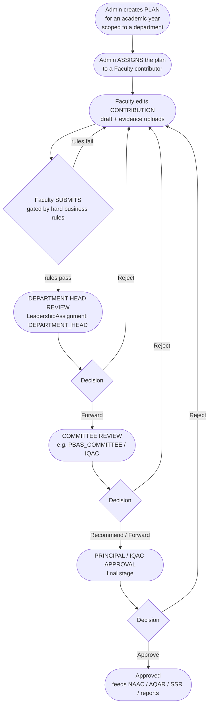
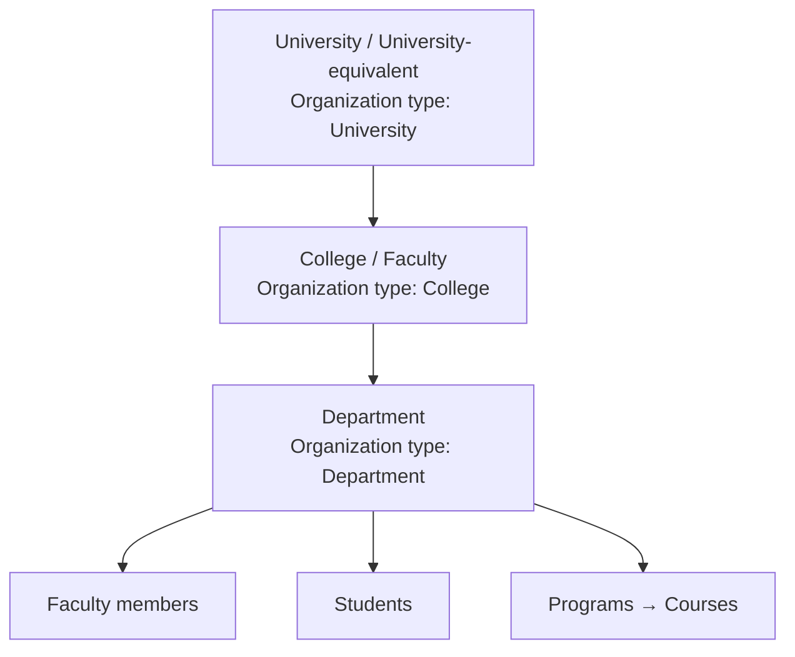
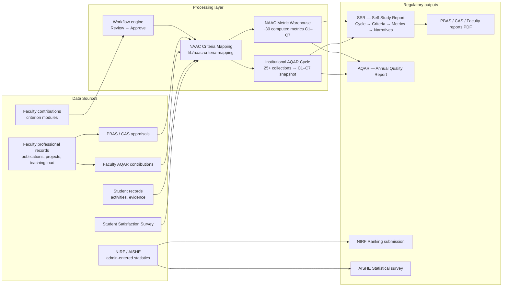
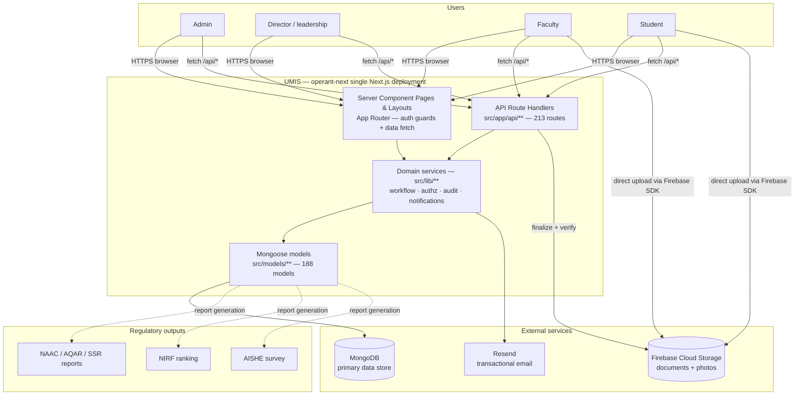

# 01 — Project Overview

**Suite:** operant-next (UMIS) Enterprise Documentation
**Document status:** Authoritative — derived from codebase and `documentation.md`

---

## Table of Contents

1. [Business Purpose](#1-business-purpose)
2. [Target Users and Portals](#2-target-users-and-portals)
3. [User Roles — What They Mean and How Director Access is Earned](#3-user-roles--what-they-mean-and-how-director-access-is-earned)
4. [Accreditation Workflows — The Core Backbone](#4-accreditation-workflows--the-core-backbone)
5. [Institution Lifecycle](#5-institution-lifecycle)
6. [High-Level Data Flow](#6-high-level-data-flow)
7. [Major Business Modules and NAAC Criteria Mapping](#7-major-business-modules-and-naac-criteria-mapping)
8. [System Context Diagram](#8-system-context-diagram)
9. [Current Implementation Approach](#9-current-implementation-approach)
10. [Architectural Strengths](#10-architectural-strengths)
11. [Architectural Weaknesses](#11-architectural-weaknesses)
12. [Related Documents](#12-related-documents)

---

## 1. Business Purpose

UMIS ("Unified Management Information System", product brand **operant**) is a structured, role-based, auditable web platform that replaces spreadsheet-and-email workflows with a governed digital system. Its core function is to help an Indian higher-education institution collect, review, and report the evidence required by statutory accreditation and quality-assurance frameworks:

| Framework | Full name | Role in UMIS |
|---|---|---|
| **NAAC** | National Assessment and Accreditation Council | Master framework; all data rolls up to NAAC Criteria C1–C7 |
| **AQAR** | Annual Quality Assurance Report | Yearly report to NAAC; supported at both faculty-contribution and institutional-cycle level |
| **SSR** | Self-Study Report | Large self-assessment document prepared for a NAAC visit |
| **NIRF** | National Institutional Ranking Framework | Ranking submission: parameters, metrics, scores, trends |
| **AISHE** | All India Survey on Higher Education | Statistical survey of enrollment, faculty, finance, infrastructure |
| **PBAS / API** | Performance Based Appraisal System / Academic Performance Indicator | Annual faculty self-appraisal producing an API score |
| **CAS** | Career Advancement Scheme | UGC faculty-promotion process gated on PBAS scores + service years |
| **IQAC** | Internal Quality Assurance Cell | Governance body that reviews and approves quality data |
| **BOS** | Board of Studies | Curriculum governance — meetings, decisions, syllabus revisions |
| **SSS** | Student Satisfaction Survey | Anonymous student survey feeding NAAC C2 metrics |

The system does not replace faculty or administration; it structures their work into reviewable, evidence-backed records that flow automatically into statutory reports.

---

## 2. Target Users and Portals

UMIS exposes four distinct authenticated portals, each with a separate layout and navigation shell:

| Role | Portal root | Shell component | Primary activity |
|---|---|---|---|
| **Admin** | `/admin` | `admin-shell.tsx` | System configuration, master data, user provisioning, report compilation, final approvals |
| **Director** (institutional leadership) | `/director` | `director-shell.tsx` | Scoped cross-module review and approval, faculty/student oversight, data exports |
| **Faculty** | `/faculty` | Server-rendered layout with client notification island | Maintain professional record; contribute PBAS, CAS, AQAR, and criterion-module data |
| **Student** | `/student` | `student-shell.tsx` | Maintain profile and activity records, upload evidence, complete SSS surveys |

Each portal lives in its own App Router route group (`(admin-protected)`, `(director-protected)`, `(faculty-protected)`, `(student-protected)`) guarded by an async Server Component layout that calls the appropriate guard function (`requireAdmin()`, `requireDirector()`, etc.).

---

## 3. User Roles — What They Mean and How Director Access is Earned

### The `role` field is not the access mechanism

The `User` model carries a `role` field with values including `Faculty`, `Student`, `Alumni`, `Admin`, `Director`, `PRO`, `NSS`, `Sports`, `Swayam`, and `Placement`. This field controls the **post-login redirect path** and the basic portal guard (`requireAdmin()` checks `role === "Admin"`). It does **not** determine what a user may review, approve, or see within the director portal.

### Director portal access is governance-derived

Access to `/director` and the ability to act on workflow stages is computed at runtime from two governance records in the database:

| Source | Model | Effect |
|---|---|---|
| **Leadership Assignment** | `LeadershipAssignment` (`src/models/core/leadership-assignment.ts`) | Grants roles: `DEPARTMENT_HEAD`, `PRINCIPAL`, `IQAC_COORDINATOR`, `DIRECTOR`, `OFFICE_HEAD` |
| **Governance Committee Membership** | `GovernanceCommitteeMembership` (`src/models/core/governance-committee-membership.ts`) | Grants workflow approver roles tied to committee types: `PBAS_REVIEW` → `PBAS_COMMITTEE`; `CAS_SCREENING` → `CAS_COMMITTEE`; `IQAC` → `IQAC`; `BOARD_OF_STUDIES` → `BOARD_OF_STUDIES`; etc. |
| **Legacy head compatibility** | `Organization.headUserId` | Always-on fallback: the head of a Department/College/University org gains the equivalent governance role (see [02_Current_Architecture.md](02_Current_Architecture.md) §Authorization) |

The function `resolveAuthorizationProfile(user)` in `src/lib/authorization/service.ts` merges all three sources into an `AuthorizationProfile` that includes `hasLeadershipPortalAccess`, `workflowRoles`, `browseScopes`, and `workflowRoleScopes`. This profile is recomputed on every request; there is no cached leadership token.

**Practical implication:** a user with `role: "Faculty"` who is assigned as a PBAS committee member can review PBAS submissions in the director portal — and that access is revoked the moment their membership record is deactivated, without any change to their `role` field.

### Account lifecycle states

Every `User` has an `accountStatus` of `PendingActivation`, `Active`, or `Suspended`. Faculty and students are provisioned by admin in `PendingActivation` and must complete a first-time activation flow before they can log in.

---

## 4. Accreditation Workflows — The Core Backbone

Most academic modules share one lifecycle, enforced by a generic workflow engine (`src/lib/workflow/engine.ts`) and the governance RBAC described above. The state machine is:

The exact stages vary by module (Teaching-Learning has four review stages; PBAS has three; CAS has its own screening chain), but the Plan → Assignment → Draft → Submitted → …Review… → Approved / Rejected backbone is identical in code. All transitions are driven by `resolveWorkflowTransition()` in the engine; no module defines its own state machine logic. The 11 module workflow definitions are seeded from `DEFAULT_WORKFLOW_DEFINITIONS` in `src/lib/workflow/engine.ts`.

### Submission gates

Submission is not simply clicking a button. Each module enforces hard business rules before a contribution may advance:

- **Teaching-Learning:** must include a pedagogical approach, attendance strategy, attainment summary, a lesson-plan document, at least one session record, one assessment, and one evidence item or link.
- **PBAS:** `totalScore > 0` and submission within the deadline; immutable revision snapshot is created on submit.
- **CAS:** at least one Approved PBAS, service years ≥ rule minimum, API score ≥ rule minimum, and three mandatory document types.
- **AQAR:** `totalContributionIndex > 0`.

Self-review (a contributor reviewing their own submission) is blocked at the engine level unless the actor is an Admin.

---

## 5. Institution Lifecycle

UMIS is scoped to a **single institution** deployment (one MongoDB URI = one institution). Within that institution:

The hierarchy is maintained in the `Organization` collection (self-referencing `parentOrganizationId`) and mirrored by the `Institution` and `Department` reference models. When an organization is renamed or restructured, `lib/admin/hierarchy.ts` re-projects the scope labels onto all dependent records.

Academic years (`AcademicYear`) and semesters (`Semester`) scope all data collection. Each plan, assignment, and reporting record carries a scope block of denormalized fields (`scopeDepartmentName`, `scopeCollegeName`, `scopeUniversityName`, and related IDs) written at creation time and indexed for efficient list filtering.

---

## 6. High-Level Data Flow

Data is never copied directly into output documents; it flows through the NAAC Criteria Mapping layer (`lib/naac-criteria-mapping/catalog.ts`, `lib/naac-criteria-mapping/service.ts`) which specifies which collections contribute to which NAAC criterion and metric. The Metric Warehouse generation (`generateNaacMetricValues()`) aggregates from approximately 20 collections in a single on-demand batch.

---

## 7. Major Business Modules and NAAC Criteria Mapping

| NAAC Criterion | Module | Key evidence models | Portals |
|---|---|---|---|
| **C1 — Curricular Aspects** | Curriculum | `CurriculumPlan`, `CurriculumAssignment`, `ProgramOutcome`, `CourseOutcome`, `SyllabusVersion`, `BosMeeting`, `ValueAddedCourse` | Admin, Director, Faculty |
| **C2 — Teaching-Learning & Evaluation** | Teaching-Learning, SSS | `TeachingLearningPlan`, `TeachingLearningAssignment`, `TeachingLearningSession`, `SssSurvey`, `SssResponse` | Admin, Director, Faculty, Student |
| **C3 — Research, Innovation & Extension** | Research-Innovation, PBAS, AQAR | `ResearchInnovationPlan`, `FacultyPublication`, `FacultyPatent`, `FacultyResearchProject`, `FacultyPbasForm` | Admin, Director, Faculty |
| **C4 — Infrastructure & Learning Resources** | Infrastructure-Library | `InfrastructureLibraryPlan`, `InfrastructureLibraryFacility`, `InfrastructureLibraryResource` | Admin, Director, Faculty |
| **C5 — Student Support & Progression** | Student-Support-Governance, Student Records | `StudentSupportPlan`, `StudentAcademicRecord`, `Placement`, `Internship` | Admin, Director, Faculty, Student |
| **C6 — Governance, Leadership & Management** | Governance-Leadership-IQAC | `GovernanceLeadershipIqacPlan`, `IqacMeeting`, `PolicyCircular`, `QualityInitiative`, `ComplianceReview` | Admin, Director, Faculty |
| **C7 — Institutional Values & Best Practices** | Institutional-Values-Best-Practices | `BestPractice`, `Distinctiveness`, `GenderEquityInitiative`, `EthicsProgram`, `GreenCampus`, `SustainabilityAudit` | Admin, Director, Faculty |
| **C1–C7 (aggregate)** | SSR, AQAR Cycle, NAAC Metric Warehouse | `SsrCycle`, `AqarCycle`, `NaacMetricValue`, `NaacMetricDefinition` | Admin (manage), Director (view), Faculty (contribute), Student (SSR read) |
| **Reporting** | AISHE, NIRF, Statutory Compliance | `AisheSurveyCycle`, `NirfRankingCycle`, compliance action items | Admin, Director |
| **Faculty careers** | PBAS, CAS | `FacultyPbasForm`, `CasApplication`, `CasPromotionRule` | Admin, Director, Faculty |

The six criterion-module families (Teaching-Learning, Research-Innovation, Infrastructure-Library, Governance-Leadership-IQAC, Institutional-Values-Best-Practices, Student-Support-Governance) share an identical architectural pattern: Admin Plan → Assignment → Faculty Contribution → multi-stage Review → Approval. See [04_Module_Documentation.md](04_Module_Documentation.md) for per-module detail.

---

## 8. System Context Diagram

---

## 9. Current Implementation Approach

### Modular monolith

UMIS is a single Next.js 16 deployment. There is no separate backend API service, no microservices, and no serverless function isolation beyond what Next.js provides per route. Three logical tiers coexist:

| Tier | Location | Technology |
|---|---|---|
| Presentation | `src/app/**/page.tsx`, `src/app/**/layout.tsx`, `src/components/**` | React 19 Server Components (pages/layouts) + Client Components (interactive UI) |
| API / Application | `src/app/api/**/route.ts` (213 handlers) | Next.js Route Handlers, Node.js runtime |
| Domain / Data | `src/lib/**` (97 modules: 24 service.ts, 20 validators.ts) + `src/models/**` (188 Mongoose models) | TypeScript services, Zod validation, Mongoose 9, MongoDB |

### React Server Components + services + Mongoose

The RSC model means initial page data is always fetched on the server: a `page.tsx` calls a `lib` service, which calls `dbConnect()` and issues Mongoose queries, then passes serialized data as props to a Client Component shell. Mutations post to `/api/*` route handlers, which delegate to the same `lib` services, then the client calls `router.refresh()` to re-run the server subtree. There is no client-side data cache (no React Query, SWR, Redux, or Zustand).

### Shared cross-cutting infrastructure

Five libraries are reused by every feature module:

- `src/lib/workflow/engine.ts` — pure state-machine resolver; no module hardcodes transitions.
- `src/lib/authorization/service.ts` — governance-driven RBAC; resolves `AuthorizationProfile` from DB on every request.
- `src/lib/audit/service.ts` — append-only `AuditLog` entries written by every mutating service.
- `src/lib/notifications/service.ts` — in-app and email notifications for workflow events and deadlines.
- `src/lib/upload/service.ts` + `src/lib/upload/policy.ts` — intent-based Firebase upload lifecycle with server-side finalization and MIME/size verification.

---

## 10. Architectural Strengths

- **Domain fidelity.** 188 Mongoose models precisely mirror the NAAC/PBAS/CAS/AQAR/AISHE/NIRF domain. Enums are shared between Mongoose schemas and Zod validators, making data contracts tight end-to-end.
- **Generic workflow engine.** One engine powers 11 review modules uniformly. Adding a module is configuration, not a new state machine.
- **Governance-driven RBAC.** Access control is dynamic and data-driven; revoking a leadership assignment immediately removes portal access on the next request.
- **Consistent conventions.** Every route, service, model, and component follows predictable patterns (guard → parse → service → envelope; interface + schema + model registration; scope block; `-manager/-review-board/-workspace` component families). The codebase is highly predictable for new developers.
- **Thin handlers, fat services.** Business logic, validation, audit, and notifications are centralized in `lib` services and never duplicated in route handlers.
- **Clean RSC boundary.** Server pages fetch data without client waterfalls; 77 client components handle only interactivity; the client bundle is lean because heavy libraries (React Flow, xlsx) are imported only where needed.
- **Strong auth primitives.** bcrypt cost-12 hashing, SHA-256-only token storage, per-request DB re-validation (suspended accounts are locked out immediately), timing-safe comparisons, and director cookie-clear on failed leadership check.

---

## 11. Architectural Weaknesses

- **No middleware.** There is no `middleware.ts`. Protection relies on each layout and route handler remembering to call its guard. A new route that omits the guard is immediately unprotected with no backstop. See [02_Current_Architecture.md](02_Current_Architecture.md) §Middleware.
- **No CSRF protection.** `sameSite: "lax"` alone is insufficient for state-changing mutations that use cookie auth. See [16_Security_Audit.md](16_Security_Audit.md).
- **No rate limiting.** Login, activation, password reset, and upload-intent endpoints have no throttle or lockout. See [16_Security_Audit.md](16_Security_Audit.md).
- **No server-side caching.** Every page render queries MongoDB live; `router.refresh()` re-fetches the entire server subtree after each mutation. See [17_Performance_Optimization.md](17_Performance_Optimization.md).
- **Unpaginated list endpoints.** Most admin and director list endpoints return full authorized sets. This scales poorly with data growth. See [17_Performance_Optimization.md](17_Performance_Optimization.md).
- **Near-zero test coverage.** Only 4 Vitest unit tests exist for a codebase of 188 models, 213 routes, and 11 workflow modules. See [14_Testing_Strategy.md](14_Testing_Strategy.md).
- **PDF ASCII-only.** Hand-rolled PDF generation strips all non-ASCII characters, silently corrupting Indian-language names in official accreditation documents. See [10_Technical_Debt_Report.md](10_Technical_Debt_Report.md).
- **Criterion module duplication.** The six Plan → Assign → Contribute → Review modules share a near-identical architecture but are implemented as six separate copies of service, validator, route, and component code. See [11_Refactoring_Strategy.md](11_Refactoring_Strategy.md).
- **Legacy `headUserId` always on.** `compatibilityMode = true` is hard-coded in `src/lib/authorization/service.ts`, meaning setting `Organization.headUserId` silently grants leadership power with no admin toggle. See [16_Security_Audit.md](16_Security_Audit.md).

---

## 12. Related Documents

| Document | Content |
|---|---|
| [02_Current_Architecture.md](02_Current_Architecture.md) | Deep AS-BUILT architecture: folder layout, component hierarchy, auth, authorization, state, middleware, caching |
| [03_Business_Domain.md](03_Business_Domain.md) | Domain glossary, bounded contexts, institution hierarchy, accreditation data roll-up |
| [04_Module_Documentation.md](04_Module_Documentation.md) | Per-module detail: PBAS, CAS, AQAR, SSR, SSS, Curriculum, six criterion modules, Reporting |
| [05_Database_Architecture.md](05_Database_Architecture.md) | 188 models, ERD, scope block, multi-tenancy, indexes, migration approach |
| [06_API_Documentation.md](06_API_Documentation.md) | 213 route handlers, conventions, shared workflow routes, error mapping |
| [07_Frontend_Architecture.md](07_Frontend_Architecture.md) | RSC/client split, component families, state, forms, data fetching |
| [08_Backend_Architecture.md](08_Backend_Architecture.md) | Services layer, validation, audit, notifications, upload, PDF, email |
| [09_Code_Quality_Report.md](09_Code_Quality_Report.md) | Code quality assessment, strengths, and technical debt inventory |
| [10_Technical_Debt_Report.md](10_Technical_Debt_Report.md) | Prioritized debt: correctness risks, security gaps, performance, maintainability |
| [16_Security_Audit.md](16_Security_Audit.md) | Full security review — CSRF, rate limiting, session, Firebase, headers |
| [17_Performance_Optimization.md](17_Performance_Optimization.md) | Query fan-out, caching strategy, pagination, bundle optimization |
| [docs/PBAS_SELF_APPRAISAL_SYSTEM.md](PBAS_SELF_APPRAISAL_SYSTEM.md) | PBAS system design reference |
| [docs/PBAS_UGC_PRODUCTION_IMPLEMENTATION_GUIDE.md](PBAS_UGC_PRODUCTION_IMPLEMENTATION_GUIDE.md) | UGC PBAS production implementation guide |
