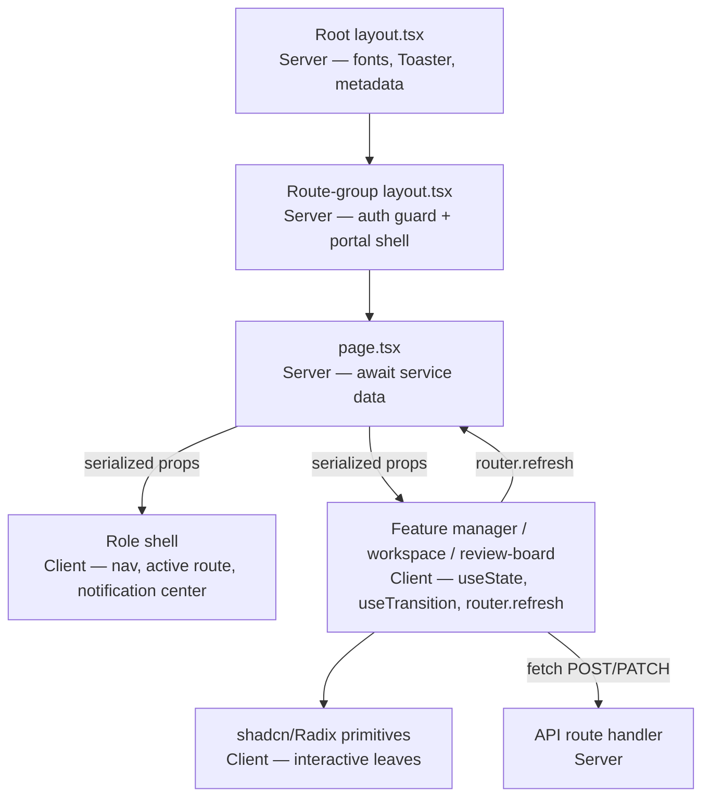
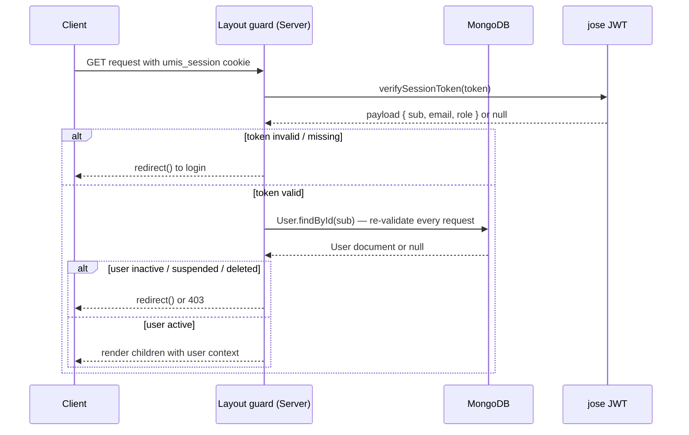
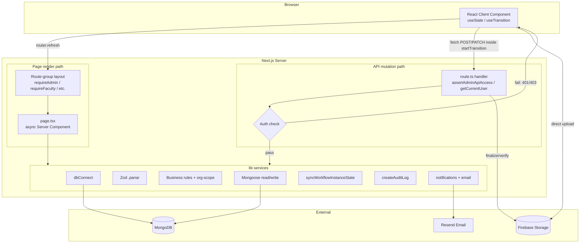

# 02 — Current Architecture

**Suite:** operant-next (UMIS) Enterprise Documentation
**Document status:** AS-BUILT — derived from codebase and `documentation.md`

---

## Table of Contents

1. [Architecture Style](#1-architecture-style)
2. [Folder Organization](#2-folder-organization)
3. [Feature Organization](#3-feature-organization)
4. [Component Hierarchy](#4-component-hierarchy)
5. [API Architecture](#5-api-architecture)
6. [Database Architecture](#6-database-architecture)
7. [Authentication](#7-authentication)
8. [Authorization — resolveAuthorizationProfile](#8-authorization--resolveauthorizationprofile)
9. [State Management](#9-state-management)
10. [Validation — Zod-in-Services](#10-validation--zod-in-services)
11. [Services Layer](#11-services-layer)
12. [Utilities and Shared Libraries](#12-utilities-and-shared-libraries)
13. [Middleware — None](#13-middleware--none)
14. [Background Jobs — None](#14-background-jobs--none)
15. [Caching](#15-caching)
16. [Layered Request Handling Diagram](#16-layered-request-handling-diagram)
17. [Related Documents](#17-related-documents)

---

## 1. Architecture Style

### Current State

UMIS is a **modular monolith** — one Next.js 16 App Router deployment serving the UI, the HTTP API, and the data-access/business layer from a single process. Three logical tiers live in one deployable unit:

| Tier | Root path | Key technology |
|---|---|---|
| Presentation | `src/app/**/page.tsx`, `src/app/**/layout.tsx`, `src/components/**` | React 19 Server Components + Client Components, Tailwind v4, shadcn/ui |
| API / Application | `src/app/api/**/route.ts` | Next.js Route Handlers, Node.js runtime (not Edge) |
| Domain / Data | `src/lib/**`, `src/models/**` | TypeScript services, Zod, Mongoose 9, MongoDB |

### Problems Identified

- There is no separate backend service; horizontal scaling of write-heavy API paths cannot be done independently of the UI render tier.
- The monolith boundary is maintained only by convention; there is no module isolation preventing lib code from importing across domains.
- No `output: "standalone"` is set in `next.config.ts`, so the deployment artifact is non-portable without manual effort.

---

## 2. Folder Organization

### Current State

```
operant-next/
├── src/
│   ├── app/                         # App Router: pages, layouts, API routes
│   │   ├── layout.tsx               # Root layout: fonts (Geist), <Toaster>, metadata
│   │   ├── page.tsx                 # Public landing page (Server Component)
│   │   ├── globals.css              # Tailwind v4 + OKLCH tokens + tw-animate-css
│   │   ├── (auth)/                  # Route group: login, register, activation, reset — public
│   │   ├── (admin-protected)/       # Route group: /admin/** — requireAdmin() guard in layout
│   │   ├── (director-protected)/    # Route group: /director/** — requireDirector() guard
│   │   ├── (faculty-protected)/     # Route group: /faculty/** — requireFaculty() guard
│   │   ├── (student-protected)/     # Route group: /student/** — requireStudentProfileAccess()
│   │   ├── admin/                   # /admin/login, /admin/setup — outside protected group
│   │   ├── director/                # /director/login — outside protected group
│   │   └── api/                     # 213 route.ts handlers
│   ├── components/
│   │   ├── ui/                      # 19 shadcn/Radix UI primitives
│   │   ├── admin/ director/ student/# Role shells + role-specific manager components
│   │   ├── auth/                    # Login/register/activation forms
│   │   ├── <feature>/               # Per-module: *-manager, *-review-board, *-contributor-workspace, *-dashboard
│   │   └── notifications/           # notification-center.tsx
│   ├── lib/                         # 97 modules — business logic + infrastructure
│   │   ├── auth/                    # session, config, tokens, password, user guards, email, http, errors, validators
│   │   ├── authorization/           # service.ts — governance RBAC
│   │   ├── workflow/                # engine.ts — generic state-machine engine
│   │   ├── audit/                   # service.ts + request.ts
│   │   ├── notifications/           # service.ts + email.ts
│   │   ├── upload/                  # service.ts + policy.ts
│   │   ├── firebase/                # config.ts (client SDK only)
│   │   ├── report-templates/        # service.ts, pdf.ts, preview.ts, validators.ts
│   │   ├── <feature>/               # service.ts + validators.ts per domain feature
│   │   ├── admin/                   # academics, hierarchy, master-data, reference-masters, users, system, dashboard
│   │   ├── hierarchy/               # canonical.ts — org projection + scope resolution
│   │   ├── academic-year.ts
│   │   └── dbConnect.ts             # globalThis Mongoose connection cache
│   └── models/                      # 188 Mongoose models, 10 domain categories
│       ├── core/        # 41 models — users, org, PBAS, CAS, AQAR, workflow, governance, audit, notifications
│       ├── reporting/   # 35 models — AISHE, NIRF, NAAC metrics, SSR
│       ├── faculty/     # 22 models — faculty + achievement sub-records
│       ├── academic/    # 20 models — program, course, curriculum, teaching-learning
│       ├── student/     # 19 models — student + activity records + support-governance
│       ├── quality/     # 16 models — values/best-practices, sustainability, gender, ethics
│       ├── reference/   # 12 models — institution, department, academic-year, semester, document, lookups
│       ├── research/    # 9 models  — research-innovation, publication, project, IP
│       ├── engagement/  # 8 models  — SSS, feedback, system-misc
│       └── operations/  # 6 models  — infrastructure-library
├── scripts/             # One-shot .cjs/.mjs migration and backfill scripts
├── docs/                # PBAS design and UGC implementation guides
└── public/              # Static assets (favicon, images)
```

### Problems Identified

- `legacy_models.txt` and `new_models.txt` at the project root describe a schema that does not match the implemented 188-model layout. They are stale planning artifacts and should be deleted.
- `scripts/ts-alias-loader.mjs` hard-codes an absolute path (`/Users/rc/Projects/operant-next/src`) that breaks on any machine other than the original developer's. See [10_Technical_Debt_Report.md](10_Technical_Debt_Report.md).
- No Dockerfile, no `.dockerignore`, no CI/CD config in the repository.

---

## 3. Feature Organization

### Current State

Each business feature is organized as a vertical slice across four layers:

| Layer | Location pattern | Example (Teaching-Learning) |
|---|---|---|
| Pages (Server) | `src/app/(role-protected)/<role>/<feature>/page.tsx` | `(admin-protected)/admin/teaching-learning/page.tsx` |
| API routes | `src/app/api/<feature>/**` + `src/app/api/admin/<feature>/**` | `api/teaching-learning/assignments/[id]/contribution/route.ts` |
| Business logic | `src/lib/<feature>/service.ts` + `validators.ts` | `lib/teaching-learning/service.ts` |
| Data models | `src/models/<category>/<name>.ts` | `models/academic/teaching-learning-plan.ts` |
| UI components | `src/components/<feature>/` | `components/teaching-learning-manager.tsx` |

The six criterion modules (Teaching-Learning, Research-Innovation, Infrastructure-Library, Governance-Leadership-IQAC, Institutional-Values-Best-Practices, Student-Support-Governance) follow this pattern with near-identical structure. Each has a `Plan` model, an `Assignment` model, a `service.ts`, a `validators.ts`, admin route files, faculty route files, an admin manager component, a faculty workspace component, and a review-board component.

### Problems Identified

- The six criterion modules are copy-adapted from a common pattern. Shared logic (scope-block writes, workflow transition calls, audit writes, reviewer notification) is repeated six times. A generic contributor-module factory could eliminate hundreds of duplicated lines. See [11_Refactoring_Strategy.md](11_Refactoring_Strategy.md).

---

## 4. Component Hierarchy

### Current State



**Component families (per module):**

| Suffix | Role | Auth surface |
|---|---|---|
| `*-manager.tsx` | Admin CRUD — plans, assignments, catalogs | `(admin-protected)` pages |
| `*-review-board.tsx` | Read + workflow decisions (approve/reject/return) | `(admin-protected)` and `(director-protected)` pages |
| `*-contributor-workspace.tsx` | Faculty submission — fields, sub-records, uploads, submit | `(faculty-protected)` pages |
| `*-dashboard.tsx` | Faculty application history (PBAS, CAS, AQAR) | `(faculty-protected)` pages |

**Role shells:**

- `admin-shell.tsx` — Client component; `usePathname()` for active nav; ~25 nav items; hosts `NotificationCenter` and `LogoutButton`.
- `director-shell.tsx` — Client component; 19 scoped nav items; exact-match active state.
- `student-shell.tsx` — Client component; responsive (desktop sidebar / tablet pills / mobile bottom tabs); 5 items.
- Faculty layout — Server-rendered header/footer with `NotificationCenter` as a client island; no active-highlight (statically built nav).

**UI Primitives (`src/components/ui/`, 19 total):**
`alert`, `alert-dialog`, `badge`, `button`, `calendar`, `card`, `checkbox`, `dialog`, `input`, `label`, `popover`, `scroll-area`, `select`, `separator`, `skeleton`, `sonner`, `table`, `tabs`, `textarea`. All are shadcn wrappers over Radix UI, styled with `cn()` (`src/lib/utils.ts`) and `class-variance-authority`.

**Notable components:**
- `hierarchy-manager.tsx` — the sole user of `@xyflow/react` (React Flow org-graph).
- `notification-center.tsx` — Radix Popover; fetches `/api/notifications?limit=12` on mount/open; optimistic mark-read.
- `faculty-workspace-form.tsx` — the largest component; `useFieldArray` per sub-section, XLSX export, per-row uploads, debounced auto-save.

### Problems Identified

- Only one `error.tsx` exists (`src/app/(faculty-protected)/faculty/profile/error.tsx`). No root `error.tsx`, no per-group `error.tsx`, no `not-found.tsx`. An unhandled server error on any other route shows the raw Next.js default error page. See [09_Code_Quality_Report.md](09_Code_Quality_Report.md).
- Only one `loading.tsx` exists (faculty profile). No skeleton loading states on admin/director list pages that fetch large datasets.
- Heavy client libraries (React Flow, xlsx/SheetJS) are statically imported, not lazily loaded with `next/dynamic`. See [17_Performance_Optimization.md](17_Performance_Optimization.md).

---

## 5. API Architecture

### Current State

213 route handlers under `src/app/api/**`. All follow the same canonical shape:

```ts
// Every handler: guard → parse → service → envelope → catch
export async function PATCH(request: Request, context: { params: Promise<{ id: string }> }) {
  try {
    const admin = await assertAdminApiAccess();          // 1. auth guard
    const body  = await request.json();                  // 2. parse
    const { id } = await context.params;                 // 3. await params (Next 16 requirement)
    const result = await updateThing(                    // 4. delegate to service
      { id: admin.id, name: admin.name, role: admin.role,
        auditContext: getRequestAuditContext(request) },
      id, body);
    return NextResponse.json({ message: "Updated.", thing: JSON.parse(JSON.stringify(result)) });
  } catch (error) {
    return createApiErrorResponse(error);                // 5. central error mapper
  }
}
```

**Response envelopes:**
- Mutations: `{ message, <entityName> }`
- Reads: `{ <entityName(s)> }`
- Notifications: `{ total, unread, notifications }`
- Bulk provisioning: HTTP 207 with `{ created[], failed[] }` on partial success
- Errors: `{ message }` or `{ message, issues[] }`

**URL structure:** REST-ish resource routes with action sub-routes:
- Resource: `/api/admin/pbas/categories`, `/api/teaching-learning/assignments/[id]`
- Actions: `/api/pbas/[id]/submit`, `/api/pbas/[id]/review`, `/api/pbas/[id]/approve`
- Dynamic params are Promises in Next 16 and must be `await`ed: `const { id } = await context.params`

**Auth on endpoints:**

| Guard function | Applied to |
|---|---|
| `assertAdminApiAccess()` | All `/api/admin/**` |
| `assertLeadershipApiAccess()` | Director/leadership endpoints |
| `getCurrentUser()` + inline role check | Faculty/student endpoints |
| Governance stage check (`canActorProcessWorkflowStage`) | `*/review`, `*/approve` sub-routes |
| Bootstrap-secret header check | `/api/admin/bootstrap` only |

### Problems Identified

- No global middleware backstop. Each route handler is responsible for its own guard. A new route added without a guard call is immediately unprotected.
- No rate limiting on any endpoint — login, activation, reset, upload-intent, or email send.
- No CSRF tokens on state-changing endpoints. See [16_Security_Audit.md](16_Security_Audit.md).
- Pagination is absent on most list endpoints. See [17_Performance_Optimization.md](17_Performance_Optimization.md).
- Several endpoints return HTTP 410 (register, faculty evidence, student resume, director student-approvals) and remain in the codebase as dead code with no cleanup plan. See [10_Technical_Debt_Report.md](10_Technical_Debt_Report.md).

---

## 6. Database Architecture

### Current State

MongoDB via Mongoose 9. Every model follows a canonical hot-reload-safe pattern:

```ts
// src/models/<category>/<name>.ts — canonical pattern
export interface IModel extends Document { /* typed fields */ }
const ModelSchema = new Schema<IModel>({ /* fields */ }, { timestamps: true, collection: "name" });
ModelSchema.index({ field_a: 1, field_b: 1 });
const Model = mongoose.models.Model || mongoose.model<IModel>("Model", ModelSchema);
export default Model;
```

Conventions applied consistently:
- `{ timestamps: true }` on every schema
- `{ _id: false }` on all embedded sub-documents
- TypeScript generics on `new Schema<T>` and `mongoose.model<T>`
- Sparse-unique indexes on optional foreign-key fields
- Enums often imported from a shared const array also reused by Zod validators

**Multi-tenancy — the scope block:** There is no separate tenant field or join layer. Every plan, assignment, and reporting record carries a denormalized scope block written at creation time:

```
scopeDepartmentName, scopeCollegeName, scopeUniversityName
scopeDepartmentId, scopeInstitutionId
scopeDepartmentOrganizationId, scopeCollegeOrganizationId, scopeUniversityOrganizationId
scopeOrganizationIds: ObjectId[]
```

`buildAuthorizedScopeQuery(profile)` in `src/lib/authorization/service.ts` produces a Mongo `$or` filter over these fields, enabling department/college/university scoping without joins.

**188 models across 10 categories:** See [05_Database_Architecture.md](05_Database_Architecture.md) for the complete ERD and field-level model reference.

### Problems Identified

- `AcademicYear.isActive` has no uniqueness constraint. Two "current" years are possible simultaneously; services fall back to "active or latest" which silently misroutes new records.
- `createAuditLog` in `src/lib/audit/service.ts` assumes an already-open connection and is not transaction-bound with the write it records — audit entries can be missing if the main write succeeds but the audit call fails (or vice versa).
- Two models (`Program`, `FacultyPbasEntry`) patch fields onto an already-compiled schema, a sign of incremental migration that bypasses normal index declaration. See [10_Technical_Debt_Report.md](10_Technical_Debt_Report.md).

---

## 7. Authentication

### Current State

Custom implementation in `src/lib/auth/**`. No NextAuth, Auth.js, Clerk, or Supabase.

**Session mechanism:**
- Library: `jose`, algorithm: HS256
- Secret: `AUTH_SECRET` env var; `getAuthSecret()` throws if missing
- Cookie: `umis_session`, `httpOnly: true`, `sameSite: "lax"`, `secure` in production only, `path: "/"`, `maxAge: 604800` (7 days)
- Payload: `{ sub: userId, email, name, role }` + jose `iat`/`exp`
- Location: `src/lib/auth/session.ts`

**Password:** bcrypt cost factor 12 (`src/lib/auth/password.ts`). `password` field is `select: false` on the `User` model; every login path explicitly calls `.select("+password")`.

**Per-request re-validation:** `getCurrentUser()` re-reads the `User` from MongoDB on every request. Suspended or deleted accounts are blocked immediately — no stale session window.

**Token storage:** One-time tokens (email verification, password reset) are emitted as 256-bit `crypto.randomBytes(32)` values, emailed to the user, and stored only as their SHA-256 hash. A database dump cannot replay links.



**Director login special case:** `POST /api/auth/director-login` runs normal credential verification, then calls `hasLeadershipPortalAccess` from `resolveAuthorizationProfile`. If the check fails, the session cookie is **cleared** before the 403 response is returned — there is no partial-auth window.

### Problems Identified

- `sameSite: "lax"` with no CSRF tokens means state-changing mutations are vulnerable to cross-site request forgery from top-level navigation attacks. See [16_Security_Audit.md](16_Security_Audit.md).
- 7-day JWT with no server-side revocation list. Per-request DB re-check mitigates this for `User.accountStatus` changes, but a stolen token remains usable until expiry if the DB check is ever bypassed. See [16_Security_Audit.md](16_Security_Audit.md).
- No rate limiting or lockout on any auth endpoint. See [16_Security_Audit.md](16_Security_Audit.md).
- Bootstrap secret length is compared before `timingSafeEqual`, leaking secret length as a timing oracle. See [16_Security_Audit.md](16_Security_Audit.md).

---

## 8. Authorization — resolveAuthorizationProfile

### Current State

Authorization is governance-driven and computed at runtime from the database. No roles are hard-coded in route handlers beyond the basic portal guard.

**Two-layer design:**

**Layer 1 — Guards** (coarse-grained, in `src/lib/auth/user.ts`):

| Function | Used by | Action on failure |
|---|---|---|
| `getCurrentUser()` | All guarded contexts | Returns null |
| `requireAdmin()` | Admin layout | `redirect()` to `/admin/login` or `/` |
| `requireDirector()` | Director layout | `redirect()` to `/director/login` or `/` |
| `requireFaculty()` | Faculty layout | `redirect()` to `/login` or `/activate-faculty` |
| `requireStudentProfileAccess()` | Student layout | `redirect()` to `/login` or `/activate-student` |
| `assertAdminApiAccess()` | Admin API routes | `throw AuthError(403)` |
| `assertLeadershipApiAccess()` | Director API routes | `throw AuthError(403)` |

**Layer 2 — `resolveAuthorizationProfile(user)`** (fine-grained, in `src/lib/authorization/service.ts`):

```mermaid
flowchart LR
    U[User] --> RP[resolveAuthorizationProfile]
    LA[LeadershipAssignment<br/>active records] --> RP
    CM[GovernanceCommitteeMembership<br/>active records] --> RP
    OH[Organization.headUserId<br/>legacy compatibility] --> RP
    RP --> Prof[AuthorizationProfile]
    Prof --> Access{hasLeadershipPortalAccess}
    Prof --> Roles{workflowRoles[]}
    Prof --> Scopes{browseScopes[]}
    Access -->|true| Portal[/director accessible]
    Roles --> WF{canActorProcessWorkflowStage}
    Scopes --> Filter{buildAuthorizedScopeQuery<br/>Mongo $or filter}
```

The `AuthorizationProfile` contains:
- `isAdmin`, `isFaculty`, `isStudent` — from `user.role`
- `hasLeadershipPortalAccess` — true if any `LeadershipAssignment` or committee membership grants leadership-level access
- `workflowRoles: WorkflowApproverRole[]` — merged from all active assignments and memberships
- `browseScopes: AuthorizationScope[]` — resolved org nodes (Department / College / University) the actor may view
- `workflowRoleScopes` — per-role scope restriction for multi-department leaders

**Committee → workflow role mapping** (from `src/lib/authorization/service.ts`):

| Committee type | Workflow approver role |
|---|---|
| `IQAC` | `IQAC` |
| `PBAS_REVIEW` | `PBAS_COMMITTEE` |
| `CAS_SCREENING` | `CAS_COMMITTEE` |
| `AQAR_REVIEW` | `AQAR_COMMITTEE` |
| `SSR_REVIEW` | `SSR_COMMITTEE` |
| `TEACHING_LEARNING_REVIEW` | `TEACHING_LEARNING_COMMITTEE` |
| `RESEARCH_COMMITTEE` | `RESEARCH_COMMITTEE` |
| `INFRASTRUCTURE_LIBRARY_REVIEW` | `INFRASTRUCTURE_LIBRARY_COMMITTEE` |
| `STUDENT_SUPPORT_GOVERNANCE_REVIEW` | `STUDENT_SUPPORT_GOVERNANCE_COMMITTEE` |
| `BOARD_OF_STUDIES` | `BOARD_OF_STUDIES` |

### Problems Identified

- `compatibilityMode = true` is hard-coded as a constant in `src/lib/authorization/service.ts` at line 63. The legacy `Organization.headUserId` path grants leadership/workflow power with no admin toggle, no audit trail for that grant path, and no way to disable it short of a code change. See [16_Security_Audit.md](16_Security_Audit.md).
- The `role` enum on `User` contains values (`PRO`, `NSS`, `Sports`, `Swayam`, `Placement`, `Director`) that are vestiges of an older role-siloed architecture. They are not the real access-control mechanism, which causes onboarding confusion. See [10_Technical_Debt_Report.md](10_Technical_Debt_Report.md).

---

## 9. State Management

### Current State

There is **no external state library**. Confirmed absent from `package.json`: React Query, SWR, Redux, Zustand, Jotai, MobX, Recoil.

State is managed at three levels:

| Level | Mechanism | Location |
|---|---|---|
| **Server state** (source of truth) | MongoDB via Mongoose; delivered as serialized props from `page.tsx`; invalidated by `router.refresh()` | `src/lib/**/service.ts` |
| **Local UI state** | `useState` (forms, tabs, dialogs, selection), `useTransition` (pending), `useDeferredValue` (search), `useEffect` (cascades, SSE-like fetch) | Client Components |
| **Form state** | `react-hook-form` + `zodResolver` for validated forms; plain `useState` objects for CRUD manager forms | Auth forms, PBAS/CAS dashboards, faculty workspace; manager components |
| **Session state** | `umis_session` JWT cookie — server-read only; never stored in a client JavaScript variable | `src/lib/auth/session.ts` |

The mutation pattern is:

```
Client Component
  → fetch(POST/PATCH) inside startTransition
  → /api/* route
  → lib service (validates, writes, audits, notifies)
  → NextResponse.json
  → component receives result
  → router.refresh()
  → Server page re-runs: fresh props flow to component
```

### Problems Identified

- `router.refresh()` re-runs the entire server subtree for the page — all services, all DB queries — after each mutation. There is no fine-grained cache invalidation. For pages that join data from many collections (director dashboard, AQAR cycle), this is expensive. See [17_Performance_Optimization.md](17_Performance_Optimization.md).
- The coexistence of two form paradigms (react-hook-form for validated forms; plain `useState` for manager CRUD forms) is undocumented and inconsistent. New developers are unsure which to use. See [09_Code_Quality_Report.md](09_Code_Quality_Report.md).

---

## 10. Validation — Zod-in-Services

### Current State

Zod v4 is the sole validation library. 20 `validators.ts` files live at `src/lib/<feature>/validators.ts`. Schemas are parsed **inside service functions**, not in route handlers:

```
Route handler: body = await request.json()  (raw, unvalidated)
  → service(actor, id, body)
    → const data = CreateThingSchema.parse(body)   ← validation happens here
    → business rules + DB write
```

This means validation errors surface through the route's `catch → createApiErrorResponse()` as HTTP 400 with `{ message, issues[] }`.

Patterns used:
- `z.string().regex(/^[a-f\d]{24}$/i)` for ObjectId validation
- Enums imported from the same const arrays used by Mongoose schemas
- `.partial()` for update schemas
- `.refine()` / `.superRefine()` for cross-field rules (password match, date ranges, duplicate-indicator rejection)
- Client forms use the same Zod schemas via `zodResolver`, so client and server validation agree exactly.

### Problems Identified

- Route handlers pass raw `await request.json()` to services. A Zod parse failure inside a service results in a 400 to the caller, which is correct, but the handler has no early-return path for clearly malformed input before service invocation.
- No environment-variable schema validation (no `zod`-parsed `env.ts`). Missing non-critical vars fail lazily at first use, sometimes with unhelpful errors deep in a service.

---

## 11. Services Layer

### Current State

The services layer (`src/lib/**/service.ts`) is the real backend. Route handlers are intentionally thin; every meaningful operation — validation, business rules, database access, workflow transitions, audit writes, and notifications — happens in a service function.

Services follow a consistent calling convention:

```ts
async function createThing(
  actor: { id: string; name: string; role: string; auditContext: AuditContext },
  body: unknown          // Zod-parsed inside
): Promise<IThing>
```

Every mutating service calls, in order:
1. `dbConnect()` — ensure connection
2. Zod schema parse
3. Business-rule assertions (throw `AuthError` on violation)
4. Org-scope resolution if needed (`buildAuthorizedScopeQuery`, `resolveCanonicalScope`)
5. Mongoose read/write
6. `syncWorkflowInstanceState()` if workflow-tracked
7. `createAuditLog()` — append audit entry
8. `notifyWorkflowStageAssignees()` or other notification call
9. Return entity (pre-serialized or serialized by caller)

Roughly 24 `service.ts` files cover: auth, authorization, workflow, audit, notifications, upload, report-templates, pbas, cas, aqar, aqar-cycle, ssr, sss, curriculum, teaching-learning, research-innovation, infrastructure-library, governance-leadership-iqac, institutional-values-best-practices, student-support-governance, naac-metric-warehouse, naac-criteria-mapping, accreditation, evidence, faculty, student, hierarchy, governance, admin sub-services.

### Problems Identified

- `src/lib/pbas/service.ts` is approximately 2,500 lines. `src/lib/accreditation/service.ts` is similarly large. These files are difficult to navigate, test, and modify safely. See [11_Refactoring_Strategy.md](11_Refactoring_Strategy.md).
- `createAuditLog` does not call `dbConnect()` itself; it relies on the caller's connection being open. Audit writes are not transaction-bound with the write they record, so they can be lost on partial failure. See [10_Technical_Debt_Report.md](10_Technical_Debt_Report.md).

---

## 12. Utilities and Shared Libraries

### Current State

**`src/lib/utils.ts`** — Tailwind `cn()` helper (`clsx` + `tailwind-merge`). Used everywhere for class composition.

**`src/lib/auth/http.ts`** — `createApiErrorResponse(error)`: maps `ZodError` → 400, Mongoose `ValidationError`/`CastError` → 400, `AuthError` (custom class with `.status`) → its status, everything else → 500. Used by every route handler.

**`src/lib/auth/errors.ts`** — `AuthError extends Error` with a `status` numeric property. The standard domain-error type thrown by all services.

**`src/lib/auth/tokens.ts`** — `createRandomToken()` (32-byte random hex), `hashToken()` (SHA-256 hex), `addHours()`, `addMinutes()` helpers.

**`src/lib/hierarchy/canonical.ts`** — `resolveCanonicalScope()` resolves an org node to its full ancestry (University → College → Department) and produces the scope block values written to records. `projectScopeOntoUser()` re-projects names onto user/faculty records after org renames.

**`src/lib/academic-year.ts`** — helpers for academic-year label formatting and period calculation.

**`src/lib/report-templates/pdf.ts`** — hand-rolled PDF-1.4 byte assembly. No external PDF library. `buildTemplatedPdf()` fills `{{token}}` placeholders and emits a `Buffer`. **Only Helvetica variants are supported; all non-ASCII characters are stripped.** See [10_Technical_Debt_Report.md](10_Technical_Debt_Report.md).

**`src/lib/upload/policy.ts`** — upload MIME type and size policy: `profile-photo` (JPEG/PNG/WebP ≤ 2 MB), `document` (PDF ≤ 10 MB), `evidence` (PDF/JPEG/PNG/WebP ≤ 10 MB).

**`src/lib/firebase/config.ts`** — Firebase client SDK initialization from `NEXT_PUBLIC_FIREBASE_*` env vars. Client SDK only; no Firebase Admin SDK is used.

---

## 13. Middleware — None

### Current State

**`middleware.ts` does not exist.** This is confirmed by the absence of the file and by the fact that Next.js middleware is not referenced anywhere in the codebase.

All concerns that middleware typically handles are done at the application layer:

| Concern | How it is handled |
|---|---|
| Auth / redirects | Async Server Component layout guards (`requireAdmin()`, `requireDirector()`, etc.) call `redirect()` |
| API auth | Each route handler calls `assertAdminApiAccess()` / `getCurrentUser()` — no shared interceptor |
| IP extraction (audit) | `getRequestAuditContext(request)` reads `x-forwarded-for` / `x-real-ip` / `cf-connecting-ip` headers per route call |
| Security headers | Not implemented at any layer (no CSP, HSTS, X-Frame-Options, Referrer-Policy) |
| Rate limiting | Not implemented at any layer |
| CORS | Not configured; all traffic is same-origin in normal operation |

### Problems Identified

- There is no single security choke point. A developer adding a new route must remember to call the appropriate guard. A missed guard leaves the route unprotected with no framework backstop.
- Security headers (CSP, HSTS, X-Frame-Options, Permissions-Policy) should be added via `next.config.ts` `headers()` or a `middleware.ts` response-header pass. See [16_Security_Audit.md](16_Security_Audit.md).
- Rate limiting and CSRF validation would naturally live in middleware but are currently absent from the entire stack. See [16_Security_Audit.md](16_Security_Audit.md).

### Recommended Solution

Add a `middleware.ts` at `src/middleware.ts` to:
1. Set security headers on all responses (CSP, HSTS, X-Frame-Options, Referrer-Policy).
2. Enforce rate limiting on auth, activation, reset, and upload-intent paths.
3. Optionally validate CSRF tokens on state-changing routes, or implement `SameSite=Strict` as a simpler mitigation.

The existing layout guards should be retained as defense-in-depth.

---

## 14. Background Jobs — None

### Current State

**There is no job scheduler, task queue, or background worker** in the application or infrastructure.

Two mechanisms substitute for scheduled work:

| Mechanism | Location | How it works |
|---|---|---|
| **Lazy deadline reminders** | `GET /api/notifications` → `lib/notifications/service.ts` | When a user opens the notification center, the service computes overdue/upcoming deadlines for PBAS and CAS and creates `Notification` records if not already present for the deduplication window. Reminders are triggered by user activity, not a clock. |
| **One-shot maintenance scripts** | `scripts/*.cjs` / `scripts/*.mjs` | Idempotent migrations and backfills run manually by an operator against `MONGODB_URI`. There is no ledger of which scripts have run against which environment. |

### Problems Identified

- Deadline reminders are only computed when users load the notification center. If no user logs in before a deadline, no reminder is ever sent.
- PDF report generation is synchronous on the API request thread. Large AQAR-cycle or NIRF-cycle PDFs block the handler for the duration of assembly. See [17_Performance_Optimization.md](17_Performance_Optimization.md).
- Email sends are fire-and-forget with no retry. A failed email is marked `failed` in the `Notification` record and never resent. See [09_Code_Quality_Report.md](09_Code_Quality_Report.md).
- The absence of a migration ledger means operators must manually track which scripts have been executed against each environment.

### Recommended Solution

Phase 1: Add a lightweight job-scheduling mechanism (e.g., node-cron in a Next.js custom server, or a separate Worker process) to run deadline-reminder computation on a daily schedule. Phase 2: Move large PDF generation to an async job with status polling.

---

## 15. Caching

### Current State

| Cache layer | Implemented | Details |
|---|---|---|
| **Mongoose connection** | Yes | `globalThis.mongooseCache` in `src/lib/dbConnect.ts` — one connection + promise, survives hot reloads and serverless reuse across invocations. `bufferCommands: false`. |
| **Lazy seeds** | Yes | `ensureDefaultReportTemplates()`, `ensureWorkflowDefinitions()`, `ensureNaacCriteriaMappingsSeeded()`, default CAS rules, and PBAS catalog are upserted once on first use and never invalidated. |
| **Next.js Data Cache** | Effectively bypassed | Pages read live from MongoDB via services. Notification polling uses `cache: "no-store"`. No `revalidate` / `unstable_cache` usage. |
| **Redis / in-memory store** | None | Not installed. |
| **HTTP response cache** | None | No CDN caching headers; no `Cache-Control` on API responses. |
| **Client-side cache** | None | No React Query, SWR, or similar. `router.refresh()` triggers a full server re-fetch. |

### Problems Identified

- Every page render issues live MongoDB queries with no intermediate cache. For reference data that changes infrequently (academic years, departments, master data, workflow definitions), this is unnecessary I/O overhead.
- The director dashboard loads 11 modules × (pending record IDs + record sets) per render — a significant fan-out query. See [17_Performance_Optimization.md](17_Performance_Optimization.md).
- `router.refresh()` after each mutation refetches the entire page subtree. Pages with many data dependencies compound this cost.

### Recommended Solution

Use Next.js `unstable_cache` / `cacheTag` with targeted revalidation tags for reference data and master data endpoints. Add Redis for session-independent caching of report-generation results and dashboard aggregates. See [17_Performance_Optimization.md](17_Performance_Optimization.md).

---

## 16. Layered Request Handling Diagram

The following diagram shows the complete request path from browser to database and back, encompassing both page renders and API mutations:



---

## 17. Related Documents

| Document | Content |
|---|---|
| [01_Project_Overview.md](01_Project_Overview.md) | Business purpose, user roles, accreditation workflow, module map |
| [03_Business_Domain.md](03_Business_Domain.md) | Domain glossary, bounded contexts, institution hierarchy, accreditation roll-up |
| [05_Database_Architecture.md](05_Database_Architecture.md) | Full ERD, 188-model reference, scope block, indexes, migration approach |
| [06_API_Documentation.md](06_API_Documentation.md) | 213 routes, conventions, workflow route pattern, error mapping |
| [07_Frontend_Architecture.md](07_Frontend_Architecture.md) | RSC/client split, component families, data fetching patterns, state |
| [08_Backend_Architecture.md](08_Backend_Architecture.md) | Services layer detail, audit, notifications, upload lifecycle, PDF, email |
| [09_Code_Quality_Report.md](09_Code_Quality_Report.md) | Code quality strengths and weaknesses |
| [10_Technical_Debt_Report.md](10_Technical_Debt_Report.md) | Prioritized debt: correctness risks, security, performance, maintainability |
| [11_Refactoring_Strategy.md](11_Refactoring_Strategy.md) | Refactoring plan for contributor-module factory, service decomposition, pagination |
| [16_Security_Audit.md](16_Security_Audit.md) | Full security review — CSRF, rate limiting, session, Firebase, headers |
| [17_Performance_Optimization.md](17_Performance_Optimization.md) | Query fan-out, caching strategy, pagination, dynamic imports |
