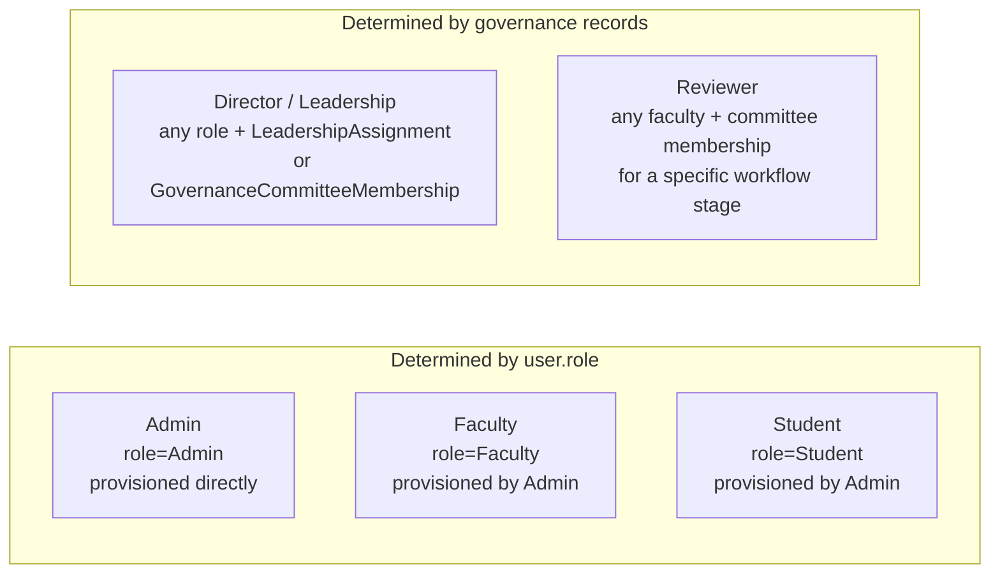
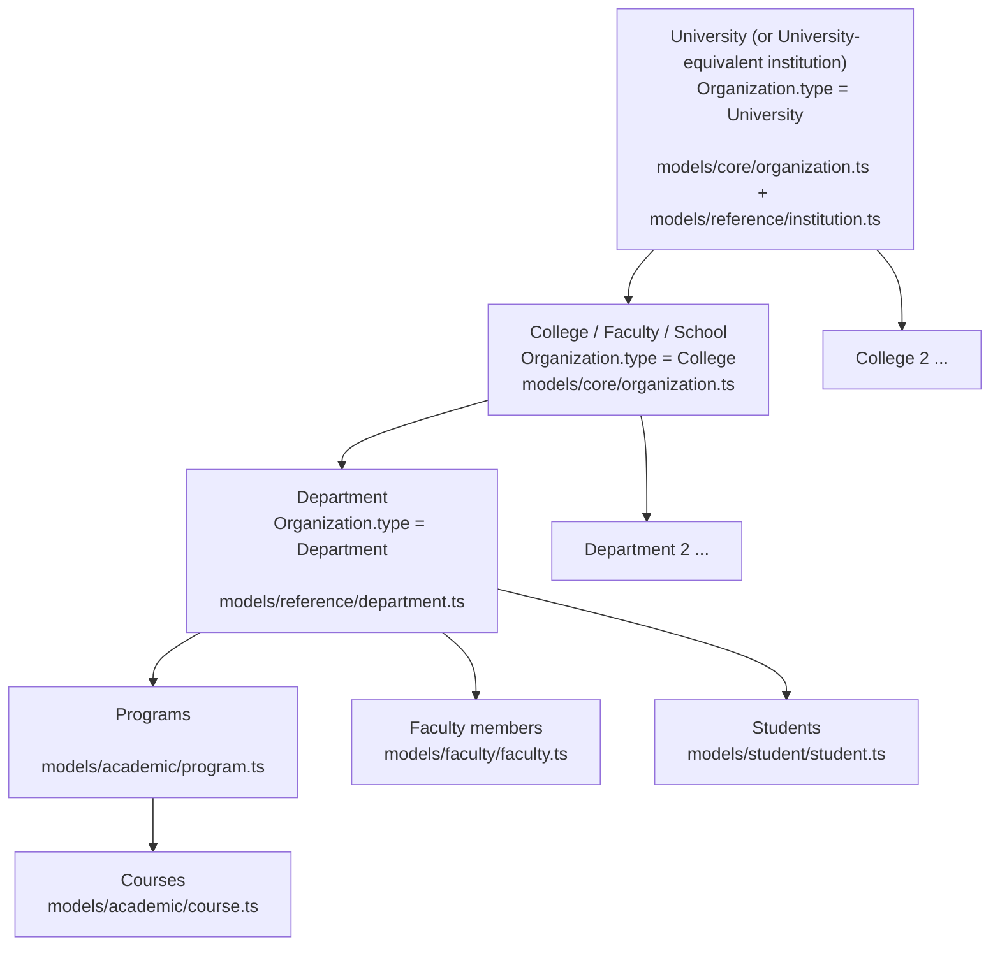
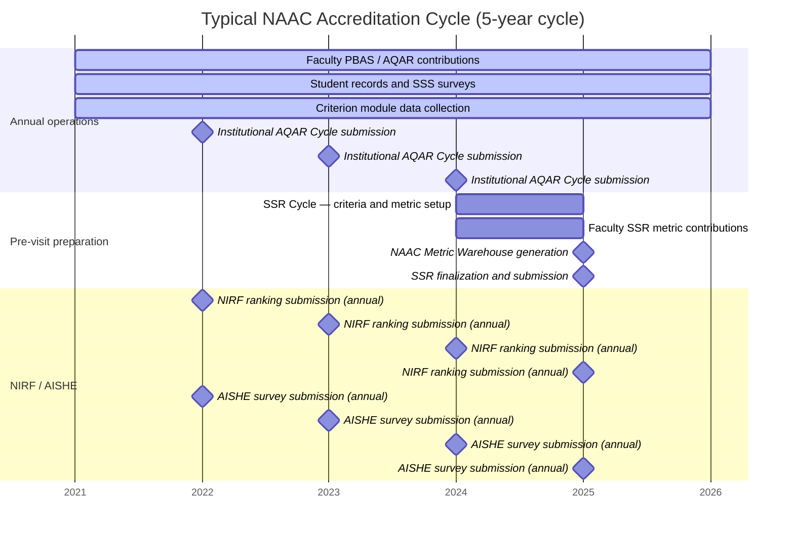
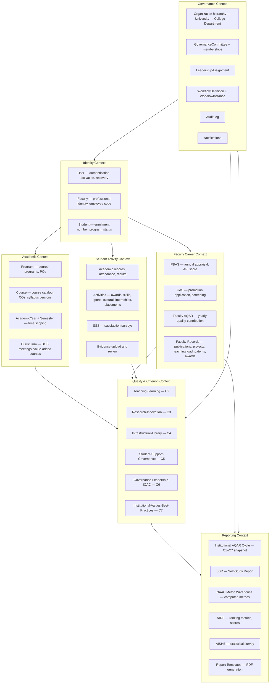
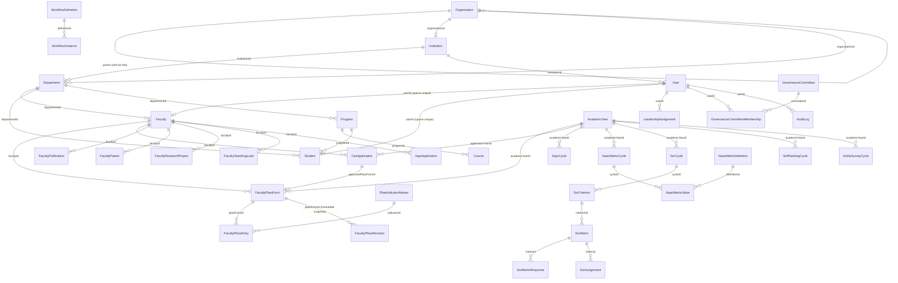
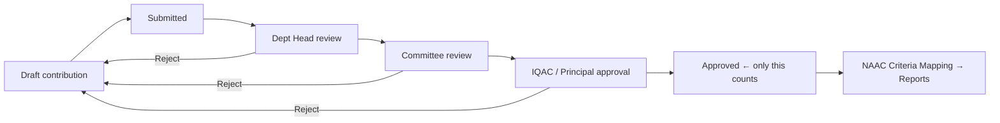
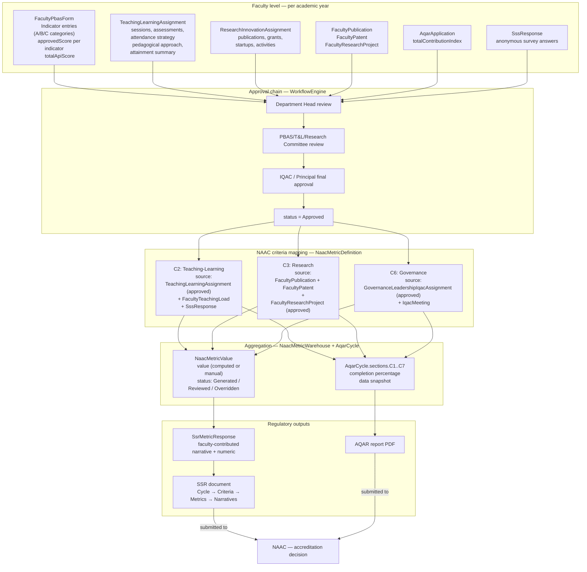

# 03 — Business Domain

**Suite:** operant-next (UMIS) Enterprise Documentation
**Document status:** Authoritative — derived from codebase and `documentation.md`

---

## Table of Contents

1. [Domain Glossary](#1-domain-glossary)
2. [Actors](#2-actors)
3. [Institution and Organization Hierarchy](#3-institution-and-organization-hierarchy)
4. [Accreditation Cycle and Academic-Year Scoping](#4-accreditation-cycle-and-academic-year-scoping)
5. [Bounded Contexts](#5-bounded-contexts)
6. [Domain-Model Relationships](#6-domain-model-relationships)
7. [How Data Flows to Regulatory Outputs](#7-how-data-flows-to-regulatory-outputs)
8. [Domain Map Diagram](#8-domain-map-diagram)
9. [Accreditation Data Roll-Up Diagram](#9-accreditation-data-roll-up-diagram)
10. [Related Documents](#10-related-documents)

---

## 1. Domain Glossary

The following terms are used throughout UMIS and its documentation suite. Understanding them is essential to reading the codebase.

### Regulatory frameworks

| Term | Full name | Role in UMIS |
|---|---|---|
| **NAAC** | National Assessment and Accreditation Council | The master accreditation framework for Indian higher education. All quality data in UMIS ultimately rolls up to NAAC's 7 criteria (C1–C7). NAAC assigns grades (A++, A+, A, B++, B+, B, C) after examining the SSR and conducting a peer-team visit. |
| **AQAR** | Annual Quality Assurance Report | Yearly institutional quality report submitted to NAAC. UMIS supports both faculty-level AQAR contributions and an institution-wide AQAR Cycle that aggregates them into a C1–C7 snapshot. |
| **SSR** | Self-Study Report | The comprehensive self-assessment document prepared for a NAAC accreditation visit. In UMIS, the SSR is structured as `SsrCycle → SsrCriterion → SsrMetric → SsrMetricResponse`, with faculty contributing narrative and metric-level responses. |
| **NIRF** | National Institutional Ranking Framework | Annual ranking submission to India's Ministry of Education. UMIS tracks ranking cycles, parameter/metric values, scores, benchmarks, and trend analysis. |
| **AISHE** | All India Survey on Higher Education | Annual statistical survey mandated by the Ministry of Education. UMIS captures enrollment, faculty, staff, finance, and infrastructure statistics per survey cycle. |
| **NAAC Criteria** | C1 through C7 | The seven evaluation dimensions NAAC uses: C1 Curricular Aspects, C2 Teaching-Learning & Evaluation, C3 Research Innovation & Extension, C4 Infrastructure & Learning Resources, C5 Student Support & Progression, C6 Governance Leadership & Management, C7 Institutional Values & Best Practices. |

### Faculty career frameworks

| Term | Full name | Role in UMIS |
|---|---|---|
| **PBAS** | Performance Based Appraisal System | Annual faculty self-appraisal system mandated by UGC. Faculty fill a structured form scoring performance across three categories (A: Teaching, B: Research, C: Extension). The resulting **API** score is a prerequisite for CAS promotion and feeds NAAC C2/C3. |
| **API** | Academic Performance Indicator | The numeric score produced by a completed PBAS form. The score is computed from claimed indicator values, moderated by a reviewer, and locked on final approval. |
| **CAS** | Career Advancement Scheme | UGC mechanism for faculty promotion (e.g., Assistant Professor → Associate Professor). Eligibility requires minimum service years and a minimum API score from approved PBAS forms. UMIS models the full application, screening-committee review, and promotion-history lifecycle. |

### Internal governance bodies and processes

| Term | Full name | Role in UMIS |
|---|---|---|
| **IQAC** | Internal Quality Assurance Cell | The institutional body responsible for planning, implementing, and monitoring quality initiatives. In UMIS, IQAC members hold the `IQAC` workflow approver role and are the final review stage before the Principal for most modules. IQAC also manages the institutional AQAR Cycle. |
| **BOS** | Board of Studies | Curriculum governance body. BOS meetings and decisions are tracked in UMIS as part of the Curriculum module (NAAC C1). BOS members hold the `BOARD_OF_STUDIES` workflow role. |
| **SSS** | Student Satisfaction Survey | NAAC-mandated anonymous survey of student experience, feeding C2 metrics. UMIS manages survey design, eligible-student targeting, response collection, and analytics including an `overallSatisfactionIndex` (0–100). |

### Technical / operational terms

| Term | Role in UMIS |
|---|---|
| **Scope block** | A set of denormalized fields (`scopeDepartmentName`, `scopeCollegeName`, `scopeUniversityName`, and related IDs) written to every plan/assignment/reporting record at creation time and indexed for efficient department/college/university scoping without joins. |
| **Workflow engine** | `src/lib/workflow/engine.ts` — a pure state-machine resolver over `WorkflowDefinition` + `WorkflowInstance` records. No module hardcodes its own transitions. 11 module definitions are seeded from `DEFAULT_WORKFLOW_DEFINITIONS`. |
| **Plan** | An admin-created record scoping a data-collection task to an academic year and department. Plans are the top-level containers for assignments in all six criterion modules, Curriculum, PBAS, CAS, and SSR. |
| **Assignment** | A plan-to-contributor linkage. An assignment records who is responsible, the due date, the current workflow status, review history, and all contribution data. The `{planId, assigneeUserId}` pair is unique per module. |
| **Contribution** | The draft content a faculty member writes into an assignment: data fields, sub-records, supporting documents, and evidence links. Saved as a Draft until the faculty member submits. |
| **Academic year** | The primary time scope for all data collection. Represented by the `AcademicYear` model (`yearStart`/`yearEnd`, `isActive`). Every plan, appraisal, survey cycle, and reporting cycle is anchored to an academic year. |
| **Governance RBAC** | Role-based access control derived at runtime from `LeadershipAssignment` and `GovernanceCommitteeMembership` records, not from the `user.role` field. Computed by `resolveAuthorizationProfile()` in `src/lib/authorization/service.ts`. |

---

## 2. Actors

Five distinct actor types interact with UMIS. The key insight is that **three of the five are determined by database governance records, not the `user.role` field.**



| Actor | How access is determined | Primary responsibilities |
|---|---|---|
| **Admin** | `user.role === "Admin"` | System configuration, user provisioning, master data management, plan creation, assignment, final approvals, report compilation, audit review |
| **Faculty** | `user.role === "Faculty"` | Maintain professional profile; contribute PBAS/CAS/AQAR appraisals; contribute criterion-module data (Teaching-Learning, Research-Innovation, etc.) |
| **Student** | `user.role === "Student"` | Maintain academic and activity records; upload evidence; complete Student Satisfaction Surveys; view applicable SSR sections |
| **Director** (institutional leadership) | `LeadershipAssignment` record with type `PRINCIPAL`, `DIRECTOR`, `IQAC_COORDINATOR`, `DEPARTMENT_HEAD`, or `OFFICE_HEAD` AND `user.accountStatus === "Active"` | Cross-module review and approval, faculty/student oversight, scoped dashboard, CSV exports, evidence review |
| **Reviewer** (committee member) | `GovernanceCommitteeMembership` record for the relevant committee type (e.g., `PBAS_REVIEW`, `IQAC`, `BOARD_OF_STUDIES`) | Review and forward/approve/reject submissions at specific workflow stages within their committee's scope |

**Note on `user.role` values:** The `User` model also contains legacy role values (`PRO`, `NSS`, `Sports`, `Swayam`, `Placement`, `Alumni`) which correspond to an older role-siloed architecture. These values affect post-login redirect paths but do not gate any substantive workflow or reporting access in the current system. The actual access control for all review and approval actions is governance-derived.

---

## 3. Institution and Organization Hierarchy

### Structure

UMIS is a single-institution deployment. Within that institution, the organizational hierarchy is:



### Two parallel hierarchies

The application maintains two overlapping hierarchy representations:

| Model family | Purpose |
|---|---|
| `Organization` (`src/models/core/organization.ts`) | The governance tree used by `resolveAuthorizationProfile()` and `buildAuthorizedScopeQuery()`. Self-referencing via `parentOrganizationId`. `hierarchyLevel` is parent + 1. `headUserId` is the legacy compatibility pointer for RBAC. |
| `Institution` + `Department` (`src/models/reference/institution.ts`, `department.ts`) | The reference hierarchy used by FK fields on `Faculty`, `Student`, `Program`, etc. Department is unique per `{institutionId, name}`. |

These are linked: `Institution.organizationId` and `Department.organizationId` point to the corresponding `Organization` nodes. The scope block on records is populated from both hierarchies via `src/lib/hierarchy/canonical.ts`.

### Scope block propagation

When a plan or assignment is created, `resolveCanonicalScope()` walks up the `Organization` tree from the target department to produce:

```
scopeDepartmentName     scopeCollegeName      scopeUniversityName
scopeDepartmentId       scopeInstitutionId
scopeDepartmentOrganizationId  scopeCollegeOrganizationId  scopeUniversityOrganizationId
scopeOrganizationIds: [deptOrgId, collegeOrgId, universityOrgId]
```

These denormalized fields are indexed on every plan/assignment collection. `buildAuthorizedScopeQuery(profile)` produces a Mongo `$or` filter across them, enabling a department head to see only their department's records and a principal to see all colleges without any join.

When an organization is renamed, `lib/admin/hierarchy.ts` re-projects the new names onto the scope fields of all dependent records and onto `User` and `Faculty` documents via `projectScopeOntoUser()`.

---

## 4. Accreditation Cycle and Academic-Year Scoping

### Academic year as the primary time scope

All data collection in UMIS is scoped to an `AcademicYear` (`yearStart`, `yearEnd`, `isActive`). An academic year is activated by an admin and determines which PBAS/CAS/AQAR cycles are "current." AQAR cycles, SSR cycles, NIRF ranking cycles, AISHE survey cycles, and NAAC metric cycles all reference an `academicYearId`.

**Known risk:** `AcademicYear.isActive` has no database-level uniqueness constraint. Two simultaneously active years produce ambiguous "current year" lookups. Services fall back to "active or latest," which can silently misroute new records. See [10_Technical_Debt_Report.md](10_Technical_Debt_Report.md).

### Typical institutional accreditation timeline



### Key cycle models

| Cycle model | Location | Scope |
|---|---|---|
| `AcademicYear` | `src/models/reference/academic-year.ts` | Master time scope for all data |
| `AqarCycle` | `src/models/core/aqar-cycle.ts` | Institutional AQAR; aggregates C1–C7 sections |
| `SsrCycle` | `src/models/reporting/ssr-cycle.ts` | SSR; contains criteria and metrics hierarchy |
| `NaacMetricCycle` | `src/models/reporting/naac-metric-cycle.ts` | NAAC metric warehouse; ~30 computed metrics |
| `NirfRankingCycle` | `src/models/reporting/nirf-ranking-cycle.ts` | NIRF ranking; parameters, metrics, scores |
| `AisheSurveyCycle` | `src/models/reporting/aishe-survey-cycle.ts` | AISHE statistical survey |
| `SssSurvey` | `src/models/engagement/sss-survey.ts` | Student Satisfaction Survey per academic year |

---

## 5. Bounded Contexts

The domain naturally decomposes into seven bounded contexts. These are not enforced by module isolation in the code (it is a monolith), but they describe the semantic boundaries:



### Context boundary rules

- **Identity** is the authentication and account-lifecycle context. It owns `User`, `Faculty`, `Student`, and the auth session. All other contexts reference users by ID.
- **Academic** owns the curriculum structure that everything else references: programs, courses, and time periods.
- **Faculty Career** owns the data that drives a faculty member's formal appraisal and promotion. PBAS, CAS, AQAR, and the faculty professional record are tightly coupled.
- **Quality & Criterion** contains the six NAAC criterion modules. All six share the Plan → Assign → Contribute → Review pattern and the workflow engine.
- **Student Activity** captures everything a student does that generates evidence. SSS connects this context to the Quality context.
- **Governance** is the infrastructure context: it owns organizational hierarchy, committee membership, workflow definitions, audit trails, and notifications. It serves all other contexts.
- **Reporting** is a read-mostly context that aggregates from all other contexts into the regulatory outputs (AQAR, SSR, NAAC metrics, NIRF, AISHE).

---

## 6. Domain-Model Relationships

The following diagram shows the core domain entities and their relationships. For the complete 188-model ERD, see [05_Database_Architecture.md](05_Database_Architecture.md).



### Key relationship rules

- **`Faculty` ↔ `User`:** linked by `Faculty.userId` (sparse unique). Not all users have a Faculty record; not all Faculty records are linked to a user (e.g., provisioned-but-not-activated).
- **`CasApplication` requires an approved `FacultyPbasForm`:** eligibility check in `lib/cas/service.ts` queries for at least one `FacultyPbasForm` with `status === "Approved"` for the faculty member.
- **Plans are not required for PBAS/CAS/AQAR:** these are faculty-initiated (one form per faculty per year, unique constraint). The six criterion modules and Curriculum require an admin-created plan before a faculty member can contribute.
- **`WorkflowInstance` is keyed by `{moduleName, recordId}`:** one instance per assignment/form/application, tracking the current status and history. The engine resolves the next valid transition from the `WorkflowDefinition` stages.
- **`Document` as evidence registrar:** every uploaded file creates a `Document` record (`src/models/reference/document.ts`) with `verificationStatus: Pending / Verified / Rejected`. Student-uploaded documents trigger an evidence-review notification to admins/directors.

---

## 7. How Data Flows to Regulatory Outputs

Data originating from faculty contributions and student records flows through several processing layers before appearing in NAAC, AQAR, SSR, NIRF, and AISHE outputs.

### Layer 1 — Source data (contributions)

Faculty contribute data through:
- **Criterion module assignments** (Teaching-Learning, Research-Innovation, etc.) — rich structured data per academic year per department
- **PBAS forms** — scored self-appraisal with evidence, reviewed and moderated by committees
- **Faculty professional records** (`faculty-workspace-form.tsx`) — publications, patents, projects, teaching load, awards, FDPs, MOOCs, consultancy, PhD guidance
- **Faculty AQAR contributions** — annual quality index with weighted metrics

Students contribute through:
- **Activity records** — academic results, awards, internships, placements, sports, cultural activities
- **SSS responses** — anonymous survey ratings

Admins contribute:
- **NIRF and AISHE statistics** — institution-wide enrollment, faculty/staff counts, finance figures, infrastructure details
- **Curriculum and BOS data**
- **Governance and IQAC records** — policies, circulars, quality initiatives, compliance reviews

### Layer 2 — Workflow (governance gate)

All faculty contributions must pass through the governance workflow before they can be included in aggregate reports. Only records with `status === "Approved"` count toward NAAC metrics, AQAR snapshots, and SSR content. This is the quality gate between raw input and auditable output.



### Layer 3 — NAAC Criteria Mapping

`src/lib/naac-criteria-mapping/catalog.ts` defines which collection, field, and filter maps to which NAAC criterion code and metric. The `NaacCriteriaMapping` and `NaacMetricDefinition` models store these mappings, which can be extended or adjusted by administrators via the NAAC Criteria Mapping manager (`admin/aqar`).

### Layer 4 — Aggregation and computation

Two aggregation mechanisms run on demand (triggered by admin action):

| Mechanism | API endpoint | Output |
|---|---|---|
| `generateNaacMetricValues()` | `POST /api/admin/naac-metric-warehouse/cycles/[id]/generate` | ~30 `NaacMetricValue` records per cycle, each aggregating from 1–5 source collections. Status: Pending → Generated → Reviewed / Overridden. |
| `generateAqarCycleSnapshot()` | `POST /api/admin/aqar/cycles/[id]/generate` | Populates `AqarCycle.sections[C1..C7]` with computed counts, completion percentages, and data snapshots from 25+ collections. |

Admins may override generated metric values with a reason; all overrides are logged in `AuditLog`.

### Layer 5 — Report outputs

| Output | Generation mechanism | Key models |
|---|---|---|
| **SSR document** | `SsrCycle` hierarchy → PDF via `lib/report-templates/pdf.ts` | `SsrCycle`, `SsrCriterion`, `SsrMetric`, `SsrMetricResponse`, `SsrNarrativeSection` |
| **Institutional AQAR report** | `AqarCycle` snapshot → PDF | `AqarCycle`, NAAC criteria sections |
| **Faculty PBAS report** | `FacultyPbasForm` → template fill → PDF | `FacultyPbasForm`, `FacultyPbasEntry`, `ReportTemplate` |
| **CAS application document** | `CasApplication` → PDF | `CasApplication`, `CasApiScoreBreakup` |
| **NIRF submission data** | Admin exports via `NirfRankingCycle` | `NirfMetricValue`, `NirfCompositeScore` |
| **AISHE survey data** | Admin exports via `AisheSurveyCycle` | `AisheStudentEnrollment`, `AisheFacultyStatistics`, `AisheFinanceStatistics`, etc. |
| **Director CSV exports** | `GET /api/director/reports?type=` | Faculty/student roster, department summary, SSS analytics, NIRF/AISHE summary |

---

## 8. Domain Map Diagram

```mermaid
flowchart TB
    subgraph Input["Source data — faculty, students, admin"]
        FAC_WS[Faculty professional records<br/>lib/faculty/service.ts<br/>22 faculty/* models]
        PBAS_F[PBAS appraisals<br/>lib/pbas/service.ts<br/>core/faculty-pbas-*]
        CAS_F[CAS applications<br/>lib/cas/service.ts<br/>core/cas-*]
        AQAR_F[Faculty AQAR<br/>lib/aqar/service.ts<br/>core/aqar-application]
        C1[Curriculum — C1<br/>lib/curriculum<br/>academic/curriculum-*]
        C2[Teaching-Learning — C2<br/>lib/teaching-learning<br/>academic/teaching-learning-*]
        C3[Research-Innovation — C3<br/>lib/research-innovation<br/>research/*]
        C4[Infrastructure-Library — C4<br/>lib/infrastructure-library<br/>operations/*]
        C5[Student-Support — C5<br/>lib/student-support-governance<br/>student/student-support-*]
        C6[Governance-IQAC — C6<br/>lib/governance-leadership-iqac<br/>core/governance-leadership-*]
        C7[Institutional-Values — C7<br/>lib/institutional-values<br/>quality/*]
        STU_REC[Student records<br/>lib/student/service.ts<br/>19 student/* models]
        SSS_F[Student Satisfaction Survey<br/>lib/accreditation/service.ts<br/>engagement/sss-*]
        NIRF_F[NIRF data<br/>reporting/nirf-*]
        AISHE_F[AISHE data<br/>reporting/aishe-*]
    end

    subgraph Gate["Governance workflow gate"]
        WF_ENG[Workflow Engine<br/>src/lib/workflow/engine.ts<br/>11 module definitions]
        AUTH_SVC[Authorization service<br/>src/lib/authorization/service.ts<br/>resolveAuthorizationProfile]
        GOV[Governance committees<br/>LeadershipAssignment<br/>GovernanceCommitteeMembership]
    end

    subgraph Mapping["NAAC mapping layer"]
        MAP[NAAC Criteria Mapping<br/>lib/naac-criteria-mapping<br/>reference/naac-criteria-mapping]
    end

    subgraph Aggregation["Aggregation"]
        WH[NAAC Metric Warehouse<br/>~30 metrics C1–C7<br/>reporting/naac-metric-*]
        CYCLE[Institutional AQAR Cycle<br/>25+ collection snapshot<br/>core/aqar-cycle]
        SSR_SVC[SSR Cycle<br/>lib/ssr/service.ts<br/>reporting/ssr-*]
    end

    subgraph Output["Regulatory outputs"]
        NAAC_OUT[NAAC accreditation<br/>SSR + AQAR reports]
        NIRF_OUT[NIRF ranking<br/>submission data]
        AISHE_OUT[AISHE survey<br/>statistical return]
        PBAS_RPT[PBAS / CAS<br/>faculty reports PDF]
        DIR_EXP[Director exports<br/>CSV: rosters, department summary]
    end

    C1 & C2 & C3 & C4 & C5 & C6 & C7 --> WF_ENG
    PBAS_F & CAS_F & AQAR_F & FAC_WS & STU_REC & SSS_F --> WF_ENG
    GOV --> AUTH_SVC --> WF_ENG
    WF_ENG -->|Approved only| MAP
    MAP --> WH
    MAP --> CYCLE
    WH & CYCLE --> SSR_SVC
    SSR_SVC --> NAAC_OUT
    CYCLE --> NAAC_OUT
    NIRF_F --> NIRF_OUT
    AISHE_F --> AISHE_OUT
    PBAS_F & CAS_F & FAC_WS --> PBAS_RPT
    WH & CYCLE --> DIR_EXP
```



---

## 9. Accreditation Data Roll-Up Diagram

The following diagram traces exactly how faculty-level data flows upward through approvals, mapping, and aggregation into NAAC criterion scores:



### NAAC criterion to system module mapping (summary)

| Criterion | System modules | Key aggregation source |
|---|---|---|
| **C1 Curricular Aspects** | Curriculum, BOS, Syllabus, Value-Added Courses | `CurriculumAssignment` (approved), `BosMeeting`, `SyllabusVersion`, `ValueAddedCourse` |
| **C2 Teaching-Learning & Evaluation** | Teaching-Learning, SSS, PBAS (teaching indicator) | `TeachingLearningAssignment` (approved), `SssResultAnalytics.overallSatisfactionIndex`, `FacultyTeachingLoad` |
| **C3 Research, Innovation & Extension** | Research-Innovation, Faculty Publications/Patents/Projects, PBAS (research indicator) | `FacultyPublication`, `FacultyPatent`, `FacultyResearchProject`, `ResearchInnovationAssignment` (approved) |
| **C4 Infrastructure & Learning Resources** | Infrastructure-Library | `InfrastructureLibraryAssignment` (approved), `InfrastructureLibraryFacility`, `InfrastructureLibraryResource` |
| **C5 Student Support & Progression** | Student-Support-Governance, Student Records, Evidence | `StudentSupportAssignment` (approved), `StudentAcademicRecord`, `Placement`, `Internship` |
| **C6 Governance, Leadership & Management** | Governance-Leadership-IQAC, Governance committees, Leadership assignments | `GovernanceLeadershipIqacAssignment` (approved), `IqacMeeting`, `PolicyCircular`, `QualityInitiative` |
| **C7 Institutional Values & Best Practices** | Institutional-Values-Best-Practices, Quality models | `InstitutionalValuesAssignment` (approved), `BestPractice`, `Distinctiveness`, `GenderEquityInitiative`, `SustainabilityAudit` |

---

## 10. Related Documents

| Document | Content |
|---|---|
| [01_Project_Overview.md](01_Project_Overview.md) | Business purpose, target users, workflow backbone, implementation approach, strengths and weaknesses |
| [02_Current_Architecture.md](02_Current_Architecture.md) | AS-BUILT architecture: folder layout, auth, authorization, state management, middleware, caching |
| [04_Module_Documentation.md](04_Module_Documentation.md) | Per-module detail: PBAS, CAS, AQAR, SSR, SSS, Curriculum, six criterion modules, NIRF, AISHE |
| [05_Database_Architecture.md](05_Database_Architecture.md) | Complete 188-model ERD, scope block design, indexes, multi-tenancy, migration approach |
| [06_API_Documentation.md](06_API_Documentation.md) | 213 route handlers, workflow route pattern, error mapping, pagination |
| [08_Backend_Architecture.md](08_Backend_Architecture.md) | Services layer detail, workflow engine, audit, notifications, upload lifecycle |
| [docs/PBAS_SELF_APPRAISAL_SYSTEM.md](PBAS_SELF_APPRAISAL_SYSTEM.md) | PBAS system design — indicator categories, scoring, workflow |
| [docs/PBAS_UGC_PRODUCTION_IMPLEMENTATION_GUIDE.md](PBAS_UGC_PRODUCTION_IMPLEMENTATION_GUIDE.md) | UGC PBAS production implementation guide |
