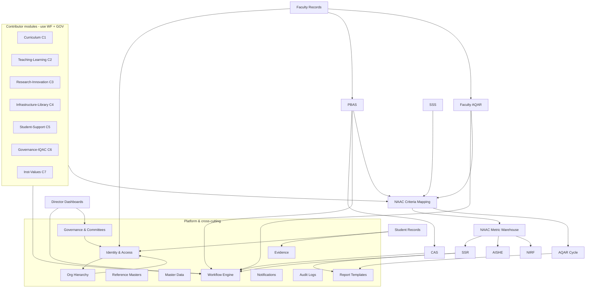

# 04 — Module Documentation

Per-module reference for UMIS (`operant-next`). Each module is documented with: **Purpose · Business rules · Dependencies · Workflow · Current implementation (real files) · Existing issues · Recommended improvements.**

Grounded in the codebase and the condensed reference [../documentation.md](../documentation.md). Related suite docs: [03_Business_Domain.md](03_Business_Domain.md) · [05_Database_Architecture.md](05_Database_Architecture.md) · [06_API_Documentation.md](06_API_Documentation.md) · [08_Backend_Architecture.md](08_Backend_Architecture.md) · [09_Code_Quality_Report.md](09_Code_Quality_Report.md) · [11_Refactoring_Strategy.md](11_Refactoring_Strategy.md) · [CONTRIBUTOR_WORKFLOW_IMPROVEMENT_PLAN.md](CONTRIBUTOR_WORKFLOW_IMPROVEMENT_PLAN.md).

---

## Table of Contents

- [Module Map & Dependencies](#module-map--dependencies)
- [Module Inventory](#module-inventory)
- **Platform & cross-cutting:** [Identity & Access](#1-identity--access-userauth) · [Organizational Hierarchy](#2-organizational-hierarchy) · [Governance & Committees](#3-governance--committees) · [Reference Masters](#4-reference-masters) · [Master Data](#5-master-data) · [Report Templates](#6-report-templates) · [Evidence Review](#7-evidence-review) · [Notifications](#8-notifications) · [Audit Logs](#9-audit-logs) · [Workflow Engine](#10-workflow-engine-infrastructure)
- **People:** [Faculty Management & Records](#11-faculty-management--records) · [Student Management & Records](#12-student-management--records)
- **Curriculum & criterion modules:** [Curriculum (C1)](#13-curriculum-c1) · [The Six Contributor Criterion Modules (C2–C7)](#14-the-six-contributor-criterion-modules-c2c7)
- **Faculty career:** [PBAS](#15-pbas) · [CAS](#16-cas)
- **Reporting & accreditation:** [Faculty AQAR](#17-faculty-aqar) · [Institutional AQAR Cycle](#18-institutional-aqar-cycle) · [SSR](#19-ssr) · [SSS](#20-sss) · [NAAC Metric Warehouse](#21-naac-metric-warehouse) · [NAAC Criteria Mapping](#22-naac-criteria-mapping) · [AISHE](#23-aishe) · [NIRF](#24-nirf) · [Statutory Compliance](#25-statutory-compliance)
- **Oversight:** [Director Dashboards & Approvals](#26-director-dashboards--approvals)

---

## Module Map & Dependencies

## Module Inventory

| # | Module | NAAC | Portals | Uses workflow engine |
|---|---|---|---|:--:|
| 1 | Identity & Access | — | all | — |
| 2 | Organizational Hierarchy | — | admin | — |
| 3 | Governance & Committees | C6 | admin (+ powers authz) | — |
| 4 | Reference Masters | — | admin | — |
| 5 | Master Data | — | admin | — |
| 6 | Report Templates | — | admin | — |
| 7 | Evidence Review | C5 | admin/director/student | — |
| 8 | Notifications | — | all | — |
| 9 | Audit Logs | — | admin | — |
| 10 | Workflow Engine | — | (infra) | ✅ core |
| 11 | Faculty Management & Records | C2/C3 | faculty/director/admin | — |
| 12 | Student Management & Records | C5 | student/director/admin | — |
| 13 | Curriculum | C1 | admin/faculty/director | ✅ |
| 14 | 6 criterion modules | C2–C7 | admin/faculty/director | ✅ |
| 15 | PBAS | C2/C3 | faculty/director/admin | ✅ |
| 16 | CAS | — | faculty/director/admin | ✅ |
| 17 | Faculty AQAR | C3 | faculty/director/admin | ✅ |
| 18 | Institutional AQAR Cycle | C1–C7 | admin | manual states |
| 19 | SSR | C1–C7 | admin/faculty/director/student | ✅ |
| 20 | SSS | C2 | admin/student | — |
| 21 | NAAC Metric Warehouse | C1–C7 | admin/director/faculty | — |
| 22 | NAAC Criteria Mapping | C1–C7 | admin (+ internal) | — |
| 23 | AISHE | — | admin/director | — |
| 24 | NIRF | — | admin/director | — |
| 25 | Statutory Compliance | — | admin/director | — |
| 26 | Director Dashboards & Approvals | all | director | ✅ (consumes) |

---

## 1. Identity & Access (User/Auth)

- **Purpose:** authenticate users and establish identity for the four portals. Full detail in [02_Current_Architecture.md](02_Current_Architecture.md) §Auth and [16_Security_Audit.md](16_Security_Audit.md).
- **Business rules:** self-registration disabled (`/api/auth/register` → 410); faculty/students are admin-provisioned then activate via `employeeCode`/`enrollmentNo` + email/phone; login blocked unless `Active` + `emailVerified`; students may log in by enrollment number; **Director access is not a `role`** — it is earned via governance (see §3).
- **Dependencies:** Organization/Institution/Department (scope), Governance (leadership access), Notifications/Email (verification/reset).
- **Workflow:** provisioning → activation → login → per-request `getCurrentUser()` re-validation.
- **Current implementation:** `src/lib/auth/*` (session, config, tokens, password, user, email, http, errors, validators), `src/app/api/auth/**`, `src/app/api/admin/bootstrap/route.ts`, `src/models/core/user.ts`.
- **Existing issues:** no CSRF tokens (`sameSite=lax`), no rate limiting/lockout, 7-day JWT with no revocation list, `role` enum carries unused legacy values (PRO/NSS/Sports/Swayam/Placement/Director). See [10_Technical_Debt_Report.md](10_Technical_Debt_Report.md).
- **Recommended improvements:** CSRF, rate limiting, `sessionVersion` revocation, prune the role enum, centralize inline API auth checks into `assert*` helpers.

## 2. Organizational Hierarchy

- **Purpose:** model University → College → Department (+ Center/Office) as `Organization` nodes; propagate scope labels used by authorization everywhere.
- **Business rules:** `hierarchyLevel = parent + 1`; head user validated; renames re-project onto denormalized scope fields.
- **Dependencies:** User (head), and every scoped record (via the scope block, see [05_Database_Architecture.md](05_Database_Architecture.md)).
- **Workflow:** admin CRUD (no review workflow).
- **Current implementation:** `src/app/(admin-protected)/admin/hierarchy/page.tsx`, `src/components/admin/hierarchy-manager.tsx` (React Flow graph), `src/app/api/admin/hierarchy/**`, `src/lib/admin/hierarchy.ts`, `src/lib/hierarchy/canonical.ts`, `src/models/core/organization.ts`.
- **Existing issues:** parallel `Institution`/`Department` hierarchy vs `Organization` tree creates dual sources of truth; `headUserId` silently grants leadership authz (see [16_Security_Audit.md](16_Security_Audit.md)).
- **Recommended improvements:** consolidate to one hierarchy source; make the `headUserId` authz path explicit/toggleable.

## 3. Governance & Committees

- **Purpose:** define committees (IQAC, BOS, PBAS/CAS/AQAR/SSR review committees, etc.), memberships, and leadership assignments — the **data that powers workflow-role authorization**.
- **Business rules:** committee type → `WorkflowApproverRole` mapping decides who reviews/notifies at each stage; memberships are date-bounded + `isActive`; leadership assignments are scope-validated.
- **Dependencies:** feeds `resolveAuthorizationProfile` (auth), the workflow engine (reviewer eligibility), notifications (recipients).
- **Workflow:** admin CRUD.
- **Current implementation:** `src/app/(admin-protected)/admin/governance/page.tsx`, `src/components/admin/governance-manager.tsx`, `src/app/api/admin/governance/**`, `src/lib/governance/service.ts` (incl. `resolveWorkflowRoleRecipientIds`), `src/models/core/{governance-committee,governance-committee-membership,leadership-assignment}.ts`.
- **Existing issues:** overlaps with the legacy `Organization.headUserId` path (two ways to grant the same power).
- **Recommended improvements:** make governance assignments the single authorization source; add an admin view of "who can act where."

## 4. Reference Masters

- **Purpose:** controlled-vocabulary lookup **entities** (Award, Skill, Sport, CulturalActivity, SocialProgram, Event) referenced by FK from student/faculty records.
- **Business rules:** student/faculty activity records must reference an existing master.
- **Dependencies:** Student/Faculty records.
- **Current implementation:** `src/app/(admin-protected)/admin/reference-masters/page.tsx`, `src/components/admin/reference-master-manager.tsx`, `src/app/api/admin/reference-masters/[kind](/[id])/route.ts`, `src/lib/admin/reference-masters.ts`, `src/models/reference/*`.
- **Existing issues:** minimal validation UI; overlaps conceptually with Master Data (see §5).
- **Recommended improvements:** clarify the Reference-Masters vs Master-Data boundary in the UI; add usage counts before delete.

## 5. Master Data

- **Purpose:** generic `{category, key}` **config store** consumed programmatically (notably PBAS scoring weights & submission deadline, office lists, report categories).
- **Business rules:** unique `(category, key)`; entries are **not** FK-referenced (queried at runtime).
- **Dependencies:** PBAS scoring engine, various dropdowns.
- **Current implementation:** `src/app/(admin-protected)/admin/master-data/page.tsx`, `src/app/api/admin/master-data(/[id]|/bulk)/route.ts`, `src/lib/admin/master-data.ts`, `src/models/core/master-data.ts`.
- **Existing issues:** untyped `metadata` (Mixed); config like PBAS weights lives here rather than in a typed settings model.
- **Recommended improvements:** typed settings accessors; schema-validate critical categories (PBAS weights) on write.

## 6. Report Templates

- **Purpose:** versioned `{{placeholder}}` templates rendered into PDFs for PBAS/AQAR/CAS/faculty reports.
- **Business rules:** defaults auto-created per type; version bumped on edit; legacy templates auto-upgraded on read.
- **Dependencies:** the PDF builder; consumed by PBAS/AQAR/faculty report endpoints.
- **Current implementation:** `src/app/(admin-protected)/admin/report-templates/page.tsx`, `src/components/admin/report-template-manager.tsx`, `src/app/api/admin/report-templates/[id]/{preview,preview-data,download}/route.ts`, `src/lib/report-templates/{service,pdf,preview,validators}.ts`, `src/models/core/report-template.ts`.
- **Existing issues:** the hand-rolled PDF builder (`src/lib/report-templates/pdf.ts`) **silently strips non-ASCII** — corrupts Indian-language names (Critical; see [10_Technical_Debt_Report.md](10_Technical_Debt_Report.md)); synchronous generation on the request thread.
- **Recommended improvements:** adopt a real PDF/Unicode-capable library; move generation to a background job (see [17_Performance_Optimization.md](17_Performance_Optimization.md)).

## 7. Evidence Review

- **Purpose:** verify student-uploaded supporting documents across 9 record types via a pending queue.
- **Business rules:** scope-based access (`resolveAuthorizedEvidenceDepartmentIds`); decision updates the `Document` + notifies the student; dashboard flags items pending > 7 days.
- **Dependencies:** Student Records, Document/Upload, Notifications, Authorization.
- **Current implementation:** `src/app/(admin-protected)/admin/evidence/page.tsx`, `src/app/(director-protected)/director/evidence/page.tsx`, `src/components/evidence/evidence-review-board.tsx`, `src/app/api/evidence/review(/[id])/route.ts`, `src/lib/evidence/service.ts`, `src/models/reference/document.ts`. (`/api/faculty/evidence` → 410, merged into faculty workspace.)
- **Existing issues:** review board unpaginated; verification is a simple status flip (no multi-reviewer trail).
- **Recommended improvements:** pagination + filters; optional dual-verification for high-stakes evidence.

## 8. Notifications

- **Purpose:** in-app + email notifications for workflow events, evidence, and deadlines.
- **Business rules:** dedupe by `metadata.dedupeKey` within a window; email only to verified addresses; deadline reminders computed **lazily** when a user fetches `/api/notifications`.
- **Dependencies:** Governance (recipient resolution), Email (Resend), every workflow module.
- **Current implementation:** `src/components/notifications/notification-center.tsx`, `src/app/api/notifications(/[id]/read|/read-all)/route.ts`, `src/lib/notifications/{service,email}.ts`, `src/models/core/notification.ts`.
- **Existing issues:** no email retry (failed = terminal); reminders depend on a user visiting the app (no scheduler); in-app + email tightly coupled in `createNotifications`.
- **Recommended improvements:** background scheduler for reminders; email outbox with retry; event-driven decoupling (see [19_Future_Architecture.md](19_Future_Architecture.md)).

## 9. Audit Logs

- **Purpose:** append-only trail of create/update/delete/workflow actions.
- **Business rules:** stores actor + action + tableName + recordId + old/new (Mixed) + IP; filterable/paginated admin view.
- **Dependencies:** called by ~20 services; IP via `getRequestAuditContext`.
- **Current implementation:** `src/app/(admin-protected)/admin/audit-logs/page.tsx`, `src/components/admin/audit-log-manager.tsx`, `src/app/api/admin/audit-logs/route.ts`, `src/lib/audit/{service,request}.ts`, `src/models/core/audit-log.ts`.
- **Existing issues:** `createAuditLog` does not `dbConnect()` and is **not transaction-bound** with the write it records (a rolled-back write can leave an orphan log, or vice-versa).
- **Recommended improvements:** bind audit writes to the same transaction/session; add `dbConnect()` guard.

## 10. Workflow Engine (infrastructure)

- **Purpose:** the generic state machine driving all review lifecycles (11 modules).
- **Business rules:** `resolveWorkflowTransition(def, status, action)` computes the next status; `canActorProcessWorkflowStage` enforces stage authorization; `syncWorkflowInstanceState` tracks live state; definitions seeded from `DEFAULT_WORKFLOW_DEFINITIONS`.
- **Dependencies:** Authorization (reviewer eligibility), Governance (roles), every contributor/faculty-career/reporting module.
- **Current implementation:** `src/lib/workflow/engine.ts` (+ `engine.test.ts`), `src/models/core/{workflow-definition,workflow-instance}.ts`.
- **Existing issues:** the engine is centralized, but each module re-implements the **orchestration** around it (see §14 and [CONTRIBUTOR_WORKFLOW_IMPROVEMENT_PLAN.md](CONTRIBUTOR_WORKFLOW_IMPROVEMENT_PLAN.md)).
- **Recommended improvements:** the Contributor Module Kernel; emit domain events on transition.

## 11. Faculty Management & Records

- **Purpose:** the complete faculty professional record (qualifications, teaching load/summary, result summary, publications, books, patents, projects, events, FDPs, MOOCs, e-content, PhD guidance, awards, consultancy, admin roles, contributions, KPIs, AQAR summary) — the **source data for PBAS/CAS scoring**.
- **Business rules:** unique `employeeCode`; `saveFacultyWorkspace` **full-replaces** each sub-collection (KPI/AQAR upsert by year); referenced entities must pre-exist in Reference Masters; `ensureFacultyContext` resolves User↔Faculty.
- **Dependencies:** Reference Masters, Upload/Evidence, PBAS/AQAR (consumers).
- **Current implementation:** `src/app/(faculty-protected)/faculty/profile/page.tsx`, `src/components/faculty/faculty-workspace-form.tsx` (**4,696 lines**), `src/app/api/faculty/{profile,photo,report,report-defaults}/route.ts`, `src/app/api/director/faculty/[id]/records/route.ts`, `src/lib/faculty/*`, 22 models in `src/models/faculty/`.
- **Existing issues:** `faculty-workspace-form.tsx` is a 4,696-line monolith; full-replace save risks data loss on concurrent edits; no optimistic-concurrency control.
- **Recommended improvements:** decompose the form by section (lazy-loaded tabs); switch to per-section upsert; add versioning/concurrency guard.

## 12. Student Management & Records

- **Purpose:** student identity + academic records + activities (awards, skills, sports, cultural, publications, research, internships, placements, participations).
- **Business rules:** unique `enrollmentNo`; attaching a document fires an evidence-review notification; activity records FK to Reference Masters.
- **Dependencies:** Reference Masters, Evidence, AQAR Cycle (`student-aqar-entry`).
- **Current implementation:** `src/app/(student-protected)/student/{profile,records,verification-pending}/page.tsx`, `src/components/student/*`, `src/app/api/student/**`, `src/app/api/director/students/[id]/records/route.ts`, `src/lib/student/*`, 19 models in `src/models/student/`.
- **Existing issues:** `student/records` type-discriminated CRUD is broad; resume-PDF endpoint retired (410).
- **Recommended improvements:** pagination on records; unify the record CRUD behind a small generic handler.

## 13. Curriculum (C1)

- **Purpose:** programs, courses, PO/CO outcome mappings, BOS meetings/decisions, syllabus versions, value-added courses, academic calendars, plus a plan→assignment→contribution→review cycle.
- **Business rules:** unique course codes; CO↔PO correlation (1–3); syllabus versions carry `effectiveFrom`; engine-driven contribution review.
- **Dependencies:** Program/Course/Department, Workflow, Governance (BOS committee).
- **Current implementation:** `src/app/(admin|faculty|director-protected)/*/curriculum`, `src/app/api/curriculum/assignments/**` + `src/app/api/admin/curriculum/**`, `src/lib/curriculum/*`, `src/models/academic/curriculum-*` (13 models) + `program.ts`/`course.ts`.
- **Existing issues:** shares the contributor-workflow duplication; large service.
- **Recommended improvements:** fold into the Contributor Module Kernel (Wave 4 in [CONTRIBUTOR_WORKFLOW_IMPROVEMENT_PLAN.md](CONTRIBUTOR_WORKFLOW_IMPROVEMENT_PLAN.md)).

## 14. The Six Contributor Criterion Modules (C2–C7)

These six modules are **architecturally identical** — admin **Plan** → **Assignment** → faculty **Contribution** → multi-stage **Review** → **Approve** — differing only in domain fields and committee type.

**Shared template (applies to all six):**
- **Business rules:** submission gated by module-specific hard rules; **self-review blocked** (unless Admin); reviewer eligibility from governance scope; status `Draft → Submitted → <Module> Review → Under Review → Committee Review → Approved/Rejected`.
- **Dependencies:** Workflow Engine, Authorization/Governance, Audit, Notifications, Upload/Document, Academic Year, Org scope.
- **Workflow:** the shared engine (see §10 and [06_API_Documentation.md](06_API_Documentation.md) state machine).
- **Current implementation (per module `<m>`):** `src/lib/<m>/{service,validators}.ts`; `src/app/api/<m>/assignments/**` (`[id]`, `/contribution`, `/submit`, `/review`); `src/app/api/admin/<m>/{plans,assignments}/**`; `src/components/<m>/<m>-{manager,review-board,contributor-workspace}.tsx`; pages under all three portals.

| Module | NAAC | Domain purpose | Domain models (category) | Committee |
|---|---|---|---|---|
| Teaching-Learning | C2 | innovative pedagogy, ICT, assessment, learning outcomes | `academic/teaching-learning-{plan,assignment,session,assessment,support}` | `TEACHING_LEARNING_REVIEW` |
| Research-Innovation | C3 | institutional research/innovation, grants, startups, IP | `research/research-innovation-{plan,assignment,activity,grant,startup}` (+ `publication`, `project`, `intellectual-property`) | `RESEARCH_COMMITTEE` |
| Infrastructure-Library | C4 | facilities, resources, maintenance, usage | `operations/infrastructure-library-{plan,assignment,facility,resource,maintenance,usage}` | `INFRASTRUCTURE_LIBRARY_REVIEW` |
| Student-Support-Governance | C5 | mentoring, grievances, progression, representation | `student/student-support-{plan,assignment,mentor-group,grievance,representation,progression}` | `STUDENT_SUPPORT_GOVERNANCE_REVIEW` |
| Governance-Leadership-IQAC | C6 | IQAC meetings, policies, quality initiatives, compliance reviews | `core/governance-{leadership-iqac-plan,leadership-iqac-assignment,iqac-meeting,policy-circular,quality-initiative,compliance-review}` | `IQAC` |
| Institutional-Values-Best-Practices | C7 | gender/ethics/environment, outreach, best practices | `quality/*` (gender-equity, ethics, green-campus, energy/water/waste, sustainability-audit, outreach, inclusiveness, best-practice, distinctiveness) | (IQAC/values) |

- **Existing issues (family-wide):** the six `service.ts` files total **~13,100 lines** of near-identical orchestration (measured; see [09_Code_Quality_Report.md](09_Code_Quality_Report.md)); ~54 parallel route files; three duplicated component types each; per-module status enums; review boards unpaginated. Adding a new criterion = copying the whole vertical.
- **Recommended improvements:** extract the **Contributor Module Kernel** and migrate each module behind parity tests — the full plan is in **[CONTRIBUTOR_WORKFLOW_IMPROVEMENT_PLAN.md](CONTRIBUTOR_WORKFLOW_IMPROVEMENT_PLAN.md)**.

## 15. PBAS

- **Purpose:** UGC annual faculty self-appraisal producing an API score (prerequisite for CAS; feeds NAAC C2/C3). See also [PBAS_SELF_APPRAISAL_SYSTEM.md](PBAS_SELF_APPRAISAL_SYSTEM.md) and [PBAS_UGC_PRODUCTION_IMPLEMENTATION_GUIDE.md](PBAS_UGC_PRODUCTION_IMPLEMENTATION_GUIDE.md).
- **Business rules:** one active form per faculty; submit gated on `totalScore>0` + deadline; immutable revision snapshot on submit; `approvedScore ≤ claimedScore ≤ maxScore`; final approval locks the form; graduated deadline reminders; admin break-glass override.
- **Dependencies:** Faculty Records (source data), Master Data (scoring weights/deadline), Workflow, Governance (PBAS committee), Report Templates (PDF).
- **Current implementation:** `src/app/(faculty|admin|director-protected)/*/pbas`, `admin/pbas/catalog`, `src/app/api/pbas/**` + `src/app/api/admin/pbas/**`, `src/lib/pbas/{service (2,502 lines),workflow,catalog,references,report-pdf,migration}.ts`, `src/models/core/{faculty-pbas-form,faculty-pbas-entry,faculty-pbas-revision,pbas-category-master,pbas-indicator-master,pbas-id-alias}.ts`.
- **Existing issues:** `pbas/service.ts` (2,502 lines) mixes scoring, workflow, revisions, moderation, reminders; scoring weights in untyped Master Data.
- **Recommended improvements:** split the service by concern (scoring / workflow / revisions / reminders); typed settings; share workflow orchestration via the kernel with a domain hook for scoring.

## 16. CAS

- **Purpose:** faculty promotion applications gated on service years + minimum API score from approved PBAS.
- **Business rules:** eligibility requires ≥1 Approved PBAS + experience/score ≥ rule minimums; 3 mandatory document types; promotion-history written on approve; default rules auto-seeded; break-glass override.
- **Dependencies:** PBAS (scores), Faculty Records, Workflow, Governance (CAS screening committee), Documents.
- **Current implementation:** `src/app/(faculty|admin|director-protected)/*/cas`, `src/components/cas/*` + `src/components/admin/cas-rule-manager.tsx`, `src/app/api/cas/**` + `src/app/api/admin/cas/rules/**`, `src/lib/cas/{service,admin,validators}.ts`, `src/models/core/cas-*`.
- **Existing issues:** shares workflow duplication; eligibility logic entangled with orchestration.
- **Recommended improvements:** kernel + domain hooks for eligibility/promotion-history.

## 17. Faculty AQAR

- **Purpose:** annual faculty quality-contribution report (publications, projects, patents, awards, fellowships, etc.) with a weighted contribution index; feeds C3 and the AQAR Cycle.
- **Business rules:** unique per (faculty, academicYear); submit gate `totalContributionIndex>0`; faculty may delete own Draft/Rejected; weighted index formula.
- **Dependencies:** Faculty Records, Workflow, AQAR Cycle (aggregation), Report Templates.
- **Current implementation:** `src/app/(faculty|admin|director-protected)/*/aqar`, `src/components/aqar/{aqar-dashboard,aqar-review-board}.tsx`, `src/app/api/aqar/**`, `src/lib/aqar/{service,report-pdf,validators}.ts`, `src/models/core/aqar-application.ts`.
- **Existing issues:** two AQAR sub-systems (this + the Cycle, §18) can confuse; shares workflow duplication.
- **Recommended improvements:** clarify naming (Faculty AQAR vs AQAR Cycle); kernel adoption.

## 18. Institutional AQAR Cycle

- **Purpose:** admin-owned institutional AQAR that aggregates 25+ collections into NAAC C1–C7 sections for a year.
- **Business rules:** one cycle per academic year; `generateAqarCycleSnapshot()` pulls live counts via `NaacCriteriaMapping`; criterion "Ready" at ≥75%; **manual** states Draft → Department Review → IQAC Review → Finalized → Submitted; submit blocked unless Finalized; syncs `student-aqar-entry`.
- **Dependencies:** NAAC Criteria Mapping, nearly every data module (aggregation source), Report Templates.
- **Current implementation:** `src/components/aqar/aqar-cycle-dashboard.tsx` (in `admin/aqar`), `src/app/api/admin/aqar/cycles/**` (`/generate`, `/finalize`, `/submit`, `/report`) + `/mappings/**`, `src/lib/aqar-cycle/{service,report-pdf,validators}.ts`, `src/models/core/aqar-cycle.ts` + `src/models/student/student-aqar-entry.ts`.
- **Existing issues:** snapshot generation is a large multi-collection fan-out (perf; see [17_Performance_Optimization.md](17_Performance_Optimization.md)); state machine is hand-coded (not the engine).
- **Recommended improvements:** aggregation pipelines + background generation; consider engine-driven states.

## 19. SSR

- **Purpose:** the NAAC-visit Self-Study Report (Cycle → Criteria → Metrics → Narratives) with contributor assignments.
- **Business rules:** hierarchical structure; assignment lifecycle via engine; multi-type responses (numeric/text/bool/date/table + narrative); optional word-count limit; scope-based reviewer authorization; students get read-only visibility.
- **Dependencies:** Workflow, Governance (SSR committee), NAAC Warehouse (data), Documents.
- **Current implementation:** `src/app/(admin|faculty|director|student-protected)/*/ssr`, `src/components/ssr/*` + `src/components/admin/ssr-manager.tsx`, `src/app/api/ssr/**` + `src/app/api/admin/ssr/**`, `src/lib/ssr/*`, `src/models/reporting/ssr-*` (6 models).
- **Existing issues:** shares workflow duplication; large admin surface.
- **Recommended improvements:** kernel adoption; reuse warehouse metric values to pre-fill quantitative metrics.

## 20. SSS

- **Purpose:** NAAC-mandated anonymous Student Satisfaction Survey feeding C2 metrics.
- **Business rules:** default 5-question blueprint across 5 buckets; only eligible students respond; one response per student/survey; anonymized analytics; `overallSatisfactionIndex` (0–100) + response rate consumed by the NAAC warehouse.
- **Dependencies:** Student, NAAC Metric Warehouse.
- **Current implementation:** `src/app/(student-protected)/student/sss/page.tsx`, `src/components/student/student-sss-workspace.tsx`, `src/app/api/student/sss/**` + `src/app/api/admin/accreditation/sss/**`, `src/lib/accreditation/service.ts`, `src/models/engagement/sss-*` (6 models).
- **Existing issues:** SSS logic lives inside the large shared `accreditation/service.ts` (1,732 lines).
- **Recommended improvements:** extract an `sss` service; add survey scheduling/reminders.

## 21. NAAC Metric Warehouse

- **Purpose:** cycle-based store of ~30 computed NAAC metrics (C1–C7) with manual override + review.
- **Business rules:** catalog seeded from `naac-criteria-mapping/catalog.ts`; `generateNaacMetricValues()` aggregates ~20 collections; status Pending→Generated→Reviewed→Overridden (override needs reason); each run logged.
- **Dependencies:** NAAC Criteria Mapping, most data modules, SSS/AISHE analytics.
- **Current implementation:** `src/app/(admin|director|faculty-protected)/*/naac-metric-warehouse`, `src/components/admin/naac-metric-warehouse-manager.tsx`, `src/app/api/admin/naac-metric-warehouse/**`, `src/lib/naac-metric-warehouse/*`, `src/models/reporting/naac-metric-*` (4 models).
- **Existing issues:** heavy generation fan-out; no scheduling.
- **Recommended improvements:** aggregation pipelines + scheduled/background generation.

## 22. NAAC Criteria Mapping

- **Purpose:** configurable bridge from data sources → NAAC criterion codes; drives AQAR-cycle snapshots and warehouse generation.
- **Business rules:** seven criteria fixed; default mappings seeded; each mapping ties `tableName:fieldReference` → `criteriaCode` with weightage.
- **Dependencies:** consumed by AQAR Cycle + NAAC Warehouse.
- **Current implementation:** managed in `admin/aqar` (`src/components/admin/naac-criteria-mapping-manager.tsx`), `src/app/api/admin/aqar/mappings/**`, `src/lib/naac-criteria-mapping/{catalog,service}.ts`, `src/models/reference/naac-criteria-mapping.ts` / `reporting/naac-metric-definition.ts`.
- **Existing issues:** mapping definitions split between a static catalog and DB records.
- **Recommended improvements:** single source of truth for mappings; validation that referenced tables/fields exist.

## 23. AISHE

- **Purpose:** All India Survey on Higher Education — statistical survey cycles (enrollment, faculty, staff, finance, infrastructure, support).
- **Business rules:** one cycle per academic year; 8 statistical categories; submission logged.
- **Dependencies:** Institution/Program, NAAC Warehouse (some values).
- **Current implementation:** `src/app/(admin-protected)/admin/accreditation` (+ director view), `src/components/accreditation/accreditation-operations-manager.tsx`, `src/app/api/admin/accreditation/aishe/**`, `src/lib/accreditation/service.ts`, `src/models/reporting/aishe-*` (11 models).
- **Existing issues:** all AISHE/NIRF/compliance/SSS logic concentrated in one 1,732-line service.
- **Recommended improvements:** split `accreditation/service.ts` per sub-system.

## 24. NIRF

- **Purpose:** National Institutional Ranking Framework — ranking cycles with parameters→metrics→scores→composite + benchmarks + trends.
- **Business rules:** ranking cycle per (year, framework); parameter weightages; composite score computed; benchmark comparison; trend analysis.
- **Dependencies:** Institution/Department, NAAC Warehouse/metric data.
- **Current implementation:** `admin/accreditation` (NIRF tab), `src/app/api/admin/accreditation/nirf/**`, `src/lib/accreditation/service.ts`, `src/models/reporting/nirf-*` (12 models).
- **Existing issues:** shares the concentrated accreditation service; score calc coupled.
- **Recommended improvements:** dedicated `nirf` service + explicit scoring module.

## 25. Statutory Compliance

- **Purpose:** track regulatory bodies, institutional approvals, statutory reports, inspection visits, and compliance action items.
- **Business rules:** approvals/renewals tracked; action items Open→InProgress→Resolved→Closed.
- **Dependencies:** Institution, Documents, Notifications.
- **Current implementation:** `admin/accreditation` (Compliance tab), `src/app/api/admin/accreditation/compliance/**`, `src/lib/accreditation/service.ts`, `src/models/core/{regulatory-body,institutional-approval,statutory-compliance-report,inspection-visit,compliance-action-item}.ts`.
- **Existing issues:** no reminders for approval expiry/inspection dates.
- **Recommended improvements:** deadline reminders (via the notifications scheduler); dashboard of upcoming renewals.

## 26. Director Dashboards & Approvals

- **Purpose:** scoped cross-module command center — unified approval queue (11 modules), faculty/student rosters with drill-down, evidence review, CSV exports.
- **Business rules:** everything filtered by `resolveAuthorizationProfile` scopes; `needsAttention` when PBAS/CAS/AQAR is in a review state; queues capped (6/module, 12 total); student-approval route retired (410).
- **Dependencies:** Workflow (pending queues), Authorization, every reviewed module.
- **Current implementation:** `src/app/(director-protected)/director/{,approvals,faculty,students,evidence,reports}/page.tsx`, `src/components/director/*`, `src/app/api/director/**`, `src/lib/director/dashboard.ts`.
- **Existing issues:** `getLeadershipDashboardData()` issues **60–80 Mongo operations per render** (11-module fan-out; see [17_Performance_Optimization.md](17_Performance_Optimization.md)); no pagination.
- **Recommended improvements:** `$facet` aggregation to collapse the fan-out; paginate queues; cache scope resolution per request.

---

*All modules trace to real files under `src/`. Structural improvements are sequenced in [11_Refactoring_Strategy.md](11_Refactoring_Strategy.md) and [12_Development_Master_Plan.md](12_Development_Master_Plan.md); the contributor-workflow family (§13–§14, and the workflow parts of §15–§19) is addressed in depth by [CONTRIBUTOR_WORKFLOW_IMPROVEMENT_PLAN.md](CONTRIBUTOR_WORKFLOW_IMPROVEMENT_PLAN.md).*
