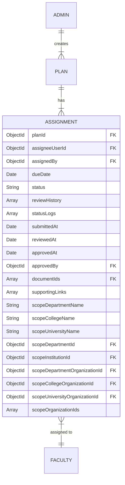

# 05 — Database Architecture

> **Suite:** UMIS (`operant-next`) Enterprise Documentation
> **Scope:** MongoDB/Mongoose engine, connection management, model registration, 188-model taxonomy, multi-tenancy, core entity schemas, plan/assignment pattern, domain families, indexes, and improvement roadmap.
> **Authoritative source:** `documentation.md` §8, supplemented by direct code reading of `src/lib/dbConnect.ts`, `src/models/core/user.ts`, `src/models/core/organization.ts`, `src/models/reference/institution.ts`, `src/models/reference/academic-year.ts`, `src/models/faculty/faculty.ts`, `src/models/student/student.ts`, `src/models/academic/program.ts`, and `src/lib/authorization/service.ts`.

---

## Table of Contents

1. [Engine and Driver](#1-engine-and-driver)
2. [Connection Management — dbConnect.ts](#2-connection-management--dbconnectts)
3. [Canonical Model Registration Pattern](#3-canonical-model-registration-pattern)
4. [Model Taxonomy — 188 Models Across 10 Categories](#4-model-taxonomy--188-models-across-10-categories)
5. [Multi-Tenancy: The Denormalized Scope Block](#5-multi-tenancy-the-denormalized-scope-block)
6. [Core Entity Field Reference](#6-core-entity-field-reference)
7. [The Plan/Assignment Pattern](#7-the-planassignment-pattern)
8. [Domain Family Deep-Dives](#8-domain-family-deep-dives)
   - 8.1 [PBAS Family](#81-pbas-family)
   - 8.2 [CAS Family](#82-cas-family)
   - 8.3 [AQAR Family](#83-aqar-family)
   - 8.4 [SSR Family](#84-ssr-family)
   - 8.5 [SSS Family](#85-sss-family)
   - 8.6 [Reporting Families — AISHE / NIRF / NAAC Metrics](#86-reporting-families--aishe--nirf--naac-metrics)
9. [Indexes and Constraints](#9-indexes-and-constraints)
10. [Entity-Relationship Diagram](#10-entity-relationship-diagram)
11. [Current State](#11-current-state)
12. [Problems Identified](#12-problems-identified)
13. [Recommended Solutions](#13-recommended-solutions)
14. [Implementation Plan](#14-implementation-plan)

---

## 1. Engine and Driver

| Attribute | Value |
|---|---|
| Database | MongoDB (Atlas or self-hosted) |
| ODM | Mongoose `^9.2.4` |
| Node runtime | Default Node.js (not Edge) — required for `Buffer`/`crypto` |
| Connection URI | `MONGODB_URI` env var; throws on absence |
| Schema option everywhere | `{ timestamps: true }` — all documents gain `createdAt`/`updatedAt` |
| Sub-document option | `{ _id: false }` — embedded sub-schemas have no own `_id` |
| `bufferCommands` | `false` — queries issued before the connection is ready throw immediately rather than queuing silently |

MongoDB's flexible document model is the reason 188 schemas can represent deeply nested accreditation structures (e.g. `reviewHistory[]`, `statusLogs[]`, embedded `metrics` weighted objects, `Mixed` old/new data in audit logs) without multi-table joins.

---

## 2. Connection Management — dbConnect.ts

**File:** `src/lib/dbConnect.ts`

### The problem it solves

Next.js hot-reloads re-evaluate module scope on every change, and serverless/edge deployments may re-instantiate the module on every cold start. Without caching, each evaluation would open a new `mongoose.connect()`, exhausting the MongoDB connection pool.

### Implementation

```ts
// src/lib/dbConnect.ts (complete file)
interface MongooseCache {
    conn: typeof mongoose | null;
    promise: Promise<typeof mongoose> | null;
}

declare global {
    var mongooseCache: MongooseCache | undefined;
}

const cached: MongooseCache = globalThis.mongooseCache ?? { conn: null, promise: null };
if (!globalThis.mongooseCache) globalThis.mongooseCache = cached;

async function dbConnect(): Promise<typeof mongoose> {
    const mongoUri = process.env.MONGODB_URI;
    if (!mongoUri) throw new Error("Please define the MONGODB_URI environment variable …");
    if (cached.conn) return cached.conn;
    if (!cached.promise) {
        console.log("Connecting to MongoDB …");
        cached.promise = mongoose.connect(mongoUri, { bufferCommands: false });
    }
    cached.conn = await cached.promise;
    return cached.conn;
}
```

### Behavior

- **First call:** opens the Mongoose connection and stores both the pending promise and the resolved connection on `globalThis.mongooseCache`.
- **Subsequent calls:** returns the cached `conn` immediately with no re-connection overhead.
- **Hot reload safety:** `globalThis` persists across module re-evaluations in the Node.js process, so the cache survives.
- **Serverless reuse:** Lambda-like hosts reuse the same process across invocations within a warm window; the cache prevents redundant re-connections.
- **`bufferCommands: false`:** any Mongoose operation attempted before `dbConnect()` completes throws immediately, surfacing bugs at development time rather than producing a silent queue.

### Caller pattern

Every `service.ts` function that touches MongoDB calls `await dbConnect()` as its first statement. The connection object is not returned to the caller — it is a side-effect that sets up the global connection for all subsequent Mongoose operations within the same request.

---

## 3. Canonical Model Registration Pattern

Every one of the 188 model files follows the same hot-reload-safe registration pattern. Importing a model file never double-registers the schema.

```ts
// Pattern used across src/models/**/<name>.ts

export interface IModel extends Document {
    // typed fields matching the schema
}

// Sub-document schemas use { _id: false }
const SubSchema = new Schema<ISub>({ /* ... */ }, { _id: false });

const ModelSchema = new Schema<IModel>({
    email: { type: String, required: true, unique: true, index: true },
    refField: { type: Schema.Types.ObjectId, ref: "Target", index: true },
    status: { type: String, enum: STATUS_VALUES, default: "Draft" },
    // ...
}, { timestamps: true, collection: "collection_name" });

// Compound / unique indexes declared separately
ModelSchema.index({ a: 1, b: 1 }, { unique: true });

// Hot-reload guard — the critical line
const Model: Model<IModel> =
    mongoose.models.Model || mongoose.model<IModel>("Model", ModelSchema);

export default Model;
```

**Conventions enforced across all 188 models:**

| Convention | Details |
|---|---|
| `typescript: true` | `Schema<IModel>` and `Model<IModel>` generics on every schema/model |
| `{ timestamps: true }` | Automatic `createdAt`/`updatedAt` on every collection |
| `{ _id: false }` on sub-schemas | Prevents unwanted `_id` fields on embedded arrays |
| Shared enum arrays | e.g. `const STATUS_VALUES = ["Draft", …] as const` — imported by both the Mongoose schema and the corresponding Zod validator in `validators.ts`, ensuring schema and API validation agree |
| `select: false` on secrets | `password`, token hashes — never returned in default projections |
| Sparse-unique indexes | Optional FK fields (e.g. `facultyId`, `studentId`, `userId`) use `{ unique: true, sparse: true }` to allow null values |
| Incremental schema patching | A handful of models (`Program`, `FacultyPbasEntry`) test `!schema.path("field")` before calling `schema.add(...)` — a sign of incremental migration without a migration framework |

---

## 4. Model Taxonomy — 188 Models Across 10 Categories

All models live under `src/models/` and are grouped by domain category. The total was measured from the codebase.

| Category | Path | Count | Primary domain |
|---|---|:---:|---|
| `core/` | `src/models/core/` | **41** | User, Organization, PBAS, CAS, AQAR, WorkflowDefinition, WorkflowInstance, GovernanceCommittee, GovernanceCommitteeMembership, LeadershipAssignment, AuditLog, Notification, MasterData, ReportTemplate, UploadIntent, regulatory compliance |
| `reporting/` | `src/models/reporting/` | **35** | AISHE (11), NIRF (12), NAAC metrics (4), SSR (6), Report |
| `faculty/` | `src/models/faculty/` | **22** | Faculty profile + 21 achievement sub-record types (publication, patent, project, teaching load, result summary, FDP, MOOC, e-content, PhD guidance, award, consultancy, admin role, event, contribution, KPI, AQAR summary, …) |
| `academic/` | `src/models/academic/` | **20** | Program, Course, Semester, 13 curriculum sub-models, 4 teaching-learning sub-models |
| `student/` | `src/models/student/` | **19** | Student + 18 activity/record types (academic record, placement, internship, award, skill, sport, cultural, publication, research, participation, support-governance) |
| `quality/` | `src/models/quality/` | **16** | Institutional Values / Best Practices: gender equity, ethics programs, green campus, energy/water/waste, sustainability audit, outreach, inclusiveness, best practice, distinctiveness |
| `reference/` | `src/models/reference/` | **12** | Institution, Department, AcademicYear, Semester, Document, NAAC criteria mapping, lookup entities (Award, Skill, Sport, CulturalActivity, SocialProgram, Event) |
| `research/` | `src/models/research/` | **9** | ResearchInnovationPlan, ResearchInnovationAssignment, activity, grant, startup, Publication, Project, IntellectualProperty |
| `engagement/` | `src/models/engagement/` | **8** | SSS (6 models), Feedback, SystemMisc |
| `operations/` | `src/models/operations/` | **6** | InfrastructureLibraryPlan, Assignment, Facility, Resource, Maintenance, Usage |
| **Total** | | **188** | |

The 10 categories map closely onto the 7 NAAC criteria (C1–C7) plus three cross-cutting infrastructure concerns (core, reporting, engagement).

---

## 5. Multi-Tenancy: The Denormalized Scope Block

UMIS is a multi-department, multi-institution system. Rather than using relational joins to determine a record's organizational home, **every plan, assignment, and reporting record carries a denormalized scope block written at creation time**.

### Scope block fields

```
scopeDepartmentName      string   — human-readable dept name
scopeCollegeName         string   — human-readable college name
scopeUniversityName      string   — human-readable university name
scopeDepartmentId        ObjectId — FK to Department
scopeInstitutionId       ObjectId — FK to Institution
scopeDepartmentOrganizationId  ObjectId — FK to Organization (dept node)
scopeCollegeOrganizationId     ObjectId — FK to Organization (college node)
scopeUniversityOrganizationId  ObjectId — FK to Organization (university node)
scopeOrganizationIds     ObjectId[] — all org ancestors (dept + college + university)
```

### How it works

1. **At record creation** (e.g. when Admin assigns a plan to a faculty member), the service resolves the faculty's full org chain and writes all nine scope fields onto the assignment document.
2. **At list fetch** for a non-admin reviewer, `buildAuthorizedScopeQuery(profile)` (in `src/lib/authorization/service.ts`) constructs a Mongo `$or` filter covering all nine fields from the reviewer's `AuthorizationProfile.browseScopes`. This filter is applied directly to the collection — no joins.
3. **Human-readable names** (`scopeDepartmentName`, etc.) survive even if the org hierarchy is later renamed, which is why they are kept alongside the ObjectId FKs.

### Why this design was chosen

MongoDB has no native foreign-key constraints or joins at query time. Denormalization avoids N+1 lookups on list pages and makes scope-filtered queries a single indexed collection scan. The trade-off is that a department rename must be propagated to all in-flight scope blocks — which is handled by a one-shot migration script (`scripts/backfill-governance-rbac.cjs`) and by the `lib/admin/hierarchy.ts` rename logic.

---

## 6. Core Entity Field Reference

### 6.1 User (`src/models/core/user.ts`, collection: `users`)

| Field | Type | Constraint | Notes |
|---|---|---|---|
| `name` | String | required | trimmed |
| `email` | String | required, unique, index | lowercase, trimmed |
| `password` | String | `select: false` | bcrypt hash (cost 12); absent until activation |
| `role` | String enum | required, index | Faculty, Student, Alumni, Admin, Director, PRO, NSS, Sports, Swayam, Placement |
| `accountStatus` | String enum | required, index | PendingActivation, Active, Suspended |
| `institutionId` | ObjectId | FK→Institution, index | |
| `departmentId` | ObjectId | FK→Department, index | |
| `studentId` | ObjectId | FK→Student, sparse-unique | set on student activation |
| `facultyId` | ObjectId | FK→Faculty, sparse-unique | set on faculty activation |
| `universityName`, `collegeName`, `department` | String | index | denormalized from org hierarchy |
| `experience[]` | embedded | `{ _id: false }` | designation, organization, dates, isCurrent |
| `researchProfile` | embedded | `{ _id: false }` | ORCID, Scopus, ResearcherID, GoogleScholar |
| `emailVerified` | Boolean | default false | |
| `emailVerificationTokenHash`, `passwordResetTokenHash` | String | `select: false` | SHA-256 hash only |
| **Compound indexes** | | | `{institutionId,role}`, `{departmentId,role}`, `{role,accountStatus}` |

### 6.2 Organization (`src/models/core/organization.ts`)

| Field | Type | Constraint |
|---|---|---|
| `name` | String | required, unique |
| `type` | String enum | University, College, Department, Center, Office |
| `parentOrganizationId` | ObjectId self-ref | FK→Organization, index |
| `hierarchyLevel` | Number | default 1, index; set to parent+1 |
| `headUserId` | ObjectId | FK→User, index — **legacy authorization path** |
| `universityName`, `collegeName` | String | index — denormalized from ancestors |
| **Compound indexes** | | `{type,parentOrganizationId,name}`, `{headUserId,isActive}` |

### 6.3 Institution (`src/models/reference/institution.ts`, collection: `institutions`)

| Field | Type | Constraint |
|---|---|---|
| `name` | String | required, unique |
| `code` | String | unique, sparse |
| `organizationId` | ObjectId | FK→Organization, index — links Institution to the org tree |
| address, city, state, country, email, phone | String | optional |

### 6.4 Department (`src/models/reference/department.ts`, collection: `departments`)

Unique per `{institutionId, name}`. Fields: `organizationId` (FK→Organization), `institutionId` (FK→Institution), `name`, `code` (sparse-unique), `headFacultyId`.

### 6.5 AcademicYear (`src/models/reference/academic-year.ts`, collection: `academic_years`)

| Field | Type | Constraint | Note |
|---|---|---|---|
| `yearStart` | Number | required, index | e.g. 2024 |
| `yearEnd` | Number | required, index | e.g. 2025 |
| `isActive` | Boolean | default false, index | **no uniqueness constraint — multiple active years possible** |
| **Compound index** | | `{yearStart,yearEnd}` unique | |

### 6.6 Semester (`src/models/reference/semester.ts`)

Fields: `semesterNumber` (unique), `name`, `academicYearId` (FK→AcademicYear).

### 6.7 Program (`src/models/academic/program.ts`, collection: `programs`)

| Field | Type | Constraint |
|---|---|---|
| `name` | String | required |
| `departmentId` | ObjectId | FK→Department, required, index |
| `institutionId` | ObjectId | FK→Institution, index |
| `degreeType` | String | required, index |
| `level` | String enum | UG, PG, PhD, Diploma, Certificate |
| `isCBCS` | Boolean | default true |
| `revisions[]` | embedded | year, percentageChange, link |
| `startAcademicYearId` | ObjectId | FK→AcademicYear; added via `schema.add()` patch |
| **Compound indexes** | | `{departmentId,name}` unique, `{departmentId,code}` unique sparse |

### 6.8 Course (`src/models/academic/course.ts`)

Unique per `{programId, semesterId, name}`. Carries `courseCode`, `title`, `credits`, outcome-mapping arrays.

### 6.9 Faculty (`src/models/faculty/faculty.ts`, collection: `faculty`)

| Field | Type | Constraint |
|---|---|---|
| `employeeCode` | String | required, unique |
| `userId` | ObjectId | FK→User, unique sparse |
| `email` | String | unique sparse |
| `designation` | String | required, index |
| `employmentType` | String enum | Permanent, AdHoc, Guest; index |
| `departmentId` | ObjectId | FK→Department, required, index |
| `institutionId` | ObjectId | FK→Institution, required, index |
| `status` | String enum | Active, OnLeave, Retired, Inactive; index |
| `researchProfile` | embedded `{ _id: false }` | ORCID, Scopus, ResearcherID, GoogleScholar |
| **Compound index** | | `{institutionId,departmentId,status}` |

### 6.10 Student (`src/models/student/student.ts`, collection: `students`)

| Field | Type | Constraint |
|---|---|---|
| `enrollmentNo` | String | required, unique |
| `userId` | ObjectId | FK→User, unique sparse |
| `departmentId` | ObjectId | FK→Department, required, index |
| `programId` | ObjectId | FK→Program, required, index |
| `institutionId` | ObjectId | FK→Institution, index |
| `admissionYear` | Number | required, index |
| `status` | String enum | Active, Graduated, Dropped, Inactive; index |
| **Compound index** | | `{departmentId,programId,status}` |

---

## 7. The Plan/Assignment Pattern

Eight module families share a two-level plan → assignment hierarchy. The pattern is the backbone of the contributor workflow.



**Modules using this pattern:** Curriculum, Teaching-Learning, Research-Innovation, Infrastructure-Library, Student-Support-Governance, Governance-Leadership-IQAC, Institutional-Values-Best-Practices, SSR.

**Invariants enforced by Mongoose:**
- `{planId, assigneeUserId}` compound unique index — one assignment per faculty per plan.
- The `status` enum is module-specific (e.g. Teaching-Learning uses Draft, Submitted, TeachingLearningReview, UnderReview, CommitteeReview, Approved, Rejected).
- `reviewHistory[]` and `statusLogs[]` are append-only embedded arrays tracking every transition actor, timestamp, and remarks.

---

## 8. Domain Family Deep-Dives

### 8.1 PBAS Family

Location: `src/models/core/` (6+ models)

| Model | Collection | Key fields |
|---|---|---|
| `FacultyPbasForm` | `faculty_pbas_forms` | `facultyId`, `academicYearId`, `apiScore`, `status`, `draftReferences[]`, `reviewCommittee[]`; unique per `{facultyId,academicYearId}` |
| `FacultyPbasEntry` | `faculty_pbas_entries` | `pbasFormId`, `indicatorId`, `claimedScore`, `approvedScore`; unique per `{pbasFormId,indicatorId}` |
| `FacultyPbasRevision` | `faculty_pbas_revisions` | Immutable submit snapshot keyed on `pbasFormId` + revision number |
| `PbasCategoryMaster` | `pbas_category_masters` | `category` (A/B/C), `maxScore`, `weightage` |
| `PbasIndicatorMaster` | `pbas_indicator_masters` | `indicatorCode`, `formulaKey`, `naacCriteriaCode`, `categoryId`, `maxScore`; FK→PbasCategoryMaster |
| `PbasIdAlias` | `pbas_id_aliases` | Legacy indicator ID mappings for migration compatibility |

`FacultyPbasEntry` patches `approvedScore` and `evidenceDocumentId` onto an already-compiled schema via `schema.add()` — evidence of incremental migration.

### 8.2 CAS Family

Location: `src/models/core/` (6 models)

| Model | Purpose |
|---|---|
| `CasApplication` | Root: facultyId, academicYear range, eligibility fields, `apiScore` breakdown, linked/manual achievements, `statusLogs[]` |
| `CasApiScoreBreakup` | Year-by-year score detail linked to `casApplicationId` |
| `CasPromotionRule` | Configurable: min experience years, min API score, source/target designation pair |
| `CasPromotionHistory` | Immutable record written on approval |
| `CasScreeningCommitteeMember` | Per-application committee member snapshot |
| `CasSupportingDocument` | `casApplicationId` + `documentId` + document type (3 mandatory types) |

### 8.3 AQAR Family

Two sub-systems:

**Faculty AQAR** (`core/aqar-application`): annual quality contribution (publications, projects, patents, awards, FDPs) with weighted `totalContributionIndex`. Status: Draft → Submitted → Under Review → Committee Review → Approved/Rejected.

**Institutional AQAR Cycle** (`core/aqar-cycle`): admin-owned cycle aggregating 25+ collections into C1–C7 sections. `generateAqarCycleSnapshot()` pulls live counts from all contributor modules. Status: Draft → Department Review → IQAC Review → Finalized → Submitted.

Also: `student/student-aqar-entry` — synced per active student for C2 data.

### 8.4 SSR Family

Location: `src/models/reporting/` (6 models)

```
SsrCycle → SsrCriterion → SsrMetric → SsrMetricResponse
                                  └→ SsrAssignment
SsrCycle → SsrNarrativeSection
```

`SsrMetricResponse` supports polymorphic response types: numeric, text, boolean, date, and table. Optional `wordCountLimit` on narrative sections.

### 8.5 SSS Family

Location: `src/models/engagement/` (6 models)

| Model | Notes |
|---|---|
| `SssSurvey` | `status`, `startDate`, `endDate`, `targetDepartmentIds[]` |
| `SssQuestion` | `surveyId`, `questionText`, `category` (5 buckets), `orderIndex` |
| `SssEligibleStudent` | `surveyId` + `studentId`; sparse-unique; set by admin |
| `SssResponse` | `surveyId` + `studentId`; **unique per pair** — one response enforced by Mongoose |
| `SssResponseDetail` | `responseId` + `questionId` + rating (1–5) |
| `SssResultAnalytics` | `overallSatisfactionIndex` (0–100), response rate, category averages — consumed by NAAC metric warehouse |

### 8.6 Reporting Families — AISHE / NIRF / NAAC Metrics

**AISHE** (11 models, `src/models/reporting/aishe-*`):

`AisheSurveyCycle` (root, unique per `academicYearId`) + 8 statistical sub-collections: institution, program enrollment, faculty, staff, finance, infrastructure, student support, submission log. Each links back to `surveyCycleId`.

**NIRF** (12 models, `src/models/reporting/nirf-*`):

`NirfRankingCycle` → `NirfParameter` → `NirfMetric` → `NirfMetricValue` + `NirfMetricDocument`. Also: `NirfParameterScore`, `NirfCompositeScore`, `NirfBenchmarkDataset`, `NirfDepartmentContribution`, `NirfTrendAnalysis`, `NirfSubmissionLog`.

**NAAC Metrics** (4 models, `src/models/reporting/naac-metric-*`):

| Model | Purpose |
|---|---|
| `NaacMetricCycle` | Unique per `academicYearId`; status Pending → Generated → Finalized |
| `NaacMetricDefinition` | ~30 definitions seeded from `lib/naac-criteria-mapping/catalog.ts`; criterionCode, formulaKey, sourceCollections |
| `NaacMetricValue` | Actual computed/overridden value; status Pending → Generated → Reviewed → Overridden; `overrideReason` required on override |
| `NaacMetricSyncRun` | Audit of each `generateNaacMetricValues()` execution |

---

## 9. Indexes and Constraints

### Declared indexes (confirmed in models)

| Entity | Indexes |
|---|---|
| User | `email` (unique), `institutionId+role`, `departmentId+role`, `role+accountStatus`, `studentId` (unique sparse), `facultyId` (unique sparse) |
| Organization | `name` (unique), `type+parentOrganizationId+name`, `headUserId+isActive` |
| Institution | `name` (unique), `code` (unique sparse) |
| Department | `institutionId+name` (unique), `organizationId` |
| AcademicYear | `yearStart+yearEnd` (unique) |
| Faculty | `employeeCode` (unique), `userId` (unique sparse), `email` (unique sparse), `institutionId+departmentId+status` |
| Student | `enrollmentNo` (unique), `userId` (unique sparse), `departmentId+programId+status` |
| Program | `departmentId+name` (unique), `departmentId+code` (unique sparse) |
| FacultyPbasForm | `facultyId+academicYearId` (unique) |
| SssResponse | `surveyId+studentId` (unique) |
| WorkflowInstance | `moduleName+recordId` — used for upsert in `syncWorkflowInstanceState` |
| Plan+Assignment families | `planId+assigneeUserId` (unique) across all 8 modules |
| UploadIntent | TTL index on `expiresAt` — auto-deletes after 15 minutes |

### Scope block index status

The scope block fields (`scopeDepartmentId`, `scopeCollegeName`, etc.) appear on dozens of collections. Individual fields are indexed where explicitly declared in the schema. However, there is **no systematic audit confirming that all nine scope fields are indexed on every collection that uses them**. Collections that filter heavily by scope (PBAS forms, assignments, workflow instances) particularly benefit from indexes on `scopeDepartmentId`, `scopeInstitutionId`, and `scopeOrganizationIds`.

### Constraints not enforced at the database level

- **No referential integrity** — all FK ObjectId fields are soft references. Deleting a Department does not cascade to Faculty or Program records.
- **`AcademicYear.isActive`** — indexed but **not uniquely constrained**. Multiple active years are possible at the DB level; business logic in services falls back to "active or latest" but an erroneous double-activation will misroute records.
- **Mixed-type fields** — `AuditLog.oldData` and `AuditLog.newData` use Mongoose `Schema.Types.Mixed`. No schema validation on those fields at the Mongoose level.

---

## 10. Entity-Relationship Diagram

The following ERD covers the core entities and their primary relationships. Scope block fields are represented on assignment models as a `SCOPE_BLOCK` notation for brevity.

```mermaid
erDiagram
    Organization ||--o{ Organization : "parentOrganizationId (self-ref)"
    Organization ||--o{ Institution : "organizationId"
    Organization ||--o{ Department : "organizationId"
    Institution ||--o{ Department : "institutionId"
    Institution ||--o{ User : "institutionId"
    Institution ||--o{ Faculty : "institutionId"
    Institution ||--o{ Student : "institutionId"
    Institution ||--o{ Program : "institutionId"
    Department ||--o{ Faculty : "departmentId"
    Department ||--o{ Student : "departmentId"
    Department ||--o{ Program : "departmentId"
    User ||--o| Faculty : "facultyId (sparse-unique)"
    User ||--o| Student : "studentId (sparse-unique)"
    Program ||--o{ Course : "programId"
    Program ||--o{ Student : "programId"
    Semester ||--o{ Course : "semesterId"

    AcademicYear ||--o{ FacultyPbasForm : "academicYearId"
    AcademicYear ||--o{ CasApplication : "applicationYearId"
    AcademicYear ||--o{ AqarCycle : "academicYearId"
    AcademicYear ||--o{ AisheSurveyCycle : "academicYearId"
    AcademicYear ||--o{ NaacMetricCycle : "academicYearId"

    Faculty ||--o{ FacultyPublication : "facultyId"
    Faculty ||--o{ FacultyPatent : "facultyId"
    Faculty ||--o{ FacultyResearchProject : "facultyId"
    Faculty ||--o{ FacultyTeachingLoad : "facultyId"
    Faculty ||--o{ FacultyPbasForm : "facultyId"
    Faculty ||--o{ CasApplication : "facultyId"

    FacultyPbasForm ||--o{ FacultyPbasRevision : "pbasFormId"
    FacultyPbasForm ||--o{ FacultyPbasEntry : "pbasFormId"
    PbasCategoryMaster ||--o{ PbasIndicatorMaster : "categoryId"
    PbasIndicatorMaster ||--o{ FacultyPbasEntry : "indicatorId"

    CasApplication ||--o{ CasApiScoreBreakup : "casApplicationId"
    CasApplication ||--o{ CasScreeningCommitteeMember : "casApplicationId"
    CasApplication ||--o{ CasSupportingDocument : "casApplicationId"

    Student ||--o{ StudentAcademicRecord : "studentId"
    Student ||--o{ Placement : "studentId"
    Student ||--o{ Internship : "studentId"

    TeachingLearningPlan ||--o{ TeachingLearningAssignment : "planId"
    CurriculumPlan ||--o{ CurriculumAssignment : "curriculumId"
    ResearchInnovationPlan ||--o{ ResearchInnovationAssignment : "planId"

    SsrCycle ||--o{ SsrCriterion : "cycleId"
    SsrCycle ||--o{ SsrMetric : "cycleId"
    SsrCriterion ||--o{ SsrMetric : "criterionId"
    SsrMetric ||--o{ SsrAssignment : "metricId"

    NaacMetricCycle ||--o{ NaacMetricValue : "cycleId"
    NaacMetricDefinition ||--o{ NaacMetricValue : "definitionId"
    AisheSurveyCycle ||--o{ AisheStudentEnrollment : "surveyCycleId"
    NirfRankingCycle ||--o{ NirfMetricValue : "rankingCycleId"

    WorkflowDefinition ||--o{ WorkflowInstance : "definitionId"
    User ||--o{ AuditLog : "userId"
    User ||--o{ Document : "uploadedBy"
    Document ||--o{ CasSupportingDocument : "documentId"
```



---

## 11. Current State

- **188 Mongoose models** across 10 domain categories, with a consistent registration pattern, shared enum arrays between Mongoose and Zod, and `{ timestamps: true }` uniformly applied.
- **Connection management** is well-designed: the `globalThis` cache in `dbConnect.ts` correctly handles hot-reload and serverless reuse; `bufferCommands: false` catches connection-order bugs early.
- **Core entities** are correctly typed and indexed for their primary access patterns.
- **Scope block denormalization** is a pragmatic, functional multi-tenancy mechanism. `buildAuthorizedScopeQuery` in `src/lib/authorization/service.ts` correctly generates the `$or` filter.
- **Migration approach** is manual: `scripts/*.cjs|.mjs` one-shot scripts, lazy seeding (`ensureWorkflowDefinitions`, `ensureDefaultReportTemplates`), and in-code `schema.add()` patches for incremental evolution.

---

## 12. Problems Identified

| Problem | Severity | Location |
|---|---|---|
| **No referential integrity** | High | All FK ObjectId fields — deleting a Department does not clean up Faculty/Program/scope blocks on assignments |
| **`AcademicYear.isActive` not uniquely constrained** | High | `src/models/reference/academic-year.ts` — two "active" years produces misrouted records; business logic only partially guards against it |
| **Scope block index coverage not audited** | Medium | Dozens of collections carry scope block fields; only some have explicit indexes; missing indexes degrade scoped-list query performance at scale |
| **`Mixed`-type fields in AuditLog** | Medium | `src/models/core/audit-log.ts` `oldData`/`newData` — no schema-level validation; stores arbitrary objects; query/indexing impossible |
| **No migration framework** | Medium | `scripts/` one-shot scripts have no execution ledger; no "which migrations ran" tracking; risky to re-run |
| **Large model count / duplication** | Medium | 8 plan+assignment pairs are near-identical; 6 criterion modules use copy-adapted schemas; a shared base schema/type would reduce drift risk |
| **`schema.add()` patching** | Low | `Program`, `FacultyPbasEntry` conditionally patch fields onto compiled schemas — a fragile workaround that can be missed in testing |
| **Denormalization consistency risk** | Low | Scope block names are written once; a department rename requires a manual backfill script; stale names can cause authorization mismatches |
| **No compound index on `isActive` + scope for WorkflowInstance** | Low | `listPendingWorkflowRecordIds` queries `{moduleName, isActive, currentApproverRoles}` — compound index would improve director dashboard performance |

---

## 13. Recommended Solutions

### R1 — Repository / data-access layer

Introduce thin repository classes wrapping Mongoose models. Repositories own all `dbConnect()` calls, scope-filter application, and field projection defaults. Services call repositories; they never import models directly. This isolates Mongoose from business logic and enables mocking in tests.

```ts
// Proposed pattern
class AssignmentRepository {
    async findByScope(profile: AuthorizationProfile, status?: string) {
        await dbConnect();
        const filter = buildAuthorizedScopeQuery(profile);
        if (status) filter.status = status;
        return TeachingLearningAssignment.find(filter).lean();
    }
}
```

### R2 — Application-level referential integrity guards

Until a migration to a system with native FK constraints is feasible, add pre-delete service guards that check for dependent records before deleting Departments, Programs, AcademicYears, and Faculty.

### R3 — Unique `AcademicYear.isActive` via application constraint

Add a `pre('save')` hook or service-level guard that sets all other `AcademicYear` records to `isActive: false` when one is activated. This is an application-level uniqueness guarantee rather than a Mongoose sparse-unique (which doesn't work for boolean fields).

### R4 — Aggregation pipelines for dashboards and snapshot generation

Replace the N+1 fan-out in `generateAqarCycleSnapshot()`, `generateNaacMetricValues()`, and the director dashboard with `$facet`/`$lookup` aggregation pipelines. This reduces round-trips from 20–25 per operation to a single Mongo command.

### R5 — Index review pass

Audit all collections carrying scope block fields. Add compound indexes `{ moduleName: 1, isActive: 1, currentApproverRoles: 1 }` on `workflow_instances`, `{ scopeDepartmentId: 1, status: 1 }` and `{ scopeInstitutionId: 1, status: 1 }` on assignment collections, and `{ isActive: 1 }` on `academic_years`.

### R6 — Migration tooling

Adopt a lightweight migration framework (e.g. `migrate-mongo` or a custom `scripts/runner.ts`) that records which migrations have run in a `migrations` collection. Replace one-shot scripts with versioned, tracked migrations.

### R7 — Shared base schemas for plan/assignment families

Extract `BasePlanSchema` and `BaseAssignmentSchema` (with scope block, status, reviewHistory, statusLogs, timestamps) as composable Mongoose schema fragments. The eight module families mixin these base schemas rather than copy-pasting them.

---

## 14. Implementation Plan

| Phase | Work | Effort | Priority |
|---|---|---|---|
| **P0 — Data integrity** | R3: enforce single active AcademicYear via pre-save hook | 0.5 day | Critical |
| **P0 — Data integrity** | R2: add pre-delete guards for Department, Program, Faculty | 1 day | Critical |
| **P1 — Performance** | R5: index review pass — add missing scope + workflow indexes | 1 day | High |
| **P1 — Performance** | R4: convert AQAR snapshot + NAAC metric generation to aggregation pipelines | 3 days | High |
| **P2 — Architecture** | R7: extract `BasePlanSchema`/`BaseAssignmentSchema` shared fragments | 2 days | Medium |
| **P2 — Architecture** | R1: introduce repository layer — start with `AssignmentRepository` and `WorkflowRepository` | 3 days | Medium |
| **P3 — Maintainability** | R6: adopt migration framework; convert `scripts/` to versioned migrations | 2 days | Medium |
| **P3 — Maintainability** | Replace `schema.add()` patches with clean schema definitions + migration | 1 day | Low |

Cross-references: indexing aligns with performance work in `17_Performance_Optimization.md`; the repository pattern is a prerequisite for the service decomposition described in `11_Refactoring_Strategy.md` and the layered target in `08_Backend_Architecture.md`; migration tooling supports the broader modernization roadmap in `19_Future_Architecture.md`.
