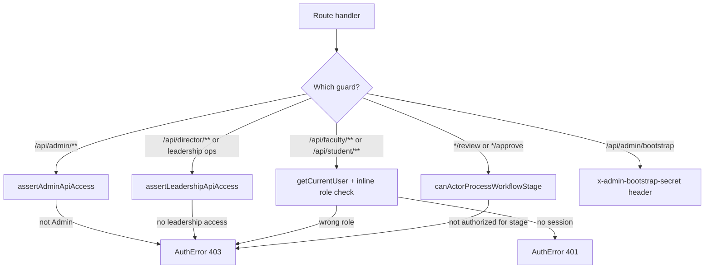
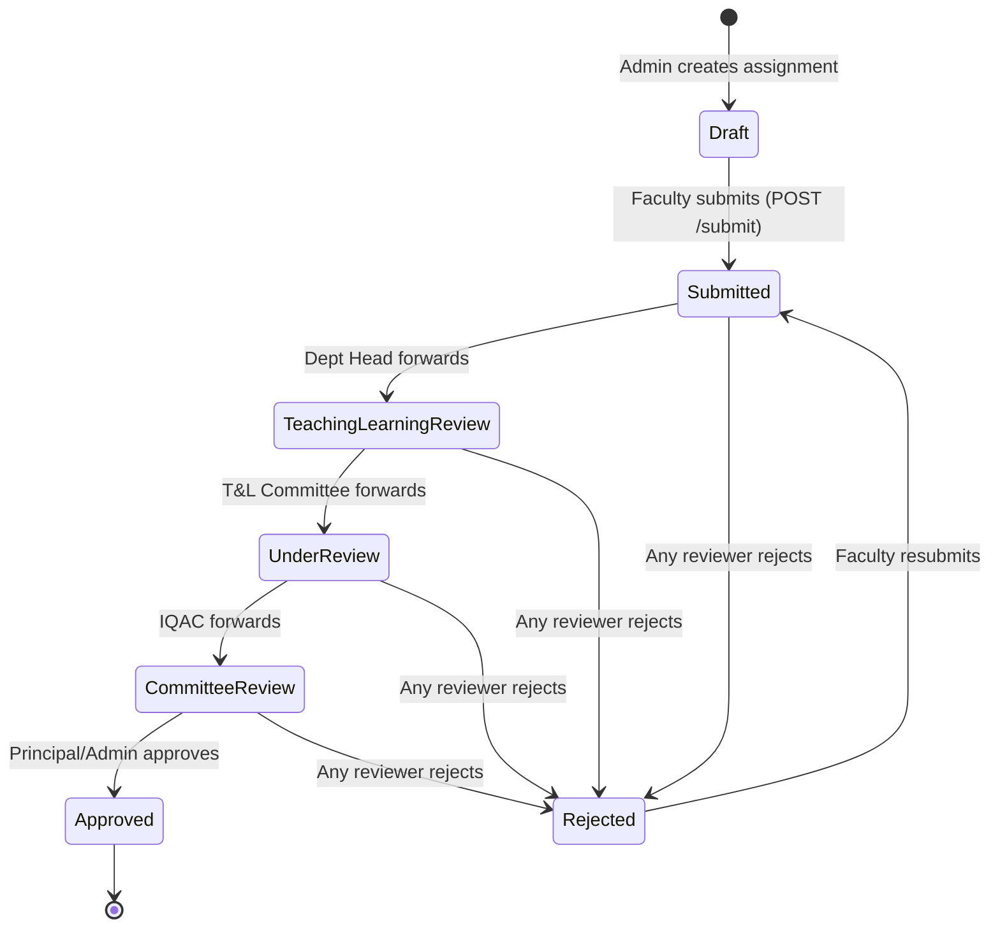
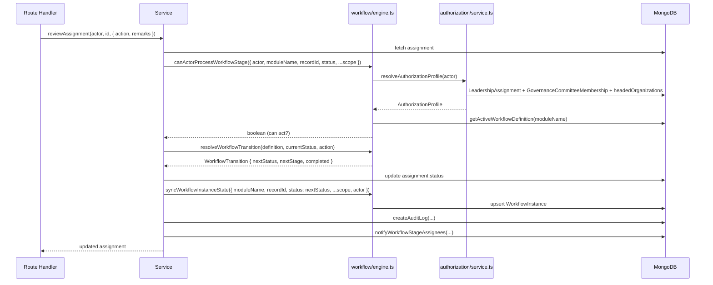

# 06 — API Documentation

> **Suite:** UMIS (`operant-next`) Enterprise Documentation
> **Scope:** Route-handler conventions, response envelope, error mapping, Zod validation placement, auth guards, the shared contributor-workflow endpoints, the generic workflow engine, a representative endpoint reference table, and the pagination/filtering gap.
> **Authoritative source:** `documentation.md` §9, supplemented by direct reading of `src/lib/auth/http.ts`, `src/lib/auth/errors.ts`, `src/lib/workflow/engine.ts`.

---

## Table of Contents

1. [API Surface at a Glance](#1-api-surface-at-a-glance)
2. [Route-Handler Conventions](#2-route-handler-conventions)
3. [Response Envelope](#3-response-envelope)
4. [Error Handling — createApiErrorResponse](#4-error-handling--createapierrorresponse)
5. [Zod Validation Placement](#5-zod-validation-placement)
6. [Authentication Guards on Endpoints](#6-authentication-guards-on-endpoints)
7. [The Shared Contributor Workflow](#7-the-shared-contributor-workflow)
   - 7.1 [Shared Route Shape](#71-shared-route-shape)
   - 7.2 [Workflow State Machine](#72-workflow-state-machine)
   - 7.3 [Submission Gates](#73-submission-gates)
8. [The Generic Workflow Engine](#8-the-generic-workflow-engine)
9. [Representative Endpoint Reference](#9-representative-endpoint-reference)
10. [Pagination and Filtering](#10-pagination-and-filtering)
11. [Current State](#11-current-state)
12. [Problems Identified](#12-problems-identified)
13. [Recommended Solutions](#13-recommended-solutions)
14. [Implementation Plan](#14-implementation-plan)

---

## 1. API Surface at a Glance

| Metric | Value |
|---|---|
| Route files (`route.ts`) | **213** under `src/app/api/**` |
| HTTP verbs used | GET, POST, PUT, PATCH, DELETE |
| Error mapper | `createApiErrorResponse()` in `src/lib/auth/http.ts` |
| Auth error class | `AuthError` in `src/lib/auth/errors.ts` |
| Workflow modules | **11** (PBAS, CAS, AQAR, SSR, CURRICULUM, TEACHING_LEARNING, INFRASTRUCTURE_LIBRARY, STUDENT_SUPPORT_GOVERNANCE, GOVERNANCE_LEADERSHIP_IQAC, INSTITUTIONAL_VALUES_BEST_PRACTICES, RESEARCH_INNOVATION) |
| Middleware | **None** — `middleware.ts` does not exist |
| Versioning | **None** — all routes are at the root path level |
| OpenAPI spec | **None** |
| Rate limiting | **None** |

The API is **REST-ish**: resources are addressed by noun paths (`/api/pbas/[id]`) and actions are either HTTP verbs on the resource or explicit action sub-routes (`/api/pbas/[id]/submit`, `/api/pbas/[id]/review`). There is no GraphQL, tRPC, WebSocket, or Server Action layer.

---

## 2. Route-Handler Conventions

Every route handler is self-contained. There is no global middleware, no shared request pipeline, and no decorator framework. The canonical shape is:

```ts
// src/app/api/<domain>/[id]/route.ts
export async function PATCH(
    request: Request,
    context: { params: Promise<{ id: string }> }   // Promise per Next.js 15/16
) {
    try {
        // 1. Auth guard — throws AuthError on failure
        const admin = await assertAdminApiAccess();

        // 2. Parse request body and await dynamic params
        const body = await request.json();
        const { id } = await context.params;           // MUST be awaited

        // 3. Delegate entirely to a service function
        const result = await updateThing(
            {
                id: admin.id,
                name: admin.name,
                role: admin.role,
                auditContext: getRequestAuditContext(request), // IP capture
            },
            id,
            body
        );

        // 4. Return success envelope
        return NextResponse.json({
            message: "Record updated.",
            thing: JSON.parse(JSON.stringify(result)),  // strip ObjectId/Date
        });
    } catch (error) {
        // 5. Central error mapper — never throws
        return createApiErrorResponse(error);
    }
}
```

**Rules implied by this pattern:**

- **Thin handlers:** route files contain no business logic. All validation, rules, DB access, workflow transitions, audit, and notifications live in `src/lib/<domain>/service.ts`.
- **`await context.params`:** Next.js 15/16 makes dynamic route params a `Promise`. Every handler that uses `[id]`, `[kind]`, or similar segments must `await context.params` before accessing properties. Omitting the `await` is a runtime type error.
- **`JSON.parse(JSON.stringify(result))`:** serializes Mongoose documents to plain objects, stripping `ObjectId`, `Date`, and Mongoose-specific prototype methods before crossing the API boundary. This is necessary because Next.js cannot serialize Mongoose Document instances.
- **`try/catch` wrapping the entire handler body:** ensures every path — including guard failures, parse errors, service errors, and Zod failures — reaches `createApiErrorResponse`.
- **`getRequestAuditContext(request)`** (`src/lib/audit/request.ts`): reads `x-forwarded-for`, `x-real-ip`, or `cf-connecting-ip` from request headers to populate `ipAddress` in the audit log.

---

## 3. Response Envelope

### Success responses

| Case | HTTP status | Body shape |
|---|---|---|
| Single entity (create/update/read) | 200 or 201 | `{ message: string, <entityName>: object }` |
| List read | 200 | `{ <entityName>s: object[] }` (no pagination wrapper) |
| Bulk provision (partial success) | **207** | `{ created: object[], failed: { input, reason }[] }` |
| Notifications | 200 | `{ total: number, unread: number, notifications: object[] }` |

The `message` field in mutations is always a human-readable confirmation (e.g. `"Teaching learning plan created."`, `"Assignment updated."`). It is displayed in client toasts and banners.

### Error responses

Always `{ message: string, issues?: ZodIssue[] }`. The `issues` array is present for 400 validation errors.

---

## 4. Error Handling — createApiErrorResponse

**File:** `src/lib/auth/http.ts`

The single `createApiErrorResponse(error: unknown)` function is imported by every route handler. Its complete dispatch table:

| Thrown type | HTTP status | Body |
|---|---|---|
| `ZodError` | 400 | `{ message: firstIssue.message, issues: ZodIssue[] }` |
| Mongoose `ValidationError` (name === "ValidationError") | 400 | `{ message: firstFieldMessage, issues: [{path, message, code}] }` |
| Mongoose `CastError` (name === "CastError") | 400 | `{ message: castMsg, issues: [{path, message, code: "CastError"}] }` |
| `AuthError` (custom class with `.status`) | `error.status` | `{ message: error.message }` |
| Anything else | 500 | `{ message: "Request failed due to an unexpected server error." }` |

**`AuthError`** (`src/lib/auth/errors.ts`):

```ts
export class AuthError extends Error {
    status: number;
    constructor(message: string, status = 400) {
        super(message);
        this.name = "AuthError";
        this.status = status;
    }
}
```

Services throw `new AuthError("Not found.", 404)`, `new AuthError("Already exists.", 409)`, `new AuthError("Forbidden.", 403)` etc. The route handler's `catch` block does not need to inspect error types — `createApiErrorResponse` handles all cases.

The 500 path calls `console.error(error)` before returning the generic message. This is the only structured observability hook in the current implementation.

---

## 5. Zod Validation Placement

Validation schemas live in `src/lib/<domain>/validators.ts` and are called from **inside service functions**, not from route handlers.

```
route.ts (thin handler)
    └→ service.ts
            ├── await dbConnect()
            ├── const validated = createThingSchema.parse(body)  ← Zod here
            ├── business rule checks (throw AuthError on violation)
            └── Mongoose write
```

**Why inside services, not in handlers:**

- A single Zod parse error thrown from a service still reaches the handler's `catch` block and is mapped to a 400 by `createApiErrorResponse`.
- Placing validation in services keeps route handlers ignorant of schema details, enables service reuse from scripts/tests without re-validating at the route level, and ensures the same schema applies wherever the service is called.

**Zod patterns used across the 20 `validators.ts` files:**

| Pattern | Example |
|---|---|
| 24-hex ObjectId | `z.string().regex(/^[0-9a-f]{24}$/, "Invalid ID")` |
| Enums shared with Mongoose | `z.enum(STATUS_VALUES)` where `STATUS_VALUES` is also the Mongoose enum array |
| `.partial()` for updates | `createSchema.partial()` reuses the base schema for PATCH |
| `.refine()` / `.superRefine()` | Cross-field rules: password confirmation match, `yearEnd > yearStart`, duplicate-indicator rejection |
| `.passthrough()` | Occasionally on nested objects where extra fields are allowed |

**Client-server schema sharing:** the same Zod schemas are imported into Client Component forms via `zodResolver(schema)` in `react-hook-form`, so client-side field errors and server-side API errors use the same messages.

---

## 6. Authentication Guards on Endpoints

There is no middleware. Each handler calls its own guard. The guard hierarchy:



| Guard function | File | Used by | Throws on failure |
|---|---|---|---|
| `assertAdminApiAccess()` | `src/lib/auth/user.ts` | all `/api/admin/**` handlers | `AuthError(403)` |
| `assertLeadershipApiAccess()` | `src/lib/auth/user.ts` | director/leadership endpoints | `AuthError(403)` |
| `getCurrentUser()` | `src/lib/auth/user.ts` | faculty, student, generic endpoints | `AuthError(401)` if no session |
| inline `role` check after `getCurrentUser()` | per-handler | faculty/student-specific routes | `AuthError(403)` |
| `canActorProcessWorkflowStage(...)` | `src/lib/workflow/engine.ts` | review/approve sub-routes | `AuthError(403)` via service |
| bootstrap secret header | `/api/admin/bootstrap/route.ts` | one-off bootstrap | `AuthError(403)` |

**Self-review block:** workflow review handlers check that `actor.id !== assignment.assigneeUserId` unless `actor.role === "Admin"`. This prevents a faculty member from approving their own submission even if they hold a committee role.

**Re-validation per request:** `getCurrentUser()` verifies the JWT cookie **and** re-fetches the `User` document from MongoDB on every call. A user whose `accountStatus` changes to `Suspended` is blocked on the next request with no cache lag.

---

## 7. The Shared Contributor Workflow

Six criterion modules (Teaching-Learning, Research-Innovation, Infrastructure-Library, Student-Support-Governance, Governance-Leadership-IQAC, Institutional-Values-Best-Practices) expose an **identical eight-route shape**.

### 7.1 Shared Route Shape

Let `<m>` be the module slug (e.g. `teaching-learning`):

| Method | Path | Auth | Purpose |
|---|---|---|---|
| `POST` | `/api/admin/<m>/plans` | Admin | Create a plan for an academic year, scoped to a department |
| `PATCH` | `/api/admin/<m>/plans/[id]` | Admin | Update plan metadata (due date, description) |
| `POST` | `/api/admin/<m>/assignments` | Admin | Assign the plan to a faculty member; status set to `Draft` |
| `PATCH` | `/api/admin/<m>/assignments/[id]` | Admin | Reassign or update assignment metadata |
| `GET` | `/api/<m>/assignments` | Faculty | List my assignments (filtered by session user) |
| `PUT` | `/api/<m>/assignments/[id]/contribution` | Faculty (assignee only) | Save draft contribution fields and sub-records |
| `POST` | `/api/<m>/assignments/[id]/submit` | Faculty (assignee only) | Validate and submit; transitions status from `Draft` → first workflow stage |
| `POST` | `/api/<m>/assignments/[id]/review` | Reviewer role (governance-determined) | Forward / Recommend / Approve / Reject at the current stage |

PBAS, CAS, AQAR, SSR, and Curriculum follow the same principle with module-specific action routes and status values.

### 7.2 Workflow State Machine

The Teaching-Learning module is representative of all six criterion modules:



PBAS adds `"Under Review"` and `"Committee Review"` stages before `Approved`. CAS follows the same three-stage PBAS chain. CURRICULUM adds a `"Board Review"` stage before IQAC. GOVERNANCE_LEADERSHIP_IQAC and INSTITUTIONAL_VALUES_BEST_PRACTICES add a `"Leadership Review"` stage. Full stage definitions are in `src/lib/workflow/engine.ts` `DEFAULT_WORKFLOW_DEFINITIONS`.

### 7.3 Submission Gates

Submission is not a simple status flip. `POST /api/<m>/assignments/[id]/submit` validates domain-specific rules before calling `resolveWorkflowTransition`. For Teaching-Learning the gates are:

- `pedagogicalApproach` must be non-empty.
- `attendanceStrategy` must be non-empty.
- `attainmentSummary` must be non-empty.
- At least one lesson-plan `Document` must be attached.
- `sessions[]` must be non-empty (at least one session recorded).
- `assessments[]` must be non-empty.
- At least one evidence item or supporting link must be present.

For PBAS: `totalScore > 0` and submission deadline has not passed (with admin break-glass override). For CAS: eligibility rule met (min service years + min API score from approved PBAS) and three mandatory document types attached.

---

## 8. The Generic Workflow Engine

**File:** `src/lib/workflow/engine.ts`

The workflow engine is a pure, configuration-driven transition resolver. No module hardcodes its own state machine logic.

### Key exported functions

| Function | Purpose |
|---|---|
| `resolveWorkflowTransition(definition, currentStatus, action)` | Pure function: given a definition and action (`submit`/`approve`/`reject`), returns the next `{ status, stage, completed }`. Throws if the action is invalid for the current status. |
| `getActiveWorkflowDefinition(moduleName)` | Fetches (and lazily seeds) the active `WorkflowDefinition` document for a module from MongoDB. |
| `ensureWorkflowDefinitions()` | Upserts all 11 `DEFAULT_WORKFLOW_DEFINITIONS` into MongoDB on first call. Called by `getActiveWorkflowDefinition`. |
| `syncWorkflowInstanceState(options)` | Upserts the `WorkflowInstance` document for a record, storing current status, stage key/label/kind, approver roles, scope block, actor, and action. |
| `canActorProcessWorkflowStage(options)` | Resolves the actor's `AuthorizationProfile` and checks whether the actor's workflow roles (scoped) match the current stage's `approverRoles`. |
| `listPendingWorkflowRecordIds(options)` | Queries `WorkflowInstance` for active instances matching the actor's roles, then filters by scope. Returns record IDs that the actor may act on. |
| `resolveWorkflowActorContext(actor)` | Delegates to `resolveAuthorizationProfile(actor)` from `src/lib/authorization/service.ts`. |

### Data flow during a review action



### WorkflowDefinition seed (11 modules)

```
PBAS               → 3 stages: Submitted → Under Review → Committee Review → Approved
CAS                → 3 stages: Submitted → Under Review → Committee Review → Approved
AQAR               → 3 stages: Submitted → Under Review → Committee Review → Approved
SSR                → 3 stages: Submitted → Under Review → Committee Review → Approved
CURRICULUM         → 4 stages: Submitted → Board Review → Under Review → Committee Review → Approved
TEACHING_LEARNING  → 4 stages: Submitted → T&L Review → Under Review → Committee Review → Approved
INFRASTRUCTURE_LIBRARY → 4 stages: Submitted → Infrastructure Review → Under Review → Committee Review → Approved
STUDENT_SUPPORT_GOVERNANCE → 4 stages: Submitted → Student Support Review → Under Review → Governance Review → Approved
GOVERNANCE_LEADERSHIP_IQAC → 4 stages: Submitted → IQAC Review → Leadership Review → Governance Review → Approved
INSTITUTIONAL_VALUES_BEST_PRACTICES → 4 stages: Submitted → IQAC Review → Leadership Review → Governance Review → Approved
RESEARCH_INNOVATION → 4 stages: Submitted → Research Review → Under Review → Committee Review → Approved
```

Versions are bumped when stage structure changes. `getActiveWorkflowDefinition` returns the highest-version active definition, falling back to any definition if none is marked active.

---

## 9. Representative Endpoint Reference

### Auth & bootstrap

| Method | Path | Auth | Purpose |
|---|---|---|---|
| `POST` | `/api/auth/login` | none | General login; students may use enrollment number |
| `POST` | `/api/auth/admin-login` | none | Requires role=Admin |
| `POST` | `/api/auth/director-login` | none | Normal login + leadership access check; clears cookie on failure |
| `POST` | `/api/auth/logout` | session | Clears `umis_session` cookie |
| `POST` | `/api/auth/forgot-password` | none | Issues reset token (uniform 200 for enumeration safety) |
| `POST` | `/api/auth/reset-password` | none | Validates token, sets password, logs in |
| `POST` | `/api/auth/activate-faculty` | none | Match employeeCode + email, set password, link facultyId |
| `POST` | `/api/auth/activate-student` | none | Match enrollmentNo + email/phone, activate |
| `POST` | `/api/admin/bootstrap` | `x-admin-bootstrap-secret` header | Create first Admin; disabled once any Admin exists |

### User and provisioning

| Method | Path | Auth | Purpose |
|---|---|---|---|
| `GET` / `POST` | `/api/admin/users` | Admin | List all users / provision single user |
| `POST` | `/api/admin/users/bulk-faculty` | Admin | Bulk provision faculty from parsed XLSX JSON; 207 on partial |
| `POST` | `/api/admin/users/bulk-students` | Admin | Bulk provision students; 207 on partial |
| `PATCH` | `/api/admin/users/[id]` | Admin | Update user role/status/dept |

### Master data and reference

| Method | Path | Auth | Purpose |
|---|---|---|---|
| `GET/POST/PATCH/DELETE` | `/api/admin/master-data(/[id])` | Admin | Generic `{category,key}` config store |
| `POST` | `/api/admin/master-data/bulk` | Admin | Bulk upsert config entries |
| `GET/POST/PATCH/DELETE` | `/api/admin/reference-masters/[kind](/[id])` | Admin | Lookup entities (Award, Skill, Sport, etc.) |

### Hierarchy and governance

| Method | Path | Auth | Purpose |
|---|---|---|---|
| `GET/POST/PATCH/DELETE` | `/api/admin/hierarchy(/[id])` | Admin | Organization tree CRUD |
| `GET/POST/PATCH/DELETE` | `/api/admin/governance/committees(/[id])` | Admin | GovernanceCommittee CRUD |
| `POST/PATCH/DELETE` | `/api/admin/governance/committees/[id]/memberships` | Admin | Manage committee members |
| `GET/POST/PATCH/DELETE` | `/api/admin/governance/leadership-assignments(/[id])` | Admin | LeadershipAssignment CRUD |

### PBAS

| Method | Path | Auth | Purpose |
|---|---|---|---|
| `GET` / `POST` | `/api/pbas` | Faculty/Admin | List / create PBAS form |
| `GET/PATCH` | `/api/pbas/[id]` | Auth | Get / update form |
| `GET/POST/PATCH` | `/api/pbas/[id]/entries` | Auth | Indicator entries |
| `POST` | `/api/pbas/[id]/entries/moderate` | Director/Admin | Score moderation |
| `POST/GET` | `/api/pbas/[id]/references` | Auth | Draft references |
| `POST` | `/api/pbas/[id]/submit` | Faculty (owner) | Submit for review |
| `POST` | `/api/pbas/[id]/review` | Reviewer role | Approve/Reject/Forward |
| `POST` | `/api/pbas/[id]/approve` | Principal/Admin | Final approval |
| `GET` | `/api/pbas/[id]/report` | Auth | Generate PDF report |
| `GET` | `/api/pbas/faculty` | Admin/Director | List by faculty |
| `GET` | `/api/pbas/summary` | Admin/Director | Dashboard summary |

### AQAR Cycle (institutional)

| Method | Path | Auth | Purpose |
|---|---|---|---|
| `GET/POST` | `/api/admin/aqar/cycles` | Admin | List / create AQAR cycles |
| `PATCH` | `/api/admin/aqar/cycles/[id]` | Admin | Update cycle metadata |
| `POST` | `/api/admin/aqar/cycles/[id]/generate` | Admin | Run `generateAqarCycleSnapshot()` |
| `POST` | `/api/admin/aqar/cycles/[id]/finalize` | Admin | Mark cycle as Finalized |
| `POST` | `/api/admin/aqar/cycles/[id]/submit` | Admin | Mark as Submitted |
| `GET` | `/api/admin/aqar/cycles/[id]/report` | Admin | Generate cycle PDF |

### SSR

| Method | Path | Auth | Purpose |
|---|---|---|---|
| `GET/POST/PATCH` | `/api/ssr/assignments/[id]/response` | Faculty/Admin | Save metric response |
| `POST` | `/api/ssr/assignments/[id]/submit` | Faculty | Submit response |
| `POST` | `/api/ssr/responses/[id]/review` | Reviewer role | Review response |

### NAAC Metric Warehouse

| Method | Path | Auth | Purpose |
|---|---|---|---|
| `GET/POST` | `/api/admin/naac-metric-warehouse/cycles` | Admin | Manage cycles |
| `POST` | `/api/admin/naac-metric-warehouse/cycles/[id]/generate` | Admin | Run metric generation (aggregates ~20 collections) |
| `PATCH` | `/api/admin/naac-metric-warehouse/values/[id]/manual` | Admin | Manual override (requires reason) |
| `PATCH` | `/api/admin/naac-metric-warehouse/values/[id]/review` | Admin | Mark value as reviewed |

### Evidence and uploads

| Method | Path | Auth | Purpose |
|---|---|---|---|
| `POST` | `/api/documents` (action=issue-upload) | Auth | Issue upload intent (UUID path, 15-min TTL) |
| `POST` | `/api/documents` (action=finalize-upload) | Auth | Finalize: verify Firebase URL, MIME, size, checksum; create Document |
| `GET/PATCH` | `/api/evidence/review(/[id])` | Admin/Director | Evidence review queue |

### Notifications

| Method | Path | Auth | Purpose |
|---|---|---|---|
| `GET` | `/api/notifications?limit=` | Auth | Fetch with lazily-computed deadline reminders; `cache: "no-store"` |
| `PATCH` | `/api/notifications/[id]/read` | Auth | Mark one read |
| `PATCH` | `/api/notifications/read-all` | Auth | Mark all read |

### Director

| Method | Path | Auth | Purpose |
|---|---|---|---|
| `GET` | `/api/director/faculty/[id]/records` | Leadership | Faculty full record drill-down |
| `GET` | `/api/director/students/[id]/records` | Leadership | Student full record drill-down |
| `GET` | `/api/director/reports?type=` | Leadership | CSV export: roster, department-summary, SSS, AISHE, NIRF, Compliance |

### Audit

| Method | Path | Auth | Purpose |
|---|---|---|---|
| `GET` | `/api/admin/audit-logs?page&pageSize&action&tableName&…` | Admin | Paginated audit log with filter options |

---

## 10. Pagination and Filtering

**Current state — inconsistent and largely absent:**

| Endpoint | Pagination | Filtering |
|---|---|---|
| `GET /api/admin/audit-logs` | `page` + `pageSize` (capped 10–100) | `action`, `tableName`, `recordId`, `userId`, `query` (regex), `startDate`, `endDate` |
| `GET /api/notifications` | `limit` (single param) | none |
| Most other GET list endpoints | **none** | **none** — returns full authorized set |

The absence of pagination on module list endpoints means admin and director consoles fetch **all records** on every page render. This is functional at small data volumes but will degrade as record counts grow into the thousands. See `17_Performance_Optimization.md`.

---

## 11. Current State

The API layer is consistent, predictable, and well-structured for a system of this size and domain complexity. The thin-handler / delegate-to-service pattern is uniformly applied across all 213 routes. The single error mapper and shared auth guards prevent divergence. The generic workflow engine eliminates per-module state-machine duplication.

Gaps are systemic rather than per-route: there is no versioning, no spec, no rate limiting, and list endpoints are not paginated.

---

## 12. Problems Identified

| Problem | Severity | Detail |
|---|---|---|
| **No API versioning** | High | All routes are under `/api/` with no `/v1/` prefix. A breaking change affects all clients simultaneously. Backward compatibility must be managed through additive-only changes and deprecation. |
| **Inconsistent auth patterns** | Medium | `/api/admin/**` handlers use `assertAdminApiAccess()` consistently. Faculty/student handlers use `getCurrentUser()` + inline `role` checks, but the pattern is not uniformly documented. A new developer can easily omit the inline role check. There is no middleware backstop. |
| **No pagination on list endpoints** | Medium | Most GET handlers return the full authorized set. As institutions grow, consoles that today load 200 assignments will eventually load 2,000+. This is a UX and performance risk. |
| **No OpenAPI / machine-readable spec** | Medium | No Swagger/OpenAPI schema exists. Client component `fetch()` calls are hand-written with no generated types. Breaking a response shape produces a runtime error, not a compile error. |
| **No rate limiting or request throttling** | High | Login, activation, password reset, upload-intent issue, and notification endpoints are all unthrottled. A scripted attack can enumerate users, exhaust the upload-intent TTL slots, or trigger mass email sends. |
| **Business logic thickness varies** | Low | Some service functions are thin wrappers (reference master CRUD), others are very large (pbas/service.ts ~2500 lines). There is no enforced size limit or service-decomposition rule. |
| **No request ID / correlation ID** | Low | Errors logged with `console.error` have no request correlation ID. Tracing a specific user request through logs (when they exist) is impossible. |
| **Retired endpoints return 410 with no sunset documentation** | Low | `/api/auth/register`, `/api/faculty/evidence`, student resume, director student-approvals return 410. No public changelog or migration guide for API consumers. |

---

## 13. Recommended Solutions

### R1 — API versioning

Introduce a `/api/v1/` prefix for all new and refactored routes. Existing routes can remain at `/api/` for backward compatibility during a transition window. The route group `src/app/api/v1/` mirrors the current structure.

### R2 — Consistent auth guard documentation and lint rule

Document the guard selection rules in `18_Coding_Standards.md`. Add an ESLint custom rule (or a code review checklist item) that flags any `export async function GET/POST/PUT/PATCH/DELETE` in `src/app/api/` that does not call a guard function within its body. As a minimum, add a `// AUTH: none — public` comment to intentionally unauthenticated endpoints.

### R3 — Pagination primitives

Add a shared `parsePaginationParams(searchParams)` utility returning `{ page, pageSize, skip }` and a `buildPaginatedResponse(items, total, page, pageSize)` wrapper. Apply to all list endpoints. Start with admin module lists and director approval queues (highest impact).

```ts
// Proposed: src/lib/pagination.ts
export function parsePaginationParams(params: URLSearchParams) {
    const page = Math.max(1, parseInt(params.get("page") ?? "1", 10));
    const pageSize = Math.min(100, Math.max(10, parseInt(params.get("pageSize") ?? "25", 10)));
    return { page, pageSize, skip: (page - 1) * pageSize };
}

export function buildPaginatedResponse<T>(
    items: T[], total: number, page: number, pageSize: number
) {
    return { items, pagination: { page, pageSize, total, totalPages: Math.ceil(total / pageSize) } };
}
```

### R4 — OpenAPI generation

Adopt `zod-to-openapi` or `@asteasolutions/zod-to-openapi`. The existing Zod schemas in `validators.ts` files are already the source of truth. Register them as OpenAPI components and generate a `openapi.json` at build time. Expose it at `/api/openapi.json` and a Swagger UI at `/api/docs` (admin-only).

### R5 — Rate limiting

Add rate limiting via an in-process store (`lru-cache` token bucket) or a Redis-backed store as a middleware utility called at the top of sensitive handlers (login, activation, reset, upload-intent). Since there is no `middleware.ts`, a shared `rateLimit(request, key, limit, window)` helper function called at the start of each sensitive handler is the lowest-friction approach.

### R6 — Request correlation IDs

Generate a `requestId` (nanoid or `crypto.randomUUID()`) at the start of each handler and include it in the audit log and in error log output. Return it in the response header `X-Request-Id`.

---

## 14. Implementation Plan

| Phase | Work | Effort | Priority |
|---|---|---|---|
| **P0 — Security** | R5: rate limiting on auth/activation/reset/upload endpoints | 2 days | Critical |
| **P1 — Performance** | R3: pagination primitives; apply to admin module lists and director dashboard | 3 days | High |
| **P1 — Quality** | R2: guard documentation + ESLint hint for auth omissions | 1 day | High |
| **P2 — DX** | R4: OpenAPI generation from existing Zod schemas | 3 days | Medium |
| **P2 — Versioning** | R1: add `/api/v1/` prefix for new routes; plan migration path for existing routes | 2 days | Medium |
| **P3 — Observability** | R6: request correlation IDs in audit logs and error output | 1 day | Low |

Cross-references: rate limiting relates to `16_Security_Audit.md`; pagination is detailed in `17_Performance_Optimization.md`; guard documentation belongs in `18_Coding_Standards.md`; versioning and OpenAPI feed into the modernization strategy in `19_Future_Architecture.md`.
