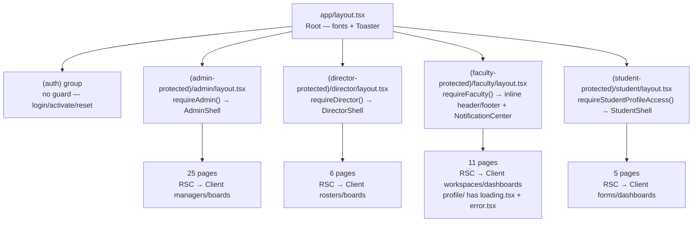
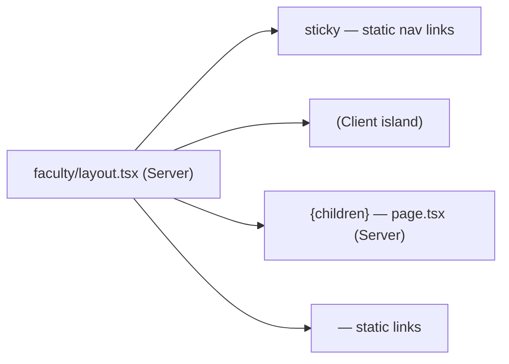

# 07 — Frontend Architecture

> **Project:** operant-next (UMIS)
> **Stack:** Next.js 16 App Router · React 19 · Tailwind v4 · shadcn/Radix · react-hook-form + Zod
> **Related docs:** [README.md](../README.md) · [02_Current_Architecture.md](02_Current_Architecture.md) · [04_Module_Documentation.md](04_Module_Documentation.md) · [06_API_Documentation.md](06_API_Documentation.md) · [09_Code_Quality_Report.md](09_Code_Quality_Report.md) · [10_Technical_Debt_Report.md](10_Technical_Debt_Report.md) · [11_Refactoring_Strategy.md](11_Refactoring_Strategy.md) · [14_Testing_Strategy.md](14_Testing_Strategy.md) · [17_Performance_Optimization.md](17_Performance_Optimization.md) · [19_Future_Architecture.md](19_Future_Architecture.md)

---

## Table of Contents

1. [Overview](#1-overview)
2. [App Router Layout Tree](#2-app-router-layout-tree)
3. [RSC vs Client Component Split](#3-rsc-vs-client-component-split)
4. [RSC → Client Data-Flow Diagram](#4-rsc--client-data-flow-diagram)
5. [Role Shells and Layout Strategies](#5-role-shells-and-layout-strategies)
6. [The Repeating Component Family](#6-the-repeating-component-family)
7. [Data Fetching](#7-data-fetching)
8. [State Management](#8-state-management)
9. [Forms — Two Paradigms](#9-forms--two-paradigms)
10. [UI Library: shadcn/Radix, `cn()`, CVA, Design Tokens](#10-ui-library-shadcnradix-cn-cva-design-tokens)
11. [Notifications UI](#11-notifications-ui)
12. [Special Libraries](#12-special-libraries)
13. [Problems Identified](#13-problems-identified)
14. [Recommended Solutions](#14-recommended-solutions)
15. [Implementation Plan](#15-implementation-plan)

---

## 1. Overview

UMIS presents four distinct portals (Admin, Director, Faculty, Student) through a single Next.js 16 deployment. The frontend is built on the App Router's **React Server Component (RSC) model**: every `page.tsx` is an async Server Component that authenticates the user, calls a `lib` service, and passes serialized data down to leaf **Client Components** that own all interactivity.

Key measurements (from [documentation.md](../documentation.md) §11–15):

| Metric | Count |
|---|---|
| RSC pages (`page.tsx`) | 73 |
| Route-group layouts (`layout.tsx`) | 5 |
| Total React components | 85 |
| Marked `"use client"` | **77** |
| shadcn/ui primitives in `src/components/ui/` | 19 |
| `loading.tsx` / `error.tsx` / `not-found.tsx` | 1 / 1 / 0 |

---

## 2. App Router Layout Tree

```
src/app/
├── layout.tsx                         Root — Geist font vars, <Toaster richColors />, <html lang="en">
│
├── page.tsx                           Public portal/landing (RSC)
│
├── (auth)/                            Route group — no chrome, no auth guard
│   ├── login/page.tsx                 Renders <LoginForm> (Client)
│   ├── register/page.tsx              Disabled — links to activation
│   ├── forgot-password/page.tsx       Renders <ForgotPasswordForm> (Client)
│   ├── reset-password/page.tsx        Renders <ResetPasswordForm> (Client)
│   ├── verify-email/page.tsx          Renders token-verification logic (Client)
│   ├── activate-faculty/page.tsx      Renders <FacultyActivationForm> (Client)
│   └── activate-student/page.tsx      Renders <StudentActivationForm> (Client)
│
├── (admin-protected)/
│   └── admin/
│       ├── layout.tsx                 requireAdmin() → <AdminShell adminName> (Client shell)
│       ├── page.tsx                   Admin dashboard (RSC → AdminDashboard Client)
│       ├── hierarchy/page.tsx         RSC → <HierarchyManager> (Client + React Flow)
│       ├── governance/page.tsx        RSC → <GovernanceManager> (Client)
│       ├── academics/page.tsx         RSC → <AcademicsManager> (Client)
│       ├── curriculum/page.tsx        RSC → <CurriculumManager> (Client)
│       ├── teaching-learning/page.tsx RSC → <TeachingLearningManager> (Client)
│       ├── research-innovation/       RSC → <ResearchInnovationManager>
│       ├── infrastructure-library/    RSC → <InfrastructureLibraryManager>
│       ├── …(six more criterion pages)
│       ├── pbas/page.tsx              RSC → <PbasReviewBoard> (Client)
│       ├── pbas/catalog/page.tsx      RSC → <PbasCatalogManager> (Client)
│       ├── cas/page.tsx               RSC → <CasRuleManager> + <CasReviewBoard>
│       ├── aqar/page.tsx              RSC → <AqarCycleDashboard>
│       ├── ssr/page.tsx               RSC → <SsrManager>
│       ├── evidence/page.tsx          RSC → <EvidenceReviewBoard>
│       ├── report-templates/page.tsx  RSC → <ReportTemplateManager>
│       ├── naac-metric-warehouse/     RSC → <NaacMetricWarehouseManager>
│       ├── accreditation/page.tsx     RSC → <AccreditationOperationsManager>
│       ├── reference-masters/page.tsx RSC → <ReferenceMasterManager>
│       ├── master-data/page.tsx       RSC → MasterData panel (Client)
│       ├── users/page.tsx             RSC → <FacultyProvisioningPanel> + <StudentProvisioningPanel>
│       ├── audit-logs/page.tsx        RSC → <AuditLogManager>
│       └── system/page.tsx            RSC → system panel (Client)
│
├── (director-protected)/
│   └── director/
│       ├── layout.tsx                 requireDirector() → <DirectorShell directorName> (Client shell)
│       ├── page.tsx                   Director dashboard
│       ├── approvals/page.tsx         Unified approval queue
│       ├── faculty/page.tsx           <LeadershipFacultyRoster>
│       ├── students/page.tsx          <LeadershipStudentRoster>
│       ├── evidence/page.tsx          <EvidenceReviewBoard>
│       └── reports/page.tsx           CSV export panel
│
├── (faculty-protected)/
│   └── faculty/
│       ├── layout.tsx                 requireFaculty() — INLINE server-rendered header+footer + <NotificationCenter> island
│       ├── page.tsx                   Faculty home
│       ├── profile/
│       │   ├── page.tsx               RSC → <FacultyWorkspaceForm> (Client, rhf + useFieldArray)
│       │   ├── loading.tsx            Skeleton (ONLY loading.tsx in entire app)
│       │   └── error.tsx              Client error boundary with retry (ONLY error.tsx)
│       ├── pbas/page.tsx              RSC → <PbasDashboard>
│       ├── cas/page.tsx               RSC → <CasDashboard>
│       ├── aqar/page.tsx              RSC → <AqarDashboard>
│       ├── ssr/page.tsx               RSC → <SsrContributorWorkspace>
│       ├── curriculum/page.tsx        RSC → <CurriculumContributorWorkspace>
│       ├── teaching-learning/page.tsx RSC → <TeachingLearningContributorWorkspace>
│       ├── research-innovation/       RSC → <ResearchInnovationContributorWorkspace>
│       ├── infrastructure-library/    RSC → <InfrastructureLibraryContributorWorkspace>
│       └── student-support-governance/ RSC → <StudentSupportGovernanceContributorWorkspace>
│
├── (student-protected)/
│   └── student/
│       ├── layout.tsx                 requireStudentProfileAccess() → <StudentShell> (Client shell)
│       ├── page.tsx                   <StudentWorkspaceHome>
│       ├── profile/page.tsx           <StudentProfileForm>
│       ├── records/page.tsx           <StudentRecordsDashboard>
│       ├── sss/page.tsx               <StudentSssWorkspace>
│       └── verification-pending/page.tsx
│
├── admin/login/page.tsx               Public — outside protected group
├── admin/setup/page.tsx               Bootstrap — outside protected group
└── director/login/page.tsx            Public — outside protected group
```

**Mermaid layout-tree (abbreviated):**



---

## 3. RSC vs Client Component Split

### Server Components (RSC) — default

All `page.tsx` and `layout.tsx` files run on the server. They:

- Execute the role guard (`requireAdmin()`, `requireFaculty()`, etc.) which calls `getCurrentUser()` — a live Mongo lookup on every request.
- Call `lib` service functions to fetch the initial data set.
- Serialize the result with `JSON.parse(JSON.stringify(data))` to strip non-serializable Mongoose types (`ObjectId`, `Date`).
- Render the Client Component shell/manager, passing the serialized data as props.
- Ship **zero JavaScript** of their own to the browser.

### Client Components (`"use client"`) — 77 files

All interactive leaves. Grouped by responsibility:

| Group | Files | Key hooks |
|---|---|---|
| **shadcn/ui primitives** (`components/ui/`) | 19 | Radix headless + `"use client"` where needed |
| **Role shells** | `admin-shell.tsx`, `director-shell.tsx`, `student-shell.tsx` | `usePathname` (active nav) |
| **Faculty layout islands** | `notification-center.tsx` | `useEffect`, `useState` |
| **Auth forms** (`components/auth/`) | `forms.tsx`, `password-checklist.tsx`, `password-input.tsx`, `logout-button.tsx`, `auth-helpers.tsx` | `useForm`, `useTransition` |
| **Module managers** (`*-manager.tsx`) | ~15 | `useState`, `useDeferredValue`, `useTransition`, `router.refresh()` |
| **Review boards** (`*-review-board.tsx`) | ~10 | `useState`, `useTransition`, `router.refresh()` |
| **Contributor workspaces** (`*-contributor-workspace.tsx`) | ~8 | `useState`, `useTransition`, file upload helpers |
| **Dashboards** (`*-dashboard.tsx`) | ~5 | `useForm`, `useFieldArray`, `router.refresh()` |
| **Faculty workspace** | `faculty-workspace-form.tsx` | `useForm`, `useFieldArray`, `useWatch`, XLSX, upload service |
| **Student components** | `student-shell.tsx`, `student-profile-form.tsx`, `student-records-dashboard.tsx`, etc. | `useState`, `useTransition` |
| **Notifications** | `notification-center.tsx` | `useEffect`, `useState`, `useMemo` |

### The serialization boundary

Every Server page executes this pattern before handing data to a Client shell:

```ts
// src/app/(admin-protected)/admin/teaching-learning/page.tsx (pattern)
const rawPlans = await getTeachingLearningAdminConsole(actor);
// Strip ObjectId / Date — cannot cross Server→Client boundary
const plans = JSON.parse(JSON.stringify(rawPlans));
return <TeachingLearningManager plans={plans} />;
```

`src/app/api/admin/teaching-learning/plans/route.ts` applies the same strip on API responses:

```ts
return NextResponse.json({
    message: "Teaching learning plan created successfully.",
    plan: JSON.parse(JSON.stringify(plan)),
});
```

---

## 4. RSC → Client Data-Flow Diagram

```mermaid
flowchart TD
    subgraph Server["Server (per request)"]
        Layout["layout.tsx<br/>requireRole() ← cookies()"]
        Page["page.tsx<br/>await libService(actor)"]
        Serial["JSON.parse(JSON.stringify(data))"]
        Layout --> Page --> Serial
    end

    subgraph Client["Client (hydrate → interact)"]
        Shell["Shell / Manager / Workspace<br/>useState · useTransition · router.refresh()"]
    end

    subgraph API["API Route (/api/**)"]
        Guard["assertXxxApiAccess()"]
        Svc["lib service function"]
        Envelope["NextResponse.json({message, entity})"]
        Guard --> Svc --> Envelope
    end

    subgraph DB["MongoDB"]
        Mongo[(Mongoose)]
    end

    Serial -->|serialized props| Shell
    Shell -->|fetch POST/PATCH/PUT| Guard
    Svc --> Mongo
    Mongo --> Svc
    Shell -->|router.refresh()| Page
    Page --> Mongo
```

**Mutation cycle (detail):**

1. User interacts with a Client Component (submit button, status change, etc.).
2. Component wraps the request in `startTransition(() => { … })`.
3. Calls `requestJson<T>(url, { method: "PATCH", body: JSON.stringify(payload) })` — a thin local fetch wrapper.
4. On success, calls `router.refresh()`.
5. Next.js re-runs the current Server page from the top, re-fetches from Mongo, re-serializes, and delivers fresh props — the Client Component re-renders with authoritative data.

There is **no client-side cache**: `router.refresh()` is the invalidation strategy.

---

## 5. Role Shells and Layout Strategies

### Admin shell — `src/components/admin/admin-shell.tsx`

```
"use client"
Props: { children, adminName }
Layout: min-h-screen bg-zinc-50 / grid lg:grid-cols-[280px_1fr]
Nav: 24-item array; usePathname() + startsWith() for active state
Hosts: <NotificationCenter /> + <LogoutButton />
```

The layout is a CSS grid with a fixed 280 px sidebar on large screens and stacked on mobile. Active route highlighting uses `usePathname()` with an exact-match for `/admin` and `startsWith` for all children.

### Director shell — `src/components/director/director-shell.tsx`

```
"use client"
Props: { children, directorName }
19 nav items (scoped module review + oversight)
Active state: exact pathname match
```

### Student shell — `src/components/student/student-shell.tsx`

```
"use client"
Props: { children, studentName, studentEmail, accountStatus }
Responsive: desktop sidebar / tablet nav-pills / mobile bottom-tab bar
5 nav items
```

### Faculty layout — `src/app/(faculty-protected)/faculty/layout.tsx`

This is the **only layout that is a Server Component** rather than delegating to a Client shell. It renders a sticky header with an inline `navLinks` array, footer links, and drops `<NotificationCenter />` as a Client island. There is **no active-route highlighting** in the faculty nav because `usePathname()` cannot be called in a Server Component.



**Inconsistency noted:** the faculty layout is the only role layout not backed by a dedicated Client shell component, and it has no active-nav highlight. See [§13 Problems Identified](#13-problems-identified).

---

## 6. The Repeating Component Family

Each of the six criterion modules (Teaching-Learning, Research-Innovation, Infrastructure-Library, Governance-Leadership-IQAC, Institutional-Values-Best-Practices, Student-Support-Governance) plus Curriculum and several specialized features ships up to four Client Components with a consistent contract:

| Suffix | File pattern | Purpose | Consuming portal |
|---|---|---|---|
| `*-manager.tsx` | `components/<module>/<module>-manager.tsx` | Admin CRUD: create plans, assign faculty, edit/delete | Admin |
| `*-review-board.tsx` | `components/<module>/<module>-review-board.tsx` | Read-only view + workflow decisions (approve/reject/return) | Admin + Director |
| `*-contributor-workspace.tsx` | `components/<module>/<module>-contributor-workspace.tsx` | Faculty contribution form + evidence uploads + submit | Faculty |
| `*-dashboard.tsx` | `components/<module>/<module>-dashboard.tsx` | Faculty application history + status (PBAS/CAS/AQAR) | Faculty |

**Representative props contract** (`teaching-learning-manager.tsx`):

```ts
// Props arrive from RSC page as JSON.parse(JSON.stringify(…))
type Props = {
    plans: PlanRecord[];
    assignments: AssignmentRecord[];
    academicYearOptions: AcademicYearOption[];
    programOptions: ProgramOption[];
    courseOptions: CourseOption[];
    semesterOptions: SemesterOption[];
    userOptions: UserOption[];
};
```

**Internal state pattern** (manager CRUD forms — plain `useState`, NOT react-hook-form):

```ts
const [planForm, setPlanForm] = useState<PlanFormState>(emptyPlanForm);
// …
setPlanForm(prev => ({ ...prev, [field]: value }));
```

**Mutation pattern** (all managers/workspaces):

```ts
const [isPending, startTransition] = useTransition();
const router = useRouter();

async function handleSubmit() {
    startTransition(async () => {
        try {
            await requestJson("/api/admin/teaching-learning/plans", {
                method: "POST",
                body: JSON.stringify(planForm),
            });
            router.refresh();
            setError(null);
        } catch (err) {
            setError(err instanceof Error ? err.message : "Request failed.");
        }
    });
}
```

---

## 7. Data Fetching

| Mechanism | Used | Where |
|---|---|---|
| RSC page → `lib` service (direct) | **Primary** | All initial page loads |
| Client `fetch()` → `/api/*` | **Primary for mutations** | All managers/workspaces/dashboards |
| `router.refresh()` re-fetch | After every mutation | All client components |
| `useEffect` + `fetch` on mount | One place only | `NotificationCenter` |
| Server Actions | Not used | — |
| React Query / SWR | Not installed | — |
| `revalidate` / ISR | Not used | Pages are fully dynamic (use `cookies()`) |

### `requestJson<T>` — the local fetch wrapper

Every manager component defines (or imports) a small wrapper:

```ts
// Pattern seen in teaching-learning-manager.tsx, curriculum-manager.tsx, etc.
async function requestJson<T>(url: string, options?: RequestInit): Promise<T> {
    const response = await fetch(url, {
        headers: { "Content-Type": "application/json", ...(options?.headers ?? {}) },
        ...options,
    });
    const data = (await response.json()) as T & { message?: string };
    if (!response.ok) throw new Error(data.message ?? "Request failed.");
    return data;
}
```

This is **duplicated across many components** without a shared abstraction. See [§13 Problems Identified](#13-problems-identified).

### Notifications — the only self-fetching client component

`src/components/notifications/notification-center.tsx` is unique in the codebase: it fetches on mount (`useEffect(() => { void refresh(); }, [])`) and on popover open, using `cache: "no-store"` to bypass the Next.js fetch cache. It also performs optimistic updates for mark-read without calling `router.refresh()`.

---

## 8. State Management

There is **no external state library** (confirmed: no React Query, SWR, Redux, Zustand, Jotai, or Recoil in `package.json`). State is deliberately minimal:

| State kind | Mechanism | Notes |
|---|---|---|
| **Server / authoritative data** | Mongo, delivered as RSC props | `router.refresh()` re-syncs |
| **Local UI state** | `useState` | Tabs, dialogs, search filters, banner messages |
| **Pending indicator** | `useTransition` → `isPending` | Disables buttons during mutations |
| **Non-blocking search** | `useDeferredValue(searchTerm)` | Deferred filter on large lists |
| **Cascade effects** | `useEffect` | Clear dependent selects when parent changes |
| **Form state (structured)** | `react-hook-form` | Auth forms, faculty workspace, hierarchy manager |
| **Form state (simple)** | `useState` object | Manager CRUD forms |
| **Session** | `umis_session` JWT cookie | Server-only read; never in client store |

The `router.refresh()` model means **every successful mutation triggers a full server subtree re-render**. This is simple and consistent but has performance implications (see [17_Performance_Optimization.md](17_Performance_Optimization.md)).

---

## 9. Forms — Two Paradigms

The codebase contains two distinct form patterns that coexist without a documented rule governing when to use each.

### Paradigm A: react-hook-form + zodResolver (validated forms)

Used for: auth flows, faculty workspace, PBAS/CAS dashboards, hierarchy manager.

```ts
// src/components/auth/forms.tsx — canonical example
"use client";
import { useForm } from "react-hook-form";
import { zodResolver } from "@hookform/resolvers/zod";
import { loginSchema } from "@/lib/auth/validators";

type LoginValues = z.infer<typeof loginSchema>;

const form = useForm<LoginValues>({
    resolver: zodResolver(loginSchema),
    defaultValues: { email: "", password: "" },
});

// Field error display
<FieldError message={form.formState.errors.email?.message} />
```

Advanced usage in `faculty-workspace-form.tsx`:
- `useFieldArray` for all dynamic sub-record sections (publications, patents, projects, FDPs, etc.)
- `Controller` for Select/Checkbox primitives
- `useWatch` for cascading field visibility
- Per-row upload via the upload service
- Zod schema: `facultyRecordSchema` from `src/lib/faculty/validators.ts`

### Paradigm B: plain `useState` (manager CRUD forms)

Used for: all `*-manager.tsx` components — teaching-learning, research-innovation, curriculum, governance, reference masters, master data, etc.

```ts
// src/components/teaching-learning/teaching-learning-manager.tsx — canonical example
const [planForm, setPlanForm] = useState<PlanFormState>(emptyPlanForm);

// Field update
onChange={(e) => setPlanForm(prev => ({ ...prev, title: e.target.value }))}

// Submit — no client-side validation; server Zod catch surfaces as toast/banner
await requestJson("/api/admin/teaching-learning/plans", {
    method: "POST",
    body: JSON.stringify(planForm),
});
```

### Comparison

| Attribute | Paradigm A (rhf + Zod) | Paradigm B (useState) |
|---|---|---|
| Client-side validation | Yes — inline field errors before submit | No — relies on server 400 responses |
| Dynamic lists | `useFieldArray` | Manual array splicing in state |
| Accessibility | `aria-describedby` via rhf | Manually wired (often missing) |
| Schema reuse | Same Zod schema as API | Type-only `PlanFormState`, no schema |
| Complexity threshold | High (complex, multi-section forms) | Low (flat create/edit forms) |

**The rule is not documented**; both exist by evolution. See [§13 Problems Identified](#13-problems-identified) and [§14 Recommended Solutions](#14-recommended-solutions).

### Validation error surfacing

Server validation errors are returned as:
```json
{ "message": "Plan title is required.", "issues": [{ "path": ["title"], "message": "…" }] }
```
Client components catch this and set a local `error` state shown as a banner. Paradigm A additionally shows inline field errors from the RHF resolver before the request is even sent.

---

## 10. UI Library: shadcn/Radix, `cn()`, CVA, Design Tokens

### shadcn/ui primitives (`src/components/ui/`)

19 generated wrappers over Radix UI headless primitives:

```
alert · alert-dialog · badge · button · calendar (react-day-picker)
card · checkbox · dialog · input · label · popover · scroll-area
select · separator · skeleton · sonner · table · tabs · textarea
```

These are the only components in `components/ui/`; there is **no internal component library** beyond this set. Shared business patterns (e.g. a reusable data table, a status badge, a confirmation dialog) are **re-implemented inline** in each manager/workspace. See [§13 Problems Identified](#13-problems-identified).

### `cn()` — class composition helper

```ts
// src/lib/utils.ts
import { clsx, type ClassValue } from "clsx";
import { twMerge } from "tailwind-merge";

export function cn(...inputs: ClassValue[]) {
    return twMerge(clsx(inputs));
}
```

Used pervasively for conditional Tailwind class composition. All shadcn primitives and custom components import `cn` from `@/lib/utils`.

### CVA (class-variance-authority)

Used inside the generated shadcn primitives (e.g. `button.tsx`, `badge.tsx`) to define variant/size props. Not used directly in custom components — custom components compose via `cn()` inline.

### Design tokens — `src/app/globals.css`

Tailwind v4 with OKLCH CSS custom properties declared in `:root`:

```css
/* src/app/globals.css (excerpt) */
:root {
    --background:         oklch(1 0 0);
    --foreground:         oklch(0.145 0 0);
    --primary:            oklch(0.205 0 0);
    --primary-foreground: oklch(0.985 0 0);
    --destructive:        oklch(0.58 0.22 27);
    --border:             oklch(0.922 0 0);
    --radius:             0.625rem;
    /* sidebar, chart, muted, accent, secondary … */
}

@theme inline {
    --color-background: var(--background);
    --color-primary:    var(--primary);
    /* … all tokens bridged into Tailwind's color namespace */
}
```

Dark mode is gated with `@custom-variant dark (&:is(.dark *))` but **no dark-mode toggle is implemented** — the app is effectively light-only. The token palette is neutral/monochromatic (no brand color defined beyond the destructive red).

### Fonts

Geist Sans and Geist Mono are loaded via `next/font/google` in `src/app/layout.tsx` and exposed as `--font-sans` / `--font-mono` CSS variables. This prevents layout shift and keeps fonts self-hosted.

```ts
// src/app/layout.tsx
const geistSans = Geist({ subsets: ["latin"], variable: "--font-sans" });
const geistMono = Geist_Mono({ subsets: ["latin"], variable: "--font-mono" });
```

---

## 11. Notifications UI

`src/components/notifications/notification-center.tsx` is a Radix `Popover`-based notification panel used in the `AdminShell`, `DirectorShell`, and faculty layout:

```
"use client"
Trigger: <Bell> icon button with absolute badge (9+ cap)
Content: ScrollArea (h-96) listing up to 12 notifications
Fetches: GET /api/notifications?limit=12  cache:"no-store"  on mount + on popover open
Mutations: POST /api/notifications/{id}/read (optimistic), POST /api/notifications/read-all
```

**State model:** local `useState<NotificationSummary>` — deliberately isolated from `router.refresh()` because notifications are ephemeral UI state, not page-level data. Mark-read is optimistic: the local count is decremented immediately before the API call resolves.

**Missing features** (current state): no real-time push (no polling, no WebSocket, no SSE); no "view all" page; no notification type icons or grouping.

---

## 12. Special Libraries

### React Flow (`@xyflow/react`) — hierarchy manager only

`src/components/admin/hierarchy-manager.tsx` is the **sole** consumer of `@xyflow/react`. It renders the org hierarchy as an interactive node graph. The library's CSS (`@xyflow/react/dist/style.css`) is imported globally in `globals.css` — this means the stylesheet loads on every page, including pages that never use the graph.

No `next/dynamic()` wrapper: the entire React Flow bundle is included in the admin bundle regardless of which admin page is visited.

### xlsx (SheetJS) — client-side only, 5 components

Used in:
- `faculty-provisioning-panel.tsx` — parse `.xlsx/.csv` for bulk faculty import
- `student-provisioning-panel.tsx` — parse `.xlsx/.csv` for bulk student import
- `faculty-workspace-form.tsx` — export faculty records to Excel

The server never receives raw file bytes; the client parses the file and POSTs JSON. No `next/dynamic()` wrapper — the xlsx bundle is included statically in all admin-shell pages.

### react-day-picker — via shadcn Calendar

`src/components/ui/calendar.tsx` wraps react-day-picker v9. Used by `admin-forms.tsx` and date fields in curriculum/AQAR managers. The Calendar component is imported statically.

### date-fns

Used in service layers and some components for date formatting and manipulation. Not a UI concern.

---

## 13. Problems Identified

The following issues are grounded in the actual codebase state (see also [09_Code_Quality_Report.md](09_Code_Quality_Report.md) and [10_Technical_Debt_Report.md](10_Technical_Debt_Report.md)):

### P1 — Two form paradigms with no documented rule

Paradigm A (rhf+Zod) and Paradigm B (plain `useState`) coexist across 77 client components. Developers adding new managers default to Paradigm B (simpler), losing client-side validation, accessibility, and field-error UX. See [§9](#9-forms--two-paradigms).

**Impact:** inconsistent error UX; accessibility gaps; harder onboarding.

### P2 — No shared design-system layer beyond `components/ui/`

`components/ui/` holds 19 Radix wrappers; everything above that level is re-implemented per feature. Status badges, confirmation dialogs, paginated data tables, and form-field wrappers are duplicated in every manager/workspace.

**Impact:** inconsistent visual language; bloated component files; maintenance cost scales with module count.

### P3 — Heavy prop-drilling + full-subtree `router.refresh()`

Server pages pass large option arrays (users, programs, courses, semesters, academic years) as props alongside the main data. After any mutation, `router.refresh()` re-runs the entire page subtree including re-fetching all option arrays.

**Impact:** unnecessary database queries per mutation; cannot do partial cache invalidation.

### P4 — Near-absent loading/error/not-found boundaries

Only `src/app/(faculty-protected)/faculty/profile/` has `loading.tsx` + `error.tsx`. All other 72 pages have neither. An unhandled server error yields the raw Next.js 500 page; a slow data fetch shows no skeleton.

**Impact:** poor perceived performance; poor error UX for most of the application.

### P5 — No accessibility strategy

No ARIA labelling conventions, no skip-to-content links, no keyboard-navigation patterns, no contrast checks documented or enforced. Paradigm B forms omit `aria-describedby` wiring that rhf provides automatically. The role shells' navigation links use `<Button asChild>` around `<Link>` without `role="navigation"` landmarks.

**Impact:** WCAG compliance unknown; potential legal risk for institutional software.

### P6 — No dynamic imports for heavy client libraries

React Flow and xlsx are statically imported into the admin bundle. Every admin page loads these regardless of whether the page uses the org hierarchy or Excel import functionality.

**Measured impact:** React Flow bundle ~200–400 KB; xlsx ~500 KB — both add to the initial admin shell parse cost.

### P7 — `requestJson<T>` duplicated in every component

The local fetch wrapper is copy-adapted in at least 15 manager/workspace files. There is no single typed API client or hook layer; error handling behavior varies slightly between copies.

**Impact:** inconsistent error surfacing; no central place to add auth headers, retry logic, or request tracking.

### P8 — Faculty layout inconsistency

The faculty layout is the only role layout implemented inline as a Server Component rather than delegating to a Client shell. It has no active-route highlighting and embeds nav logic in the layout file itself.

**Impact:** visual inconsistency; harder to add features (notifications badge, user menu) without converting to a Client component.

### P9 — Large components

`faculty-workspace-form.tsx` (`"use client"`) covers the entire faculty professional record (qualifications, publications, patents, projects, events, FDPs, KPIs, AQAR summary) in a single file. `src/lib/pbas/service.ts` is ~2500 lines.

**Impact:** slow IDE operations; difficult to test or reason about individual sections.

### P10 — No responsiveness strategy documented

The student shell has explicit responsive breakpoints; the admin shell is desktop-first with implicit mobile fallback. No formal grid/spacing system or responsive convention is written down.

---

## 14. Recommended Solutions

### R1 — Standardize on react-hook-form

Adopt Paradigm A (rhf + zodResolver) as the **single form paradigm** for all new forms. For existing manager CRUD forms, migrate progressively using the same Zod schemas already present in `lib/<module>/validators.ts`. Provide a shared `<FormField>` wrapper component that wires `aria-describedby` from rhf error state automatically.

**File reference:** `src/lib/teaching-learning/validators.ts` already defines `teachingLearningPlanSchema` — use it as the `resolver` in the manager form instead of the current `PlanFormState` plain object.

### R2 — Build a shared UI component layer above `components/ui/`

Extract the most-duplicated patterns into `src/components/shared/`:
- `<DataTable>` — paginated, sortable, with search; typed generics; replaces per-manager table JSX
- `<StatusBadge status={…}>` — maps workflow status values to colors
- `<ConfirmDialog>` — generic destructive-action confirmation
- `<FormField label hint error>` — wraps shadcn Input/Select/Textarea with label + error wiring
- `<PageHeader title description>` — consistent page heading

This is not a separate package; it is a `src/components/shared/` folder that all feature components import from.

### R3 — Typed API client + hook abstraction

Replace the per-component `requestJson` copies with a single module:

```ts
// src/lib/api-client.ts (proposed)
export async function apiRequest<T>(
    url: string,
    options?: RequestInit,
): Promise<T> { … }
```

Optionally wrap in custom hooks for common patterns:
```ts
// src/hooks/use-mutation.ts (proposed)
export function useMutation<TInput, TOutput>(
    url: string,
    method: "POST" | "PATCH" | "PUT" | "DELETE",
) { … }
```

### R4 — Error, loading, and not-found boundaries

Add `loading.tsx` (skeleton) and `error.tsx` (error boundary with retry) to each route group's layout level, not just individual pages. Add `not-found.tsx` at the root. This alone eliminates the raw 500 page for most routes with minimal effort.

Priority order: root, `(admin-protected)/admin/`, `(faculty-protected)/faculty/`, others.

### R5 — Code-splitting via `next/dynamic`

```ts
// src/app/(admin-protected)/admin/hierarchy/page.tsx (proposed)
import dynamic from "next/dynamic";
const HierarchyManager = dynamic(
    () => import("@/components/admin/hierarchy-manager"),
    { ssr: false, loading: () => <HierarchyManagerSkeleton /> }
);
```

Apply the same to xlsx-importing components (`faculty-provisioning-panel`, `student-provisioning-panel`, `faculty-workspace-form`). Move the React Flow CSS import from `globals.css` to `hierarchy-manager.tsx` or a page-level import.

### R6 — Accessibility baseline

1. Add `<nav aria-label="…">` to all role shell navigation arrays.
2. Add a skip-to-main-content link in `layout.tsx`.
3. Require `htmlFor`/`id` pairing on all form fields (the shared `<FormField>` from R2 enforces this).
4. Run `eslint-plugin-jsx-a11y` as part of the ESLint config.
5. Document WCAG 2.1 AA as the target in this document.

### R7 — Faculty layout migration

Convert `faculty/layout.tsx` to a Client shell component (`FacultyShell`) matching the admin/director/student pattern. This unblocks active-nav highlighting and makes the faculty layout consistent with the other three portals.

### R8 — Component decomposition

Split `faculty-workspace-form.tsx` into per-section sub-components:
- `FacultyBasicInfoSection.tsx`
- `FacultyPublicationsSection.tsx`
- `FacultyProjectsSection.tsx`
- etc.

Each section receives its own `useFieldArray` slice and can be `React.lazy`-loaded.

---

## 15. Implementation Plan

Priority-ordered, each step delivers standalone value.

| Phase | Item | Effort | Value |
|---|---|---|---|
| **Phase 1 — Quick wins** | Add `loading.tsx` + `error.tsx` to each route group (R4) | 1 day | Eliminates raw 500s |
| Phase 1 | Add root `not-found.tsx` | 2 h | — |
| Phase 1 | Extract `apiRequest` shared module (R3) | 1 day | Removes duplication |
| **Phase 2 — Foundations** | Add `next/dynamic` for React Flow + xlsx (R5) | 1 day | Reduces admin bundle |
| Phase 2 | Add `eslint-plugin-jsx-a11y` and fix blockers (R6) | 2 days | a11y baseline |
| Phase 2 | Build `src/components/shared/` with `DataTable`, `StatusBadge`, `ConfirmDialog`, `FormField` (R2) | 3–4 days | Removes most duplication |
| **Phase 3 — Form standardization** | Migrate manager forms from `useState` to rhf + existing Zod schemas (R1) | 1–2 days per module | Consistent validation UX |
| Phase 3 | Convert faculty layout to `FacultyShell` Client component (R7) | 0.5 days | — |
| **Phase 4 — Decomposition** | Split `faculty-workspace-form.tsx` into sections (R8) | 3 days | IDE + test-ability |
| Phase 4 | Introduce `useMutation` hook (R3 extension) | 1 day | Shared loading/error state |
| **Phase 5 — Long-term** | Add React Server Actions for form mutations (replaces fetch+refresh pattern) | Per module | Eliminates `router.refresh()` full-refetch |
| Phase 5 | Introduce a cache layer (Next.js data cache with `revalidateTag`) for option arrays | 1–2 days | Reduces per-mutation DB load |
| Phase 5 | Dark mode support (toggle + media-query) | 2 days | UX |

> Cross-reference: [11_Refactoring_Strategy.md](11_Refactoring_Strategy.md) covers service-layer decomposition. [17_Performance_Optimization.md](17_Performance_Optimization.md) covers database-side improvements. [14_Testing_Strategy.md](14_Testing_Strategy.md) covers component testing.
