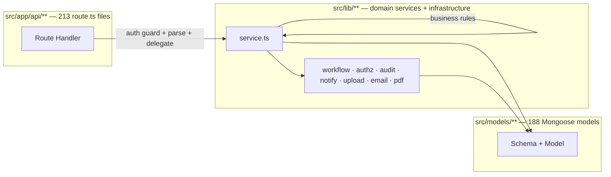
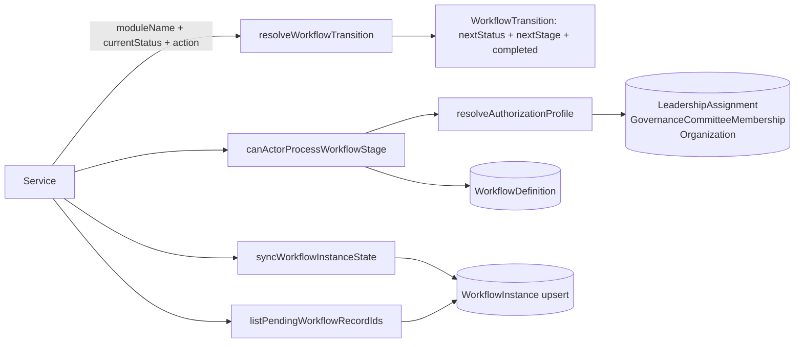
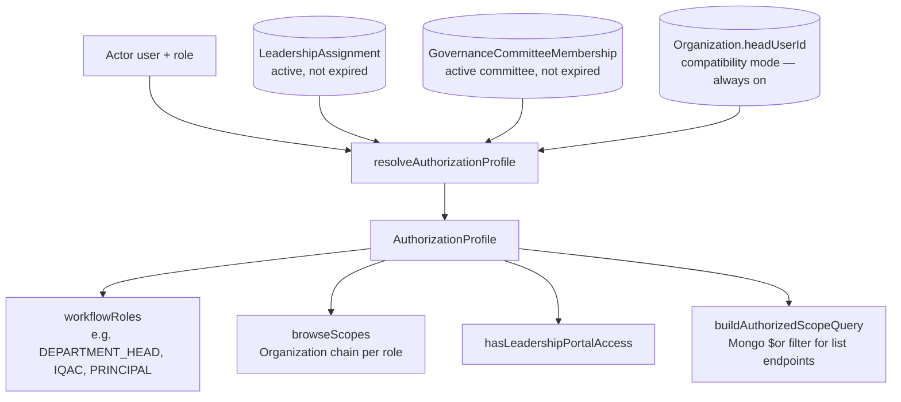
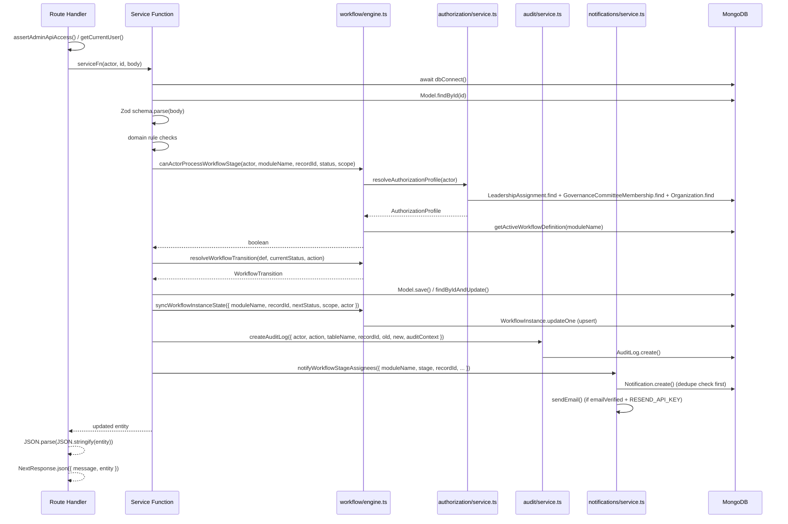
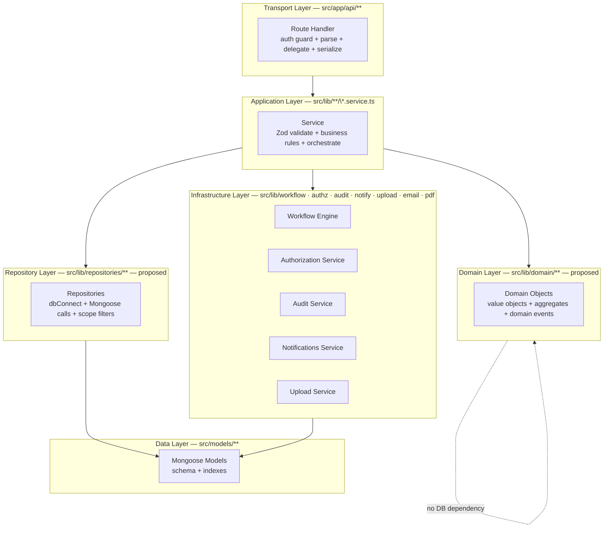

# 08 — Backend Architecture

> **Suite:** UMIS (`operant-next`) Enterprise Documentation
> **Scope:** The route → validator → service → model layering; the fat service layer; cross-cutting infrastructure (workflow engine, authorization service, audit, notifications, upload, email, PDF); how `dbConnect`, org-scoping, audit, and notifications compose inside a service call; and a full improvement roadmap toward a layered/hexagonal target.
> **Authoritative source:** `documentation.md` §3, §8, §9, §10; supplemented by reading `src/lib/workflow/engine.ts`, `src/lib/authorization/service.ts`, `src/lib/audit/service.ts`, `src/lib/auth/http.ts`, `src/lib/auth/errors.ts`.

---

## Table of Contents

1. [Architecture Style](#1-architecture-style)
2. [The Four-Layer Stack](#2-the-four-layer-stack)
3. [Layer 1: Route Handlers (Thin)](#3-layer-1-route-handlers-thin)
4. [Layer 2: Service Layer (Fat)](#4-layer-2-service-layer-fat)
5. [Layer 3: Data Access (Mongoose Direct)](#5-layer-3-data-access-mongoose-direct)
6. [Cross-Cutting Infrastructure](#6-cross-cutting-infrastructure)
   - 6.1 [Workflow Engine](#61-workflow-engine)
   - 6.2 [Authorization Service](#62-authorization-service)
   - 6.3 [Audit Service](#63-audit-service)
   - 6.4 [Notifications Service](#64-notifications-service)
   - 6.5 [Upload Service](#65-upload-service)
   - 6.6 [Email](#66-email)
   - 6.7 [PDF Generation](#67-pdf-generation)
7. [How the Layers Compose — Annotated Service Call](#7-how-the-layers-compose--annotated-service-call)
8. [The Six Contributor Criterion Modules](#8-the-six-contributor-criterion-modules)
9. [Current State](#9-current-state)
10. [Problems Identified](#10-problems-identified)
11. [Recommended Solutions](#11-recommended-solutions)
12. [Target Architecture](#12-target-architecture)
13. [Implementation Plan](#13-implementation-plan)

---

## 1. Architecture Style

UMIS is a **modular monolith**: a single Next.js 16 deployment serves the UI (React Server Components + Client Components), the HTTP API surface (213 route handlers), and the entire backend domain logic (`src/lib/**`). There is no separate API service, no microservice split, and no message queue.

The backend is organized as a **thin-handler / fat-service** design:

- **Route handlers** (`src/app/api/**/route.ts`) authenticate, parse, delegate, and return.
- **Service modules** (`src/lib/**/service.ts`) own validation, business rules, data access, workflow transitions, audit, and notifications.
- **Models** (`src/models/**`) are pure Mongoose schema definitions.



---

## 2. The Four-Layer Stack

```
┌────────────────────────────────────────────────────────┐
│  Layer 0: Presentation (RSC pages + Client Components) │
│           src/app/**/page.tsx, src/components/**       │
├────────────────────────────────────────────────────────┤
│  Layer 1: API / Transport (Route Handlers)             │
│           src/app/api/**/route.ts — 213 files          │
│           • auth guard • parse body / params           │
│           • delegate to service • serialize response   │
├────────────────────────────────────────────────────────┤
│  Layer 2: Domain / Application (Services)              │
│           src/lib/**/service.ts — 24 files             │
│           • Zod validation • business rules            │
│           • workflow transitions • audit • notify      │
│           • direct Mongoose calls                      │
├────────────────────────────────────────────────────────┤
│  Layer 3: Data (Mongoose Models)                       │
│           src/models/**/*.ts — 188 files               │
│           • schema definition • indexes                │
│           • hot-reload-safe registration               │
└────────────────────────────────────────────────────────┘
```

Layers 0 and 1 are covered in `07_Frontend_Architecture.md` and `06_API_Documentation.md` respectively. This document focuses on Layers 2 and 3 and the cross-cutting infrastructure that spans them.

---

## 3. Layer 1: Route Handlers (Thin)

Covered fully in `06_API_Documentation.md`. The relevant structural points for backend architecture:

- **No business logic.** A handler that contains an `if/else` on domain data (beyond parsing which action sub-route to call) is a code smell — it belongs in the service.
- **Auth guard is the handler's only responsibility** beyond delegation. Every handler starts with a guard call; failure throws `AuthError`, which the shared `createApiErrorResponse` maps to 401/403.
- **`JSON.parse(JSON.stringify(result))`** strips Mongoose-specific types before returning. Services return Mongoose documents or lean objects; handlers are responsible for serialization.
- **`getRequestAuditContext(request)`** (`src/lib/audit/request.ts`) extracts the client IP from proxy headers and passes it to the service as `auditContext`. This is the only request-context data that flows into the service layer.

---

## 4. Layer 2: Service Layer (Fat)

Services are the backend. They are **not** thin orchestrators — they contain validation, rules, multi-step database operations, workflow transitions, audit writes, and notification dispatches, all in one function call.

### Service module structure

Each feature has a `src/lib/<domain>/` directory containing:

| File | Responsibility |
|---|---|
| `service.ts` | All business operations for the feature |
| `validators.ts` | Zod schemas for create/update/submit actions |
| `report-pdf.ts` (where applicable) | PDF byte assembly for the feature's report |
| `catalog.ts` / `migration.ts` (where applicable) | One-off seed / migration helpers |

**24 `service.ts` files** are present. The largest is `src/lib/pbas/service.ts` (~2,500 lines). Other notable sizes: `src/lib/accreditation/service.ts`, `src/lib/faculty/service.ts`.

### A typical service function (annotated)

```ts
// src/lib/teaching-learning/service.ts (representative — not verbatim)
export async function submitTeachingLearningAssignment(
    actor: { id: string; name: string; role: string; auditContext?: AuditRequestContext },
    assignmentId: string
) {
    await dbConnect();                                        // 1. ensure connection

    const assignment = await TeachingLearningAssignment
        .findById(assignmentId);                             // 2. fetch record
    if (!assignment) throw new AuthError("Not found.", 404);

    if (assignment.assigneeUserId.toString() !== actor.id)  // 3. ownership check
        throw new AuthError("Forbidden.", 403);

    if (assignment.status !== "Draft" && assignment.status !== "Rejected")
        throw new AuthError("Cannot submit from current status.", 409);

    // 4. Domain submission gates (feature-specific validation)
    if (!assignment.pedagogicalApproach) throw new AuthError("Pedagogical approach required.", 400);
    if (!assignment.sessions?.length) throw new AuthError("At least one session required.", 400);
    // …additional gates…

    const def = await getActiveWorkflowDefinition("TEACHING_LEARNING"); // 5. fetch WF def
    const transition = resolveWorkflowTransition(def, assignment.status, "submit"); // 6. compute next status

    assignment.status = transition.status;                   // 7. apply status
    assignment.submittedAt = new Date();
    assignment.statusLogs.push({ status: transition.status, changedBy: actor.id, changedAt: new Date() });
    await assignment.save();                                 // 8. persist

    await syncWorkflowInstanceState({                        // 9. sync WF instance
        moduleName: "TEACHING_LEARNING",
        recordId: assignmentId,
        status: transition.status,
        actor,
        action: "submit",
        ...scopeFieldsFrom(assignment),
    });

    await createAuditLog({                                   // 10. audit
        actor,
        action: "SUBMIT",
        tableName: "teaching_learning_assignments",
        recordId: assignmentId,
        auditContext: actor.auditContext,
    });

    await notifyWorkflowStageAssignees({                     // 11. notify reviewers
        moduleName: "TEACHING_LEARNING",
        recordId: assignmentId,
        stage: transition.stage,
        subject: `Teaching-Learning assignment submitted: ${assignment.title}`,
    });

    return assignment;
}
```

This 11-step pattern is replicated across all six criterion module submit functions, the PBAS/CAS/AQAR submit functions, and the SSR submit function. The shared infrastructure calls (steps 5–11) are the same; only the domain gates (step 4) differ per module.

### Service categories

| Category | Files | Notes |
|---|---|---|
| Contributor modules (×6) | `teaching-learning`, `research-innovation`, `infrastructure-library`, `student-support-governance`, `governance-leadership-iqac`, `institutional-values-best-practices` | Near-identical service structure; only domain models and submission gates differ |
| Faculty appraisal | `pbas/`, `cas/`, `aqar/`, `aqar-cycle/` | Larger and more complex; PBAS service is ~2500 lines |
| Reporting | `accreditation/`, `naac-metric-warehouse/`, `naac-criteria-mapping/` | Heavy aggregation logic; `accreditation/service.ts` covers AISHE, NIRF, compliance, SSS |
| Academic | `curriculum/`, `faculty/`, `student/` | Mid-size; faculty service handles 20+ sub-collections |
| Infrastructure | `audit/`, `notifications/`, `upload/`, `report-templates/` | Cross-cutting; called by all other services |
| Admin | `admin/academics.ts`, `admin/hierarchy.ts`, `admin/master-data.ts`, `admin/reference-masters.ts`, `admin/users.ts`, `admin/system.ts`, `admin/dashboard.ts` | Thin-to-medium services for admin console operations |
| Auth-adjacent | `auth/` (session, tokens, password, email), `authorization/service.ts`, `hierarchy/canonical.ts`, `governance/service.ts` | Auth and RBAC; rarely modified after stabilization |

---

## 5. Layer 3: Data Access (Mongoose Direct)

There is **no repository or data-access abstraction layer**. Service functions call Mongoose model methods directly:

```ts
// Common patterns in service.ts files
await dbConnect();
const item = await SomeModel.findById(id).lean();
await SomeModel.create({ ... });
await SomeModel.findByIdAndUpdate(id, { $set: { ... } }, { new: true });
await SomeModel.deleteOne({ _id: id });
await SomeModel.find(scopeFilter).select("field1 field2").lean();
await SomeModel.countDocuments(filter);
const result = await SomeModel.aggregate([...]);
```

**Implications:**

- Mongoose `ObjectId` comparisons, `.lean()` usage, and projection strings are spread across service functions rather than centralized.
- Mocking data access for unit tests requires either mocking Mongoose models directly (fragile) or running against a real DB.
- Schema changes require updates in every service function that projects or filters on the changed field.

---

## 6. Cross-Cutting Infrastructure

### 6.1 Workflow Engine

**File:** `src/lib/workflow/engine.ts`

The workflow engine is a pure configuration-driven state-machine resolver powering all 11 workflow modules. It is the most-reused piece of infrastructure in the backend.



Key design properties:
- `resolveWorkflowTransition` is a **pure function** — no DB calls, no side effects; fully testable in isolation.
- `WorkflowDefinition` documents are lazily seeded by `ensureWorkflowDefinitions()` and cached in MongoDB. Adding a new module requires only a new entry in `DEFAULT_WORKFLOW_DEFINITIONS`.
- `syncWorkflowInstanceState` upserts (not inserts) the `WorkflowInstance`, so it is idempotent — safe to call multiple times with the same state.
- No module hardcodes transitions; all stage definitions live in the engine seed.

### 6.2 Authorization Service

**File:** `src/lib/authorization/service.ts`

`resolveAuthorizationProfile(actor)` is called once per workflow action to build the actor's complete `AuthorizationProfile`. It merges three data sources:



`buildAuthorizedScopeQuery(profile)` translates `browseScopes` into a MongoDB `$or` filter over the scope block fields. This is the integration point between the authorization service and the database layer.

### 6.3 Audit Service

**File:** `src/lib/audit/service.ts`

`createAuditLog({ actor, action, tableName, recordId, oldData, newData, auditContext, session? })` writes an append-only record to the `audit_logs` collection.

```ts
// Signature
export async function createAuditLog({
    actor,          // { id, name, role }
    action,         // string — e.g. "CREATE", "SUBMIT", "APPROVE"
    tableName,      // string — Mongoose collection name
    recordId,       // string
    oldData,        // unknown — serialized with toPlainAuditValue()
    newData,        // unknown
    auditContext,   // { ipAddress? }
    session?,       // ClientSession — optional Mongo session
}: AuditPayload)
```

`toPlainAuditValue()` recursively converts `ObjectId`/`Date`/Mongoose Document instances to plain serializable values before storage. This prevents the `Mixed`-typed `oldData`/`newData` fields from holding non-serializable types.

**Known gap:** `createAuditLog` does **not** call `await dbConnect()` itself. It assumes the caller's service has already established the connection. If called from a context where `dbConnect()` was not called first, it will throw. This is a latent reliability risk.

### 6.4 Notifications Service

**File:** `src/lib/notifications/service.ts`

Writes in-app `Notification` documents and dispatches emails via `lib/notifications/email.ts`.

Key behaviors:
- **Deduplication:** notifications with a `metadata.dedupeKey` are not duplicated within a configurable window.
- **Stage recipient resolution:** `resolveWorkflowRoleRecipientIds(stage.approverRoles, subjectScope)` in `lib/governance/service.ts` finds the actual user IDs who hold the required workflow roles for the subject's scope, so notifications reach the right reviewers.
- **Email gating:** only users with `emailVerified: true` receive emails. If `RESEND_API_KEY` is unset, the email body is logged to `console.info` and the send is skipped (dev safety net).
- **Deadline reminders:** computed lazily on `GET /api/notifications`. There is no background scheduler.

### 6.5 Upload Service

**Files:** `src/lib/upload/service.ts`, `src/lib/upload/policy.ts`

Three-phase: issue intent → client uploads directly to Firebase → server finalize/verify. Covered fully in `05_Database_Architecture.md` (UploadIntent) and `06_API_Documentation.md`.

The server-side finalize step (`/api/documents`, action `finalize-upload`) re-fetches the file from Firebase, verifies content-type, size, and SHA-256 checksum, and creates a `Document` record. This is the integrity gate.

**Known gap:** `POST /api/faculty/photo` and `POST /api/student/photo` bypass intent/finalize entirely and only check the URL prefix — no MIME, size, or checksum verification. See `16_Security_Audit.md`.

### 6.6 Email

**Files:** `src/lib/auth/email.ts` (verification/reset), `src/lib/notifications/email.ts` (workflow notifications)

- Both instantiate `new Resend(process.env.RESEND_API_KEY)` per call.
- Email bodies are hand-built inline-HTML strings.
- No retry queue; if a send fails, the notification is marked `failed` and stays that way.
- Dev fallback: if `RESEND_API_KEY` is absent, link/subject is `console.info`-logged and the Resend call is skipped.

### 6.7 PDF Generation

**Files:** `src/lib/report-templates/pdf.ts`, `src/lib/pbas/report-pdf.ts`, `src/lib/faculty/report-pdf.ts`, `src/lib/aqar/report-pdf.ts`, `src/lib/aqar-cycle/report-pdf.ts`, `src/lib/report-templates/preview.ts`

PDFs are assembled as **raw PDF-1.4 byte streams** with no external PDF library. `buildTemplatedPdf()` fills `{{token}}` placeholders, then `buildRawPdf()` assembles the PDF object graph and cross-reference table.

**Known gap:** Only Helvetica-family fonts are embedded. All non-ASCII characters (including Indian script names in Devanagari, etc.) are stripped before rendering. Official accreditation PDFs for Indian institutions will have faculty/student names silently corrupted. See `10_Technical_Debt_Report.md`.

---

## 7. How the Layers Compose — Annotated Service Call

The following diagram shows all the cross-cutting infrastructure that a single workflow-review service call touches:



**Observation:** a single review action issues 8–12 database round-trips across multiple collections. This is correct and auditable but not aggregated. At high concurrency or with a slow MongoDB cluster, the cumulative latency is a concern (see `17_Performance_Optimization.md`).

---

## 8. The Six Contributor Criterion Modules

The six C1–C7 contributor modules (Teaching-Learning, Research-Innovation, Infrastructure-Library, Student-Support-Governance, Governance-Leadership-IQAC, Institutional-Values-Best-Practices) are **copy-adapted** from a single template. Each module has:

- A `Plan` model and `Assignment` model with scope block (in `src/models/<category>/`).
- A `service.ts` with `createPlan`, `updatePlan`, `createAssignment`, `updateAssignment`, `getAssignmentsForFaculty`, `saveContribution`, `submitAssignment`, `reviewAssignment`, each calling the same 11-step infrastructure sequence.
- A `validators.ts` with create/update/submit schemas.
- Four admin/faculty/director routes per module.

**Duplication scope:**

| Element | Count (×6 modules) | Lines estimated |
|---|---|---|
| Plan CRUD (service) | 6 × ~50 lines | ~300 |
| Assignment CRUD (service) | 6 × ~80 lines | ~480 |
| Submit function (service) | 6 × ~100 lines | ~600 |
| Review function (service) | 6 × ~120 lines | ~720 |
| Route files (8 routes × 6) | 48 files | — |
| Validator schemas | 6 × ~50 lines | ~300 |
| **Total duplication** | | **~2,400 lines** |

The modules differ only in:
1. The Mongoose model imports.
2. The domain-specific submission gate conditions (step 4 in the submit function).
3. Status enum values and workflow module name.

This is the primary maintainability risk in the backend: a bug fix or infrastructure change (e.g. adding request correlation IDs to audit logs) must be applied to six identical locations.

---

## 9. Current State

The backend is predictable and well-structured for a system of this domain complexity. Key strengths:

- **Consistent thin-handler / fat-service split** — route files contain no business logic.
- **Generic workflow engine** — 11 modules share one state-machine resolver; no per-module transition duplication.
- **Generic authorization service** — governance-driven RBAC computed per request from three data sources.
- **Consistent cross-cutting calls** — audit, notifications, and workflow sync are called uniformly by all service submit/review functions.
- **TypeScript strict mode** throughout; path aliases; typed Mongoose schemas.
- **`bufferCommands: false`** and the `dbConnect` cache prevent connection issues.

---

## 10. Problems Identified

| Problem | Severity | Location |
|---|---|---|
| **No repository / data-access abstraction** | High | All 24 service files import Mongoose models directly; Mongoose calls are scattered; mocking for tests is impractical |
| **Very large service files** | High | `lib/pbas/service.ts` ~2500 lines; `lib/accreditation/service.ts` spans AISHE + NIRF + compliance + SSS; `lib/faculty/service.ts` handles 20+ sub-collections |
| **Heavy duplication across 6 criterion modules** | High | ~2,400 lines of near-identical code across 6 service files, 48 route files, 6 validator files |
| **Audit writes not transaction-bound** | Medium | `createAuditLog` is called after `Model.save()` with no shared transaction; a crash between the two leaves an un-audited write |
| **`createAuditLog` assumes connection** | Medium | No internal `dbConnect()` call; if called from a cold context it throws |
| **No dependency injection** | Medium | Services `import` models and infrastructure utilities directly; no DI container, no testability boundary; 4 unit tests cover a system with ~2,500 service lines |
| **No domain layer** | Medium | There are no domain objects, aggregates, or value objects; all business rules live as imperative code inside service functions |
| **N+1 DB round-trips in service calls** | Medium | A single review action issues 8–12 DB round-trips; director dashboard issues 11 modules × (records + pending IDs) fan-out per render |
| **PDF generation is synchronous and ASCII-only** | Medium | Blocks the request thread for large reports; silently corrupts non-ASCII names |
| **No background job infrastructure** | Low | Deadline reminders computed on every notification fetch; large report generation on the request thread; no queue or scheduler |

---

## 11. Recommended Solutions

### R1 — Repository / data-access abstraction layer

Introduce repository classes between services and Mongoose. Each repository owns `dbConnect()`, scope-filter application, and common projection/lean defaults. Services call repositories; they never import Mongoose models.

```ts
// Proposed pattern: src/lib/repositories/assignment.repository.ts
export class AssignmentRepository<TDoc> {
    constructor(private readonly Model: Model<TDoc>) {}

    async findById(id: string): Promise<TDoc | null> {
        await dbConnect();
        return this.Model.findById(id).lean() as Promise<TDoc | null>;
    }

    async findByScope(filter: Record<string, unknown>): Promise<TDoc[]> {
        await dbConnect();
        return this.Model.find(filter).lean() as Promise<TDoc[]>;
    }
}
```

This makes services testable via repository mocks without a MongoDB instance.

### R2 — Shared "contributor module" factory

Extract a `createContributorModuleServices(config)` factory that generates the six identical service functions from a configuration object:

```ts
// Proposed: src/lib/contributor-module/factory.ts
interface ContributorModuleConfig {
    moduleName: WorkflowModuleName;
    PlanModel: Model<IBasePlan>;
    AssignmentModel: Model<IBaseAssignment>;
    validateSubmission: (assignment: IBaseAssignment) => void; // module-specific gates
}

export function createContributorModuleServices(config: ContributorModuleConfig) {
    return {
        createPlan: ...,
        createAssignment: ...,
        saveContribution: ...,
        submitAssignment: ...,   // calls config.validateSubmission() then shared infrastructure
        reviewAssignment: ...,
    };
}
```

Each of the six modules calls `createContributorModuleServices` with its own config. This collapses ~2,400 duplicated lines into one shared implementation.

### R3 — Transactional audit

Wrap Mongoose write + audit log in a MongoDB session and transaction for all state-changing operations (submit, review, approve, delete):

```ts
const session = await mongoose.startSession();
await session.withTransaction(async () => {
    await assignment.save({ session });
    await createAuditLog({ ..., session });
});
```

This ensures that if the process crashes after the write but before the audit, the write is rolled back — preserving audit completeness.

### R4 — Service decomposition

Split the three monolith service files:

| Current file | Split into |
|---|---|
| `lib/pbas/service.ts` (~2500 lines) | `pbas/form.service.ts` (CRUD + lifecycle), `pbas/scoring.service.ts` (score computation), `pbas/workflow.service.ts` (submit/review/approve), `pbas/catalog.service.ts` (indicator/category management) |
| `lib/accreditation/service.ts` | `accreditation/aishe.service.ts`, `accreditation/nirf.service.ts`, `accreditation/compliance.service.ts`, `accreditation/sss.service.ts` |
| `lib/faculty/service.ts` | `faculty/profile.service.ts` (identity), `faculty/workspace.service.ts` (sub-collections), `faculty/report.service.ts` (PDF) |

### R5 — Dependency injection (lightweight)

Introduce simple constructor injection for repositories and infrastructure utilities rather than top-level imports. This does not require a DI framework — a service factory function accepting its dependencies is sufficient:

```ts
export function createTeachingLearningService(
    repository: AssignmentRepository,
    workflowEngine: WorkflowEngine,
    auditService: AuditService,
    notificationService: NotificationService,
) {
    return {
        async submitAssignment(actor, id) {
            const assignment = await repository.findById(id);
            // ...
        }
    };
}
```

### R6 — Asynchronous PDF and report generation

Move large PDF assembly (`aqar-cycle/report-pdf.ts`, NIRF, AISHE aggregation) to a background job queue (BullMQ + Redis, or a lightweight in-process queue). The request returns a job ID; the client polls or receives a notification when the PDF is ready. This unblocks the request thread and prevents timeouts on large reports.

### R7 — `createAuditLog` self-sufficient connection

Add `await dbConnect()` as the first line of `createAuditLog` to remove the hidden caller dependency.

---

## 12. Target Architecture



The immediate practical target (Phases 1–2) is the **repository layer + contributor module factory** — the two changes with the highest return on investment. The full domain layer (Phase 3) is longer-term and feeds into the DDD-lite evolution described in `19_Future_Architecture.md`.

---

## 13. Implementation Plan

| Phase | Work | Effort | Priority | Cross-reference |
|---|---|---|---|---|
| **P0 — Reliability** | R7: add `dbConnect()` to `createAuditLog`; add `session` option validation | 0.5 day | Critical | |
| **P0 — Reliability** | R3: wrap submit/approve/delete in Mongo transactions for audit atomicity | 2 days | Critical | `05_Database_Architecture.md` |
| **P1 — Architecture** | R1: introduce repository layer; start with `AssignmentRepository` and `WorkflowInstanceRepository` | 3 days | High | `11_Refactoring_Strategy.md` |
| **P1 — Architecture** | R2: shared contributor-module factory; replace the six duplicated service blocks | 5 days | High | `11_Refactoring_Strategy.md` |
| **P2 — Maintainability** | R4: decompose `pbas/service.ts` into 4 focused services | 3 days | Medium | `09_Code_Quality_Report.md` |
| **P2 — Maintainability** | R4: decompose `accreditation/service.ts` into 4 domain services | 2 days | Medium | `09_Code_Quality_Report.md` |
| **P3 — Testability** | R5: lightweight DI for new services; write integration tests against repositories | 4 days | Medium | `09_Code_Quality_Report.md` |
| **P3 — Performance** | R6: move PDF generation to async background job | 3 days | Medium | `17_Performance_Optimization.md` |
| **P4 — Future** | Domain layer introduction (value objects, aggregates) | 5+ days | Low | `19_Future_Architecture.md` |

**Migration strategy:** repositories and the contributor-module factory can be introduced module by module without a big-bang rewrite. Start with Teaching-Learning (simplest gates), prove the pattern, then apply to the remaining five modules. Existing modules continue working unchanged while new ones use the factory.

Cross-references: `11_Refactoring_Strategy.md` for the detailed refactoring sequence; `09_Code_Quality_Report.md` for service size and test coverage metrics; `17_Performance_Optimization.md` for the DB round-trip and PDF performance details; `19_Future_Architecture.md` for the long-term hexagonal/DDD-lite target.
