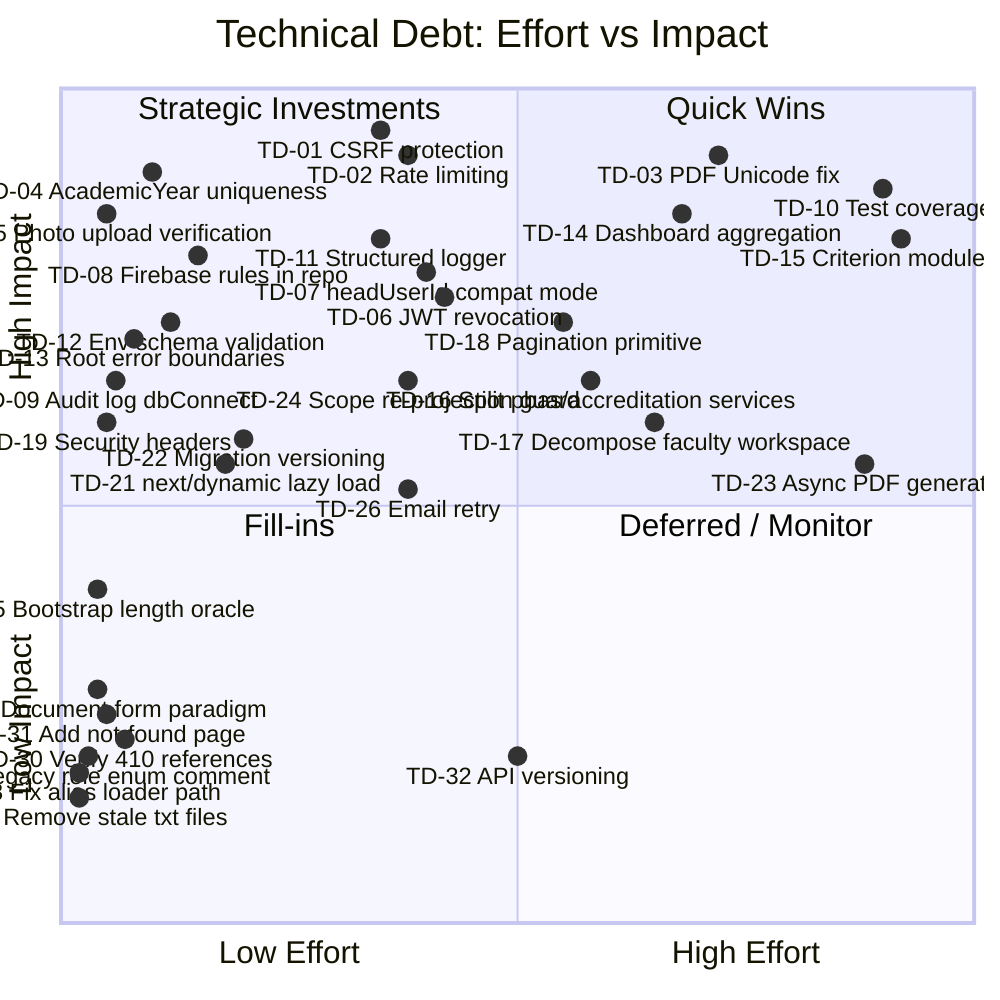

# 10 — Technical Debt Register

> **Project:** UMIS (`operant-next`) · Next.js 16 App Router + MongoDB/Mongoose
> **Scope:** Formal, itemised debt register derived from `documentation.md` §20/21/23/27 and verified against live source files
> **Authoritative grounding:** `documentation.md` §20 Security · §21 Performance · §23 Code Quality · §27 Known Issues & Technical Debt
> **Cross-references:** [09_Code_Quality_Report.md](09_Code_Quality_Report.md) · [11_Refactoring_Strategy.md](11_Refactoring_Strategy.md) · [02_Current_Architecture.md](02_Current_Architecture.md) · [05_Database_Architecture.md](05_Database_Architecture.md) · [06_API_Documentation.md](06_API_Documentation.md) · [07_Frontend_Architecture.md](07_Frontend_Architecture.md)

---

## Table of Contents

1. [How to Read This Register](#1-how-to-read-this-register)
2. [Critical Items](#2-critical-items)
3. [High-Priority Items](#3-high-priority-items)
4. [Medium-Priority Items](#4-medium-priority-items)
5. [Low-Priority Items](#5-low-priority-items)
6. [Summary Table](#6-summary-table)
7. [Effort vs Impact Quadrant](#7-effort-vs-impact-quadrant)
8. [Sequencing Notes](#8-sequencing-notes)

---

## 1. How to Read This Register

**Category** indicates the importance of remediation. **Effort** is a T-shirt size:

| Code | Meaning |
|---|---|
| XS | < 2 hours — one-liner or single-file fix |
| S | half a day |
| M | 1–3 days |
| L | 1–2 weeks |
| XL | 2–4 weeks |

**Priority** combines category and blocking dependencies. Items are numbered sequentially and can be referenced from commit messages, tickets, or PR descriptions (e.g. `TD-03`).

---

## 2. Critical Items

---

### TD-01

| Field | Value |
|---|---|
| **ID** | TD-01 |
| **Title** | No CSRF protection on state-changing API endpoints |
| **Category** | Critical |
| **Priority** | P0 |

**Description:**  
The session cookie (`umis_session`) is `sameSite: "lax"`, which reduces but does not eliminate CSRF risk. All state-changing `POST`, `PATCH`, and `DELETE` route handlers rely solely on the cookie for authentication. There are no CSRF tokens, no `Origin`/`Referer` header checks, and no double-submit cookie pattern.

**Impact:**  
An attacker who can trick a logged-in admin into visiting a malicious page can issue authenticated API requests (create users, approve workflows, alter master data) without the admin's knowledge.

**Files involved:**  
- `src/lib/auth/config.ts` (cookie config — `sameSite: "lax"`)
- `src/app/api/**/*.ts` (all 213 route handlers — none have a CSRF check)

**Suggested solution:**  
1. Add a signed `X-CSRF-Token` header check to all non-idempotent routes via a shared helper called at the top of each handler (mirroring `assertAdminApiAccess()`).
2. Generate the token during session creation and store it as a separate non-HttpOnly cookie or include it in the JWT payload and read it client-side.
3. See `11_Refactoring_Strategy.md` §4 for the migration approach.

**Estimated effort:** M (2–3 days — helper + per-handler adoption, no schema change)

---

### TD-02

| Field | Value |
|---|---|
| **ID** | TD-02 |
| **Title** | No rate limiting or account lockout on auth, upload-intent, and email endpoints |
| **Category** | Critical |
| **Priority** | P0 |

**Description:**  
No rate-limiting middleware or per-IP/per-user throttle exists on any endpoint. The login (`/api/auth/login`, `/api/auth/admin-login`, `/api/auth/director-login`), activation, password reset, upload-intent (`/api/documents`), and email-send paths are all fully unbounded.

**Impact:**  
- Credential brute-force is unlimited.
- Password reset tokens can be enumerated by flooding the `forgot-password` endpoint.
- Upload-intent creation can be abused to exhaust Firebase Storage write quotas.
- Email send can be abused to spam users.

**Files involved:**  
- `src/app/api/auth/login/route.ts`
- `src/app/api/auth/admin-login/route.ts`
- `src/app/api/auth/director-login/route.ts`
- `src/app/api/auth/forgot-password/route.ts`
- `src/app/api/auth/activate-faculty/route.ts`
- `src/app/api/auth/activate-student/route.ts`
- `src/app/api/documents/route.ts`

**Suggested solution:**  
Implement rate limiting at the Next.js host layer (e.g., Vercel rate-limit headers, nginx `limit_req`) or add an in-process token-bucket per IP using a lightweight library such as `upstash/ratelimit` (Redis-backed). Add account lockout (5 failed attempts → 15-minute lock) inside `findUserForLogin` in `src/lib/auth/user.ts`.

**Estimated effort:** M (3 days — Redis/Upstash setup + per-endpoint annotation)

---

### TD-03

| Field | Value |
|---|---|
| **ID** | TD-03 |
| **Title** | PDF generator strips all non-ASCII characters — corrupts Indian-language names |
| **Category** | Critical |
| **Priority** | P0 |

**Description:**  
The hand-rolled PDF byte assembler in `src/lib/report-templates/pdf.ts` supports only Helvetica variants (standard PDF Type-1 fonts). All non-ASCII characters (Devanagari, Tamil, Telugu, etc.) are silently stripped during `{{token}}` substitution. Official accreditation PDFs (PBAS reports, CAS applications, faculty profiles) may contain faculty names and institutional names with Indian-language characters that are dropped without warning.

**Impact:**  
Official regulatory documents submitted to NAAC/UGC may have garbled or missing names, which could invalidate the submissions or require manual correction.

**Files involved:**  
- `src/lib/report-templates/pdf.ts` (PDF byte assembler)
- `src/lib/pbas/report-pdf.ts`
- `src/lib/faculty/report-pdf.ts`
- `src/lib/aqar/report-pdf.ts`
- `src/lib/aqar-cycle/report-pdf.ts`
- `src/lib/report-templates/preview.ts`

**Suggested solution:**  
Replace the hand-rolled PDF assembler with a production-grade library that supports Unicode/UTF-8 and embeds fonts (e.g., `pdfkit` with a Noto Sans or Lohit Devanagari TTF, or `@react-pdf/renderer`). The PDF generation interface (`buildTemplatedPdf(context, buffer)`) can remain stable — only the implementation changes. This is a **breaking replacement** requiring thorough output testing.

**Estimated effort:** L (1–2 weeks — library integration + font embedding + output regression tests)

---

### TD-04

| Field | Value |
|---|---|
| **ID** | TD-04 |
| **Title** | `AcademicYear.isActive` has no uniqueness constraint — multiple active years possible |
| **Category** | Critical |
| **Priority** | P0 |

**Description:**  
`src/models/reference/academic-year.ts` defines `isActive: { type: Boolean, default: false, index: true }` with no uniqueness constraint. Two (or more) years can have `isActive: true` simultaneously. Services fall back to "active or latest" heuristics but do not enforce exclusivity.

**Impact:**  
New PBAS forms, AQAR applications, teaching-learning plans, and all records that auto-populate `academicYearId` from the active year are silently created against the wrong year. This is a data-integrity risk that could affect the accuracy of NAAC metric calculations.

**Files involved:**  
- `src/models/reference/academic-year.ts` (no unique index on `isActive`)
- Any service that calls `AcademicYear.findOne({ isActive: true })` (multiple services)

**Suggested solution:**  
1. Immediate: add a service-level guard in every "set active year" mutation that first sets all other years to `isActive: false` in an atomic `updateMany` before setting the new one.
2. Follow-up: add a partial unique index `{ isActive: 1 }` with `partialFilterExpression: { isActive: true }` so only one document can have `isActive: true` at the database level.
3. Run a data-audit script to detect and resolve any existing duplicate active years.

**Estimated effort:** S (half a day for service guard + 1 day for index + audit script)

---

### TD-05

| Field | Value |
|---|---|
| **ID** | TD-05 |
| **Title** | Photo-upload endpoints bypass MIME/size/checksum verification |
| **Category** | Critical |
| **Priority** | P0 |

**Description:**  
`POST /api/faculty/photo` and `POST /api/student/photo` accept a `photoUrl` string and perform only a domain-prefix string check (verifying the URL starts with the Firebase storage host). The full upload-finalize path (`src/app/api/documents/route.ts`) re-fetches the file, validates MIME type, file size, and computes a SHA-256 checksum. The photo endpoints skip all of this.

**Impact:**  
An authenticated user can set their profile photo URL to any Firebase Storage URL (including one they do not own, or a non-image file), bypassing all file-type and size controls.

**Files involved:**  
- `src/app/api/faculty/photo/route.ts`
- `src/app/api/student/photo/route.ts`

**Suggested solution:**  
Apply the same re-fetch, MIME-type check (`image/jpeg`, `image/png`, `image/webp`), and size check (≤2 MB) used in the finalize path of `src/app/api/documents/route.ts`. This is a near-copy of existing code.

**Estimated effort:** XS (2–3 hours)

---

## 3. High-Priority Items

---

### TD-06

| Field | Value |
|---|---|
| **ID** | TD-06 |
| **Title** | 7-day JWT with no server-side revocation list |
| **Category** | High |
| **Priority** | P1 |

**Description:**  
Session tokens are stateless JWTs (`HS256`) with a 7-day TTL (`src/lib/auth/config.ts`). There is no revocation mechanism — a stolen token is valid for up to 7 days. The per-request `getCurrentUser()` re-fetches the `User` from Mongo on every request, which provides near-instant lockout for suspended/deleted accounts, but this only works if every code path calls `getCurrentUser()`. Any future edge function, middleware, or webhook integration that skips this check would have no revocation protection.

**Impact:**  
A leaked session token is valid for up to 7 days. Admin tokens are especially high-value.

**Files involved:**  
- `src/lib/auth/session.ts`
- `src/lib/auth/config.ts`

**Suggested solution:**  
Maintain a `SessionRevocationList` collection (a simple set of revoked token `jti` values with TTL indexes). Check membership in `getSessionPayload()`. Alternatively, shorten the token TTL to 1–2 hours and implement silent refresh. See `11_Refactoring_Strategy.md` §3 for the migration approach (cookie name / payload changes are breaking).

**Estimated effort:** M (2–3 days — model + check + revoke-on-logout)

---

### TD-07

| Field | Value |
|---|---|
| **ID** | TD-07 |
| **Title** | Always-on legacy `headUserId` authorisation path (`compatibilityMode = true`) |
| **Category** | High |
| **Priority** | P1 |

**Description:**  
`src/lib/authorization/service.ts` line 63 hard-codes `const compatibilityMode = true;`. When this is true, `resolveAuthorizationProfile()` queries `Organization.headUserId` for every authorisation check, granting leadership/workflow roles to whoever is set as the `headUserId` of any organization — with no admin-facing toggle, no audit trail for the grant, and no way to disable it without a code change.

**Impact:**  
Any database record with an `Organization.headUserId` pointing to a user implicitly grants that user director-portal access and review power over all records in that org's scope. This is a hidden privilege-escalation vector that cannot be managed through the Admin UI.

**Files involved:**  
- `src/lib/authorization/service.ts` (lines 63, 519–523)
- `src/models/core/organization.ts` (`headUserId` field)

**Suggested solution:**  
1. Add a `MasterData` config key `authorization.legacy-head-user-id-enabled` (boolean) that gates the compatibility path.
2. Run `backfill-governance-rbac.cjs` (already in `scripts/`) to migrate all `headUserId` grants to `LeadershipAssignment` records.
3. Once all grants are migrated and verified, set the config key to `false` and remove the compatibility block.

**Estimated effort:** M (2–3 days — config key + migration verification)

---

### TD-08

| Field | Value |
|---|---|
| **ID** | TD-08 |
| **Title** | Firebase Storage Security Rules not in repository — security dependency unverifiable |
| **Category** | High |
| **Priority** | P1 |

**Description:**  
All `NEXT_PUBLIC_FIREBASE_*` credentials are shipped in the client-side JavaScript bundle by design. The only access control on the Firebase Storage bucket is the Firebase Storage Security Rules, which are **not stored in this repository**. Any unintended change to the rules (or a permissive default rule) would allow any authenticated Firebase user to read or write arbitrary files in the bucket.

**Impact:**  
Potential unauthorised access to all uploaded documents (faculty evidence, student records, PBAS/CAS supporting documents).

**Files involved:**  
- `src/lib/firebase/config.ts`
- Firebase project (external)

**Suggested solution:**  
1. Add Firebase Storage Security Rules to the repository (e.g., `firebase/storage.rules`) and include a CI check that validates the rules before any deployment.
2. Rules should restrict reads to authenticated users and writes to the specific `storagePaths` format issued by the intent system.

**Estimated effort:** S (1 day — rules authoring + CI check)

---

### TD-09

| Field | Value |
|---|---|
| **ID** | TD-09 |
| **Title** | `createAuditLog` is not transaction-bound with the write it records |
| **Category** | High |
| **Priority** | P1 |

**Description:**  
`src/lib/audit/service.ts` `createAuditLog()` accepts an optional `ClientSession` but does not call `dbConnect()` itself. Callers that omit the session (most do) write the audit entry in a separate, independent Mongo operation. If the primary write succeeds and the audit log creation fails (e.g., due to a transient error), there is a write with no audit trail. Conversely, if an audit log is written and the primary write later rolls back (rare in the current non-transactional model, but possible with future refactors), an orphaned audit entry is created.

**Impact:**  
Incomplete audit trails for compliance-critical operations (PBAS approval, CAS promotion, workflow transitions). NAAC accreditation may require demonstrable audit completeness.

**Files involved:**  
- `src/lib/audit/service.ts` (line 83 — `createAuditLog` function, no `dbConnect()`)
- All ~20 callers in `src/lib/**/service.ts`

**Suggested solution:**  
1. Immediate: add `await dbConnect()` as the first line of `createAuditLog()`.
2. Medium-term: wrap critical write + audit pairs in a Mongoose session transaction (`await session.withTransaction(async () => { ... })`) for the most compliance-sensitive operations (PBAS/CAS approval, user provisioning, workflow transitions).

**Estimated effort:** XS → M (XS for the `dbConnect()` guard; M for full transaction wrapping)

---

### TD-10

| Field | Value |
|---|---|
| **ID** | TD-10 |
| **Title** | Near-zero automated test coverage (4 unit tests, 0 integration tests) |
| **Category** | High |
| **Priority** | P1 |

**Description:**  
The codebase has exactly 4 Vitest unit test files:
- `src/lib/auth/user.test.ts`
- `src/lib/pbas/validators.test.ts`
- `src/lib/pbas/workflow.test.ts`
- `src/lib/workflow/engine.test.ts`

There are 0 integration tests, 0 API-level tests, 0 component tests, and 0 end-to-end tests for a system with 213 route handlers, 188 Mongoose models, 24 service modules, and 85 React components. The AQAR verification script (`scripts/verify-aqar-seven-modules.mjs`) runs against a live database and is not automated in CI.

**Impact:**  
Any refactoring or new feature addition has no automated regression safety net. Silent regressions in workflow transitions, authorisation checks, or submission gates could affect accreditation data integrity.

**Files involved:**  
- `src/lib/auth/user.test.ts`
- `src/lib/pbas/validators.test.ts`
- `src/lib/pbas/workflow.test.ts`
- `src/lib/workflow/engine.test.ts`
- `vitest.config.ts`

**Suggested solution:**  
Prioritise tests by risk, in this order:
1. Workflow engine transition logic (already partially covered — extend).
2. `resolveAuthorizationProfile()` for all governance role combinations.
3. Each module's `submit*Assignment()` gate conditions.
4. API-level integration tests using `supertest` against a test MongoDB instance (or `mongomemoryserver`).
5. Eventually: component tests for the review-board and manager components.

See `14_Testing_Strategy.md` for the planned test pyramid.

**Estimated effort:** XL (ongoing — foundational test infrastructure + initial coverage takes 2–4 weeks; full coverage is a continuous effort)

---

### TD-11

| Field | Value |
|---|---|
| **ID** | TD-11 |
| **Title** | Console-only logging — no structured logger, no error tracking |
| **Category** | High |
| **Priority** | P1 |

**Description:**  
All server-side logging is via `console.*` calls in 4 files. There is no structured logger (Pino, Winston), no log levels, no correlation IDs, and no error tracking (Sentry, Datadog, Highlight). A 500 error in production produces `"An unexpected server error occurred."` to the client and nothing observable on the server.

**Impact:**  
Production incidents cannot be diagnosed. Performance bottlenecks are invisible. Security anomalies (repeated failed logins, unusual access patterns) are undetectable.

**Files involved:**  
- `src/lib/dbConnect.ts`
- `src/lib/auth/email.ts`
- `src/lib/notifications/email.ts`
- `src/lib/auth/http.ts`
- `src/app/api/**/*.ts` (all catch blocks currently surface errors through `createApiErrorResponse` but do not log them server-side)

**Suggested solution:**  
1. Add a thin logger module (`src/lib/logger.ts`) wrapping `pino` or `winston` with a JSON formatter and a `LOG_LEVEL` env var.
2. Replace the 4 `console.*` calls with logger calls.
3. Add `logger.error(error, { path, method, userId })` in `createApiErrorResponse` before returning the 500 response.
4. Integrate Sentry (or equivalent) with `captureException` in the error mapper and a root `error.tsx` boundary.

**Estimated effort:** M (2–3 days — logger setup + error-tracker integration)

---

### TD-12

| Field | Value |
|---|---|
| **ID** | TD-12 |
| **Title** | No environment-schema validation at startup |
| **Category** | High |
| **Priority** | P1 |

**Description:**  
There is no centralised environment schema. Critical vars (`MONGODB_URI`, `AUTH_SECRET`) throw at first use via their accessor functions. Optional-but-production-required vars (`RESEND_API_KEY`, `ADMIN_BOOTSTRAP_SECRET`) have no startup check. Missing `NEXT_PUBLIC_FIREBASE_*` vars cause silent Firebase initialisation failures that are only discovered when a user first tries to upload a file.

**Impact:**  
Deployment with a missing or mistyped environment variable fails at runtime during the first user-facing request rather than at startup, making misconfiguration hard to detect in CI.

**Files involved:**  
- `src/lib/auth/config.ts` (`getAuthSecret`, `getRequiredEnv`)
- `src/lib/dbConnect.ts`
- `src/lib/firebase/config.ts`

**Suggested solution:**  
Create `src/lib/env.ts` with a Zod schema:
```typescript
const envSchema = z.object({
  MONGODB_URI: z.string().url(),
  AUTH_SECRET: z.string().min(32),
  NODE_ENV: z.enum(["development", "production", "test"]),
  NEXT_PUBLIC_FIREBASE_API_KEY: z.string(),
  // ... all vars from documentation.md §19
});
export const env = envSchema.parse(process.env);
```
Import from `src/lib/env.ts` wherever env vars are needed. Validate at build time in `next.config.ts`.

**Estimated effort:** S (half a day)

---

### TD-13

| Field | Value |
|---|---|
| **ID** | TD-13 |
| **Title** | No root error or not-found boundaries — framework default UI on failure |
| **Category** | High |
| **Priority** | P1 |

**Description:**  
Only one `error.tsx` exists (`src/app/(faculty-protected)/faculty/profile/error.tsx`). All other routes (25+ admin pages, 19+ director pages, 5+ student pages) have no error boundary. A server-side error in a layout or page renders the bare Next.js error UI, losing the application shell and branding. There is no `not-found.tsx` at the root level.

**Impact:**  
User-facing errors appear as unbranded framework pages, breaking trust. Admin/director users who encounter an error cannot easily navigate back to the application.

**Files involved:**  
- `src/app/error.tsx` (missing)
- `src/app/not-found.tsx` (missing)
- `src/app/(admin-protected)/error.tsx` (missing)
- `src/app/(director-protected)/error.tsx` (missing)
- `src/app/(student-protected)/error.tsx` (missing)

**Suggested solution:**  
Add a root `src/app/error.tsx` (client component with a branded retry UI) and a root `src/app/not-found.tsx`. Optionally add per-group `error.tsx` files to keep the relevant shell (AdminShell, DirectorShell) visible during errors.

**Estimated effort:** XS (2–4 hours — purely additive files)

---

### TD-14

| Field | Value |
|---|---|
| **ID** | TD-14 |
| **Title** | Director dashboard queries 26+ collections per page render — no aggregation or caching |
| **Category** | High |
| **Priority** | P1 |

**Description:**  
`src/lib/director/dashboard.ts` imports from 26 model files. A single director dashboard page render triggers separate Mongo queries for each of the 11 workflow modules (plans count + assignment list + pending workflow IDs) plus department lookups, resulting in potentially 35+ round-trips per render. There is no aggregation pipeline (`$facet`), no result caching, and no query batching.

**Impact:**  
Slow page loads for director dashboards, especially as the number of plans and assignments grows. In production with hundreds of records per module, this could exceed acceptable response times.

**Files involved:**  
- `src/lib/director/dashboard.ts`
- `src/lib/workflow/engine.ts` (`listPendingWorkflowRecordIds`)

**Suggested solution:**  
1. Replace per-module count/list queries with a single `$facet` aggregation pipeline per portal that computes all module summaries in one round-trip.
2. Cache the dashboard summary for 30–60 seconds using Next.js `unstable_cache` or a lightweight in-memory TTL cache (given the absence of Redis).

**Estimated effort:** L (1–2 weeks — aggregation design + testing + cache layer)

---

### TD-15

| Field | Value |
|---|---|
| **ID** | TD-15 |
| **Title** | Six criterion modules duplicate ~11 933 lines across service, validator, route, and component files |
| **Category** | High |
| **Priority** | P2 |

**Description:**  
Teaching-Learning, Research-Innovation, Infrastructure-Library, Governance-Leadership-IQAC, Institutional-Values-Best-Practices, and Student-Support-Governance each maintain near-identical service, validator, route handler, and component code. Every service exports the same 9 functions with a module-name prefix. Every route handler is a 40-line file differing only in one import and one message string.

**Impact:**  
Bug fixes and feature additions must be applied six times. The six service files account for ~11 933 lines of largely duplicated code.

**Files involved:**  
- `src/lib/teaching-learning/service.ts` (1 812 lines)
- `src/lib/research-innovation/service.ts` (2 407 lines)
- `src/lib/infrastructure-library/service.ts` (1 790 lines)
- `src/lib/governance-leadership-iqac/service.ts` (1 755 lines)
- `src/lib/institutional-values-best-practices/service.ts` (2 379 lines)
- `src/lib/student-support-governance/service.ts` (1 790 lines)
- Corresponding `validators.ts`, `route.ts` (×7 per module), and component (×3 per module) files

**Suggested solution:**  
Extract a generic `createCriterionModule(config)` factory as described in `09_Code_Quality_Report.md` §2.1 and `11_Refactoring_Strategy.md` §8.2. Per-module re-export files preserve the existing API surface.

**Estimated effort:** XL (3–4 weeks — factory design + module-by-module migration + regression testing)

---

### TD-16

| Field | Value |
|---|---|
| **ID** | TD-16 |
| **Title** | `pbas/service.ts` (2 199 lines) and `accreditation/service.ts` (1 595 lines) are monoliths |
| **Category** | High |
| **Priority** | P2 |

**Description:**  
`src/lib/pbas/service.ts` exports 26 functions covering PBAS scoring, reminder computation, snapshot building, faculty/review/admin queues, submission, review, approval, and report data. `src/lib/accreditation/service.ts` covers four entirely separate regulatory frameworks (AISHE, NIRF, compliance, SSS). `src/lib/research-innovation/service.ts` at 2 407 lines bundles 10+ domain sub-entities.

**Impact:**  
Reviewing or changing any single PBAS concern requires navigating a 2 200-line file. A single import of `pbas/service.ts` pulls the entire concern tree into the module graph.

**Files involved:**  
- `src/lib/pbas/service.ts`
- `src/lib/accreditation/service.ts`
- `src/lib/research-innovation/service.ts`

**Suggested solution:**  
Split by concern using barrel `index.ts` re-exports (see `11_Refactoring_Strategy.md` §8.3 and §3 for the safe migration approach). For PBAS: `application.ts`, `scoring.ts`, `review.ts`, `reminders.ts`, `report.ts`. For accreditation: `aishe.ts`, `nirf.ts`, `compliance.ts`, `sss.ts`.

**Estimated effort:** M–L (1–2 weeks per service — split + re-export + caller verification)

---

### TD-17

| Field | Value |
|---|---|
| **ID** | TD-17 |
| **Title** | `faculty-workspace-form.tsx` is 4 480 lines — unreviable and untestable |
| **Category** | High |
| **Priority** | P2 |

**Description:**  
`src/components/faculty/faculty-workspace-form.tsx` is the largest single file in the codebase at 4 480 lines. It handles 20+ sub-collections via `useFieldArray`, XLSX export, per-row file uploads, auto-save, and complex field cascades. It is the single most complex Client Component and cannot be meaningfully unit-tested.

**Impact:**  
Any change to the faculty workspace form risks regressions across multiple sections. The file cannot be reviewed effectively in a pull request.

**Files involved:**  
- `src/components/faculty/faculty-workspace-form.tsx`

**Suggested solution:**  
Extract per-section components (`<QualificationsSection>`, `<PublicationsSection>`, `<TeachingLoadSection>`, etc.) each accepting `control`, `register`, `errors`, and their own field-array from the parent. The parent form manages only the top-level `useForm` hook and the submit/save logic.

**Estimated effort:** L (1–2 weeks — decomposition + regression verification)

---

## 4. Medium-Priority Items

---

### TD-18

| Field | Value |
|---|---|
| **ID** | TD-18 |
| **Title** | Unpaginated list endpoints — unbounded data return |
| **Category** | Medium |
| **Priority** | P2 |

**Description:**  
Most module list endpoints (all six criterion module admin consoles, governance committees, SSR metrics, NAAC metric definitions, reference masters) return the full authorized set. There is no shared pagination primitive.

**Impact:**  
At scale (hundreds of plans per year, thousands of assignments, hundreds of faculty), these endpoints will return multi-MB JSON payloads and slow page renders. Dropdowns populated from these lists will be unusable.

**Files involved:**  
- All `get*AdminConsole()` functions in six criterion service files
- `src/lib/governance/service.ts`
- `src/lib/ssr/service.ts`
- `src/lib/admin/reference-masters.ts`

**Suggested solution:**  
Add a shared `paginateQuery(model, filter, { page, pageSize, sort })` helper returning `{ data, total, page, pageSize }`. Adopt `?page&pageSize&q` query params on list endpoints with backward-compatible defaults (first page, large `pageSize`).

**Estimated effort:** M (2–3 days for the primitive; L for full adoption across all endpoints)

---

### TD-19

| Field | Value |
|---|---|
| **ID** | TD-19 |
| **Title** | No security headers (CSP, HSTS, X-Frame-Options, Referrer-Policy) |
| **Category** | Medium |
| **Priority** | P2 |

**Description:**  
No HTTP security headers are configured. The `next.config.ts` only sets remote image patterns. There is no middleware to add headers globally.

**Impact:**  
- No Content-Security-Policy → XSS attacks can exfiltrate data.
- No X-Frame-Options / frame-ancestors → clickjacking risk on admin forms.
- No HSTS → cookies not protected by HTTPS enforcement in the browser.

**Files involved:**  
- `next.config.ts`

**Suggested solution:**  
Add `headers()` in `next.config.ts` returning `Content-Security-Policy`, `X-Frame-Options: DENY`, `X-Content-Type-Options: nosniff`, `Referrer-Policy: strict-origin-when-cross-origin`, and `Strict-Transport-Security` (production only).

**Estimated effort:** XS (2 hours)

---

### TD-20

| Field | Value |
|---|---|
| **ID** | TD-20 |
| **Title** | Two form paradigms coexist without a documented rule |
| **Category** | Medium |
| **Priority** | P3 |

**Description:**  
Auth forms and the faculty workspace use `react-hook-form` + `zodResolver`. ~20 manager CRUD forms use plain `useState` objects. There is no documented rule distinguishing the two choices. New contributors consistently face a decision point with no guidance.

**Impact:**  
Inconsistent DX; plain-`useState` forms lack built-in field-level validation, dirty tracking, and `isSubmitting` state.

**Files involved:**  
- `src/components/auth/forms.tsx` (react-hook-form)
- `src/components/faculty/faculty-workspace-form.tsx` (react-hook-form)
- `src/components/admin/*-manager.tsx` (~20 files — plain useState)

**Suggested solution:**  
Document the rule in `18_Coding_Standards.md`: use `react-hook-form` for any form with server-validated fields; use plain `useState` only for trivial single-field inline edits where no validation is required.

**Estimated effort:** XS (documentation only)

---

### TD-21

| Field | Value |
|---|---|
| **ID** | TD-21 |
| **Title** | No `next/dynamic` for React Flow and xlsx — unnecessary bundle weight for all admin users |
| **Category** | Medium |
| **Priority** | P2 |

**Description:**  
`@xyflow/react` (React Flow) is statically imported only in `hierarchy-manager.tsx`. `xlsx` (SheetJS) is statically imported in 5 components. Both libraries are heavy and are loaded in the initial JavaScript bundle for every admin user, even those who never visit the hierarchy manager or the provisioning panels.

**Impact:**  
Increased initial page load time for all admin users.

**Files involved:**  
- `src/components/admin/hierarchy-manager.tsx` (React Flow)
- `src/components/admin/faculty-provisioning-panel.tsx` (xlsx)
- `src/components/admin/student-provisioning-panel.tsx` (xlsx)
- `src/components/faculty/faculty-workspace-form.tsx` (xlsx)
- Other xlsx-using components

**Suggested solution:**  
Use `next/dynamic(() => import('./HierarchyManager'), { ssr: false })` for the hierarchy manager. Use dynamic `import('xlsx')` inside the handler functions for the provisioning panels.

**Estimated effort:** S (1 day)

---

### TD-22

| Field | Value |
|---|---|
| **ID** | TD-22 |
| **Title** | No migration versioning — one-shot scripts are untracked |
| **Category** | Medium |
| **Priority** | P2 |

**Description:**  
`scripts/*.cjs|*.mjs` are one-shot idempotent backfill/migration scripts with no "which ran where" ledger. There is no equivalent of Flyway/Liquibase/Prisma migrations. Operators must manually track which scripts have been run on which environment.

**Impact:**  
Missed migration on a new deployment or environment causes data inconsistencies that surface as subtle bugs rather than startup errors.

**Files involved:**  
- `scripts/migrate-institution-terminology.cjs`
- `scripts/backfill-organizations.cjs`
- `scripts/backfill-governed-reference-masters.cjs`
- `scripts/backfill-governance-rbac.cjs`
- `scripts/cleanup-aqar-verification-data.mjs`
- `scripts/verify-aqar-seven-modules.mjs`

**Suggested solution:**  
Add a `MigrationLog` collection with schema `{ name: string, ranAt: Date }`. Each script checks if its name is already present before running and writes a record on success. Add a `scripts/run-migrations.mjs` orchestrator that runs all pending scripts in dependency order.

**Estimated effort:** S (1 day)

---

### TD-23

| Field | Value |
|---|---|
| **ID** | TD-23 |
| **Title** | Synchronous PDF generation blocks the request thread |
| **Category** | Medium |
| **Priority** | P3 |

**Description:**  
PDF generation (`src/lib/report-templates/pdf.ts`) assembles raw PDF bytes synchronously on the request thread. For small reports this is acceptable. For large cycle PDFs (AQAR cycle with all 7 criteria, NIRF composite report), this can block the Node.js event loop for a noticeable duration.

**Impact:**  
Long-running PDF generation can cause request timeouts on serverless platforms (Vercel has a 60-second function timeout). It also blocks concurrent request handling during the computation.

**Files involved:**  
- `src/lib/report-templates/pdf.ts`
- `src/lib/pbas/report-pdf.ts`
- `src/lib/aqar-cycle/report-pdf.ts`
- `src/app/api/pbas/[id]/report/route.ts` (and similar)

**Suggested solution:**  
Move PDF generation to a background job queue (BullMQ + Redis, or a simple Mongo-polled job table) that is dequeued by a worker process. The API immediately returns a job ID; the client polls for completion. This is a significant architectural addition — treat as a P3 / Wave 4 change after the higher-priority items are addressed.

**Estimated effort:** XL (3–4 weeks — requires background job infrastructure)

---

### TD-24

| Field | Value |
|---|---|
| **ID** | TD-24 |
| **Title** | Scope-block denormalisation: re-projection reliability unverified |
| **Category** | Medium |
| **Priority** | P2 |

**Description:**  
The scope block (9 fields: `scopeDepartmentName`, `scopeCollegeName`, `scopeUniversityName`, `scopeDepartmentId`, `scopeInstitutionId`, `scopeDepartmentOrganizationId`, `scopeCollegeOrganizationId`, `scopeUniversityOrganizationId`, `scopeOrganizationIds`) is denormalised onto 17 model types (confirmed by grep). When an Organisation is renamed, `lib/admin/hierarchy.ts` re-projects updated names. If this re-projection is interrupted or fails silently, scope-based queries will return stale department/college names, and the UI may show records from the wrong scope.

**Impact:**  
Incorrect scope filtering could expose records from one department to users authorised for a different department — a data-access integrity issue.

**Files involved:**  
- `src/lib/admin/hierarchy.ts` (re-projection logic)
- 17 model files with scope-block fields

**Suggested solution:**  
Wrap the rename + re-projection in a Mongo session transaction. Add a verification step after re-projection that counts the expected vs actual updated records and logs a warning on mismatch.

**Estimated effort:** M (2–3 days)

---

### TD-25

| Field | Value |
|---|---|
| **ID** | TD-25 |
| **Title** | Bootstrap length oracle — secret length leaked before timing-safe comparison |
| **Category** | Medium |
| **Priority** | P2 |

**Description:**  
The admin bootstrap endpoint checks `secret.length !== expectedSecret.length` before the `crypto.timingSafeEqual` comparison. This leaks the byte-length of the bootstrap secret to an attacker who can measure response timing for different-length inputs.

**Impact:**  
Low — reduces the search space for brute-forcing the bootstrap secret. In practice the bootstrap endpoint is a one-time-use path, but the pattern is a bad practice worth fixing.

**Files involved:**  
- `src/app/api/admin/bootstrap/route.ts`

**Suggested solution:**  
Pad both secrets to a fixed length before comparison, or always call `timingSafeEqual` regardless of length (with a fixed-length comparison buffer).

**Estimated effort:** XS (30 minutes)

---

### TD-26

| Field | Value |
|---|---|
| **ID** | TD-26 |
| **Title** | Email send has no retry mechanism — failed emails are silently lost |
| **Category** | Medium |
| **Priority** | P2 |

**Description:**  
`src/lib/notifications/email.ts` marks a failed notification as `status: "failed"` and does not retry. Transient Resend API failures (rate limit, network blip) permanently lose the notification. For workflow events (PBAS approval notifications, deadline reminders), this means faculty members may miss critical communications.

**Files involved:**  
- `src/lib/notifications/email.ts`
- `src/models/core/notification.ts`

**Suggested solution:**  
Add a `retryCount` and `nextRetryAt` field to `Notification`. A lightweight job (cron or opportunistic — triggered on `GET /api/notifications`) retries `status: "failed"` notifications up to 3 times with exponential back-off.

**Estimated effort:** M (1–2 days)

---

## 5. Low-Priority Items

---

### TD-27

| Field | Value |
|---|---|
| **ID** | TD-27 |
| **Title** | `legacy_models.txt` / `new_models.txt` are stale planning artifacts in the project root |
| **Category** | Low |
| **Priority** | P3 |

**Description:**  
Two text files in the project root (`legacy_models.txt`, `new_models.txt`) describe a different, older role-siloed model layout that does not match the implemented schema. They confuse developers who see them and assume they document the current model structure.

**Files involved:**  
- `legacy_models.txt`
- `new_models.txt`

**Suggested solution:**  
Remove or move to `docs/archive/`.

**Estimated effort:** XS (5 minutes)

---

### TD-28

| Field | Value |
|---|---|
| **ID** | TD-28 |
| **Title** | `scripts/ts-alias-loader.mjs` hard-codes an absolute path to the original developer's machine |
| **Category** | Low |
| **Priority** | P3 |

**Description:**  
`scripts/ts-alias-loader.mjs` line 23: `path.join("/Users/rc/Projects/operant-next/src", specifier.slice(2))`. Any developer running this script on a different machine silently gets `ENOENT` errors.

**Files involved:**  
- `scripts/ts-alias-loader.mjs`

**Suggested solution:**  
Replace the hard-coded path with `path.join(new URL('../src', import.meta.url).pathname, specifier.slice(2))` to resolve relative to the script's location.

**Estimated effort:** XS (10 minutes)

---

### TD-29

| Field | Value |
|---|---|
| **ID** | TD-29 |
| **Title** | Legacy `role` enum values (`PRO`, `NSS`, `Sports`, `Swayam`, `Placement`) mislead developers |
| **Category** | Low |
| **Priority** | P3 |

**Description:**  
`src/models/core/user.ts` line 87 includes legacy role values from the old model structure that have no functional effect in the current authorisation system. Portal access is governed by `LeadershipAssignment` and `GovernanceCommitteeMembership`, not by these role values.

**Files involved:**  
- `src/models/core/user.ts`

**Suggested solution:**  
Add a code comment explaining that these values are legacy and carry no access implications in the current RBAC model. In a future migration (when the user count and data safety allow), consider removing them from the enum if they are no longer assigned to any active users.

**Estimated effort:** XS (comment — 10 minutes; enum removal — S with data migration)

---

### TD-30

| Field | Value |
|---|---|
| **ID** | TD-30 |
| **Title** | Retired 410 endpoints may have lingering dead client-side references |
| **Category** | Low |
| **Priority** | P3 |

**Description:**  
Four route files return HTTP 410 (`/api/auth/register`, `/api/student/resume`, `/api/faculty/evidence`, `/api/director/student-approvals/[id]`). It is not verified whether any component still issues `fetch()` calls to these paths.

**Files involved:**  
- `src/app/api/auth/register/route.ts`
- `src/app/api/student/resume/route.ts`
- `src/app/api/faculty/evidence/route.ts`
- `src/app/api/director/student-approvals/[id]/route.ts`

**Suggested solution:**  
Run `grep -r "/api/auth/register\|/api/student/resume\|/api/faculty/evidence\|/api/director/student-approvals"` across `src/components/**` to confirm no live client references exist. If clean, the 410 routes can eventually be removed.

**Estimated effort:** XS (1 hour — grep + decision)

---

### TD-31

| Field | Value |
|---|---|
| **ID** | TD-31 |
| **Title** | No `not-found.tsx` — unknown URLs show bare Next.js 404 page |
| **Category** | Low |
| **Priority** | P3 |

**Description:**  
There is no `src/app/not-found.tsx`. Unknown URLs render the Next.js framework default 404 page, losing the application branding and navigation.

**Files involved:**  
- `src/app/not-found.tsx` (missing)

**Suggested solution:**  
Add a branded `not-found.tsx` with a link back to the appropriate portal landing page.

**Estimated effort:** XS (30 minutes)

---

### TD-32

| Field | Value |
|---|---|
| **ID** | TD-32 |
| **Title** | No API versioning strategy |
| **Category** | Low |
| **Priority** | P4 |

**Description:**  
There is no `/api/v1/` prefix or versioning mechanism. Any breaking API change requires all clients to update simultaneously.

**Files involved:**  
- All `src/app/api/**/*.ts`

**Suggested solution:**  
For the near-term (single-app monolith with no external consumers), this is acceptable. If the API is ever exposed to external consumers, add a `/api/v1/` prefix layer. Document this decision in `06_API_Documentation.md`.

**Estimated effort:** XS–L (documentation: XS; full versioning: L)

---

## 6. Summary Table

| ID | Title | Category | Effort | Priority |
|---|---|---|---|---|
| TD-01 | No CSRF protection on state-changing API endpoints | Critical | M | P0 |
| TD-02 | No rate limiting or account lockout | Critical | M | P0 |
| TD-03 | PDF generator strips non-ASCII — corrupts Indian-language names | Critical | L | P0 |
| TD-04 | `AcademicYear.isActive` no uniqueness constraint | Critical | S | P0 |
| TD-05 | Photo upload endpoints bypass MIME/size verification | Critical | XS | P0 |
| TD-06 | 7-day JWT with no server-side revocation list | High | M | P1 |
| TD-07 | Always-on legacy `headUserId` authorisation path | High | M | P1 |
| TD-08 | Firebase Security Rules not in repository | High | S | P1 |
| TD-09 | `createAuditLog` not transaction-bound | High | XS→M | P1 |
| TD-10 | Near-zero automated test coverage | High | XL | P1 |
| TD-11 | Console-only logging, no error tracking | High | M | P1 |
| TD-12 | No environment-schema validation at startup | High | S | P1 |
| TD-13 | No root error or not-found boundaries | High | XS | P1 |
| TD-14 | Director dashboard 26+ collection fan-out per render | High | L | P1 |
| TD-15 | Six criterion modules duplicate ~11 933 lines | High | XL | P2 |
| TD-16 | `pbas/service.ts` and `accreditation/service.ts` monoliths | High | M–L | P2 |
| TD-17 | `faculty-workspace-form.tsx` 4 480 lines | High | L | P2 |
| TD-18 | Unpaginated list endpoints — unbounded data return | Medium | M→L | P2 |
| TD-19 | No security headers (CSP, HSTS, X-Frame-Options) | Medium | XS | P2 |
| TD-20 | Two form paradigms without documented rule | Medium | XS | P3 |
| TD-21 | No `next/dynamic` for React Flow / xlsx | Medium | S | P2 |
| TD-22 | No migration versioning — scripts untracked | Medium | S | P2 |
| TD-23 | Synchronous PDF generation blocks request thread | Medium | XL | P3 |
| TD-24 | Scope-block re-projection reliability unverified | Medium | M | P2 |
| TD-25 | Bootstrap length oracle | Medium | XS | P2 |
| TD-26 | Email send has no retry mechanism | Medium | M | P2 |
| TD-27 | Stale `legacy_models.txt`/`new_models.txt` in project root | Low | XS | P3 |
| TD-28 | `ts-alias-loader.mjs` hard-codes developer's machine path | Low | XS | P3 |
| TD-29 | Legacy `role` enum values mislead developers | Low | XS | P3 |
| TD-30 | Retired 410 endpoints may have lingering dead references | Low | XS | P3 |
| TD-31 | No `not-found.tsx` — unknown URLs show bare Next.js 404 | Low | XS | P3 |
| TD-32 | No API versioning strategy | Low | XS–L | P4 |

---

## 7. Effort vs Impact Quadrant

The following diagram maps all 32 debt items onto an effort × impact matrix to guide prioritisation. Items in the upper-left (low effort, high impact) are the quickest wins.



**Reading the quadrant:**

| Quadrant | Meaning | Items |
|---|---|---|
| Upper-Left (Quick Wins) | Low effort, high impact — do these first | TD-04, TD-05, TD-08, TD-09, TD-12, TD-13, TD-19 |
| Upper-Right (Strategic) | High effort, high impact — plan and schedule | TD-01, TD-02, TD-03, TD-10, TD-14, TD-15, TD-16 |
| Lower-Left (Fill-ins) | Low effort, low impact — do when convenient | TD-20, TD-27, TD-28, TD-29, TD-30, TD-31 |
| Lower-Right (Deferred) | High effort, low impact — defer or monitor | TD-23, TD-32 |

---

## 8. Sequencing Notes

These notes cross-reference `11_Refactoring_Strategy.md` and (the planned) `12_Development_Master_Plan.md` for phased delivery.

### Wave 0 — Immediate (< 1 week, zero risk)

Items that are purely additive or one-liner fixes with no schema or API change:

| ID | Item | Owner hint |
|---|---|---|
| TD-04 | `AcademicYear.isActive` service-level guard | Any backend dev |
| TD-05 | Photo endpoint MIME/size re-fetch | Any backend dev |
| TD-09 | Add `dbConnect()` to `createAuditLog` | Any backend dev |
| TD-12 | `src/lib/env.ts` Zod schema | Any backend dev |
| TD-13 | Root `error.tsx` + `not-found.tsx` | Any frontend dev |
| TD-19 | Security headers in `next.config.ts` | Any backend dev |
| TD-25 | Bootstrap length oracle fix | Any backend dev |
| TD-27 | Remove `legacy_models.txt`/`new_models.txt` | Any dev |
| TD-28 | Fix `ts-alias-loader.mjs` path | Any dev |
| TD-31 | Add branded `not-found.tsx` | Any frontend dev |

### Wave 1 — Security Hardening (1–4 weeks)

| ID | Item | Dependency |
|---|---|---|
| TD-01 | CSRF protection | None |
| TD-02 | Rate limiting | None (or Redis setup) |
| TD-06 | JWT revocation list | TD-01 (session infra) |
| TD-07 | Migrate legacy `headUserId` grants | Run `backfill-governance-rbac.cjs` first |
| TD-08 | Firebase rules in repo + CI | None |
| TD-11 | Structured logger + error tracking | None |

### Wave 2 — Performance and Reliability (4–8 weeks)

| ID | Item | Dependency |
|---|---|---|
| TD-03 | PDF Unicode fix | New PDF library evaluation |
| TD-14 | Director dashboard aggregation | TD-11 (logging helps diagnose) |
| TD-18 | Pagination primitive + adoption | None |
| TD-21 | `next/dynamic` for heavy libs | None |
| TD-22 | Migration versioning | None |
| TD-24 | Scope re-projection guard | None |
| TD-26 | Email retry | None |

### Wave 3 — Maintainability (8–16 weeks)

| ID | Item | Dependency |
|---|---|---|
| TD-10 | Test coverage (workflow, authz, submit gates first) | TD-11 (logging), TD-04, TD-09 fixed first |
| TD-16 | Split `pbas/service.ts` and `accreditation/service.ts` | TD-10 (tests before split) |
| TD-17 | Decompose `faculty-workspace-form.tsx` | TD-10 |

### Wave 4 — Architecture (16+ weeks)

| ID | Item | Dependency |
|---|---|---|
| TD-15 | Criterion module generic factory | TD-10, TD-16 (services cleaner first) |
| TD-23 | Async PDF background jobs | Requires job queue infrastructure |

---

*This register should be reviewed and updated at the start of each development sprint. Items that are resolved should be marked with a resolution date and the resolving commit or PR reference rather than deleted, to maintain a complete debt history.*
