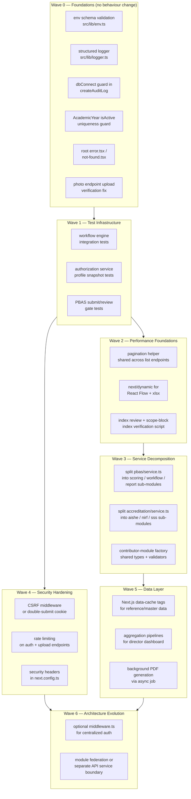

# 11 — Refactoring Strategy

> **Project:** UMIS (`operant-next`) · Next.js 16 App Router + MongoDB/Mongoose  
> **Audience:** Engineering leads, senior developers  
> **Approach:** Strangler-fig incremental refactoring — never big-bang, always ship-safe  
> **Cross-references:** [08_Backend_Architecture.md](08_Backend_Architecture.md), [10_Technical_Debt_Report.md](10_Technical_Debt_Report.md), [12_Development_Master_Plan.md](12_Development_Master_Plan.md), [19_Future_Architecture.md](19_Future_Architecture.md)

---

## Table of Contents

1. [Guiding Principle — Strangler Fig](#1-guiding-principle--strangler-fig)
2. [What to Refactor First vs What to Leave Unchanged](#2-what-to-refactor-first-vs-what-to-leave-unchanged)
3. [Breaking Changes](#3-breaking-changes)
4. [Migration Strategy](#4-migration-strategy)
5. [Risk Analysis](#5-risk-analysis)
6. [Rollback Plan](#6-rollback-plan)
7. [Refactoring Waves — Dependency Ordering](#7-refactoring-waves--dependency-ordering)
8. [Module-by-Module Refactoring Plan](#8-module-by-module-refactoring-plan)
   - 8.1 Auth / Authz
   - 8.2 The Six Criterion Modules (as a family)
   - 8.3 PBAS
   - 8.4 CAS
   - 8.5 AQAR (Faculty + Institutional Cycle)
   - 8.6 SSR
   - 8.7 Faculty Records & Profile
   - 8.8 Student Records & Profile
   - 8.9 Admin / Reference Masters / Master Data
   - 8.10 Reporting & Accreditation (NAAC Warehouse, AISHE, NIRF, SSS)
   - 8.11 Frontend Shells & Components

---

## 1. Guiding Principle — Strangler Fig

The codebase is a live, accreditation-critical system: any refactoring that requires a simultaneous rewrite of multiple layers is unacceptable. The strangler-fig pattern dictates:

1. **Build the new code alongside the old.** New implementations replace old behaviour one seam at a time; old code paths remain reachable until the new one is validated.
2. **Never break the contract.** API response envelopes (`{ message, entity }`), cookie names, Mongoose model collection names, and workflow stage values are contractual. Change them with migration headers or versioned endpoints, not in-place.
3. **Test before delete.** Write at minimum one integration test covering the old behaviour before deleting the old code path.
4. **Feature-flag risky changes.** Use `MasterData` category `feature-flags` or environment variables to gate changes that modify workflow or authorization behaviour.
5. **Commit atomically per concern.** Each PR changes exactly one seam: either a service split, or a new shared primitive, or a component decomposition — not all at once.

---

## 2. What to Refactor First vs What to Leave Unchanged

### Refactor First (high-value, lower-risk)

| Area | Why now |
|---|---|
| Env-schema validation (`src/lib/env.ts`) | Prevents silent failures; no runtime behaviour change; one file |
| Structured logger replacing `console.*` | Additive; old `console.*` calls become thin wrappers; no API impact |
| `createAuditLog` — add `dbConnect()` guard | One-line fix; eliminates a correctness risk with zero schema change |
| `AcademicYear.isActive` uniqueness guard | Service-level enforcement first, then a sparse unique index later |
| Root `error.tsx` / `not-found.tsx` | Purely additive App Router files |
| `next/dynamic` for React Flow & xlsx | Import-level change only; zero API or data impact |
| Pagination primitive for list endpoints | Add `?page&pageSize` with backward-compatible defaults returning full sets when omitted |
| Photo-endpoint upload verification | Add MIME/size re-fetch matching the finalize path in `src/app/api/faculty/photo/route.ts` and `src/app/api/student/photo/route.ts` |

### Leave Unchanged (until later waves)

| Area | Why wait |
|---|---|
| Mongoose model schemas / collection names | Renaming collections requires a coordinated data migration and zero-downtime cutover |
| Workflow engine state machine | Any state-value rename breaks existing `WorkflowInstance` records in the DB |
| Cookie name (`umis_session`) & JWT payload shape | Active sessions are invalidated if the name or `sub`/`role` claims change |
| Authorization scope-block field names | Changing `scopeDepartmentId` etc. requires rewriting every query that filters on them |
| Firebase Storage paths convention | Existing document `fileUrl` values in the DB would break |
| Report template `{{placeholder}}` syntax | Templates are stored in the DB; a syntax change requires a migration of all stored templates |

---

## 3. Breaking Changes

The following changes, if attempted naively, are **breaking**. Each needs the migration approach described.

| Change | Breaking Because | Safe Migration Approach |
|---|---|---|
| Rename `umis_session` cookie | All active sessions become invalid | Issue new cookie name, accept both names for one 7-day window, then remove old name |
| Change JWT payload structure (`sub` / `role` / `email` / `name`) | `getSessionPayload()` would fail on existing tokens | Add a new claim alongside the old; strip old claim after rollout |
| Move a Mongoose collection | Old documents disappear from queries | Keep both collection names, backfill, flip the model, verify, drop old collection |
| Change scope-block field names | All existing `buildAuthorizedScopeQuery` filters return empty sets | Add new fields alongside old in a backfill script, update queries to read new fields, drop old fields only after full rollout |
| Merge the six criterion module service files into a generic factory | The service function names and signatures change | Expose the old function names as re-exports from the new generic; remove re-exports after all callers are updated |
| Split `pbas/service.ts` into sub-modules | Named exports disappear or move | Use barrel `index.ts` re-exporting all old names from new submodules |
| Change the `WorkflowInstance.currentStatus` value set | Records in progress have an unknown status | Add a mapping layer in the engine for old → new values; backfill; flip |

---

## 4. Migration Strategy

### 4.1 Database changes

1. All schema changes go through a `scripts/*.cjs` or `scripts/*.mjs` idempotent backfill script.
2. The script must be idempotent (existence checks / `upsert`) and logged (`console.info` with counts).
3. Run the script against a staging DB snapshot before production.
4. No Mongoose schema enforces a new required field until the backfill is verified complete.
5. Track which scripts have run in a new `MigrationLog` collection (add a thin model and a `markMigrationRan` helper).

### 4.2 Code changes

1. New shared primitives (pagination helper, logger, env schema) land first and are independently merge-able.
2. Consumer migrations are separate PRs from the primitive itself.
3. Old code paths are not deleted until new paths have been in production for at least one week without error.

### 4.3 API contract changes

- New endpoints use versioned paths (e.g. `/api/v2/...`) or an `Accept-Version` header until the old client is confirmed migrated.
- Old endpoints return HTTP 301 or 410 only after the UI is confirmed using the new path.

---

## 5. Risk Analysis

| Risk | Likelihood | Impact | Mitigation |
|---|---|---|---|
| Workflow state mismatch after engine refactor | Medium | High — records stuck in unknown state | Freeze in-progress records during the engine change window; add unknown-state handler |
| Authorization regression: users gain/lose access unexpectedly | Medium | High — accreditation data exposure | Maintain a snapshot of test user profiles; compare `AuthorizationProfile` outputs before/after each authorization change |
| Session invalidation during cookie rename | Low | Medium — all users logged out simultaneously | Coordinate with ops to deploy during off-hours; use dual-cookie acceptance window |
| DB collection rename leaves orphan documents | Low | High — data loss visible to users | Run backfill script before flipping the model; keep old collection for 30 days |
| Service split breaks TypeScript imports across 213 route files | Medium | Low — compile-time only, caught by `npm run build` | Use barrel re-exports so existing import paths continue to resolve |
| Large-file decomposition introduces logic regressions in PBAS/CAS flows | Medium | High — financial/HR impact if scoring changes | Add targeted unit tests covering all formula paths in `pbas/service.ts` before decomposing |
| Test coverage is near zero | High | Medium — regressions invisible | Add workflow + authz integration tests as the prerequisite gate before any Wave 2+ work |

---

## 6. Rollback Plan

### Immediate rollback (< 1 hour)

Each refactoring PR that touches a service or route is deployed behind a feature flag in `MasterData`. Setting `{ category: "feature-flags", key: "<flag>", value: "false" }` re-enables the old code path without a redeploy.

### Full rollback (Git revert)

1. Identify the last known-good commit SHA before the breaking change.
2. `git revert <sha>..HEAD --no-commit && git commit -m "revert: <reason>"`.
3. DB backfill scripts must be reversible: each backfill script must have an `--undo` flag that removes any added fields/documents.
4. For collection renames: old collection is kept for 30 days. Re-pointing the Mongoose model registration back to the old name restores full functionality.

### Session continuity

If a cookie rename is reverted, the old cookie name still works. No session invalidation occurs because the revert re-adds acceptance of the old cookie name.

---

## 7. Refactoring Waves — Dependency Ordering

---

## 8. Module-by-Module Refactoring Plan

### 8.1 Auth / Authz

**Current Implementation**

Custom `jose` HS256 JWT session managed in `src/lib/auth/session.ts`. Cookie config in `src/lib/auth/config.ts`. Guards in `src/lib/auth/user.ts` (`getCurrentUser`, `requireAdmin`, `requireFaculty`, etc.). Authorization resolved lazily per request in `src/lib/authorization/service.ts` (`resolveAuthorizationProfile`). `compatibilityMode = true` hard-coded at line 63 of `src/lib/authorization/service.ts`.

**Problems**

- No CSRF tokens; `sameSite: "lax"` only.
- No rate limiting on login/reset/activation.
- `compatibilityMode` cannot be turned off without a code change.
- Bootstrap endpoint has a length-leaking comparison (`secretsMatch` checks `.length` before `timingSafeEqual`).
- No server-side session revocation list.
- Session token carries `role` — role changes do not propagate to existing tokens.

**Target Architecture**

- Add CSRF double-submit cookie pattern (stateless, no Redis required).
- `compatibilityMode` becomes a `MasterData` boolean flag, defaulting `true`; can be toggled by admin.
- Rate limiting via in-process `Map`-based token bucket or a lightweight middleware (`next-rate-limit` or custom `src/lib/rate-limit.ts`).
- Bootstrap comparison: remove length check, let `timingSafeEqual` handle length-mismatched inputs by padding.
- Session role is used only to gate the initial login redirect; actual access is always re-computed from the DB on each request (already the case — preserve this).

**Migration Strategy**

1. Add CSRF token as a separate httpOnly cookie set at login; validate it as a request header (`x-csrf-token`) in all state-mutating API routes using a shared `assertCsrfToken()` helper.
2. Introduce the rate-limit helper in `src/lib/rate-limit.ts`, add it to `/api/auth/login`, `/api/auth/admin-login`, `/api/auth/forgot-password`, `/api/auth/activate-faculty`, `/api/auth/activate-student`, and `/api/documents` (issue-upload).
3. Move `compatibilityMode` to `MasterData` lookup cached for 60s.
4. Fix bootstrap length oracle: `const maxLen = Math.max(a.length, b.length); const padA = Buffer.alloc(maxLen); const padB = Buffer.alloc(maxLen); a.copy(padA); b.copy(padB); return crypto.timingSafeEqual(padA, padB);`.

**Files Affected**

- `src/lib/auth/session.ts` (add CSRF cookie)
- `src/lib/auth/user.ts` (add `assertCsrfToken` helper)
- `src/lib/auth/config.ts` (CSRF cookie name constant)
- `src/lib/authorization/service.ts` (externalise `compatibilityMode`)
- `src/app/api/admin/bootstrap/route.ts` (fix length oracle)
- `src/app/api/auth/login/route.ts`, `admin-login/route.ts`, `director-login/route.ts`, `forgot-password/route.ts`, `activate-faculty/route.ts`, `activate-student/route.ts` (add rate-limit calls)
- New: `src/lib/rate-limit.ts`

**Dependencies**

Wave 0 complete. Tests for auth guard paths (Wave 1).

**Testing Requirements**

- Unit: `timingSafeEqual` bootstrap fix (no length leak).
- Integration: login lockout after N attempts; CSRF token rejection on POST without header.
- Regression: existing session flow (login → protected page → mutation) must continue to work.

**Estimated Complexity:** Medium  
**Priority:** P0 (security)

---

### 8.2 The Six Criterion Modules (as a family)

**Current Implementation**

Teaching-Learning, Research-Innovation, Infrastructure-Library, Governance-Leadership-IQAC, Institutional-Values-Best-Practices, Student-Support-Governance each have near-identical files:

- `src/lib/<module>/service.ts` (plan CRUD + assignment CRUD + submit + review)
- `src/lib/<module>/validators.ts` (plan schema + assignment schema)
- `src/app/api/admin/<module>/plans/route.ts` + `[id]/route.ts`
- `src/app/api/admin/<module>/assignments/route.ts` + `[id]/route.ts`
- `src/app/api/<module>/assignments/route.ts` + `[id]/contribution/route.ts` + `[id]/submit/route.ts` + `[id]/review/route.ts`
- `src/components/<module>-manager.tsx`, `<module>-review-board.tsx`, `<module>-contributor-workspace.tsx`

**Problems**

- Hundreds of duplicated lines; a bug fix (e.g. adding pagination) must be applied six times.
- No shared type definitions for the common `Plan` / `Assignment` shape, so type drift between modules is possible.
- Adding a new module requires copying all six file families and manually adapting.

**Target Architecture**

A `src/lib/contributor-module/` package providing:
- `createContributorModuleService<TPlan, TAssignment>(config)` factory that returns fully-typed `createPlan`, `updatePlan`, `createAssignment`, `updateAssignment`, `getAssignment`, `saveContribution`, `submitAssignment`, `reviewAssignment` functions.
- Shared Zod schemas for the common plan and assignment base shapes; each module extends them.
- Shared component factory (`ContributorWorkspace`, `ReviewBoard`, `ModuleManager`) parameterised by column definitions and domain-specific form sections.

**Migration Strategy**

1. Extract a `shared-types/contributor.ts` defining the `BasePlan` and `BaseAssignment` TypeScript interfaces. Do not change any service yet — just assert that existing service return types satisfy these interfaces.
2. Create `src/lib/contributor-module/factory.ts` implementing the factory for **one** module (Teaching-Learning) while keeping the existing `teaching-learning/service.ts` intact.
3. Validate that the factory-generated service passes all Teaching-Learning integration tests.
4. Migrate the remaining five modules one at a time, keeping old service files as re-export barrels for one release cycle.
5. Migrate the components last, once all six services are confirmed factory-generated.

**Files Affected**

- New: `src/lib/contributor-module/factory.ts`, `shared-types.ts`, `base-validators.ts`
- All six `lib/<module>/service.ts` (become thin wrappers, then deleted)
- All six `lib/<module>/validators.ts` (become thin extensions)
- All 48+ route files in `src/app/api/(admin|<module>)/`
- All 18 manager/review-board/workspace components

**Dependencies**

Wave 1 integration tests required before starting. Pagination primitive (Wave 2) should be included in the factory from day one.

**Testing Requirements**

- For each module: submit-gate test, review-gate test, scope-access test (reviewer cannot see out-of-scope assignment).
- Regression: existing admin plan → faculty contribution → review → approve flow for all six modules.

**Estimated Complexity:** High  
**Priority:** P2 (maintainability)

---

### 8.3 PBAS

**Current Implementation**

`src/lib/pbas/service.ts` is approximately 2,500 lines covering: form lifecycle, entry scoring, reference management, workflow transitions, admin settings, catalog, backfill, deadline reminders, and PDF report generation.

`src/app/api/pbas/` has 15+ route files spanning faculty, admin, and director concerns.

**Problems**

- Single 2,500-line file is untestable as a unit; changes to scoring logic risk breaking notification logic and vice versa.
- PDF generation is synchronous on the request thread (`/api/pbas/[id]/report`).
- Deadline reminder computation is triggered lazily on every `GET /api/notifications` call rather than on a schedule.

**Target Architecture**

Split into `src/lib/pbas/`:
- `lifecycle.ts` — form creation, submission, approval, status transitions
- `scoring.ts` — `claimedScore`, `approvedScore`, `apiScore` computation
- `entries.ts` — entry CRUD + reference management
- `catalog.ts` (already exists — keep)
- `report.ts` — PDF report assembly (delegates to `report-templates/pdf.ts`)
- `notifications.ts` — deadline reminder computation (extracted from current service + notifications service)
- `admin.ts` — admin settings (deadline, scoring weights)
- `index.ts` — barrel re-exporting all public APIs under old names

**Migration Strategy**

1. ~~Add unit tests covering all scoring paths in the existing monolith (prerequisite).~~ ✅ **Done (Phase 3)** — `src/lib/pbas/scoring.test.ts` covers all 30 indicator formula keys.
2. ~~Extract `scoring.ts` first (pure functions, no side effects, easiest to test in isolation).~~ ✅ **Done (Phase 3)** — `src/lib/pbas/scoring.ts` created; dead `computePbasApiScore` removed; `DEFAULT_PBAS_SCORING_WEIGHTS` and `roundScore` consolidated here.
3. Extract `catalog.ts` (already separate — verify it stays independent).
4. Extract `entries.ts`.
5. Extract `notifications.ts`.
6. Extract `report.ts` and convert report endpoint to use `waitUntil` (Next.js 15+) or a simple async queue for large reports.
7. Extract `lifecycle.ts` last (most complex; has cross-calls to scoring, notifications).
8. Create `index.ts` barrel that re-exports all names from old import paths.

**Phase 3 completion summary (2026-07-31)**

- Created `src/lib/pbas/scoring.ts` — extracted `DEFAULT_PBAS_SCORING_WEIGHTS`, `roundScore`, `buildRawIndicatorScores`, `loadPbasIndicatorCatalog`, `computePbasDynamicScorecard`, `PbasIndicatorCatalogEntry`, `PbasDynamicScorecard` from the monolith.
- Removed dead `computePbasApiScore` (was exported but never called at runtime; all scoring paths already used the dynamic pipeline).
- Updated `src/lib/pbas/admin.ts` to import `DEFAULT_PBAS_SCORING_WEIGHTS` from `scoring.ts`.
- Added 33 unit tests across 7 describe blocks in `src/lib/pbas/scoring.test.ts`; all pass.
- Updated `docs/PBAS_SELF_APPRAISAL_SYSTEM.md` with a Scoring Architecture section (§12).

**Files Affected**

- `src/lib/pbas/service.ts` (decomposed into 7 sub-modules)
- `src/app/api/pbas/[id]/report/route.ts` (async PDF)
- `src/app/api/pbas/[id]/submit/route.ts`, `review/route.ts`, `approve/route.ts`

**Dependencies**

Wave 1 PBAS scoring/gate tests required. Structured logger (Wave 0) for error visibility in notifications sub-module.

**Testing Requirements**

- Unit: scoring formula for each PBAS indicator category (A, B, C).
- Unit: `approvedScore ≤ claimedScore ≤ maxScore` guard.
- Integration: submit-gate (requires `totalScore > 0` and before deadline), multi-stage review, final approval locks form.

**Estimated Complexity:** High  
**Priority:** P2 (maintainability) / P1 for async PDF (performance)

---

### 8.4 CAS

**Current Implementation**

`src/lib/cas/service.ts` + `src/lib/cas/admin.ts` + `src/lib/cas/validators.ts`. Smaller than PBAS service but shares the same synchronous report pattern.

**Problems**

- Eligibility check queries three collections (PBAS, Faculty, CAS promotion rules) serially — opportunity for `Promise.all`.
- PDF generation is synchronous.
- Promotion rules are seeded once but never versioned; a rule change has no audit trail.

**Target Architecture**

- `eligibility.ts` — `checkCasEligibility()` with parallel queries.
- `lifecycle.ts` — application CRUD, submission, review, approval.
- `promotion-rules.ts` — rule CRUD + versioning (add `versionedAt` field to `CasPromotionRule`).
- `report.ts` — async PDF.
- `index.ts` barrel.

**Migration Strategy**

1. Extract `eligibility.ts` with parallelized queries (immediate performance win).
2. Add `versionedAt` + `versionNote` to `CasPromotionRule` model and backfill existing rules.
3. Extract remaining sub-modules following the PBAS pattern.

**Files Affected**

- `src/lib/cas/service.ts`, `admin.ts`, `validators.ts`
- `src/models/core/cas-promotion-rule.ts` (add versioning fields)
- `src/app/api/cas/[id]/workflow/route.ts` (async PDF)

**Dependencies**

PBAS decomposition complete (use as template).

**Testing Requirements**

- Unit: eligibility gate (min experience, min API score, mandatory docs).
- Integration: apply → submit → committee review → final approval → promotion-history write.

**Estimated Complexity:** Medium  
**Priority:** P2

---

### 8.5 AQAR (Faculty + Institutional Cycle)

**Current Implementation**

Two sub-systems sharing the AQAR acronym:

1. **Faculty AQAR**: `src/lib/aqar/service.ts` — relatively contained.
2. **AQAR Cycle** (`src/lib/aqar-cycle/`): `generateAqarCycleSnapshot()` queries 25+ collections to aggregate criterion sections. This is the highest single-function query count in the codebase.

**Problems**

- `generateAqarCycleSnapshot()` issues 20–25 serial collection queries with no aggregation pipeline — O(collections) round-trips.
- NAAC criteria mapping is re-fetched on every snapshot generation rather than cached.
- The `student-aqar-entry` sync on cycle generation is a silent N+1 (one upsert per active student).

**Target Architecture**

- Convert `generateAqarCycleSnapshot()` to use MongoDB `$facet` aggregation: one pipeline per criterion section, all executed in a single `aggregate()` call against the relevant collection.
- Cache `NaacCriteriaMapping` documents using Next.js `unstable_cache` or an in-memory LRU with a 5-minute TTL.
- Extract `student-aqar-entry` sync into a dedicated `syncStudentAqarEntries(cycleId)` function that can be called asynchronously post-snapshot.

**Migration Strategy**

1. Add snapshot generation timing metrics using the new structured logger.
2. Port criterion C1 to `$facet` first; validate output matches the current output.
3. Port C2–C7 progressively.
4. Add criteria-mapping cache.
5. Extract student-aqar-entry sync.

**Files Affected**

- `src/lib/aqar-cycle/service.ts` (snapshot generation)
- `src/lib/naac-criteria-mapping/service.ts` (add caching)
- `src/models/core/aqar-cycle.ts` (no schema change)

**Dependencies**

Structured logger (Wave 0). Aggregation pipeline pattern established in director dashboard refactoring (Wave 5).

**Testing Requirements**

- Integration: generate snapshot with known fixture data; verify criterion counts match expected values.
- Performance: snapshot generation time < 2s for typical institution size.

**Estimated Complexity:** Medium  
**Priority:** P1 (performance)

**Phase 5 completion summary (2026-07-31)**

Two improvements shipped under Phase 5:

**Part A — Import from Profile** (`src/lib/aqar/references.ts`, `src/lib/aqar/service.ts`,
`src/app/api/aqar/[id]/import-candidates/route.ts`):

- Created `src/lib/aqar/references.ts` with `loadAqarImportContext` (8 parallel workspace
  queries scoped to the academic year window), 8 field-transform functions, and
  `buildAqarImportPayload` — following the established PBAS references pattern.
- Added `getAqarImportCandidates(actor, id)` to the AQAR service — faculty-owner-only;
  reuses `getAqarApplicationById` for auth and `ensureFacultyContext` for ownership check.
- Added `GET /api/aqar/[id]/import-candidates` route exposing the payload to the client.
- Updated `docs/AQAR_SYSTEM.md §10` with full import feature documentation.

**Part B — Cycle Performance** (`src/lib/aqar-cycle/service.ts`,
`src/lib/naac-criteria-mapping/service.ts`):

- Added module-scope `_criteriaCache` to `listNaacCriteriaMappings` — eliminates redundant
  `countDocuments` seed checks and the repeated `find({})` on every snapshot call.
  Cache is invalidated on any write (create / update / delete).
- Removed duplicate `await ensureNaacCriteriaMappingsSeeded()` from `buildCriteriaSections`
  (it was already called inside `listNaacCriteriaMappings`).
- Replaced `Faculty.find().select("administrativeResponsibilities")` with a `$group`
  aggregate that returns the sum of array lengths directly — eliminates a full-collection scan.
- Replaced `FacultyTeachingLoad.find()` and `FacultyAdminRole.find()` with `countDocuments()`
  — eliminates two more full-collection scans.
- Merged 2 `User.countDocuments` into one `$facet` aggregate (saves 1 round-trip).
- Merged 3 `Organization.countDocuments` into one `$facet` aggregate (saves 2 round-trips).
- Merged 2 `Publication.countDocuments` into one `$facet` aggregate (saves 1 round-trip).
- Merged 2 `Project.countDocuments` into one `$facet` aggregate (saves 1 round-trip).
- Scoped `Semester.find({})` to `Semester.find({ academicYearId })` in
  `syncStudentAqarEntries` — eliminates historical semesters from the downstream `$in` query.
- Net: ~10 fewer DB round-trips per snapshot + 3 full-collection scans eliminated.

**Phase 4 completion summary (2026-07-31)**

Fixed five concrete correctness and documentation gaps in `src/lib/aqar/service.ts` and `src/models/core/aqar-application.ts`:

- Added duplicate-prevention guard in `createAqarApplication` — rejects a second application for the same faculty + academic year with HTTP 409.
- Removed spurious `pushStatusLog` call from `updateAqarApplication` — status logs now record only actual transitions, not autosaves.
- Added explicit status guard in `approveAqarApplication` before the authorization check — produces a clear 409 message when the application is not in "Committee Review" status.
- Changed `(facultyId, academicYear)` compound index to `unique: true` in `AqarApplicationSchema` — enforces the duplicate constraint at the DB layer.
- Added one-line JSDoc to all 11 exported service functions.
- Created `docs/AQAR_SYSTEM.md` — full system reference document covering the data model, status workflow, API surface, `facultyContribution` structure, metrics computation, role permissions, and compliance checklist.

Architectural note: 8 of the 12 `facultyContribution` sub-arrays duplicate data from dedicated faculty module models. This is documented in `docs/AQAR_SYSTEM.md §8.1` and deferred to Phase 5 pending a design decision on whether to keep separate entry, add an import-from-profile helper, or switch to FK references.

---

### 8.6 SSR

**Current Implementation**

`src/lib/ssr/` + `src/app/api/ssr/**` + `src/app/api/admin/ssr/**`. Hierarchical `SsrCycle → SsrCriterion → SsrMetric → SsrMetricResponse` with an assignment pattern.

**Problems**

- SSR metric response list endpoints return all responses for a cycle without pagination — a large institution with many metrics and faculty responses could return thousands of documents.
- No caching of the `SsrMetricDefinition` catalog.

**Target Architecture**

- Add cursor-based or offset pagination to `GET /api/ssr/**` list endpoints.
- Add `unstable_cache` for metric definitions with a `ssr-catalog` cache tag; revalidate on admin edit.

**Migration Strategy**

Same pagination primitive as all other list endpoints (Wave 2). Cache layer added in Wave 5.

**Files Affected**

- `src/lib/ssr/service.ts`
- `src/app/api/ssr/**` and `src/app/api/admin/ssr/**` list routes
- `src/components/ssr-manager.tsx`, `ssr-review-board.tsx`

**Dependencies**

Pagination helper (Wave 2).

**Testing Requirements**

- Integration: SSR assignment lifecycle (Draft → Submitted → Under Review → Approved).
- Unit: pagination helper returns correct slices.

**Estimated Complexity:** Low–Medium  
**Priority:** P2

---

### 8.7 Faculty Records & Profile

**Current Implementation**

`src/lib/faculty/service.ts` + `src/lib/faculty/migration.ts` + 22 `src/models/faculty/*` models. `saveFacultyWorkspace()` does a full-replace per sub-collection. `src/components/faculty-workspace-form.tsx` is the largest component (multiple `useFieldArray`, XLSX export, per-row uploads, auto-save).

**Problems**

- Full-replace on sub-collections (`publications`, `patents`, etc.) is not atomic and has no transaction — a partial failure leaves the record in an inconsistent state.
- `faculty-workspace-form.tsx` has too many responsibilities: form state, file uploads, XLSX export, API calls, and presentation.
- The `migration.ts` module (backfill utility) ships in the production bundle.

**Target Architecture**

- Wrap sub-collection replacements in Mongoose sessions (`startSession()` + `withTransaction()`). Note: requires a MongoDB replica set or Atlas deployment.
- Split `faculty-workspace-form.tsx` into a coordinator component + section-specific sub-components (`PublicationsSection`, `PatentsSection`, `TeachingLoadSection`, etc.).
- Move `migration.ts` to `scripts/` — it is a one-off backfill, not a runtime service.

**Migration Strategy**

1. Move `migration.ts` to `scripts/faculty-backfill.mjs` (non-breaking, additive).
2. Extract `PublicationsSection` from `faculty-workspace-form.tsx` as the first sub-component; validate UX is unchanged.
3. Progressively extract remaining sections.
4. Add Mongoose session wrapper to `saveFacultyWorkspace` only after verifying the deployment environment supports transactions.

**Files Affected**

- `src/lib/faculty/service.ts` (transaction wrapper)
- `src/lib/faculty/migration.ts` (move to `scripts/`)
- `src/components/faculty-workspace-form.tsx` (split into ~10 section components)

**Dependencies**

Wave 1 integration tests for workspace save flow.

**Testing Requirements**

- Integration: save faculty workspace → verify all sub-collections contain expected records.
- Unit: section components render correctly with known fixture data.

**Estimated Complexity:** Medium  
**Priority:** P2

---

### 8.8 Student Records & Profile

**Current Implementation**

`src/lib/student/service.ts` + `src/lib/student/records-service.ts` + 19 `src/models/student/*` models. Reference-master FK validation is inline in `records-service.ts`. Resume PDF route returns 410.

**Problems**

- Retired resume PDF route (`/api/student/resume`) still has a handler returning 410 — remove the file entirely and add a note to routing that it is gone.
- Reference-master FK validation is duplicated between `records-service.ts` and `admin/reference-masters.ts`.
- No pagination on student record list endpoints consumed by the director roster.

**Target Architecture**

- Extract shared `validateReferenceEntityExists(kind, id)` helper in `src/lib/admin/reference-masters.ts` and import it from `records-service.ts`.
- Delete the 410 route handler; update API documentation.
- Add pagination to `getStudentRecords` queries.

**Migration Strategy**

1. Delete `src/app/api/student/resume/route.ts` (safe — already 410).
2. Extract reference validation helper.
3. Add pagination query params.

**Files Affected**

- `src/lib/student/records-service.ts`
- `src/lib/admin/reference-masters.ts` (extract helper)
- `src/app/api/student/resume/route.ts` (delete)

**Dependencies**

Pagination helper (Wave 2).

**Testing Requirements**

- Unit: reference entity validation rejects nonexistent IDs.
- Integration: student record CRUD + director roster pagination.

**Estimated Complexity:** Low  
**Priority:** P2

---

### 8.9 Admin / Reference Masters / Master Data

**Current Implementation**

`src/lib/admin/` contains: `academics.ts`, `hierarchy.ts`, `master-data.ts`, `reference-masters.ts`, `users.ts`, `system.ts`, `dashboard.ts`. `src/lib/hierarchy/canonical.ts` resolves org scope. `src/lib/admin/reference-masters.ts` covers six entity kinds (Award, Skill, Sport, CulturalActivity, SocialProgram, Event) in a single file via a `kind` discriminator.

**Problems**

- `admin/users.ts` handles both faculty provisioning and student provisioning — two very different schemas and rules in one file.
- The hierarchy rename operation in `hierarchy.ts` re-projects scope labels onto every record in every collection — this is a full-table scan across dozens of collections and runs synchronously on the request thread.
- `reference-masters.ts` is correctly structured; the main improvement is adding caching for read-heavy lookups (used in every contribution form).

**Target Architecture**

- Split `admin/users.ts` into `admin/faculty-provisioning.ts` and `admin/student-provisioning.ts`.
- Make hierarchy renames async: queue the re-projection as a background job (or offload to a `scripts/` utility that operators run post-rename).
- Add `unstable_cache` with tag `reference-masters` to all `getReferenceEntities` calls; tag-invalidate on any write.

**Migration Strategy**

1. Add caching to reference-master reads (Wave 5 — additive, no behaviour change).
2. Split users.ts file — use barrel re-exports during transition.
3. Async hierarchy rename: add a `renamePending` flag to `Organization`, respond 202 Accepted, process in background.

**Files Affected**

- `src/lib/admin/users.ts` (split)
- `src/lib/admin/hierarchy.ts` (async rename)
- `src/lib/admin/reference-masters.ts` (add caching)
- `src/app/api/admin/hierarchy/[id]/route.ts` (202 for renames)

**Dependencies**

Structured logger (Wave 0). Cache infrastructure (Wave 5).

**Testing Requirements**

- Integration: bulk-provision 50 faculty users, verify 207 partial-success response on one invalid row.
- Integration: hierarchy rename propagates scope labels to downstream assignment records.

**Estimated Complexity:** Medium  
**Priority:** P2

---

### 8.10 Reporting & Accreditation (NAAC Warehouse, AISHE, NIRF, SSS)

**Current Implementation**

`src/lib/accreditation/service.ts` is a large file covering AISHE, NIRF, SSS, and compliance — four distinct reporting domains. `src/lib/naac-metric-warehouse/service.ts` (`generateNaacMetricValues()`) issues 20+ queries across collections. PDF report generation for AQAR cycle and NAAC metrics is synchronous.

**Problems**

- `accreditation/service.ts` is a domain grab-bag; AISHE, NIRF, SSS, and compliance should not share a file.
- `generateNaacMetricValues()` has the same multi-collection fan-out problem as AQAR snapshot generation.
- Synchronous report generation for large AISHE/NIRF submissions blocks the request thread.

**Target Architecture**

- Split into `src/lib/reporting/aishe.ts`, `src/lib/reporting/nirf.ts`, `src/lib/reporting/sss.ts`, `src/lib/reporting/compliance.ts`, with a shared `src/lib/reporting/index.ts` barrel.
- Convert `generateNaacMetricValues()` to `Promise.all` for independent metric queries.
- Report generation endpoints return 202 Accepted + a job ID; client polls `GET /api/admin/reports/[jobId]/status`. Use an in-memory job map initially; replace with a DB-backed job later.

**Migration Strategy**

1. Split accreditation/service.ts into four sub-modules with barrel re-exports.
2. Add `Promise.all` to NAAC metric generation.
3. Add async report generation (the most invasive change — do last).

**Files Affected**

- `src/lib/accreditation/service.ts` (split into 4 files)
- `src/lib/naac-metric-warehouse/service.ts` (parallel metric queries)
- `src/app/api/admin/aqar/cycles/[id]/report/route.ts`, `src/app/api/admin/naac-metric-warehouse/...` (async generation)

**Dependencies**

Structured logger (Wave 0). Background job infrastructure (Wave 5).

**Testing Requirements**

- Unit: NIRF metric computation with fixture data.
- Integration: AISHE survey cycle CRUD and submission log.
- Integration: NAAC metric generation produces expected values from fixture collections.

**Estimated Complexity:** Medium–High  
**Priority:** P2

---

### 8.11 Frontend Shells & Components

**Current Implementation**

- `src/components/admin-shell.tsx` — 25 nav items, notification centre, logout.
- `src/components/director-shell.tsx` — 19 nav items.
- `src/components/student-shell.tsx` — responsive 5-item nav.
- Faculty layout inlines nav as a server-rendered header (no shell component file).
- 77 of 85 components are `"use client"`.
- `@xyflow/react` and `xlsx` are statically imported in their respective files.

**Problems**

- `@xyflow/react` ships in the initial admin bundle even for pages that never render the hierarchy graph. Bundle impact: ~400 KB gzipped.
- `xlsx` ships in client bundles for admin and faculty even for pages that don't use bulk import/export.
- Two form paradigms (`react-hook-form` vs plain `useState`) coexist in the same route groups without a documented rule, creating inconsistency for new developers.

**Target Architecture**

- `next/dynamic(() => import("@/components/hierarchy-manager"), { ssr: false })` in the `/admin/hierarchy` page — eliminates React Flow from all other admin page bundles.
- `next/dynamic(() => import("xlsx"), { ssr: false })` wrapped in a client-side hook (`useXlsx`) called only from the bulk-provision and faculty-workspace-export components.
- Document the form paradigm rule: `react-hook-form` for user-facing validated forms; plain `useState` for admin CRUD forms that are not user-facing and have no complex validation needs.

**Migration Strategy**

1. Wrap `hierarchy-manager.tsx` in `next/dynamic` in the admin/hierarchy page (one-line change, immediate bundle win).
2. Create `src/lib/hooks/use-xlsx.ts` that lazily imports `xlsx` and exposes the two used APIs (`read`, `writeFile`); update the five import sites.
3. Add a `CONTRIBUTING.md` section (or a comment in `src/components/README.md`) documenting the form paradigm rule.

**Files Affected**

- `src/app/(admin-protected)/admin/hierarchy/page.tsx` (dynamic import)
- `src/components/hierarchy-manager.tsx` (remove direct `@xyflow/react` static import — handled by wrapper)
- `src/lib/hooks/use-xlsx.ts` (new)
- 5 components that import `xlsx` directly: `faculty-workspace-form.tsx`, admin bulk-provisioning managers

**Dependencies**

None — can be done in Wave 0 / Wave 2 (no logic change).

**Testing Requirements**

- Visual: hierarchy graph still renders after dynamic import.
- Functional: bulk faculty provisioning XLSX parse still works after lazy-loaded hook.

**Estimated Complexity:** Low  
**Priority:** P1 (performance — immediate bundle impact)
