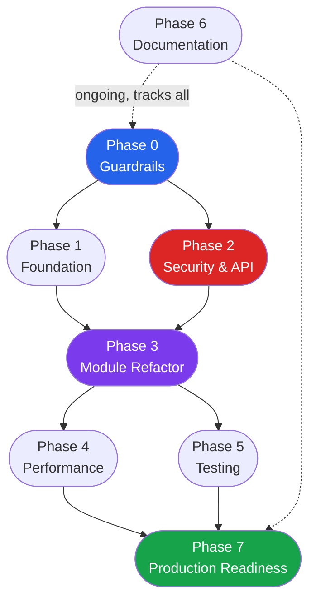
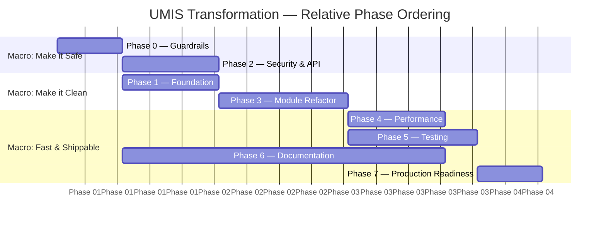

# 12 — Development Master Plan

**UMIS (operant-next) — Phased Blueprint for Enterprise Transformation**

> **Status:** Living document — update phase status, completed tasks, and actual lessons as work lands.
> **Timelines:** All phase ordering is *relative and sequential*, not fixed calendar commitments. For a calendar-pinned view with sprint allocations see [13_Feature_Roadmap.md](13_Feature_Roadmap.md).
> **Scope:** This document is the single executive-level blueprint. It does not replace the detail documents it links — it synthesises them into a coherent delivery order. When code and a document disagree, the code is the source of truth.

---

## Table of Contents

1. [Purpose & Guiding Principle](#1-purpose--guiding-principle)
2. [Phase-Dependency Overview](#2-phase-dependency-overview)
3. [Gantt: Relative Phase Ordering](#3-gantt-relative-phase-ordering)
4. [Phase 0 — Guardrails](#4-phase-0--guardrails)
5. [Phase 1 — Foundation](#5-phase-1--foundation)
6. [Phase 2 — Security, Auth/Authz & API Cleanup](#6-phase-2--security-authauthz--api-cleanup)
7. [Phase 3 — Module Refactoring](#7-phase-3--module-refactoring)
8. [Phase 4 — Performance](#8-phase-4--performance)
9. [Phase 5 — Testing](#9-phase-5--testing)
10. [Phase 6 — Documentation](#10-phase-6--documentation)
11. [Phase 7 — Production Readiness](#11-phase-7--production-readiness)
12. [Cross-Cutting Principles](#12-cross-cutting-principles)
13. [Debt-Priority Mapping](#13-debt-priority-mapping)
14. [Decision Log](#14-decision-log)

---

## 1. Purpose & Guiding Principle

UMIS has grown organically from a data-collection tool into a 188-model, 213-route, multi-portal accreditation platform. It already contains strong foundations: a single generic workflow engine, governance-driven RBAC, consistent layer conventions, and typed end-to-end schemas. The goal of this plan is to **incrementally evolve that solid core into an enterprise-grade product — without a big-bang rewrite**.

Every phase is:

- **Independently deployable** — the application runs and is usable after each phase.
- **Value-adding** — each phase reduces concrete risk or delivers a measurable improvement to reliability, security, or performance.
- **Non-regressing** — a phase's acceptance criteria include "all previously passing tests still pass and no existing functionality is broken."

The transformation progresses through three broad macro-stages:

| Macro-stage | Phases | Theme |
|---|---|---|
| **Make it safe** | 0, 2 | Reliability guardrails first; then close security gaps |
| **Make it clean** | 1, 3 | Restructure and deduplicate so new work costs less |
| **Make it fast & shippable** | 4, 5, 6, 7 | Performance, test coverage, docs, production ops |

---

## 2. Phase-Dependency Overview

**Reading the diagram:**
- A solid arrow means "must be substantially complete before the next phase starts."
- Phase 2 (Security) can run in parallel with Phase 1 (Foundation) once Phase 0 is done, since they target different files. In practice, small teams should sequence them.
- Phase 6 (Documentation) is an ongoing activity that tracks every other phase and finalises in Phase 7.

---

## 3. Gantt: Relative Phase Ordering

The bars represent *relative duration and ordering*, not calendar dates. See [13_Feature_Roadmap.md](13_Feature_Roadmap.md) for calendar-pinned milestones.

> Note: Phase 1 and Phase 2 partially overlap — Foundation touches folder structure; Security touches routes and middleware. Co-ordinate to avoid merge conflicts on shared files.

---

## 4. Phase 0 — Guardrails

### Overview

Phase 0 installs the safety net that every subsequent phase relies on. Nothing about the system's functionality changes; what changes is the team's ability to detect and recover from failures before they affect users.

### Goals

1. Any configuration error fails loudly at startup, not silently at runtime.
2. Every server-side error is structured, searchable, and traceable to a request.
3. Every page renders a graceful error UI instead of a blank screen on failure.
4. A CI pipeline runs on every pull request before merge.
5. All future code written in this codebase follows a single, documented standard (see [18_Coding_Standards.md](18_Coding_Standards.md)).

### Tasks

| # | Task | Detail |
|---|---|---|
| P0-T1 | **Env-schema validation** | Create `src/lib/config/env.ts` using Zod (or `t3-env`). Enumerate all variables from `documentation.md §19`. Call the validator at the top of `src/lib/db/connect.ts` so a missing `MONGODB_URI` crashes at boot with a clear message, not mid-request. |
| P0-T2 | **Structured logger** | Replace all `console.log/warn/error` callsites with a thin logger wrapper (`src/lib/logger.ts`) that emits JSON-structured records with `level`, `msg`, `requestId`, `userId`, and `timestamp`. Use `pino` or a lightweight shim. The wrapper exposes the same surface as `console` so callsites are mechanical find-and-replace. |
| P0-T3 | **Error-tracking integration** | Wire Sentry (or equivalent) to capture unhandled server exceptions. Add `sentry.server.config.ts`, `sentry.client.config.ts`, and the `instrumentation.ts` entry point. Ensure PII (passwords, tokens) is scrubbed from event payloads. |
| P0-T4 | **Root `error.tsx` and `not-found.tsx`** | Add `src/app/error.tsx` (client error boundary), `src/app/not-found.tsx` (404 page), and per-portal-group `error.tsx` files for `(admin-protected)`, `(director-protected)`, `(faculty-protected)`, and `(student-protected)`. Each renders a branded, actionable recovery UI. Currently only `faculty/profile/error.tsx` exists. |
| P0-T5 | **CI pipeline bootstrap** | Add `.github/workflows/ci.yml` (or the equivalent for the team's CI system). Pipeline steps: `npm ci`, `npm run lint`, `npm run type-check`, `npm test`. The pipeline must pass on `main` before any other phase merges. |
| P0-T6 | **Adopt Coding Standards** | All PRs from this point forward are reviewed against [18_Coding_Standards.md](18_Coding_Standards.md). Add a `CONTRIBUTING.md` referencing it, and add a linting rule or PR-template checklist item. |
| P0-T7 | **Fix the hard-coded path in `ts-alias-loader.mjs`** | The file contains `/Users/rc/Projects/operant-next/src` which breaks on every other machine. Replace with `path.resolve(process.cwd(), 'src')`. |

### Dependencies

None. Phase 0 is the unconditional entry point for all subsequent work.

### Risks

| Risk | Likelihood | Mitigation |
|---|---|---|
| Sentry SDK size increases client bundle | Low | Configure `sentry/nextjs` to tree-shake and use edge-compatible replay only for admin portal |
| Env-validation breaks `npm run dev` for developers with partial `.env.local` | Medium | Document all required vs optional variables clearly; provide `.env.example` with safe placeholder values |
| CI pipeline flakiness blocks velocity | Low | Start with a simple 4-step pipeline; add parallelism once stable |

### Deliverables

- `src/lib/config/env.ts` — Zod env schema
- `src/lib/logger.ts` — structured logger wrapper
- `src/app/error.tsx`, `src/app/not-found.tsx`, per-group `error.tsx` files
- `sentry.server.config.ts`, `sentry.client.config.ts`, `instrumentation.ts`
- `.github/workflows/ci.yml`
- `.env.example`
- `CONTRIBUTING.md`
- `ts-alias-loader.mjs` path fix

### Acceptance Criteria

- [ ] Starting the dev server with a missing `MONGODB_URI` prints an actionable error message and exits within 2 seconds.
- [ ] Throwing an unhandled error in any route handler records a structured JSON log entry with `level: "error"`, `requestId`, and a Sentry event ID.
- [ ] Navigating to an unmapped route renders the custom `not-found.tsx` page with a link back to the home page.
- [ ] A deliberate server error in a page renders the custom `error.tsx` page with a retry button.
- [ ] The CI pipeline runs `lint + type-check + test` on every PR and blocks merges if any step fails.
- [ ] `ts-alias-loader.mjs` runs without modification on a fresh Windows and macOS clone.

---

## 5. Phase 1 — Foundation

### Overview

Phase 1 reorganises the source tree toward a feature-based/domain-driven structure and extracts shared primitives. It does not change behaviour — it creates the clean foundation on which all later refactoring and feature work is done more safely. Refer to [11_Refactoring_Strategy.md](11_Refactoring_Strategy.md) Wave 0 and Wave 1 for the detailed module-by-module plan.

### Goals

1. The top-level `src/lib/` directory is organised by feature/domain rather than one flat list of service files.
2. Shared primitive utilities (date handling, pagination, ID generation, response helpers) live in one place, not scattered across services.
3. A nascent shared UI/design-system package exists so components are composed, not duplicated.

### Tasks

| # | Task | Detail |
|---|---|---|
| P1-T1 | **Feature-based `lib/` restructuring** | Reorganise `src/lib/` from the current flat arrangement into domain sub-directories matching the bounded contexts identified in [03_Business_Domain.md](03_Business_Domain.md): `lib/auth/`, `lib/workflow/`, `lib/accreditation/`, `lib/pbas/`, `lib/faculty/`, `lib/student/`, `lib/admin/`, `lib/reporting/`, `lib/notifications/`, `lib/upload/`. Move files; update all `@/lib/...` imports. No logic changes in this step. |
| P1-T2 | **Shared utility primitives** | Create `src/lib/shared/`: `pagination.ts` (cursor/offset models, `parsePaginationParams`), `query.ts` (`buildScopeFilter`, `buildDateRangeFilter`), `response.ts` (promotion of `createApiErrorResponse` and envelope helpers to a single import), `dates.ts` (academic-year helpers). All existing usages are migrated to import from here. |
| P1-T3 | **Extract common model mixins** | The scope block (`institutionId`, `departmentId`, `academicYearId`) and the status-log block appear in dozens of models. Extract typed Mongoose sub-schemas in `src/models/shared/scope.ts` and `src/models/shared/workflow-status.ts`. Existing models adopt them via `...scopeBlock` spread. |
| P1-T4 | **Shared UI component catalogue** | Audit the 85 components. Identify components duplicated across portals (data tables, form-field wrappers, status badges, timeline/audit-log displays). Consolidate them under `src/components/shared/`. Document them in [07_Frontend_Architecture.md](07_Frontend_Architecture.md). |
| P1-T5 | **Resolve the two-form-paradigm split** | Decide once: React Hook Form (`rhf`) is the standard for all complex multi-field forms; plain `useState` is reserved for single-input quick-edits. Document the rule in [18_Coding_Standards.md](18_Coding_Standards.md). Migrate the ~5 largest `useState`-driven forms to RHF incrementally in this phase. |
| P1-T6 | **Remove stale artifacts** | Delete `legacy_models.txt`, `new_models.txt`, and any other files that describe a schema not implemented in the codebase. Archive them in git history via a commit message documenting why. |

### Dependencies

- Phase 0 must be complete (CI pipeline must run to catch import-path breakage).

### Risks

| Risk | Likelihood | Mitigation |
|---|---|---|
| Import-path migration breaks at runtime but passes TypeScript | Medium | CI lint/type-check catches most; add a smoke-test page per portal in Phase 5 |
| Scope-block mixin introduces subtle Mongoose schema differences | Medium | Keep the existing per-model definitions as the canonical reference; adopt the mixin only when a model is touched for another reason (opportunistic, not forced) |
| RHF migration introduces form-behaviour regressions | Medium | Migrate one form per PR; include before/after screenshots in PR description |

### Deliverables

- Reorganised `src/lib/` with domain sub-directories
- `src/lib/shared/` with pagination, query, response, and date utilities
- `src/models/shared/scope.ts` and `src/models/shared/workflow-status.ts`
- Consolidated `src/components/shared/` catalogue
- Updated [18_Coding_Standards.md](18_Coding_Standards.md) form-paradigm rule
- Deletion of stale artifact files

### Acceptance Criteria

- [ ] `npm run build` and `npm run lint` pass after every sub-task.
- [ ] No `../../../` relative import traverses more than two levels (enforced by an ESLint rule configured in this phase).
- [ ] `src/lib/shared/pagination.ts` exports `parsePaginationParams` and is used by at least one existing list endpoint.
- [ ] The stale `legacy_models.txt` and `new_models.txt` files are gone from `main`.

---

## 6. Phase 2 — Security, Auth/Authz & API Cleanup

### Overview

Phase 2 closes the security gaps identified in [16_Security_Audit.md](16_Security_Audit.md) and in `documentation.md §20`. It also introduces the API-level primitives (pagination, consistent guards, validation hardening) that prevent a class of data-integrity bugs and that Phase 3's refactoring depends on. Cross-reference [06_API_Documentation.md](06_API_Documentation.md) for the current API surface.

### Goals

1. All state-mutating API routes are protected against CSRF.
2. Auth-related endpoints are rate-limited and account-lockout enforced.
3. The session can be actively revoked without waiting for JWT expiry.
4. Photo-upload endpoints perform the same MIME/size/checksum verification as the finalize path.
5. Firebase Storage Rules are explicitly documented and audited.
6. All API list endpoints support pagination.
7. Validation schemas are applied consistently at the route boundary.

### Tasks

| # | Task | Detail |
|---|---|---|
| P2-T1 | **CSRF protection** | Implement the double-submit-cookie or signed-token pattern. The simplest correct approach for this stack: generate a `csrf_token` cookie alongside the session cookie; every `POST/PATCH/DELETE` handler calls a new `assertCsrf(request)` guard that validates the `X-CSRF-Token` header against the cookie. Exempt GET and the two public auth POST endpoints (`/api/auth/login`, `/api/auth/setup`) from the check. Severity: **High** (see `documentation.md §20`). |
| P2-T2 | **Rate limiting on auth & sensitive endpoints** | Add an in-process rate-limiter (e.g., `lru-cache`-backed sliding window) or an edge middleware solution. Apply limits to: `POST /api/auth/login` (5/min per IP), `POST /api/auth/forgot-password` and `activate` (3/min per IP), `POST /api/.../upload-intent` (10/min per user), `POST /api/admin/invite` (20/hour per admin). Lockout the account for 15 minutes after 10 consecutive failed logins. |
| P2-T3 | **Session revocation list** | Add a `RevokedSession` Mongoose model (`{ jti: string (unique), expiresAt: Date (TTL index), userId, revokedAt }`). Add `jti` to the JWT payload. `getCurrentUser()` checks the revocation list on every request. Expose `POST /api/auth/logout` that inserts the `jti`. Admin "suspend user" also inserts `jti` for all live sessions. |
| P2-T4 | **Photo-upload endpoint hardening** | Refactor `POST /api/faculty/photo` and `POST /api/student/photo` to follow the same intent/finalize pattern as the general upload service, or at minimum apply the same `verifyUploadedFile()` checks (re-fetch URL, host/bucket validation, MIME sniff, size limit, SHA-256 checksum comparison). See `documentation.md §20` Medium severity finding. |
| P2-T5 | **Firebase Storage Rules audit** | Document the current Firebase Storage Rules in `docs/16_Security_Audit.md`. Confirm they enforce: (a) authenticated writes only to paths the current user owns (`/uploads/{userId}/...`), (b) read scoped to the authenticated user or an admin token, (c) MIME and size checks at the Storage level. Commit the `storage.rules` file to the repo. |
| P2-T6 | **Security headers** | Add `next.config.ts` HTTP-header configuration for CSP (report-only initially), HSTS (if behind HTTPS), `X-Frame-Options: DENY`, `Referrer-Policy: strict-origin-when-cross-origin`, `Permissions-Policy`. |
| P2-T7 | **Deprecate/guard legacy `headUserId` auth** | Add an admin toggle (`Organization.legacyHeadUserIdEnabled: boolean`, default `false` for new installs). The compatibility mode activates only when the toggle is on, and the admin UI exposes it with a deprecation warning. Document a migration path in [16_Security_Audit.md](16_Security_Audit.md). |
| P2-T8 | **Fix bootstrap-secret length oracle** | Remove the `secretsMatch` length comparison that occurs before `timingSafeEqual`. The length check leaks the secret's length. Simply call `timingSafeEqual` after padding both buffers to the same length. |
| P2-T9 | **Pagination primitives on list endpoints** | Using the `parsePaginationParams` utility from Phase 1, retrofit pagination to the highest-traffic list endpoints first: admin users list, faculty records, student records, AQAR cycle list, PBAS records. Apply `{ page, limit, sort }` query params; return `{ data, pagination: { page, limit, total, pages } }` envelopes. Full list in [06_API_Documentation.md](06_API_Documentation.md). |
| P2-T10 | **Consistent API guards** | Audit all 213 `route.ts` handlers. Every state-mutating handler must call an explicit guard (`assertAdminApiAccess`, `assertFacultyApiAccess`, etc.) before any business logic. Add a lint rule or a custom ESLint plugin that warns on exported `POST/PATCH/DELETE/PUT` functions that do not call an `assert*Access` or `getCurrentUser` within the first 5 lines. |
| P2-T11 | **AcademicYear uniqueness constraint** | Add a partial unique index: `{ isActive: 1 }` filtered on `{ isActive: true }` so only one active year can exist. Update the service to use `findOneAndUpdate` with the `$set: { isActive: false }` on the previous before activating the new one. This is a **data-integrity P0** item from `documentation.md §27`. |

### Dependencies

- Phase 0 (CI pipeline must catch type errors from new guard helpers).
- Phase 1 (shared query utilities used by P2-T9).

### Risks

| Risk | Likelihood | Mitigation |
|---|---|---|
| CSRF tokens break third-party or native-app API consumers | Low | UMIS has no documented public API consumers; exempt only explicitly documented machine-to-machine endpoints |
| Rate limiter state is lost on server restart (in-process store) | Medium | Acceptable for a single-instance deploy; document that a Redis adapter is required for multi-instance |
| Session revocation list grows unboundedly | Low | The `expiresAt: Date` TTL index automatically purges expired tokens; monitor collection size post-deploy |
| Firebase Rules audit reveals gaps that break existing uploads | Medium | Stage the audit in a non-production Firebase project first |

### Deliverables

- `src/lib/auth/csrf.ts` — CSRF guard
- `src/lib/auth/rate-limit.ts` — rate-limiter middleware
- `src/models/core/revoked-session.ts` — revocation model
- Updated photo-upload route handlers
- `storage.rules` committed to repo
- Security headers in `next.config.ts`
- Admin UI toggle for `legacyHeadUserIdEnabled`
- `AcademicYear` partial unique index migration script
- Updated [16_Security_Audit.md](16_Security_Audit.md) with audit results and remediation notes

### Acceptance Criteria

- [ ] Posting to `POST /api/auth/login` without a CSRF token returns `403 Forbidden`.
- [ ] 6 consecutive failed login attempts from the same IP within 60 seconds returns `429 Too Many Requests` for the next 15 minutes.
- [ ] Calling `POST /api/auth/logout` and then making a request with the old session cookie returns `401 Unauthorized`.
- [ ] Uploading an HTML file to `POST /api/faculty/photo` returns `400 Bad Request` with a MIME-type error.
- [ ] `storage.rules` is committed; a Firebase Rules unit test (Firebase Emulator) covers the user-scoped write and cross-user read restriction.
- [ ] All list endpoints support `?page=2&limit=20` and return a `pagination` envelope.
- [ ] `npm run lint` detects and fails on a `POST` handler that does not call a guard function.
- [ ] Attempting to `INSERT` two `AcademicYear` documents with `isActive: true` fails with a MongoDB unique error.

---

## 7. Phase 3 — Module Refactoring

### Overview

Phase 3 is the largest structural investment in the plan. It targets the maintainability debt that is the biggest impediment to adding new features safely: the 6-way duplication of the criterion-module pattern, the monolith service files, and the missing repository abstraction. Detailed refactor waves and the module-by-module plan are in [11_Refactoring_Strategy.md](11_Refactoring_Strategy.md). The database-layer view is in [08_Backend_Architecture.md](08_Backend_Architecture.md).

### Goals

1. A single generic "contributor-module kernel" replaces the near-identical code across all 6 NAAC criterion modules (C1–C7).
2. A repository layer decouples business logic from Mongoose queries.
3. `pbas/service.ts` (~2500 lines) and `accreditation/service.ts` are decomposed into single-concern modules.
4. Audit writes are transaction-bound with the writes they record.
5. Dead and retired code is removed.

### Tasks

| # | Task | Detail |
|---|---|---|
| P3-T1 | **Identify the contributor-module kernel API** | Analyse the 6 criterion modules (Curriculum, Teaching-Learning, Research-Innovation, Infrastructure-Library, Student-Support-Governance, Governance-Leadership-IQAC). Extract the invariant operations: `createPlan`, `assignReviewers`, `submitContribution`, `reviewContribution`, `approveContribution`, `rejectContribution`, `escalateContribution`, `getPlan`, `getContributions`, `getModuleStatus`. These become a typed `ContributorModule<TConfig, TPlan, TRecord>` generic in `src/lib/shared/contributor-module/`. |
| P3-T2 | **Implement the generic kernel** | Build the kernel as a factory function: `createContributorModule(config)` that returns a service object with the standard operations. The `config` object carries the module-specific Mongoose models, workflow definition key, notification templates, and scope-resolution logic. The kernel delegates cross-cutting concerns (workflow, audit, notifications) to the existing engines — it adds no new infrastructure. |
| P3-T3 | **Migrate modules to the kernel one-by-one** | Migrate modules in order of ascending complexity: Teaching-Learning → Infrastructure-Library → Student-Support-Governance → Governance-Leadership-IQAC → Research-Innovation → Curriculum. Each migration is a separate PR. After each PR the feature must pass all existing manual smoke tests (add to CI in Phase 5). |
| P3-T4 | **Introduce a repository layer** | Create `src/lib/shared/repository/` with a `BaseRepository<TDoc>` class that wraps Mongoose CRUD, scope-filtering, and pagination. Per-entity repositories extend it (`FacultyRepository`, `StudentRepository`, etc.). Services call repositories — not Mongoose models directly. Start with the repositories most called by the large service files; do not force this pattern on every model in one phase. |
| P3-T5 | **Decompose `pbas/service.ts`** | Split the ~2500-line file along concern lines: `pbas/scoring.service.ts` (API-score calculation), `pbas/record.service.ts` (CRUD for appraisal records), `pbas/cycle.service.ts` (year-cycle management), `pbas/cas.service.ts` (CAS eligibility and promotion workflow), `pbas/export.service.ts` (PDF/XLSX generation). The public surface of the original file is preserved via a barrel re-export for backward compatibility during the transition. |
| P3-T6 | **Decompose `accreditation/service.ts`** | Extract: `accreditation/metric-warehouse.service.ts` (NAAC metric computation and storage), `accreditation/aqar-cycle.service.ts` (institutional AQAR snapshot), `accreditation/ssr.service.ts` (SSR compilation), `accreditation/nirf.service.ts`, `accreditation/aishe.service.ts`. Same barrel approach. |
| P3-T7 | **Transaction-bound audit writes** | Modify `createAuditLog` to accept an optional Mongoose `ClientSession`. Every service method that performs a state-changing write (submit, approve, reject) passes its session to `createAuditLog`. Add `dbConnect()` guard inside `createAuditLog` for the rare callsites that invoke it standalone. |
| P3-T8 | **Remove retired endpoints and dead client references** | Audit dead 410 endpoints (`/api/auth/register`, `/api/faculty/evidence`, student resume, director student-approvals). Remove the associated service logic and component code that points to them. Keep the route handler stub returning 410 for backward compatibility if any external bookmarks exist, but delete all internal client calls. |

### Dependencies

- Phase 1 complete (shared utilities and lib structure).
- Phase 2 substantially complete (API guards and pagination used by kernel's standard operations).

### Risks

| Risk | Likelihood | Mitigation |
|---|---|---|
| Kernel introduces subtle behavioural differences vs bespoke modules | High | Dual-run: keep the old module service alongside the kernel implementation for one sprint; compare outputs on staging with production-like data |
| Service decomposition breaks shared state (e.g., a scoring function that shares an in-memory cache between concerns) | Medium | Identify shared state before splitting; make it explicit as an injected dependency |
| Transaction-bound audits require MongoDB replica set (transactions need rs) | Medium | Document this infra requirement; the dev `docker-compose` must include a single-node replica set |
| Dead code removal breaks an undocumented admin workflow | Low | Keep 410 stubs; alert on 410 response rate in production monitoring for two weeks post-deploy |

### Deliverables

- `src/lib/shared/contributor-module/` — kernel factory and types
- 6 criterion-module services refactored to use the kernel
- `src/lib/shared/repository/` — `BaseRepository` and initial per-entity repositories
- Decomposed `pbas/` and `accreditation/` service files
- Updated `createAuditLog` with session parameter
- Deletion of dead client code; 410 stubs preserved
- Updated [11_Refactoring_Strategy.md](11_Refactoring_Strategy.md) with actual outcomes

### Acceptance Criteria

- [ ] All 6 criterion modules operate through the generic kernel; no criterion-module has its own copy of `submitContribution` / `reviewContribution` logic.
- [ ] `pbas/service.ts` and `accreditation/service.ts` no longer exist as single files; they are replaced by the decomposed service files plus their barrel re-exports.
- [ ] An end-to-end manual test of PBAS score calculation produces identical results before and after decomposition.
- [ ] `createAuditLog` calls within a service transaction write the audit record atomically (verified by aborting the transaction and checking no orphan audit record was created).
- [ ] `npm run build`, `npm run lint`, and `npm test` all pass.

---

## 8. Phase 4 — Performance

### Overview

Phase 4 addresses the performance issues documented in [17_Performance_Optimization.md](17_Performance_Optimization.md) and `documentation.md §21`. The most impactful changes are eliminating N+1 fan-out on dashboards, introducing a caching layer for reference/master data, and deferring heavy I/O (PDF generation) off the request thread.

### Goals

1. Director and admin dashboard pages load in under 2 seconds at 10,000 records per collection.
2. Reference/master-data endpoints do not hit MongoDB on every request.
3. Client bundles for admin pages do not include React Flow or xlsx unless those pages are actually visited.
4. Large PDF and metric-generation operations do not block the HTTP handler.

### Tasks

| # | Task | Detail |
|---|---|---|
| P4-T1 | **Aggregation pipelines for dashboard fan-out** | Rewrite the director dashboard query that currently loads 11 modules × (records + pending IDs). Replace with a single `$facet` aggregation pipeline per module group that returns counts, pending IDs, and last-updated timestamps in one round-trip. Similarly convert the AQAR-cycle snapshot (20–25 collection fan-out) and NAAC metric generation to aggregation pipelines. See [17_Performance_Optimization.md](17_Performance_Optimization.md) for query patterns. |
| P4-T2 | **Caching for reference/master data** | Identify the collections that change infrequently (AcademicYear, Department, Institution, master course catalogs, reference lookup tables). Wrap their service reads in Next.js `unstable_cache` (or React `cache`) with a tag-based invalidation strategy. Invalidate the relevant tags whenever an admin mutates those collections. |
| P4-T3 | **`next/dynamic` for heavy client libraries** | Wrap the React Flow hierarchy manager component and all 5 xlsx import components in `next/dynamic({ ssr: false })`. This removes these libraries from the initial JS payload for users who never visit the relevant admin pages. Measure bundle size before/after with `@next/bundle-analyzer`. |
| P4-T4 | **Async/queued PDF and metric generation** | Move large PDF generation (`reportGeneration/`, `ssr/`, cycle PDF) and NAAC metric computation to a background job. Options in order of increasing complexity: (a) Next.js Route Handler with `waitUntil` + `ReadableStream` for progress polling; (b) a simple Redis/BullMQ queue backed by a worker; (c) edge-triggered serverless function. Choose (a) for the initial implementation and document the upgrade path to (b). |
| P4-T5 | **Index audit** | Verify that all scope-block fields (`institutionId`, `departmentId`, `academicYearId`) and status fields are indexed in every collection that serves list endpoints. Add a `scripts/audit-indexes.mjs` script that connects to MongoDB and reports any collection missing an expected index. |
| P4-T6 | **Client-side fetch deduplication** | Where `router.refresh()` triggers a full subtree refetch after mutations, audit the most frequently mutated pages (PBAS record save, workflow state transition). Replace with targeted revalidation (`revalidatePath` / `revalidateTag`) to limit the refetch scope. |

### Dependencies

- Phase 3 complete (decomposed services enable targeted aggregation rewrites without tangled dependencies).
- Phase 1 (shared query primitives used to build aggregation helpers).

### Risks

| Risk | Likelihood | Mitigation |
|---|---|---|
| Aggregation pipelines introduce correctness bugs in metric generation | High | Dual-run old and new implementations on staging with production-like data; compare outputs before cutting over |
| `unstable_cache` invalidation is missed after an admin mutation | Medium | Centralise cache-tag constants in `src/lib/shared/cache-tags.ts`; write a lint rule that forbids direct model writes outside of service functions (ensuring invalidation calls go through the service layer) |
| Background PDF generation changes the UX contract (users previously received the PDF synchronously) | Medium | Add a progress indicator and a "ready for download" notification; document the change in release notes |

### Deliverables

- Aggregation-pipeline versions of director dashboard, AQAR snapshot, and metric generation queries
- `unstable_cache`-wrapped reference data services with tag invalidation
- `next/dynamic`-wrapped React Flow and xlsx components
- Background PDF/metric generation mechanism
- `scripts/audit-indexes.mjs`
- Bundle-size before/after report in PR description
- Updated [17_Performance_Optimization.md](17_Performance_Optimization.md) with measured improvements

### Acceptance Criteria

- [ ] Director dashboard page Time-to-First-Byte (TTFB) is below 800 ms against a 10,000-record test dataset (measured in Lighthouse or a custom load test).
- [ ] Admin pages that include React Flow or xlsx report a JS bundle at least 30% smaller than before (measured by `@next/bundle-analyzer`).
- [ ] A large-cycle PDF request returns a `202 Accepted` with a job ID; polling the job ID endpoint eventually returns the PDF URL.
- [ ] A `GET /api/admin/academic-years` response for an unchanged list is served from cache on the second request (confirmed by Mongo query profiler showing zero queries on cache hit).
- [ ] The index audit script reports zero missing indexes for the production database.

---

## 9. Phase 5 — Testing

### Overview

Phase 5 builds the automated test pyramid described in [14_Testing_Strategy.md](14_Testing_Strategy.md). The current state — 4 unit tests for a 188-model, 213-route application — means regressions are caught only manually. This phase does not aim for 100% coverage; it aims for **high-confidence coverage of the highest-risk code paths** (authentication, workflow engine, authorization, each module's submit/review gate, and the aggregation pipelines introduced in Phase 4).

### Goals

1. The workflow engine and authorization service have comprehensive unit tests.
2. Every API route has at minimum a happy-path and one error-path integration test.
3. Each contributor module has an end-to-end test that walks the full submit → review → approve flow.
4. The CI pipeline runs the full test suite on every PR.
5. The AQAR verification script is retired as a CI artifact and replaced by a proper integration test suite.

### Tasks

| # | Task | Detail |
|---|---|---|
| P5-T1 | **Test infrastructure** | Set up Vitest with `@vitest/coverage-v8`, `mongodb-memory-server` for integration tests, and `@testing-library/react` for component tests. Add `npm run test:unit`, `npm run test:integration`, and `npm run test:e2e` scripts. Configure coverage thresholds: 80% for `src/lib/workflow/` and `src/lib/auth/`. |
| P5-T2 | **Unit tests: workflow engine** | Cover `resolveWorkflowTransition`, `syncWorkflowInstanceState`, all transition guard conditions, and stage-notification dispatch. Target: 100% branch coverage for the engine's state-machine logic. |
| P5-T3 | **Unit tests: authorization service** | Cover `resolveLeadershipAccess`, `resolveDirectorAccess`, and every role-permission assertion function. Include the governance-role resolution path and the legacy `headUserId` compatibility path. |
| P5-T4 | **Unit tests: PBAS scoring** | The API-score calculation is academically significant and high-risk for regressions. Unit-test every scoring formula in `pbas/scoring.service.ts` (extracted in Phase 3) against known input/output pairs from the UGC scoring rubric. |
| P5-T5 | **Integration tests: API routes** | Using `mongodb-memory-server` + `supertest` (or Next.js route handler test utilities), write integration tests for the 30 highest-traffic routes (identified by code review). Each test: seeds data, makes the HTTP request with a valid session cookie, asserts response shape. |
| P5-T6 | **End-to-end tests: contributor-module flows** | Using Playwright, write E2E tests for the full workflow of one representative contributor module (Teaching-Learning). The test covers: admin creates plan → faculty submits record → reviewer approves → admin exports. This test also validates the generic kernel from Phase 3. |
| P5-T7 | **Regression suite: Phase 0–4 deliverables** | Write focused regression tests for: (a) CSRF guard rejects unauthenticated POST, (b) rate limiter triggers on the 6th consecutive login failure, (c) pagination envelope is present on all list endpoints, (d) director dashboard responds within the SLA threshold. |
| P5-T8 | **Retire the AQAR verify script from CI** | Replace `scripts/verify-aqar-seven-modules.mjs` (which runs against a live DB) with a `test/integration/aqar-seven-modules.test.ts` that uses `mongodb-memory-server`. Remove the live-DB dependency from any CI step. |

### Dependencies

- Phase 3 complete (decomposed services are easier to unit-test in isolation).
- Phase 4 complete (aggregation pipelines need regression tests before go-live).

### Risks

| Risk | Likelihood | Mitigation |
|---|---|---|
| `mongodb-memory-server` binary download is slow in CI | Medium | Cache the binary in the CI pipeline using the built-in cache action |
| Playwright E2E tests are flaky on CI due to timing | Medium | Use `waitForSelector` and `waitForResponse` assertions; run with `--retries=2` in CI |
| High test-coverage requirement slows feature velocity | Low | Coverage thresholds apply only to the workflow engine and auth; the rest is "best effort" in Phase 5 with growth in subsequent cycles |

### Deliverables

- Vitest + `mongodb-memory-server` + Testing Library setup
- Unit test suites: workflow engine, authorization, PBAS scoring
- Integration test suite: 30 highest-traffic API routes
- Playwright E2E: Teaching-Learning contributor-module full flow
- Phase 0–4 regression suite
- Retired AQAR live-DB verify script replaced by integration test
- Updated [14_Testing_Strategy.md](14_Testing_Strategy.md) with actual coverage numbers

### Acceptance Criteria

- [ ] `npm run test:unit` passes with 80%+ branch coverage on `src/lib/workflow/` and `src/lib/auth/`.
- [ ] `npm run test:integration` passes against `mongodb-memory-server` with no external network calls.
- [ ] The Playwright E2E Teaching-Learning flow passes on CI in under 3 minutes.
- [ ] `scripts/verify-aqar-seven-modules.mjs` is deleted; the equivalent coverage is in `test/integration/`.
- [ ] The CI pipeline enforces that the test suite passes before any PR merges.

---

## 10. Phase 6 — Documentation

### Overview

Phase 6 is not a single sprint — it is an **ongoing obligation** that runs from Phase 0 through Phase 7. Its specific deliverables are: keeping the sibling docs current as the codebase evolves, and producing the API/OpenAPI specification that is absent today.

### Goals

1. Every sibling document in this `docs/` suite reflects the post-transformation codebase.
2. An OpenAPI 3.1 specification documents all 213 (post-refactor: fewer) API routes.
3. New developers can onboard using this documentation suite without requiring verbal briefing.

### Tasks

| # | Task | Detail |
|---|---|---|
| P6-T1 | **Update docs as each phase closes** | Each phase's PR includes a "docs" commit that updates the relevant sibling documents. Specifically: Phase 1 → update [02_Current_Architecture.md](02_Current_Architecture.md), [04_Module_Documentation.md](04_Module_Documentation.md); Phase 2 → update [16_Security_Audit.md](16_Security_Audit.md); Phase 3 → update [08_Backend_Architecture.md](08_Backend_Architecture.md), [11_Refactoring_Strategy.md](11_Refactoring_Strategy.md); Phase 4 → update [17_Performance_Optimization.md](17_Performance_Optimization.md); Phase 5 → update [14_Testing_Strategy.md](14_Testing_Strategy.md); Phase 7 → update [15_Deployment_Architecture.md](15_Deployment_Architecture.md). |
| P6-T2 | **OpenAPI specification** | Use `zod-to-openapi` (or `ts-to-openapi`) to auto-generate OpenAPI 3.1 spec from the Zod validator schemas already in the codebase. Wire it to a `GET /api/openapi.json` endpoint and serve Swagger UI at `/api-docs` (admin only). Commit the generated `openapi.json` to `docs/openapi.json` and add a CI step to regenerate and diff it. |
| P6-T3 | **Onboarding runbook** | Write `docs/ONBOARDING.md`: environment setup, first admin bootstrap, common dev workflows, how to add a new contributor module using the kernel, how to write a migration script. Reference relevant sibling docs. |
| P6-T4 | **Architecture Decision Records (ADRs)** | Retrospectively document the 5 key decisions from `documentation.md §28` as ADRs in `docs/adr/`. Prospectively add an ADR for any architectural decision made during the transformation phases. |

### Dependencies

- Each update task has a dependency on the phase it documents.

### Risks

| Risk | Likelihood | Mitigation |
|---|---|---|
| Documentation falls behind code under delivery pressure | High | Make the "docs" commit a PR-template checklist item; the PR cannot be merged without it |
| OpenAPI auto-generation misses routes with inline validation (not Zod) | Medium | Mark inline-validation routes as technical debt and migrate them to Zod schemas in Phase 3 |

### Deliverables

- All sibling docs updated to reflect each phase's outcomes
- `docs/openapi.json` + `/api-docs` Swagger UI
- `docs/ONBOARDING.md`
- `docs/adr/` directory with 5 retrospective ADRs

### Acceptance Criteria

- [ ] After Phase 7, every document in the `docs/` suite has a "Last updated" date within 30 days of the final phase landing.
- [ ] `GET /api/openapi.json` returns a valid OpenAPI 3.1 document that describes at least 80% of the API routes.
- [ ] A new developer following `ONBOARDING.md` verbatim can run the app and submit a PBAS record in under 2 hours (validated by pairing with a new team member).

---

## 11. Phase 7 — Production Readiness

### Overview

Phase 7 formalises the operational foundation. After Phases 0–6, the application is secure, clean, performant, and tested. Phase 7 ensures it can be **reliably deployed, monitored, rolled back, and scaled**. The detailed deployment topology is in [15_Deployment_Architecture.md](15_Deployment_Architecture.md).

### Goals

1. The application ships via a reproducible, containerised artifact.
2. The CI/CD pipeline automates deployment to staging and gates production promotion.
3. Observability (metrics, traces, alerts) is in place before a user-facing incident.
4. Database schema changes are managed through a tracked migration framework.

### Tasks

| # | Task | Detail |
|---|---|---|
| P7-T1 | **Dockerfile + Docker Compose** | Add a production `Dockerfile` using the `node:22-alpine` base with a multi-stage build. Enable `output: "standalone"` in `next.config.ts`. Add `docker-compose.yml` for local development with a MongoDB replica-set node (required for transactions from Phase 3) and a local Mongo seed command. |
| P7-T2 | **CI/CD pipeline: staging auto-deploy** | Extend the CI pipeline: on merge to `main`, build the Docker image, push to a container registry (ECR/GCR/GHCR), and deploy to a staging environment. Add a smoke-test job (Playwright `--project=chromium --headed=false` against the staging URL) before the "promote to production" step. |
| P7-T3 | **CI/CD pipeline: production promotion gate** | Production deploy requires: (a) all CI checks pass, (b) staging smoke tests pass, (c) manual approval from Tech Lead or Engineering Manager. Implement as a GitHub Actions `environment: production` with required reviewers. |
| P7-T4 | **Migration framework** | Replace the current ad-hoc `scripts/*.cjs` runbook with a tracked migration framework (`migrate-mongo` or a lightweight custom runner). Every schema change is a numbered migration file. The CI/CD pipeline runs `migrate-mongo up` automatically before `next start`. Migrations are idempotent. The previously un-tracked scripts are wrapped as migration 001–006 retroactively. |
| P7-T5 | **Observability stack** | Configure Sentry (wired in Phase 0) with performance tracing. Add a `/api/health` endpoint (database ping, version, uptime). Set up an uptime monitor (e.g., Better Uptime or a cloud-provider health check) against `/api/health`. Define alert thresholds: p95 TTFB > 3s, error rate > 1% over 5 minutes, failed login rate > 50/min. |
| P7-T6 | **Secrets management** | Move all secrets from `.env.local` to a secrets manager (AWS Secrets Manager / GCP Secret Manager / Vault). The application reads secrets at startup via the env-schema from Phase 0; the CI/CD pipeline injects them at deploy time. Remove secrets from any build artifacts or Docker image layers. |
| P7-T7 | **Backup and recovery runbook** | Document the MongoDB backup strategy (Atlas automated snapshots or `mongodump` cron), the recovery procedure, the Firebase Storage backup policy, and the RTO/RPO targets. Commit to `docs/OPERATIONS.md`. |

### Dependencies

- Phase 4 (performance SLAs that alert thresholds are based on).
- Phase 5 (smoke tests used in the CI/CD pipeline).
- Phase 3 (transaction support requires replica-set — must be in Docker Compose).
- Phase 6 (documentation must be current before production go-live).

### Risks

| Risk | Likelihood | Mitigation |
|---|---|---|
| `output: "standalone"` reveals missing `serverExternalPackages` for Mongoose | Medium | Test the standalone build early in the phase; add `serverExternalPackages: ["mongoose"]` to `next.config.ts` if needed |
| Migration framework retroactively wrapping old scripts introduces ordering bugs | Medium | Run the wrapped migrations against a copy of the production database in staging before enabling auto-migration in CI/CD |
| Secrets manager adds latency to application startup | Low | Cache secrets at startup (single read at cold start); use provider SDK caching for warm instances |

### Deliverables

- `Dockerfile` (multi-stage, standalone)
- `docker-compose.yml` (app + MongoDB replica set)
- Extended CI/CD pipeline with staging auto-deploy, smoke tests, and production gate
- Migration framework with numbered files for all existing scripts
- `/api/health` endpoint
- Alert configuration in Sentry + uptime monitor
- Secrets-manager integration
- `docs/OPERATIONS.md`
- Updated [15_Deployment_Architecture.md](15_Deployment_Architecture.md) with actual production topology

### Acceptance Criteria

- [ ] `docker build -t umis .` + `docker run umis` produces a running application with no host-installed Node.js.
- [ ] Merging a PR to `main` automatically deploys to staging within 10 minutes without manual steps.
- [ ] Running `migrate-mongo up` against a fresh database applies all migrations idempotently; running it again changes nothing.
- [ ] `/api/health` returns `200 OK` with JSON `{ "status": "healthy", "db": "connected", "version": "..." }`.
- [ ] Deleting `MONGODB_URI` from the runtime environment causes the health endpoint to return `503` and triggers a Sentry alert within 2 minutes.
- [ ] The production deployment requires a recorded manual approval event in the CI/CD audit log.

---

## 12. Cross-Cutting Principles

These principles apply to every phase and every pull request:

1. **Never break the running application.** Every PR is deployable to production. Features that span multiple PRs use feature flags or the strangler-fig pattern (keep old and new code side-by-side; cut over atomically).

2. **Code review against [18_Coding_Standards.md](18_Coding_Standards.md).** No exceptions for "just a quick fix."

3. **One concern per PR.** Structural refactoring (rename, move) and behaviour changes do not go in the same PR.

4. **Debt register is live.** When new debt is created (technical shortcuts under time pressure), it is logged in [10_Technical_Debt_Report.md](10_Technical_Debt_Report.md) immediately with a severity and a target phase for resolution. Debt is not invisible.

5. **Observability before optimisation.** Do not guess at performance problems. Measure first (Phase 0 logger + Phase 7 traces), then optimise (Phase 4).

6. **Tests before the merge.** From Phase 5 onwards, a PR that adds or modifies business logic must include a test. The PR template enforces this.

7. **Documentation travels with the code.** Every phase PR includes a documentation update. Documentation is not a separate, later activity.

---

## 13. Debt-Priority Mapping

This table maps the debt items from [10_Technical_Debt_Report.md](10_Technical_Debt_Report.md) to the phases that resolve them. Severity labels follow the report's convention.

| Debt Item | Severity | Resolved in Phase |
|---|---|---|
| No CSRF protection | Critical | Phase 2 |
| No rate limiting / lockout | Critical | Phase 2 |
| AcademicYear uniqueness gap | Critical | Phase 2 |
| No env-schema validation | High | Phase 0 |
| Photo-upload verification gap | High | Phase 2 |
| No root error.tsx / not-found.tsx | High | Phase 0 |
| Near-zero test coverage | High | Phase 5 |
| 7-day JWT with no revocation | Medium | Phase 2 |
| Legacy headUserId always-on | Medium | Phase 2 |
| Firebase Rules not audited | Medium | Phase 2 |
| No security headers | Medium | Phase 2 |
| 6-way criterion module duplication | High | Phase 3 |
| `pbas/service.ts` ~2500 lines | High | Phase 3 |
| `accreditation/service.ts` monolith | High | Phase 3 |
| `createAuditLog` not transaction-bound | Medium | Phase 3 |
| No structured logger / error tracking | Medium | Phase 0 |
| Unpaginated list endpoints | Medium | Phase 2 |
| N+1 dashboard fan-out | Medium | Phase 4 |
| No caching for reference data | Medium | Phase 4 |
| Synchronous PDF generation | Medium | Phase 4 |
| No dynamic import for heavy libs | Low | Phase 4 |
| Two form paradigms | Low | Phase 1 |
| Stale `legacy_models.txt` | Low | Phase 1 |
| Hard-coded path in `ts-alias-loader.mjs` | Low | Phase 0 |
| Dead client references to 410 routes | Low | Phase 3 |
| No migration framework | Medium | Phase 7 |
| No CI/CD pipeline | High | Phase 0 / Phase 7 |
| No containerisation | Medium | Phase 7 |
| No OpenAPI specification | Low | Phase 6 |

---

## 14. Decision Log

Decisions made during the transformation that future team members should understand:

| # | Decision | Rationale | Date | Owner |
|---|---|---|---|---|
| D001 | Incremental refactor over big-bang rewrite | The application is in production use; a rewrite would take 6+ months with high risk of feature loss and domain misunderstanding | At plan creation | Tech Lead |
| D002 | Generic kernel uses factory function, not class inheritance | Factory functions are simpler to tree-shake, test, and compose in TypeScript; class hierarchies in this codebase have historically become tightly coupled | Phase 3 | Backend Lead |
| D003 | Rate limiter starts in-process (not Redis) | Eliminates a Redis dependency for initial deployment; documented upgrade path to Redis when multi-instance deployment is needed | Phase 2 | Backend Lead |
| D004 | Background jobs start with `waitUntil` streaming, not a queue | A queue (BullMQ) is the correct long-term answer but adds operational complexity; `waitUntil` covers 95% of cases for the current data volume | Phase 4 | Backend Lead |

> Add new rows here when a decision is made under time pressure, overrides a prior convention, or is likely to confuse a future reader.

---

*This document is part of the UMIS Architecture & Development Suite. For the calendarised view, see [13_Feature_Roadmap.md](13_Feature_Roadmap.md). For the enterprise north-star target, see [19_Future_Architecture.md](19_Future_Architecture.md). For the full debt register, see [10_Technical_Debt_Report.md](10_Technical_Debt_Report.md). For refactor wave details, see [11_Refactoring_Strategy.md](11_Refactoring_Strategy.md).*
