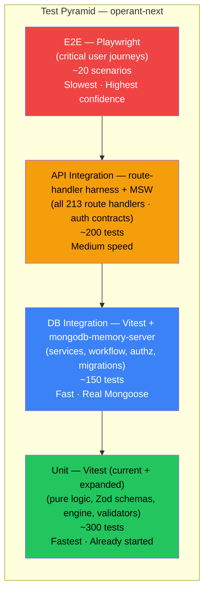
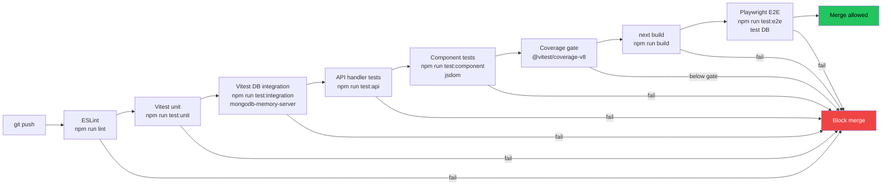

# 14 — Testing Strategy

> **Project:** UMIS / `operant-next`
> **Stack:** Next.js 16 App Router · React 19 · MongoDB/Mongoose · Vitest 2
> **Cross-references:** `02_Current_Architecture.md` · `08_Backend_Architecture.md` · `09_Code_Quality_Report.md` · `10_Technical_Debt_Report.md` · `11_Refactoring_Strategy.md` · `12_Development_Master_Plan.md` (Phase 5) · `16_Security_Audit.md` · `18_Coding_Standards.md`
> **Authoritative source:** `documentation.md` §2 (tooling), §7 (auth/authz), §9.6 (workflow engine), §22 (error handling), §23 (code quality), §27 (known issues)

---

## Table of Contents

1. [Current State](#1-current-state)
2. [Problems Identified](#2-problems-identified)
3. [Target Test Strategy](#3-target-test-strategy)
4. [Recommended Tooling](#4-recommended-tooling)
5. [What to Test First — Priority Order](#5-what-to-test-first--priority-order)
6. [Coverage Targets](#6-coverage-targets)
7. [CI Gating](#7-ci-gating)
8. [Implementation Plan](#8-implementation-plan)

---

## 1. Current State

### 1.1 Automated Tests (Vitest)

Vitest 2 (`^2.1.9`) is installed and configured. The runner executes in a **Node environment** with global assertion APIs. Path alias `@/*` → `src/*` is resolved via `vitest.config.ts`.

```ts
// vitest.config.ts
export default defineConfig({
    test: {
        include: ["src/**/*.test.ts"],
        environment: "node",
        globals: true,
    },
    resolve: { alias: { "@": path.resolve(__dirname, "./src") } },
});
```

Exactly **4 test files** exist across the codebase:

| File | Subject | Scope | Technique |
|---|---|---|---|
| `src/lib/auth/user.test.ts` | `bootstrapAdmin()` | Unit | `vi.mock` for DB, session, password, tokens, authz |
| `src/lib/pbas/validators.test.ts` | `pbasApplicationSchema`, `pbasEntryModerationSchema` | Unit | Pure Zod `.safeParse()` |
| `src/lib/pbas/workflow.test.ts` | `canTransitionPbasStatus`, `assertPbasTransition`, `deriveReviewTransition` | Unit | Pure functions |
| `src/lib/workflow/engine.test.ts` | `resolveWorkflowTransition`, `getWorkflowPendingStatuses`, `getWorkflowStageByStatus` | Unit | Pure functions with an inline definition fixture |

The `user.test.ts` file demonstrates the correct Vitest mocking pattern (`vi.hoisted`, `vi.mock`) for modules that touch Next.js internals (`next/navigation`) and Mongoose models.

**Total: 4 test files, approximately 55 test cases.**

### 1.2 Manual / Smoke Tests

`scripts/verify-aqar-seven-modules.mjs` is a live-database smoke test. It connects to the real MongoDB instance pointed to by `MONGODB_URI`, exercises all seven AQAR-related contributor modules end-to-end, and logs pass/fail results to stdout. This is the only test that touches the database and the workflow engine under real Mongoose conditions. There is a companion cleanup script, `scripts/cleanup-aqar-verification-data.mjs`, which deletes the data created by the verification run.

These scripts are **not integrated into `npm test`** and require a configured, running database. They constitute an informal integration/smoke harness rather than a repeatable automated test.

### 1.3 Confirmed Gaps

- **No integration tests** that exercise service functions against a real (or in-memory) database.
- **No API-layer tests** that issue HTTP requests to route handlers.
- **No component tests** for any of the 85 React components.
- **No end-to-end tests** covering user journeys (login → submit → review → approve).
- **No performance/load tests.**
- **No security-specific tests** (CSRF guard, rate-limit behaviour, authz boundary enforcement).
- **No regression tests** protecting the workflow engine's 11 module definitions from accidental mutation.
- ESLint (`eslint-config-next`) runs but is not coupled to test outcomes.

---

## 2. Problems Identified

| Problem | Impact | Severity |
|---|---|---|
| 4 tests for 188 models, 213 route handlers, 97 lib modules | Any refactoring breaks silently; regressions ship to production | Critical |
| Workflow engine is the backbone of 11 modules; only its pure helpers are tested — `syncWorkflowInstanceState` and `canActorProcessWorkflowStage` have zero coverage | Silent breakage of the entire review lifecycle | Critical |
| `resolveAuthorizationProfile()` — the RBAC brain — has no tests | Authorization failures or privilege-escalation bugs go undetected | Critical |
| Submit gates (T&L required fields, PBAS `totalScore>0`, CAS mandatory docs) lack automated validation | Malformed data bypasses submission guards after refactoring | High |
| The AQAR smoke test uses a live database — it cannot run in CI safely, produces real data, and requires manual cleanup | Test coverage is operationally coupled to a live environment | High |
| No route-handler tests mean API contract changes are invisible until a client breaks | API regressions discovered in production | High |
| No component tests for 85 components, including complex managers with async state | UI regressions are caught only manually | Medium |
| No CI pipeline — `npm test` runs 4 tests; no lint gate, no build gate | Quality gates must be enforced manually per developer | High |
| PDF generation, email sending, and notification logic have zero test coverage | Silent failures in critical user-facing paths | Medium |

---

## 3. Target Test Strategy

The target is a **four-layer test pyramid** that grows coverage incrementally from the most valuable, highest-ROI layer upward.



### 3.1 Unit Tests (Vitest, Node environment)

**Scope:** pure functions, Zod validators, workflow engine logic, authorization profile computation against mocked data sources, service functions with all DB/external calls mocked via `vi.mock`.

**What belongs here:**
- All 20 `validators.ts` files (Zod `.safeParse` / `.parse` — no mocking required).
- `src/lib/workflow/engine.ts` — extend existing tests to cover `syncWorkflowInstanceState` mock path, `canActorProcessWorkflowStage`, `listPendingWorkflowRecordIds`, and all 11 `DEFAULT_WORKFLOW_DEFINITIONS`.
- `src/lib/authorization/service.ts` — `resolveAuthorizationProfile` with mocked `LeadershipAssignment` / `GovernanceCommitteeMembership` queries; `buildAuthorizedScopeQuery`; `canReviewWorkflowStage`.
- `src/lib/auth/*` — extend `bootstrapAdmin` tests; add `createSessionToken`/`verifySessionToken`, `hashPassword`/`verifyPassword`, token utilities.
- Service functions that contain pure business logic distinct from DB writes (e.g. eligibility computation in `lib/cas/service.ts`, API score calculation in `lib/pbas/service.ts`).
- PDF assembly helpers (byte-level output regression tests).

### 3.2 DB Integration Tests (Vitest + `mongodb-memory-server`)

**Scope:** service functions exercised against a real Mongoose instance backed by an ephemeral in-memory MongoDB. Tests exercise real schema validation, indexes, and Mongoose middleware.

**What belongs here:**
- Full workflow lifecycle for each module (create plan → assign → save draft → submit → review → approve/reject → resubmit).
- `resolveAuthorizationProfile` with real `LeadershipAssignment` / `GovernanceCommitteeMembership` documents.
- Submit gates: verify that a Teaching-Learning assignment with missing required fields is rejected; that a PBAS form with `totalScore = 0` cannot be submitted; that a CAS application without mandatory document types is rejected.
- Audit log writes: confirm `createAuditLog` records the expected actor + action after a state transition.
- Notification creation: confirm `notifyWorkflowStageAssignees` produces `Notification` documents for the correct recipient user IDs.
- `dbConnect` caching behaviour: the connection promise is reused across calls in the same process.
- `AcademicYear` / unique-index enforcement.
- Migration scripts (`scripts/*.cjs|.mjs`) — run against an in-memory seed and assert idempotency.

**Setup pattern:**

```ts
// src/test/setup/db.ts
import { MongoMemoryServer } from "mongodb-memory-server";
import mongoose from "mongoose";

let mongod: MongoMemoryServer;

export async function startTestDb() {
    mongod = await MongoMemoryServer.create();
    await mongoose.connect(mongod.getUri());
}

export async function stopTestDb() {
    await mongoose.disconnect();
    await mongod.stop();
}

export async function clearTestDb() {
    const collections = mongoose.connection.collections;
    for (const key of Object.keys(collections)) {
        await collections[key].deleteMany({});
    }
}
```

Vitest `globalSetup` / `beforeAll`/`afterAll` per test file or a shared suite setup invokes `startTestDb` / `stopTestDb`; `beforeEach` calls `clearTestDb` to isolate tests.

### 3.3 API Integration Tests (Route-Handler Harness)

**Scope:** HTTP-level tests that instantiate Next.js route handlers directly (using the Next.js test utilities or a lightweight `node:http` harness) and exercise auth, request parsing, service delegation, and response envelope.

**Approach — two options:**

**Option A (preferred for Next.js 16):** Import route handler functions directly, construct a `Request` object, and call the exported method:

```ts
// Example: src/app/api/admin/bootstrap/route.test.ts
import { POST } from "@/app/api/admin/bootstrap/route";

it("returns 403 when bootstrap secret is wrong", async () => {
    const req = new Request("http://localhost/api/admin/bootstrap", {
        method: "POST",
        headers: { "x-admin-bootstrap-secret": "wrong" },
        body: JSON.stringify({ name: "A", email: "a@b.com", password: "Pass1!" }),
    });
    const res = await POST(req);
    expect(res.status).toBe(403);
});
```

**Option B (full HTTP, future):** Run `next dev`/`next start` in the test process and use `undici` or `node-fetch` to issue real HTTP requests. Suitable for contract testing but slower; more appropriate once a CI pipeline is established.

**MSW (Mock Service Worker) for external services:** Use `msw` in the Node environment to intercept outbound HTTP calls from service functions (Resend email API, Firebase download-URL fetch during `finalize-upload`). This avoids real network calls in CI without patching the module graph with `vi.mock`.

```ts
// src/test/mocks/handlers.ts
import { http, HttpResponse } from "msw";

export const handlers = [
    http.get("https://firebasestorage.googleapis.com/*", () =>
        new HttpResponse(Buffer.from("%PDF-1.4"), { headers: { "content-type": "application/pdf" } })
    ),
    http.post("https://api.resend.com/*", () => HttpResponse.json({ id: "mock-id" })),
];
```

### 3.4 Component Tests (Vitest + jsdom + Testing Library)

**Scope:** React component rendering, interactive state, and form submission for the 85 components. Focus on components with non-trivial logic: workflow decision panels, multi-step submission forms, the notification centre.

**Configuration:** add a second Vitest project entry (or workspace) with `environment: "jsdom"` for component tests.

```ts
// vitest.config.ts (extended)
export default defineConfig({
    test: {
        projects: [
            {
                // existing unit/integration tests
                test: { include: ["src/**/*.test.ts"], environment: "node", globals: true },
                resolve: { alias: { "@": "./src" } },
            },
            {
                // component tests
                test: {
                    include: ["src/**/*.test.tsx"],
                    environment: "jsdom",
                    globals: true,
                    setupFiles: ["src/test/setup/component.ts"],
                },
                resolve: { alias: { "@": "./src" } },
            },
        ],
    },
});
```

**Libraries:** `@testing-library/react`, `@testing-library/user-event`, `@testing-library/jest-dom` (matchers). Mock `next/navigation` (`usePathname`, `useRouter`) and `next/font` via `vi.mock` or a global setup file.

**Priority components to test first:**

1. Auth forms (`src/components/auth/forms.tsx`) — login validation, error display, redirect paths.
2. `pbas-dashboard.tsx` — submit gate feedback, score display.
3. `teaching-learning-contributor-workspace.tsx` — required-field enforcement pre-submit.
4. `notification-center.tsx` — fetch-on-open, optimistic mark-read.

### 3.5 End-to-End Tests (Playwright)

**Scope:** critical user journeys exercised against a running application (test database). 20 prioritized scenarios cover the highest-value paths.

**Priority scenarios:**

| # | Journey | Portal |
|---|---|---|
| 1 | Admin bootstrap → admin login | Admin |
| 2 | Admin provisions faculty → faculty activates account | Admin + Faculty |
| 3 | Admin creates Teaching-Learning plan → assigns faculty | Admin |
| 4 | Faculty submits Teaching-Learning contribution | Faculty |
| 5 | Dept-head reviews and forwards → committee approves | Director/Admin |
| 6 | Faculty creates PBAS form → adds entries → submits | Faculty |
| 7 | Director reviews PBAS → moderates scores → forwards | Director |
| 8 | Admin approves PBAS → faculty downloads PDF report | Admin + Faculty |
| 9 | Faculty applies for CAS → uploads mandatory docs → submits | Faculty |
| 10 | Admin reviews CAS → approves → promotion history recorded | Admin |
| 11 | Student activates account → completes SSS survey | Student |
| 12 | Admin generates NAAC metric values for a cycle | Admin |
| 13 | Director accesses approval queue → reviews all 11 module types | Director |
| 14 | Evidence submitted → admin verifies → student notified | Admin + Student |
| 15 | Forgot-password → reset → login with new credentials | Public |
| 16 | Admin creates governance committee → assigns faculty member | Admin |
| 17 | Faculty submits AQAR application → director reviews | Faculty + Director |
| 18 | Admin creates institutional AQAR cycle → generates snapshot | Admin |
| 19 | Admin bulk-provisions faculty from Excel → handles partial failure | Admin |
| 20 | Session cookie expires → protected route redirects to login | All |

**Playwright configuration:** run against a dedicated test database (`MONGODB_URI_TEST`). Use Playwright's `globalSetup` to seed an admin user and reference data before the suite runs.

### 3.6 Performance Tests (k6 / autocannon)

**Scope:** load-test the most latency-sensitive endpoints.

**Tooling:**
- **k6**: scripted HTTP scenarios; integrates with CI via `k6 run --out json` and threshold assertions.
- **autocannon**: simpler; `npx autocannon -c 50 -d 30 http://localhost:3000/api/...`.

**Priority endpoints for load testing:**

1. `GET /api/notifications` — computed deadline reminders on every fetch; N+1 risk.
2. `GET /api/admin/audit-logs?page=1&pageSize=50` — paginated but large collection.
3. `POST /api/admin/naac-metric-warehouse/cycles/{id}/generate` — aggregates 20+ collections.
4. Admin list endpoints (Teaching-Learning, Research-Innovation) — full authorized-set fetch with no pagination.

**Baseline thresholds (suggested):**

| Endpoint | p95 target | Error rate |
|---|---|---|
| `/api/notifications` | < 500 ms | < 0.1% |
| Workflow submit | < 800 ms | < 0.1% |
| Metric warehouse generate | < 10 s | < 1% |
| Admin list endpoints | < 1 s | < 0.1% |

### 3.7 Security-Oriented Tests

Security tests are a subset of API integration tests and E2E tests that assert **negative** paths. See `16_Security_Audit.md` for the full audit. High-priority automated security assertions:

- CSRF: a `PATCH` request to a mutation endpoint without the session cookie returns 401/403, not 200.
- Authorization boundary: a faculty user cannot call `assertAdminApiAccess`-gated routes; a student cannot call faculty routes.
- Bootstrap secret: wrong secret → 403; missing secret in production → 403; correct secret → 201.
- Self-review block: a faculty member who is also listed as a reviewer cannot approve their own submission (unless actor is Admin).
- Token replay: a used password-reset token cannot be reused.
- Suspended user: after admin suspends a user, their active session cookie is rejected on the next request (per-request DB re-validation).
- Director login: a user without a `LeadershipAssignment` / `GovernanceCommitteeMembership` cannot acquire a director session.

### 3.8 Regression Tests

Regression tests protect known-good behaviour after refactoring. The immediate priority is the **workflow engine's 11 module definitions** — any change to `DEFAULT_WORKFLOW_DEFINITIONS` in `src/lib/workflow/engine.ts` should break a snapshot test that asserts the exact stage graph.

```ts
// src/lib/workflow/engine.definitions.test.ts
import { DEFAULT_WORKFLOW_DEFINITIONS } from "@/lib/workflow/engine";

it("PBAS workflow definition is stable", () => {
    expect(DEFAULT_WORKFLOW_DEFINITIONS.PBAS).toMatchSnapshot();
});

it("all 11 module definitions are registered", () => {
    const keys = Object.keys(DEFAULT_WORKFLOW_DEFINITIONS);
    expect(keys).toHaveLength(11);
    expect(keys).toContain("TEACHING_LEARNING");
    expect(keys).toContain("RESEARCH_INNOVATION");
    // … all 11
});
```

---

## 4. Recommended Tooling

| Layer | Tool | Rationale |
|---|---|---|
| **Unit** | **Vitest 2** (already installed) | Native ESM; Vite speed; `vi.mock`/`vi.hoisted`; path alias resolution; runs in Node environment matching production route handlers |
| **DB integration** | **`mongodb-memory-server`** | Spins a real `mongod` binary in-process; no Docker required; supports Mongoose 9 indexes, TTL, and middleware; isolates tests from production data |
| **API integration** | **Route-handler imports + `msw`** for external HTTP | Call exported handler functions with `new Request(...)`; intercept outbound calls (Resend, Firebase) with MSW Node server; no full HTTP stack needed |
| **Component** | **`@testing-library/react`** + **`@testing-library/user-event`** + **jsdom** | React 19 compatible; tests behaviour (not implementation); `user-event` simulates real browser events including Tab / Enter |
| **E2E** | **Playwright** | First-class Next.js support; parallel browser workers; built-in `expect` for network/navigation; trace viewer for debugging; supports Chromium/Firefox/WebKit |
| **Performance** | **k6** (scripted) + **autocannon** (quick one-shot) | k6 for CI thresholds; autocannon for ad-hoc developer benchmarking |
| **Coverage** | **Vitest `--coverage` via `@vitest/coverage-v8`** | V8 coverage without instrumentation overhead; Istanbul-compatible LCOV output for CI badges |
| **Snapshot** | **Vitest built-in `toMatchSnapshot`** | Stabilize workflow definitions and Zod schema outputs |

**Installation (additions to `package.json` devDependencies):**

```bash
npm install -D \
  mongodb-memory-server \
  msw \
  @testing-library/react \
  @testing-library/user-event \
  @testing-library/jest-dom \
  @vitest/coverage-v8 \
  playwright \
  @playwright/test \
  k6
```

---

## 5. What to Test First — Priority Order

The following backlog is ordered by **risk × reach**. Items at the top protect the most critical paths with the least effort.

### Priority 1 — Workflow Engine (expand existing coverage)

`src/lib/workflow/engine.ts` is the backbone of 11 modules and is already partially tested. Expand to:

- `syncWorkflowInstanceState` — upsert behaviour, stage transitions written to `WorkflowInstance` (DB integration).
- `canActorProcessWorkflowStage` — each approver role for each module; self-review block.
- `listPendingWorkflowRecordIds` — returns correct record IDs at each stage.
- All 11 `DEFAULT_WORKFLOW_DEFINITIONS` — snapshot tests and stage-count assertions.

**Effort:** ~1 day. **Risk reduced:** complete review lifecycle for all 11 modules.

### Priority 2 — Authorization (`resolveAuthorizationProfile`)

`src/lib/authorization/service.ts` drives portal access, scope filtering, and stage gating. No tests exist.

- Unit tests: mock `LeadershipAssignment.find` / `GovernanceCommitteeMembership.find`; assert correct `workflowRoles`, `browseScopes`, `hasLeadershipPortalAccess`.
- DB integration tests: seed real governance documents; assert `buildAuthorizedScopeQuery` produces the expected Mongo filter; assert `canReviewWorkflowStage` returns `true`/`false` for the correct role at each stage.
- Boundary: user with NO assignments → empty profile, no portal access.
- Boundary: `compatibilityMode` path via `Organization.headUserId`.

**Effort:** ~2 days. **Risk reduced:** privilege escalation bugs, incorrect scope filtering.

### Priority 3 — Submit / Review Gates

Each module has submission validation that goes beyond Zod schema checks — file presence, score thresholds, mandatory document types.

- Teaching-Learning: `pedagogicalApproach`, `attendanceStrategy`, `attainmentSummary`, a lesson-plan document, ≥1 session, ≥1 assessment, ≥1 evidence/link → DB integration test.
- PBAS: `totalScore > 0`, deadline check → service unit test with mocked date and DB.
- CAS: 3 mandatory document types present → service unit test.
- SSR: multi-type response validation (numeric/text/bool/date/table + narrative) → unit.
- AQAR: `totalContributionIndex > 0` → unit.

**Effort:** ~3 days. **Risk reduced:** data integrity regressions after service refactoring.

### Priority 4 — Auth Flows (expand existing bootstrap tests)

- Faculty activation: `employeeCode + email` match → session created; mismatch → 403.
- Student activation: `enrollmentNo + email/phone` match.
- Forgot-password / reset-password token lifecycle: token hash stored; raw token not stored; used token invalidated.
- Director login: leadership check fail → cookie cleared → 403.
- Suspended user: per-request re-validation rejects active cookie.

**Effort:** ~2 days. **Risk reduced:** authentication bypass and account-takeover paths.

### Priority 5 — API Route Contracts

Write route-handler import tests for the 15 highest-traffic endpoints:
- `POST /api/auth/admin-login` (auth guard, credential validation, session issue).
- `GET /api/notifications` (pagination, deadline computation).
- `POST /api/teaching-learning/assignments/{id}/submit` (auth + gate + workflow transition).
- `POST /api/teaching-learning/assignments/{id}/review` (reviewer-role check, self-review block).
- `POST /api/pbas/{id}/submit` / `review` / `approve`.
- `GET /api/admin/audit-logs` (pagination, filtering).
- `POST /api/documents` (`issue-upload` and `finalize-upload` flows).

**Effort:** ~3 days. **Risk reduced:** API regressions from route refactoring, guard omissions.

### Priority 6 — Component Tests (auth forms first)

Auth forms are used by all four portals, contain Zod validation, and represent the highest user-facing risk.

**Effort:** ~2 days per module family. Start with auth, then PBAS dashboard, then Teaching-Learning contributor workspace.

---

## 6. Coverage Targets

| Metric | Short-term (Phase 5 start) | Medium-term (6 months) | Long-term |
|---|---|---|---|
| **Statement coverage** | 30% | 60% | 80% |
| **Branch coverage** | 20% | 50% | 70% |
| **`src/lib/workflow/**`** | 90% | 95% | 95% |
| **`src/lib/authorization/**`** | 80% | 90% | 90% |
| **`src/lib/auth/**`** | 70% | 85% | 90% |
| **`src/lib/pbas/**`** | 40% → 80% | 85% | 90% |
| **Route handlers** | 10% | 60% | 80% |
| **Components** | 0% | 40% | 65% |

Coverage is tracked via `vitest --coverage` (`@vitest/coverage-v8`) and reported in CI. **Coverage gates (hard fail):**

- `src/lib/workflow/**`: < 85% → CI fails.
- `src/lib/authorization/**`: < 75% → CI fails.
- `src/lib/auth/**`: < 70% → CI fails.
- Overall project: < 25% initially, ratcheting upward by 5% per sprint.

---

## 7. CI Gating

Until a CI pipeline is established (see `15_Deployment_Architecture.md`), the test commands can be added as local `package.json` scripts and enforced via a pre-push git hook.

**Target CI test flow:**



**Proposed `package.json` script additions:**

```json
{
  "scripts": {
    "test": "vitest run",
    "test:unit": "vitest run --project unit",
    "test:integration": "vitest run --project integration",
    "test:api": "vitest run --project api",
    "test:component": "vitest run --project component",
    "test:e2e": "playwright test",
    "test:coverage": "vitest run --coverage",
    "test:perf": "k6 run scripts/perf/load-test.js"
  }
}
```

**Gate rules (CI):**

1. Any test failure → build fails; merge blocked.
2. Coverage below threshold → build fails.
3. `next build` failure → build fails (catches TypeScript errors missed locally).
4. E2E run against staging database; failures block deployment, not merge (to be revisited once E2E suite is stable).

---

## 8. Implementation Plan

This plan maps to **Phase 5 of `12_Development_Master_Plan.md`** and should begin after the security hardening (Phase 2) and refactoring phases (Phases 3–4) are underway, since refactoring and testing should proceed together.

### Sprint 1 (Week 1–2): Foundation

- [ ] Add `mongodb-memory-server`, `@vitest/coverage-v8`, `msw` to `devDependencies`.
- [ ] Create `src/test/setup/db.ts` with `startTestDb` / `stopTestDb` / `clearTestDb`.
- [ ] Create `src/test/mocks/handlers.ts` with MSW handlers for Firebase + Resend.
- [ ] Extend `vitest.config.ts` to support `--project` filtering (unit vs integration).
- [ ] Add `test:coverage` script; configure coverage thresholds for `src/lib/workflow/**`.
- [ ] Expand `engine.test.ts` to cover all 11 module definition snapshots and `canActorProcessWorkflowStage`.
- [ ] Write DB integration tests for `syncWorkflowInstanceState` (full lifecycle for one module).

### Sprint 2 (Week 3–4): Authorization + Auth

- [ ] Write unit tests for `resolveAuthorizationProfile` (mocked), covering all three input sources (Leadership, Governance, compatibility).
- [ ] Write DB integration tests for `buildAuthorizedScopeQuery` + `canReviewWorkflowStage`.
- [ ] Expand auth tests: faculty activation, student activation, reset-password lifecycle, director login fail path, suspended-user rejection.
- [ ] Set coverage gate for `src/lib/authorization/**` (75%) and `src/lib/auth/**` (70%).

### Sprint 3 (Week 5–6): Submit Gates + API Routes

- [ ] Write DB integration tests for Teaching-Learning, PBAS, and CAS submit gates.
- [ ] Write API route-handler import tests for 15 priority endpoints (authentication, guard, response shape).
- [ ] Add MSW integration to intercept Firebase + Resend in API tests.
- [ ] Wire `npm run test:api` into CI gate.

### Sprint 4 (Week 7–8): Component Tests + E2E Foundation

- [ ] Add `@testing-library/react`, `@testing-library/user-event`, `jsdom` project to Vitest config.
- [ ] Write component tests for auth forms (login, faculty activation, reset-password).
- [ ] Install Playwright; write E2E scenarios 1–5 (bootstrap, provisioning, plan creation, faculty submit, dept-head review).
- [ ] Configure Playwright to run against a seeded test database.

### Sprint 5 (Week 9–12): Fill Coverage + Performance

- [ ] Extend component tests to PBAS dashboard and Teaching-Learning contributor workspace.
- [ ] Write remaining 15 E2E scenarios.
- [ ] Write k6 load-test scripts for priority endpoints; establish baseline thresholds.
- [ ] Write security-negative tests (CSRF, authorization boundary, token replay).
- [ ] Convert `scripts/verify-aqar-seven-modules.mjs` to a Vitest DB integration test suite (using `mongodb-memory-server`) so it can run in CI without a live database.
- [ ] Achieve overall coverage ≥ 30%, workflow engine ≥ 85%.

### Ongoing

- New service functions must ship with unit tests for pure logic and DB integration tests for the state transitions they introduce.
- New route handlers must ship with at least one happy-path and one auth-failure API test.
- New Zod validators must ship with `.safeParse` tests covering valid inputs, invalid inputs, and edge-case cross-field rules.
- PR reviews (see `18_Coding_Standards.md`) include a test coverage check for the changed files.

---

*This document reflects the test infrastructure as it exists at the time of writing. When test counts, tooling, or CI configuration change, update this document to remain the accurate technical reference.*
