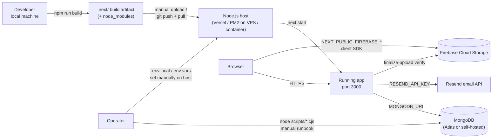
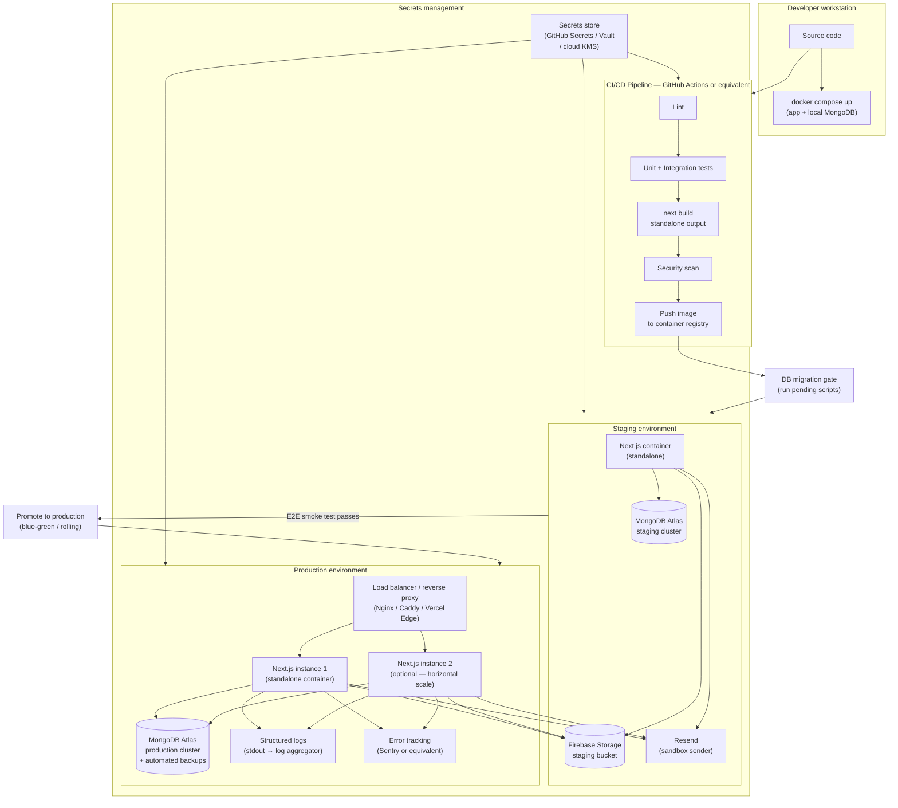
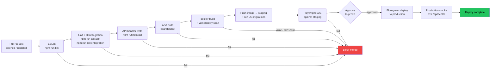

# 15 — Deployment Architecture

> **Project:** UMIS / `operant-next`
> **Stack:** Next.js 16 App Router · React 19 · MongoDB/Mongoose · Node.js runtime
> **Cross-references:** `02_Current_Architecture.md` · `08_Backend_Architecture.md` · `09_Code_Quality_Report.md` · `10_Technical_Debt_Report.md` · `12_Development_Master_Plan.md` · `14_Testing_Strategy.md` · `16_Security_Audit.md` · `17_Performance_Optimization.md`
> **Authoritative source:** `documentation.md` §19 (environment variables), §24 (deployment), §3 (architecture), §20 (security)

---

## Table of Contents

1. [Current State](#1-current-state)
2. [Environment Variables Reference](#2-environment-variables-reference)
3. [Problems Identified](#3-problems-identified)
4. [Recommended Target Architecture](#4-recommended-target-architecture)
5. [Implementation Plan](#5-implementation-plan)

---

## 1. Current State

### 1.1 Build and Runtime

The application uses a standard **Node.js runtime**. It requires Node.js because it uses `crypto`, `Buffer`, and Mongoose — Edge runtime is not supported. The build and run commands are:

```bash
npm run build   # next build  → produces .next/
npm run start   # next start  → Node HTTP server
npm run lint    # eslint
npm test        # vitest run  (4 tests)
```

There is no `output: "standalone"` in `next.config.ts`. The `.next/` directory produced by `next build` is the only build artifact. It must be co-located with `node_modules/` for `next start` to work, which means a full `npm install` is needed on every deployment target.

`next.config.ts` contains one configuration:

```ts
// next.config.ts
const nextConfig: NextConfig = {
    images: {
        remotePatterns: [
            { protocol: "https", hostname: "firebasestorage.googleapis.com" },
        ],
    },
};
```

This allows `next/image` to serve images from Firebase Storage. No other configuration is present: no custom headers, no rewrites, no redirects, and no `output` mode override.

### 1.2 Data / Operations Scripts

`scripts/` contains seven one-shot Node.js scripts that connect directly to MongoDB via `MONGODB_URI`:

| Script | npm alias | Purpose |
|---|---|---|
| `migrate-institution-terminology.cjs` | `migrate:institution-terminology` | Rename `schoolName`/`collegeName`/`universityName` across collections |
| `backfill-organizations.cjs` | `backfill:organizations` | Create/link `Organization` nodes from `Institution`/`Department` records |
| `backfill-governed-reference-masters.cjs` | `backfill:governed-reference-masters` | Activate legacy reference collections; deprecate old master-data categories |
| `backfill-governance-rbac.cjs` | `backfill:governance-rbac` | Seed `leadership_assignments` from `headUserId`; backfill scope fields |
| `cleanup-aqar-verification-data.mjs` | — | Delete data created by the AQAR verification run |
| `verify-aqar-seven-modules.mjs` | — | Live-DB end-to-end smoke test of all 7 AQAR modules |
| `ts-alias-loader.mjs` | — | Node loader resolving `@/` → `src/` (broken: hard-coded absolute path `/Users/rc/Projects/operant-next/src`) |

These scripts are idempotent but **untracked**: there is no ledger recording which script ran on which database instance, at what time, or by whom. They are manual runbook steps.

### 1.3 Current Deployment Topology



### 1.4 What Is Confirmed Absent

- **No Dockerfile** or `docker-compose.yml` in the repository.
- **No CI/CD configuration** (no GitHub Actions, GitLab CI, Bitbucket Pipelines, or equivalent `.yml`/`.json` workflow files).
- **No `output: "standalone"`** in `next.config.ts` — the build artifact is not self-contained.
- **No staging environment** configuration — one set of environment variables, one deployment target.
- **No migration framework** — no versioning, no run ledger, no rollback.
- **No observability tooling** — no structured logger, no APM agent, no error-tracking service, no metrics/traces.
- **No secrets management** beyond `.env.local` / host environment variables set manually.
- **No automated database backup** configuration in the repository.
- **No health-check endpoint** (`/api/health` or equivalent) for load-balancer or uptime monitoring.
- **No zero-downtime restart** strategy — `next start` is a blocking process; restarts drop in-flight requests.

---

## 2. Environment Variables Reference

This section summarises the full environment variable inventory. The canonical detail is in `documentation.md` §19. Configuration is consumed at build time (`NEXT_PUBLIC_*`) and runtime (server-only).

| Variable | Required | Consumed by | Notes |
|---|---|---|---|
| `MONGODB_URI` | Required | `src/lib/dbConnect.ts` | Connection string with credentials. High-value secret — never in VCS or client bundle. |
| `AUTH_SECRET` | Required | `src/lib/auth/session.ts` — HS256 JWT signing | 32+ bytes random string. High-value secret. Rotate requires all active sessions to be invalidated. |
| `ADMIN_BOOTSTRAP_SECRET` | Required in production | `src/lib/auth/user.ts` — `bootstrapAdmin()` | Optional in development. If unset in production, bootstrap endpoint returns 403. |
| `APP_URL` | Recommended | `src/lib/auth/email.ts` — email link base | Falls back to `NEXT_PUBLIC_APP_URL`, then `http://localhost:3000`. Must be the public HTTPS origin in production. |
| `NEXT_PUBLIC_APP_URL` | Recommended | Client-visible base URL | Used in client-side link construction. |
| `RESEND_API_KEY` | Optional (critical in prod) | `src/lib/auth/email.ts`, `src/lib/notifications/email.ts` | If unset, emails are `console.info`-logged — must NOT be left unset in production. |
| `RESEND_FROM_EMAIL` | Optional | Resend sender address | Defaults to Resend sandbox address if unset. |
| `NEXT_PUBLIC_FIREBASE_API_KEY` | Required for uploads | `src/lib/firebase/config.ts` | Client-visible by design; Firebase Storage Security Rules are the real access control. |
| `NEXT_PUBLIC_FIREBASE_AUTH_DOMAIN` | Required for uploads | Firebase client SDK init | |
| `NEXT_PUBLIC_FIREBASE_PROJECT_ID` | Required for uploads | Firebase client SDK init | |
| `NEXT_PUBLIC_FIREBASE_STORAGE_BUCKET` | Required for uploads | Firebase client SDK + server finalize URL validation | |
| `NEXT_PUBLIC_FIREBASE_MESSAGING_SENDER_ID` | Required for uploads | Firebase client SDK init | |
| `NEXT_PUBLIC_FIREBASE_APP_ID` | Required for uploads | Firebase client SDK init | |
| `NODE_ENV` | Framework-managed | Cookie `secure` flag, bootstrap requirement, email fallback | Set automatically by Next.js (`development` / `production` / `test`). |

**Security classification:**
- **Secrets (never in VCS or client bundle):** `MONGODB_URI`, `AUTH_SECRET`, `ADMIN_BOOTSTRAP_SECRET`, `RESEND_API_KEY`.
- **Server-side non-secrets:** `APP_URL`, `RESEND_FROM_EMAIL`.
- **Client-visible by design:** all `NEXT_PUBLIC_FIREBASE_*` variables (embedded in the browser bundle; Firebase Security Rules control actual access).

**Known gap:** There is no startup schema validation. A missing required variable fails **lazily** at the first code path that reads it — potentially minutes into a deploy, during a user request, rather than at startup. The recommended fix is a Zod-parsed `env.ts` module that reads and validates all variables at startup (see §4.4).

---

## 3. Problems Identified

| Problem | Category | Severity |
|---|---|---|
| No CI/CD pipeline — every deploy is a manual, operator-driven sequence with no automated quality gate | Process | Critical |
| No automated tests gate a deployment — broken code can be deployed without detection | Quality | Critical |
| Environment variables set manually on each host — no secrets management, no audit trail, risk of misconfiguration | Security | High |
| No `output: "standalone"` — deploying requires copying `node_modules/` alongside `.next/`, making the artifact large and slow to distribute | Ops | High |
| No migration framework — scripts run in untracked order; no rollback; two environments can diverge silently | Data integrity | High |
| No staging environment — changes go from developer laptop directly to production | Risk | High |
| No observability — `console` logging only; no error tracking (Sentry/etc.); no APM; no structured log format | Reliability | High |
| No health-check endpoint — load balancers, uptime monitors, and container orchestrators cannot probe liveness/readiness | Ops | Medium |
| No zero-downtime strategy — `next start` restarts drop in-flight requests | Reliability | Medium |
| No automated database backup configuration in the repo — backup cadence and retention are invisible to the development team | Data integrity | High |
| `ts-alias-loader.mjs` has a hard-coded absolute path `/Users/rc/Projects/operant-next/src` — breaks on every machine except the original author's | Dev experience | Medium |
| Resend email fallback silently drops emails if `RESEND_API_KEY` is unset in production — no startup check prevents this | Reliability | High |
| No email retry — failed sends are marked `failed` and never retried; notifications are lost permanently | Reliability | Medium |
| Firebase Storage Security Rules are not in the repository — rules may be overly permissive and cannot be reviewed or version-controlled | Security | High |

---

## 4. Recommended Target Architecture

### 4.1 Target Deployment Topology



### 4.2 Containerization

Add `output: "standalone"` to `next.config.ts`. This causes `next build` to produce a self-contained `server.js` with only the required `node_modules` sub-tree (typically 70–90% smaller than a full install). The resulting directory can be copied into a minimal container image.

**Recommended `next.config.ts` change:**

```ts
const nextConfig: NextConfig = {
    output: "standalone",
    images: {
        remotePatterns: [
            { protocol: "https", hostname: "firebasestorage.googleapis.com" },
        ],
    },
};
```

**Dockerfile (production):**

```dockerfile
# ---- build stage ----
FROM node:22-alpine AS builder
WORKDIR /app
COPY package*.json ./
RUN npm ci
COPY . .
RUN npm run build

# ---- runtime stage ----
FROM node:22-alpine AS runner
WORKDIR /app
ENV NODE_ENV=production

# standalone output is self-contained
COPY --from=builder /app/.next/standalone ./
COPY --from=builder /app/.next/static ./.next/static
COPY --from=builder /app/public ./public

EXPOSE 3000
CMD ["node", "server.js"]
```

**`docker-compose.yml` for local development** (replaces manual MongoDB install):

```yaml
services:
  app:
    build: .
    ports:
      - "3000:3000"
    env_file: .env.local
    depends_on:
      - mongo

  mongo:
    image: mongo:7
    ports:
      - "27017:27017"
    volumes:
      - mongo-data:/data/db

volumes:
  mongo-data:
```

### 4.3 CI/CD Pipeline



**Proposed GitHub Actions workflow structure:**

```
.github/
  workflows/
    ci.yml          # lint + test + build (on PR)
    deploy-staging.yml  # build + push + migrate + e2e (on merge to main)
    deploy-prod.yml     # promote staging image (on release tag)
```

### 4.4 Environment and Secrets Management

**Principle:** secrets never live in source code, developer machines, or deployment manifests as plain text. They are injected at runtime from a managed store.

**Recommended approach:**

1. **GitHub Secrets** (or the equivalent for the chosen CI platform) for CI pipeline secrets.
2. **Cloud provider secret manager** (AWS Secrets Manager, GCP Secret Manager, Azure Key Vault, or HashiCorp Vault) for production runtime secrets.
3. **`.env.local`** remains for local development only, and is git-ignored.

**Startup environment validation** — add `src/lib/env.ts`:

```ts
// src/lib/env.ts  (server-only; import only in lib modules, never in client components)
import { z } from "zod";

const envSchema = z.object({
    MONGODB_URI: z.string().min(1),
    AUTH_SECRET: z.string().min(32),
    ADMIN_BOOTSTRAP_SECRET: z.string().optional(),
    APP_URL: z.string().url().optional(),
    RESEND_API_KEY: z.string().optional(),
    RESEND_FROM_EMAIL: z.string().email().optional(),
    NODE_ENV: z.enum(["development", "production", "test"]).default("development"),
});

export const env = envSchema.parse(process.env);
```

Import `env` in `dbConnect.ts` and `session.ts` instead of reading `process.env` directly. Any misconfiguration is caught **at process startup**, not lazily during a user request.

**Fix `ts-alias-loader.mjs`** — replace the hard-coded `/Users/rc/Projects/operant-next/src` with `path.resolve(process.cwd(), "src")` so the loader works on any machine.

### 4.5 Database Migration Framework

The current `scripts/` approach (one-shot, untracked, manual) needs to be replaced with a versioned migration system that records which migrations have run on each environment.

**Recommended pattern — migrate-mongo:**

```bash
npm install -D migrate-mongo
```

```
migrations/
  20250801000000-migrate-institution-terminology.js
  20250802000000-backfill-organizations.js
  20250803000000-backfill-governance-rbac.js
  ... (convert existing scripts)
config/migrate-mongo-config.js
```

Migrations are run as part of the CI/CD pipeline **after** the new container image is built but **before** traffic switches to the new version (migration gate in the deployment flow above).

Each migration file exports `up` (apply) and `down` (rollback):

```js
// migrations/20250801000000-migrate-institution-terminology.js
module.exports = {
    async up(db) {
        await db.collection("faculties").updateMany(
            { schoolName: { $exists: true } },
            [{ $set: { universityName: "$schoolName" } }, { $unset: "schoolName" }]
        );
    },
    async down(db) {
        await db.collection("faculties").updateMany(
            { universityName: { $exists: true } },
            [{ $set: { schoolName: "$universityName" } }, { $unset: "universityName" }]
        );
    },
};
```

`migrate-mongo status` shows which migrations have run on the current database. This replaces the runbook with an auditable, version-controlled record.

### 4.6 Observability

**Structured logging** — replace all `console.log`/`console.error` calls with a structured logger. Recommended: `pino` (fast, JSON output, zero-dependency, Next.js compatible).

```ts
// src/lib/logger.ts
import pino from "pino";
export const logger = pino({ level: process.env.LOG_LEVEL ?? "info" });
```

Log lines should carry: `level`, `timestamp`, `requestId` (generated per request), `userId` (from session), `action`, and any domain context. This makes logs searchable in aggregation systems (Datadog, Loki, CloudWatch, etc.).

**Error tracking** — add Sentry (or an equivalent). The Next.js SDK instruments server components, API routes, and client components in one pass:

```bash
npm install @sentry/nextjs
npx @sentry/wizard@latest -i nextjs
```

Sentry will capture unhandled errors, surfacing the issues currently lost in `console.error` and the generic 500 response. Set `SENTRY_DSN` as an environment variable.

**Health check endpoint** — add `src/app/api/health/route.ts`:

```ts
// src/app/api/health/route.ts
import { NextResponse } from "next/server";
import dbConnect from "@/lib/dbConnect";

export async function GET() {
    try {
        await dbConnect();
        return NextResponse.json({ status: "ok", timestamp: new Date().toISOString() });
    } catch {
        return NextResponse.json({ status: "error" }, { status: 503 });
    }
}
```

Configure the load balancer / Kubernetes readiness probe to check `GET /api/health`.

**Metrics / APM** — for production, consider adding OpenTelemetry instrumentation (`@opentelemetry/sdk-node`). This provides distributed tracing across the Next.js → MongoDB path and is compatible with Datadog, Jaeger, Grafana Tempo, and cloud-native APM services.

### 4.7 Staging vs Production

| Concern | Staging | Production |
|---|---|---|
| **Database** | Separate Atlas cluster (or separate database on same cluster) | Dedicated cluster with connection-level IP allowlisting |
| **Firebase Storage** | Separate bucket (`umis-staging`) | Production bucket (`umis-prod`) |
| **Resend** | Sandbox sender / sandbox domain | Verified custom domain |
| **Auth secret** | Different `AUTH_SECRET` | Different `AUTH_SECRET` (rotation independent) |
| **Admin bootstrap** | Enabled (for test setup) | `ADMIN_BOOTSTRAP_SECRET` required; disabled after first run |
| **Feature flags** | Can be ahead of production | Stable |
| **Log level** | `debug` | `info` (warn/error to Sentry) |
| **Deployment trigger** | On merge to `main` | On release tag / manual approval |

### 4.8 Database Backup and Restore

MongoDB Atlas provides automated backups out of the box when using M10+ clusters. For self-hosted MongoDB:

- **Daily `mongodump`** cron job → compress → upload to S3/GCS with 30-day retention.
- **Point-in-time recovery** requires MongoDB Enterprise or Atlas; otherwise, snapshot + oplog replay.
- **Restore procedure** should be documented and tested quarterly.
- **Backup verification**: schedule a monthly restore to a sandbox environment and run `verify-aqar-seven-modules.mjs` (converted to a CI-safe test per `14_Testing_Strategy.md`) to confirm data integrity.

Add a `npm run db:backup` and `npm run db:restore` script pair to the project for local use, and document the production backup cadence in the operations runbook.

### 4.9 Zero-Downtime Deployment

**Blue-green deployment** (recommended for initial implementation):

1. Build and push a new container image (green).
2. Run DB migrations against the shared database.
3. Start the green instance(s) alongside the existing blue instance(s).
4. Run health checks on green; if healthy, route traffic to green.
5. Drain and stop blue.

This requires that each migration is **backward-compatible** with the running blue application — additive changes (new fields, new collections) are safe; renaming or removing fields used by the running app requires a two-phase migration (add → migrate → remove).

**Alternative (Vercel):** Vercel's zero-downtime deployment is built in — it runs `next build`, promotes the build atomically, and rolls back on failure. The main considerations are DB migrations (run via a `vercel-deploy` hook or a separate CI step before promoting) and the standalone output requirement.

---

## 5. Implementation Plan

This plan spans across `12_Development_Master_Plan.md` phases.

### Phase 1 (immediate, 1–2 weeks): Foundations

- [ ] Add `output: "standalone"` to `next.config.ts`.
- [ ] Write `Dockerfile` and `docker-compose.yml` (app + local Mongo).
- [ ] Verify `npm run build` and `docker build` succeed with no errors.
- [ ] Add `src/lib/env.ts` with Zod startup validation of all required variables.
- [ ] Add `GET /api/health` endpoint; verify it returns 200 with a running DB and 503 without.
- [ ] Fix `ts-alias-loader.mjs` path to use `path.resolve(process.cwd(), "src")`.

### Phase 2 (weeks 3–4): CI/CD Pipeline

- [ ] Create `.github/workflows/ci.yml` that runs lint + unit + integration tests on every PR.
- [ ] Create `.github/workflows/deploy-staging.yml` that builds the Docker image, pushes to a registry, and runs migrations before deploying to staging.
- [ ] Configure `MONGODB_URI`, `AUTH_SECRET`, and other secrets in GitHub Secrets (not in the repository).
- [ ] Wire `npm test` and `npm run lint` as required status checks for PR merges.

### Phase 3 (weeks 5–6): Migration Framework + Observability

- [ ] Install `migrate-mongo`; convert all existing `scripts/*.cjs` migrations into numbered `migrations/*.js` files with `up`/`down` methods.
- [ ] Add `npm run migrate` and `npm run migrate:status` scripts.
- [ ] Integrate `migrate-mongo up` as a step in `deploy-staging.yml` before deployment.
- [ ] Add `pino` structured logger; replace key `console.log` / `console.error` calls in `dbConnect.ts`, service layer, and API error handler.
- [ ] Install and configure Sentry (`@sentry/nextjs`); set `SENTRY_DSN` in environment.

### Phase 4 (weeks 7–8): Staging Environment + Secrets

- [ ] Provision a staging MongoDB Atlas cluster and staging Firebase bucket.
- [ ] Configure staging environment variables in the secrets manager.
- [ ] Run Playwright E2E smoke tests (per `14_Testing_Strategy.md`) against staging as part of `deploy-staging.yml`.
- [ ] Add manual approval gate before production promotion.

### Phase 5 (ongoing): Hardening + Zero-Downtime

- [ ] Implement blue-green deployment or confirm Vercel deployment handles it.
- [ ] Document DB backup cadence and recovery procedure; configure automated backups on Atlas.
- [ ] Add OpenTelemetry tracing for MongoDB query latency visibility.
- [ ] Review and version-control Firebase Storage Security Rules.
- [ ] Schedule quarterly backup restoration drills.

---

*This document reflects the deployment infrastructure as it exists at the time of writing. When build configuration, CI/CD pipelines, or environment setup change, update this document to remain the accurate operational reference.*
