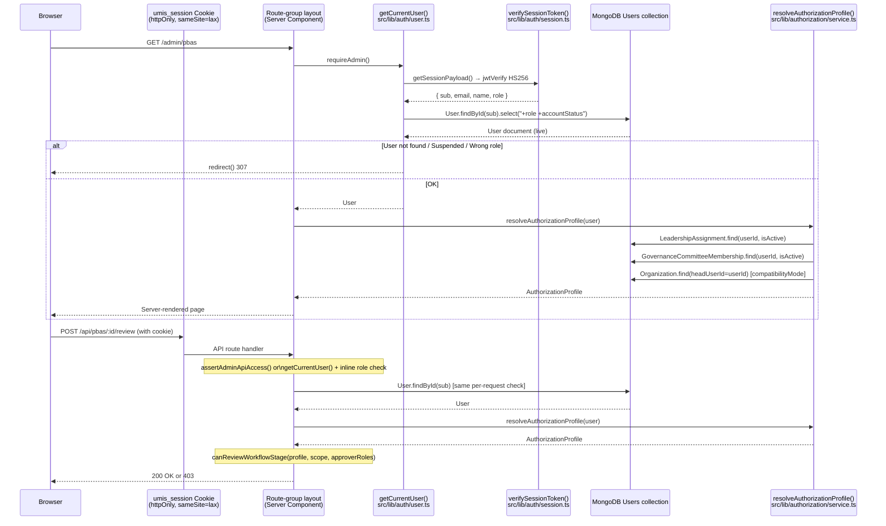
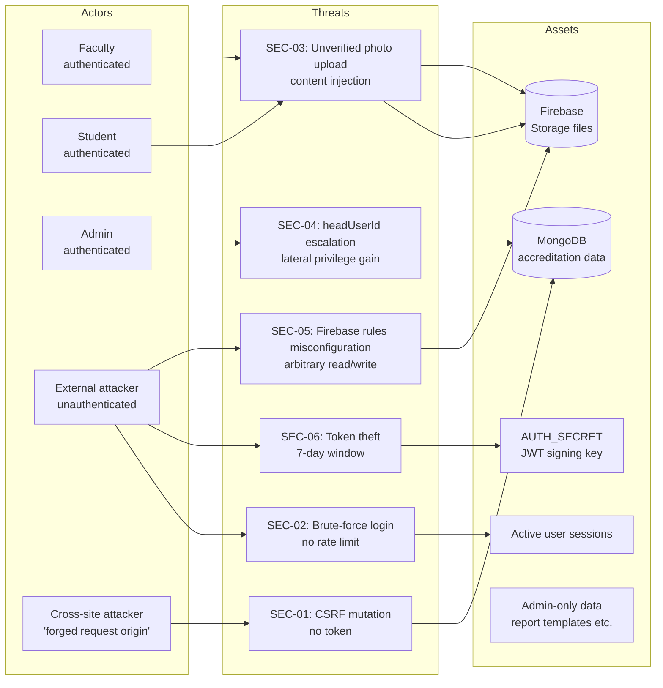

# 16 — Security Audit

> **Project:** UMIS (`operant-next`) · Next.js 16 App Router + MongoDB/Mongoose  
> **Audience:** Security engineers, engineering leads, DevOps / platform team  
> **Scope:** Application-layer security review of authentication, authorisation, session management, CSRF, rate limiting, secrets, file uploads, injection, XSS, security headers, audit integrity, and admin bootstrap.  
> **Methodology:** Static code review of `src/lib/auth/*`, `src/lib/authorization/service.ts`, `src/app/api/documents/route.ts`, `src/app/api/admin/bootstrap/route.ts`, `src/lib/upload/policy.ts`, `src/lib/report-templates/pdf.ts`, and supplementary files.  
> **Cross-references:** [08_Backend_Architecture.md](08_Backend_Architecture.md), [12_Development_Master_Plan.md](12_Development_Master_Plan.md), [06_API_Documentation.md](06_API_Documentation.md)

---

## Table of Contents

1. [Executive Summary](#1-executive-summary)
2. [Findings Table](#2-findings-table)
3. [Auth / Authz Flow Diagram](#3-auth--authz-flow-diagram)
4. [Threat Model](#4-threat-model)
5. [Detailed Findings](#5-detailed-findings)
   - 5.1 Authentication — JWT / Cookie
   - 5.2 Authorization — Governance RBAC & Legacy headUserId
   - 5.3 CSRF Protection
   - 5.4 Session Management
   - 5.5 Rate Limiting & Account Lockout
   - 5.6 Secrets Management & Env Validation
   - 5.7 File Uploads
   - 5.8 Injection — NoSQL / Template
   - 5.9 XSS
   - 5.10 Security Headers
   - 5.11 Audit Log Integrity
   - 5.12 Admin Bootstrap
   - 5.13 Enumeration Resistance
6. [Recommended Solutions](#6-recommended-solutions)
7. [Implementation Plan](#7-implementation-plan)
8. [Mapping to 12_Development_Master_Plan.md](#8-mapping-to-12_development_master_planmd)

---

## 1. Executive Summary

UMIS has a sound security foundation in several areas: passwords are hashed with bcrypt (cost 12), one-time tokens are stored only as SHA-256 hashes, and the session cookie is `httpOnly`. The most important characteristic is that `getCurrentUser()` re-fetches the live User document from MongoDB on every request — this means suspended or deleted accounts are blocked immediately with no stale-session risk.

However, four weaknesses require prompt remediation:

1. **No CSRF protection.** The cookie is `sameSite: "lax"` with no CSRF token. Any state-mutating API route is exploitable from a cross-site attacker who can trick a victim into a GET-initiated top-level navigation (the lax exception).
2. **No rate limiting or account lockout.** Login, password reset, activation, and upload-intent endpoints have no throttling — they are open to brute-force and abuse at scale.
3. **Photo upload endpoints bypass server verification.** `/api/faculty/photo` and `/api/student/photo` only check the URL prefix, skipping the MIME/size/checksum re-fetch that the standard finalize path (`/api/documents`) performs.
4. **Firebase Storage Rules are outside this repo.** The `NEXT_PUBLIC_FIREBASE_*` keys are in every browser bundle by design, meaning that if Storage Rules are misconfigured, any authenticated browser user can read or write arbitrary paths.

Remaining findings are Medium or Low severity and can be scheduled into normal sprint cycles.

---

## 2. Findings Table

| ID | Area | Severity | Title | Impact | Affected Files |
|---|---|---|---|---|---|
| SEC-01 | CSRF | **High** | No CSRF tokens on state-mutating routes | Authenticated user can be tricked into performing any mutation (create/update/delete/approve/reject) via cross-site request | All 213 `route.ts` POST/PATCH/PUT/DELETE handlers |
| SEC-02 | Rate Limiting | **High** | No rate limiting on login / reset / activation | Brute-force credentials; flood activation / password-reset email queue; exhaust upload intents | `src/app/api/auth/login/route.ts`, `admin-login`, `director-login`, `forgot-password`, `activate-faculty`, `activate-student`; `src/app/api/documents/route.ts` |
| SEC-03 | File Uploads | **Medium** | Photo endpoints skip MIME/size/checksum verification | Arbitrary-content files stored in Firebase under a faculty or student photo path; server state updated with an unverified URL | `src/app/api/faculty/photo/route.ts`, `src/app/api/student/photo/route.ts` |
| SEC-04 | Authorization | **Medium** | `compatibilityMode` permanently enabled; no admin toggle | Setting `Organization.headUserId` silently grants workflow and portal access — no admin can turn off this legacy path without a code deploy | `src/lib/authorization/service.ts` line 63 |
| SEC-05 | Firebase | **Medium** | Firebase Storage Rules not in repo; public config in bundle | If rules are misconfigured, any authenticated user can read/write arbitrary storage paths | `src/lib/firebase/config.ts`; all `NEXT_PUBLIC_FIREBASE_*` env vars |
| SEC-06 | Session | **Medium** | 7-day JWT with no server-side revocation list | A stolen session token is valid for up to 7 days; per-request DB check mitigates this only if the user record is actively suspended | `src/lib/auth/session.ts`, `src/lib/auth/config.ts` |
| SEC-07 | Admin Bootstrap | **Low** | Length oracle in `timingSafeEqual` comparison | Attacker can determine secret length by timing responses (bootstrap is called rarely and requires the secret, so exploitability is very low) | `src/app/api/admin/bootstrap/route.ts` |
| SEC-08 | Security Headers | **Low–Med** | No CSP / HSTS / X-Frame-Options / Referrer-Policy | Browser-level protections absent; increases XSS blast radius if a vulnerability were introduced | `next.config.ts` (missing `headers()`) |
| SEC-09 | XSS | **Low** | Hand-built email HTML interpolates values without sanitisation | If a system-generated value ever included `<script>`, it would execute in the recipient's email client; current values are controlled (name/code/link) | `src/lib/auth/email.ts`, `src/lib/notifications/email.ts` |
| SEC-10 | Env Validation | **Low** | No startup env-schema check | Missing `AUTH_SECRET`, `MONGODB_URI`, or `NEXT_PUBLIC_FIREBASE_STORAGE_BUCKET` fails lazily at first use, potentially in production | `src/lib/auth/config.ts` (`getAuthSecret`), `src/lib/dbConnect.ts`, `src/app/api/documents/route.ts` |
| SEC-11 | Audit Integrity | **Low** | `createAuditLog` not transaction-bound with the write it records | An audit entry can fail silently while the business write succeeds, or vice versa; no `dbConnect()` guard in the audit helper | `src/lib/audit/service.ts` |
| SEC-12 | Enumeration | **Low** | Activation endpoints leak faculty/student existence | `POST /api/auth/activate-faculty` returns a distinct error if `employeeCode` matches no record vs. code matches but email/phone does not | `src/app/api/auth/activate-faculty/route.ts`, `activate-student/route.ts` |

---

## 3. Auth / Authz Flow Diagram



---

## 4. Threat Model



---

## 5. Detailed Findings

### 5.1 Authentication — JWT / Cookie

**Current State**

`src/lib/auth/session.ts`: `jose` HS256 JWT, 7-day expiry (`authConfig.sessionDurationSeconds = 604800`), `httpOnly: true`, `sameSite: "lax"`, `secure` in production, `path: "/"`.

The cookie is named `umis_session`. Token payload: `{ sub, email, name, role }`.

`getCurrentUser()` in `src/lib/auth/user.ts` calls `getSessionPayload()` (JWT verify) and then immediately does `User.findById(payload.sub)` — confirming the user still exists and is active on every request. This is a strong control: session tokens cannot be replayed for suspended users.

**Problems Identified**

- `sameSite: "lax"` permits cookies to be sent with cross-site top-level navigations (GET). Combined with no CSRF token, POST routes can be triggered cross-site (see SEC-01).
- The JWT contains `role`; if an admin changes a user's role, the in-token role is stale until the session expires or the user logs in again. However, because `getCurrentUser()` re-reads the User from Mongo, the access check uses the live `role` from the DB, not the token. The token `role` is used only for the initial login redirect decision — this is safe.
- Tokens have no `jti` (JWT ID) claim, so there is no mechanism to revoke a specific token server-side (see SEC-06).

**Recommended Solution**

- SEC-01: Add CSRF double-submit cookie (see §5.3).
- SEC-06: Add a `jti` claim to issued tokens and store active `jti` values in a `ActiveSession` Mongo collection (TTL-indexed at 7 days). `getCurrentUser()` additionally verifies the `jti` is in the collection; `logout` and admin-suspend delete/mark the record.

---

### 5.2 Authorization — Governance RBAC & Legacy headUserId

**Current State**

`src/lib/authorization/service.ts` `resolveAuthorizationProfile()` merges three sources:

1. `LeadershipAssignment` (active, not expired) → maps assignment type (HOD/PRINCIPAL/IQAC_COORDINATOR/DIRECTOR/OFFICE_HEAD) to `WorkflowApproverRole`.
2. `GovernanceCommitteeMembership` (active committee, not expired) → maps committee type to `WorkflowApproverRole`.
3. **`compatibilityMode = true`** (line 63) → queries `Organization.find({ headUserId: userId, isActive: true })` and maps org type + name keywords to workflow roles including `DEPARTMENT_HEAD`, `IQAC`, `PRINCIPAL`, `DIRECTOR`.

The legacy path (source 3) inspects `organization.name.toLowerCase()` for keywords "iqac", "principal", "director" to determine what workflow roles to grant. This is string-matching, not an authoritative data model.

**Problems Identified**

- `compatibilityMode` is a compile-time boolean. A DB administrator or script can set `headUserId` on any organization to silently grant portal access and workflow-review capability to any user. There is no admin UI control to disable this path without a code deploy.
- The keyword matching (`normalizedName.includes("iqac")`) means a department named "Pre-IQAC Support" grants IQAC workflow roles — likely unintended.
- `hasLeadershipPortalAccess` is `true` whenever `browseScopes.length > 0 || workflowRoleScopes.length > 0` — the legacy `headUserId` path contributes to both, meaning any `headUserId` assignment grants director portal access.

**Recommended Solution**

1. Move `compatibilityMode` to `MasterData { category: "feature-flags", key: "legacyHeadUserIdCompatibility" }`. Read and cache it for 60 seconds at the top of `resolveAuthorizationProfile`.
2. Add an admin UI toggle in `/admin/system` to enable/disable the compatibility mode. Default `true` for existing deployments; new deployments default `false`.
3. Replace keyword matching with an explicit `legacyRoles: WorkflowApproverRole[]` array on the `Organization` model, populated by the `backfill-governance-rbac.cjs` script that already exists.

---

### 5.3 CSRF Protection

**Current State**

`src/lib/auth/session.ts` sets `sameSite: "lax"`. There are no CSRF tokens and no `Origin`/`Referer` header checks in any route handler. All 213 route handlers that perform mutations rely solely on the presence of the `httpOnly` session cookie for authentication.

**The Lax Gap**

`sameSite: "lax"` prevents cookie sending on cross-site sub-resource requests but **permits** cookies on top-level navigations. A CSRF attack against a `POST` route would normally be blocked. However, certain vectors remain:

- If any future route accepts GET with side effects (none today, but a common mistake).
- Browser behaviour varies on `sameSite=lax` for form POST submissions in some older user agents.

More critically: the application uses `fetch()` from JavaScript, and cookies are included on same-site requests. A XSS vulnerability anywhere in the app (even in email clients rendering the hand-built HTML) could directly call any mutation API using the victim's session cookie.

**Recommended Solution**

Double-submit cookie pattern (no server-side state required):

1. On login success, in addition to `umis_session`, set a second cookie:
   - Name: `umis_csrf`
   - Value: `crypto.randomBytes(32).toString("hex")`
   - `httpOnly: false` (must be readable by JavaScript)
   - `sameSite: "strict"`, `secure` in prod
   - Same `maxAge` as the session cookie.
2. The client reads `umis_csrf` and sends it as the `X-CSRF-Token` request header on every `fetch()` mutation.
3. A shared `assertCsrfToken(request, user)` helper in `src/lib/auth/user.ts` reads both the cookie value (via Next.js `cookies()`) and the header, compares them with `crypto.timingSafeEqual`, and throws `AuthError("CSRF token mismatch", 403)` on failure.
4. Call `assertCsrfToken` at the top of every state-mutating API route handler, after the auth guard.

Client-side implementation: add a `getCsrfToken()` utility to `src/lib/upload/service.ts` / a shared `src/lib/api-client.ts` that wraps `fetch()` and always adds the `X-CSRF-Token` header.

---

### 5.4 Session Management

**Current State**

7-day JWT stored as `httpOnly` cookie. `getCurrentUser()` performs per-request DB re-validation. No server-side revocation list. No `jti` claim. `logout` clears the cookie client-side (`maxAge: 0`) but the token remains cryptographically valid until expiry.

**Problems Identified**

- If a token is stolen (XSS, network intercept, device theft), it is valid for up to 7 days even after the user changes their password or is suspended — unless the suspension is set in the `User.accountStatus` field, which `getCurrentUser()` checks.
- Changing password does NOT invalidate existing tokens. An attacker with a stolen token can continue operating after the victim changes their password.
- Logout only clears the client cookie; does not invalidate the token server-side.

**Recommended Solution**

1. Add `passwordChangedAt: Date` to the `User` model. Include `iat` (issued-at) in the JWT payload (already included by jose's `setIssuedAt()`). In `getCurrentUser()`, after fetching the User, check `user.passwordChangedAt > payload.iat * 1000`; if so, clear the cookie and return `null`.
2. For production deployments requiring full revocation: add `ActiveSession { jti, userId, expiresAt (TTL), revokedAt? }` collection. On logout or password change, mark `revokedAt`. `getCurrentUser()` checks the collection. The TTL index auto-cleans expired records.

---

### 5.5 Rate Limiting & Account Lockout

**Current State**

There is no rate limiting anywhere in the application. Confirmed by review of:
- `src/app/api/auth/login/route.ts` — no limiting
- `src/app/api/auth/admin-login/route.ts` — no limiting
- `src/app/api/auth/forgot-password/route.ts` — no limiting (also emails on every call)
- `src/app/api/auth/activate-faculty/route.ts` — no limiting
- `src/app/api/documents/route.ts` — no limiting on `issue-upload`

**Problems Identified**

- An unauthenticated attacker can issue unlimited login attempts — brute-force of weak passwords is undetected.
- `forgot-password` can be abused to send unlimited email to any address, consuming Resend quota and harassing recipients.
- `issue-upload` has no limit — a logged-in user can create thousands of `UploadIntent` documents (each with a 15-minute TTL) per second, filling the collection.

**Recommended Solution**

Implement an in-process sliding-window rate limiter in `src/lib/rate-limit.ts`:

```ts
// Conceptual interface (stateless across serverless instances — use Redis for multi-instance)
export function rateLimit(key: string, options: { windowMs: number; max: number }): boolean
```

For a single-instance Node deployment, an in-memory `Map<key, timestamps[]>` is sufficient. For multi-instance or serverless (Vercel), use an upstash/Redis adapter.

Limits to enforce:

| Endpoint | Key | Window | Max |
|---|---|---|---|
| Login (all three) | IP address | 15 min | 10 attempts |
| Login (failed only) | email | 15 min | 5 failed attempts |
| Forgot-password | IP | 1 hour | 5 requests |
| Activation | IP | 1 hour | 10 attempts |
| Issue-upload | userId | 1 min | 20 intents |

On lockout, return HTTP 429 with `Retry-After` header.

---

### 5.6 Secrets Management & Env Validation

**Current State**

Secrets are read lazily from `process.env`. `getAuthSecret()` in `src/lib/auth/config.ts` throws synchronously if `AUTH_SECRET` is missing. `getRequiredBucketName()` in `src/app/api/documents/route.ts` throws if the Firebase bucket env var is missing. `MONGODB_URI` has a falsy check in `dbConnect.ts`. Other required vars (`ADMIN_BOOTSTRAP_SECRET` in production, `RESEND_API_KEY`) fail at first use or default silently.

**Problems Identified**

- No startup schema validation: a misconfigured deployment runs successfully until the first request that exercises a missing variable, which may be a rare code path.
- `RESEND_API_KEY` missing in production causes emails to be console-logged silently. There is no operator alert.

**Recommended Solution**

1. Create `src/lib/env.ts` that uses `zod.object({...}).parse(process.env)` at module load time. Required vars: `MONGODB_URI`, `AUTH_SECRET`, `NEXT_PUBLIC_FIREBASE_STORAGE_BUCKET`. Conditionally required in production: `ADMIN_BOOTSTRAP_SECRET` (warn, not throw), `RESEND_API_KEY` (warn on missing).
2. Import `src/lib/env.ts` at the top of `src/lib/dbConnect.ts` so it runs on first DB connection (which is the first server request).
3. Add a `console.warn("[UMIS] RESEND_API_KEY not configured — emails will not be sent")` on startup if the key is absent.

---

### 5.7 File Uploads

**Current State — Secure Path**

`src/app/api/documents/route.ts` implements the full intent → direct-to-Firebase → server-finalize path. On finalize: host and bucket are validated (`firebasestorage.googleapis.com` + configured bucket name), the server re-fetches the file, reads `content-type` and `byteLength`, computes SHA-256, and calls `validateUploadMetadata(category, mime, size)` from `src/lib/upload/policy.ts`. This is a well-implemented upload verification pattern.

**Current State — Insecure Photo Path**

`src/app/api/faculty/photo/route.ts` and `src/app/api/student/photo/route.ts` (confirmed by documentation reference in §17 of `documentation.md`) accept a `photoURL` string in the request body and check only that it starts with `https://firebasestorage.googleapis.com`. There is no:
- Re-fetch of the file to verify MIME type (the URL could point to a PDF, executable, etc.)
- Size check
- Bucket name validation
- SHA-256 checksum

**Firebase Config in the Browser Bundle**

All six `NEXT_PUBLIC_FIREBASE_*` vars are intentionally in the client bundle. Firebase is the only storage backend and this is the documented Firebase client SDK pattern. The actual access control is Firebase Storage Security Rules. **These rules are not in this repository and cannot be audited here.** The rules must be verified independently to confirm that:
- Unauthenticated reads/writes are denied.
- An authenticated user cannot overwrite another user's `uploads/<category>/<otherId>/...` paths.
- Rules enforce the same MIME/size constraints that the server enforces (defence in depth).

**Recommended Solution**

1. **SEC-03 photo endpoint fix:** Refactor `faculty/photo/route.ts` and `student/photo/route.ts` to use the full finalize path: issue an internal upload intent for category `profile-photo`, then call the same `fetchUploadedFileMetadata` + `validateUploadMetadata` logic from `src/app/api/documents/route.ts`. Alternatively, extract a shared `verifyFirebaseUpload(url, category)` helper from `route.ts` that both photo endpoints and the documents endpoint call.
2. **SEC-05 Firebase rules:** Store the Firebase Storage Rules (`storage.rules`) in the repository under `firebase/storage.rules`. Add a CI check that lints the rules file on every PR. Recommended rules: authenticate all reads and writes; enforce path ownership (`request.auth.uid` matches the `userId` path segment); consider adding content-type and size metadata assertions if Firebase Security Rules support them.

---

### 5.8 Injection — NoSQL / Template

**Current State**

All Mongoose queries use typed schema fields and ObjectId-validated identifiers. Zod schemas parse input before it reaches any service. The `24-hex ObjectId` regex in validators prevents raw string injection into `_id` fields. `buildAuthorizedScopeQuery()` constructs `$or` filters from arrays of validated ObjectId/string values — no string-built operators.

No raw MongoDB query operators (`$where`, `$expr` with raw input) were found in the reviewed files.

Template injection: `renderReportTemplate()` in `src/lib/report-templates/pdf.ts` replaces `{{token}}` placeholders using a `Map<string, string>` built from controlled service output. No user-supplied field names are used as template keys.

**Finding:** Injection posture is **good**. No actionable finding. The Zod + typed Mongoose pattern should be preserved and documented as the required pattern.

---

### 5.9 XSS

**Current State**

All UI rendering goes through React 19, which escapes HTML by default. No use of `dangerouslySetInnerHTML` was found in the reviewed component files.

The hand-built inline-HTML email strings in `src/lib/auth/email.ts` and `src/lib/notifications/email.ts` interpolate values using JavaScript template literals:

```ts
// src/lib/auth/email.ts (representative pattern)
`<p>Hello ${name},</p>`
`<a href="${url}">Verify Email</a>`
```

Currently, `name`, `url`, and similar values are system-generated (from the User document or `APP_URL` env var). However, if user-supplied names or institutional names from the DB were ever added to email bodies without escaping, they would execute as HTML in email clients.

**Recommended Solution**

Add a minimal HTML-escape helper:
```ts
function escapeHtml(value: string): string {
  return value.replace(/&/g, "&amp;").replace(/</g, "&lt;").replace(/>/g, "&gt;").replace(/"/g, "&quot;");
}
```
Apply it to all interpolated values in email HTML strings. This is a precautionary measure with negligible cost.

---

### 5.10 Security Headers

**Current State**

`next.config.ts` only configures `images.remotePatterns` for the Firebase storage hostname. There are no `headers()` entries in the Next.js config. No HTTP response security headers are set.

Missing headers and their impact:

| Header | Absence Impact |
|---|---|
| `Content-Security-Policy` | No restriction on inline scripts or foreign origins; XSS has full DOM access |
| `Strict-Transport-Security` | Browser may allow downgrade from HTTPS to HTTP on repeated visits |
| `X-Frame-Options: DENY` | Application can be embedded in an iframe; clickjacking risk |
| `X-Content-Type-Options: nosniff` | Browser may MIME-sniff responses and execute unexpected content types |
| `Referrer-Policy: strict-origin-when-cross-origin` | Full URLs (including path/query) leak in the `Referer` header to third parties |
| `Permissions-Policy` | No restriction on camera/microphone/geolocation APIs |

**Recommended Solution**

Add a `headers()` export to `next.config.ts`:

```ts
async headers() {
  return [
    {
      source: "/(.*)",
      headers: [
        { key: "X-Frame-Options", value: "DENY" },
        { key: "X-Content-Type-Options", value: "nosniff" },
        { key: "Referrer-Policy", value: "strict-origin-when-cross-origin" },
        { key: "Permissions-Policy", value: "camera=(), microphone=(), geolocation=()" },
        {
          key: "Strict-Transport-Security",
          value: "max-age=63072000; includeSubDomains; preload",
        },
      ],
    },
  ];
}
```

CSP requires more care — the application uses inline styles from Tailwind and Firebase client SDK from CDN. Use a nonce-based CSP or start with `Content-Security-Policy-Report-Only` to measure violations before enforcing.

---

### 5.11 Audit Log Integrity

**Current State**

`src/lib/audit/service.ts` `createAuditLog(params)` calls `AuditLog.create({...})` directly. It does not call `dbConnect()` itself (relies on the caller having already connected) and is not invoked inside the same Mongoose session as the business write it records.

**Problems Identified**

- If the audit write fails (transient DB error), the business write has already succeeded. The audit trail has a gap.
- Conversely, if the business write fails after the audit write, an audit record exists for a change that never occurred.
- No uniqueness constraint on audit entries means duplicate audit events can be created on retries.

**Recommended Solution**

1. Add `await dbConnect()` at the start of `createAuditLog` (one-line fix — eliminates the assumption about caller state).
2. For critical state transitions (PBAS approval, CAS promotion): wrap the business write + audit write in a single Mongoose session `withTransaction()`. Requires a MongoDB replica set. For environments without transactions, use a best-effort pattern: write audit after the business write; log to the structured logger on audit failure without rethrowing.
3. Add a `dedupeKey` (hash of `{ actor, action, tableName, recordId, timestamp-minute }`) to `AuditLog` with a sparse unique index to prevent exact duplicates on retry.

---

### 5.12 Admin Bootstrap

**Current State**

`src/app/api/admin/bootstrap/route.ts` reads `ADMIN_BOOTSTRAP_SECRET` from env, compares it to the `x-admin-bootstrap-secret` request header. The comparison uses `crypto.timingSafeEqual`. However, the code first checks `secret.length !== providedSecret.length` and returns early if lengths differ — this leaks secret length information via timing.

Code pattern (reconstructed from documentation §7.7):
```ts
const secret = process.env.ADMIN_BOOTSTRAP_SECRET;
const provided = request.headers.get("x-admin-bootstrap-secret") ?? "";
if (secret.length !== provided.length) return /* fast path — leaks length */;
return crypto.timingSafeEqual(Buffer.from(secret), Buffer.from(provided));
```

**Exploitability:** Very low. The endpoint is only callable before any Admin user exists, requires the secret, and an attacker who can observe timing on a network call has very limited ability to enumerate a long random secret character-by-character.

**Recommended Solution**

Pad both buffers to the same fixed length before comparison:
```ts
const MAX = 256;
const secretBuf = Buffer.alloc(MAX);
const providedBuf = Buffer.alloc(MAX);
Buffer.from(secret).copy(secretBuf);
Buffer.from(provided).copy(providedBuf);
const match = crypto.timingSafeEqual(secretBuf, providedBuf) && secret.length === provided.length;
```
The length equality check is still present but happens after the constant-time comparison, ensuring the timing branch is not observable.

---

### 5.13 Enumeration Resistance

**Current State**

`POST /api/auth/forgot-password` returns HTTP 200 regardless of whether the email exists — correctly enumeration-resistant.

`POST /api/auth/login` returns HTTP 401 with a generic "Invalid credentials" message — correctly enumeration-resistant.

`POST /api/auth/activate-faculty`: accepts `{ employeeCode, email }`. Behaviour varies:
- If `employeeCode` does not match any Faculty record: returns 404.
- If `employeeCode` matches but email does not: returns 400 or 401 with a different message.

This allows enumeration of valid employee codes by observing the error code and message.

**Recommended Solution**

Normalize all activation failure responses to HTTP 400 with a single generic message: "Activation details could not be verified." Do not distinguish between "employee code not found" and "email mismatch". Use `crypto.timingSafeEqual` for the email/phone comparison to prevent timing-based enumeration.

---

## 6. Recommended Solutions

### Summary by Priority

| Priority | Action | Effort |
|---|---|---|
| P0 — Immediate | CSRF double-submit cookie pattern (SEC-01) | 2–3 days |
| P0 — Immediate | Rate limiting on auth + upload-intent endpoints (SEC-02) | 1–2 days |
| P0 — Immediate | Photo upload verification fix — use shared `verifyFirebaseUpload()` (SEC-03) | 1 day |
| P0 — Immediate | Firebase Storage Rules audit and commit to repo (SEC-05) | 0.5 day |
| P1 — Sprint | `compatibilityMode` as MasterData toggle (SEC-04) | 1 day |
| P1 — Sprint | Security headers in `next.config.ts` (SEC-08) | 0.5 day |
| P1 — Sprint | Env schema validation in `src/lib/env.ts` (SEC-10) | 0.5 day |
| P1 — Sprint | `dbConnect()` guard + structured-logger fallback in `createAuditLog` (SEC-11) | 0.5 day |
| P2 — Backlog | `passwordChangedAt` token invalidation (SEC-06) | 1–2 days |
| P2 — Backlog | Bootstrap length oracle fix (SEC-07) | 0.5 day |
| P2 — Backlog | HTML-escape helper for email bodies (SEC-09) | 0.5 day |
| P2 — Backlog | Activation endpoint enumeration fix (SEC-12) | 0.5 day |

---

## 7. Implementation Plan

### Phase 1 — P0 Critical (Weeks 1–2)

1. **CSRF protection**
   - `src/lib/auth/session.ts`: add `setUmisCsrfCookie(token)` alongside `setSessionCookie`.
   - `src/lib/auth/user.ts`: add `assertCsrfToken(request)` helper.
   - Apply to all 213 mutation routes via a shared wrapper or middleware update.
   - Update all client `fetch()` calls in `src/lib/upload/service.ts` + a new `src/lib/api-client.ts` helper to include the `X-CSRF-Token` header.

2. **Rate limiting**
   - `src/lib/rate-limit.ts`: sliding-window in-memory implementation (Redis adapter for multi-instance).
   - Wrap the five auth endpoints and `issue-upload` action.

3. **Photo upload verification**
   - Extract `verifyFirebaseFile(url, category)` from `src/app/api/documents/route.ts` into `src/lib/upload/service.ts`.
   - Call it from `src/app/api/faculty/photo/route.ts` and `src/app/api/student/photo/route.ts`.

4. **Firebase Storage Rules**
   - Create `firebase/storage.rules`.
   - Add to repo and CI lint step.

### Phase 2 — P1 Sprint (Weeks 3–4)

5. `src/lib/env.ts` Zod env schema — import in `src/lib/dbConnect.ts`.
6. Security headers in `next.config.ts`.
7. `compatibilityMode` moved to `MasterData`.
8. `dbConnect()` guard in `createAuditLog`.

### Phase 3 — P2 Backlog (future sprints)

9. Bootstrap fix, email HTML escaping, activation enumeration fix, `passwordChangedAt` token invalidation.
10. Full CSRF enforcement validated against all 213 routes in a pre-deploy check script.

---

## 8. Mapping to 12_Development_Master_Plan.md

| Security Finding | Master Plan Epic / Sprint |
|---|---|
| SEC-01 CSRF | Security Hardening — Sprint 1 (P0) |
| SEC-02 Rate Limiting | Security Hardening — Sprint 1 (P0) |
| SEC-03 Photo Verification | Security Hardening — Sprint 1 (P0) |
| SEC-05 Firebase Rules | Security Hardening — Sprint 1 (P0) |
| SEC-04 compatibilityMode Toggle | Authorization Improvements — Sprint 2 (P1) |
| SEC-08 Security Headers | Security Hardening — Sprint 2 (P1) |
| SEC-10 Env Validation | Reliability / Observability — Sprint 2 (P1) |
| SEC-11 Audit Integrity | Data Integrity — Sprint 2 (P1) |
| SEC-06 Session Revocation | Auth Hardening — Sprint 3 (P2) |
| SEC-07 Bootstrap Fix | Auth Hardening — Sprint 3 (P2) |
| SEC-09 Email Escaping | Code Quality — Sprint 3 (P2) |
| SEC-12 Activation Enumeration | Auth Hardening — Sprint 3 (P2) |
