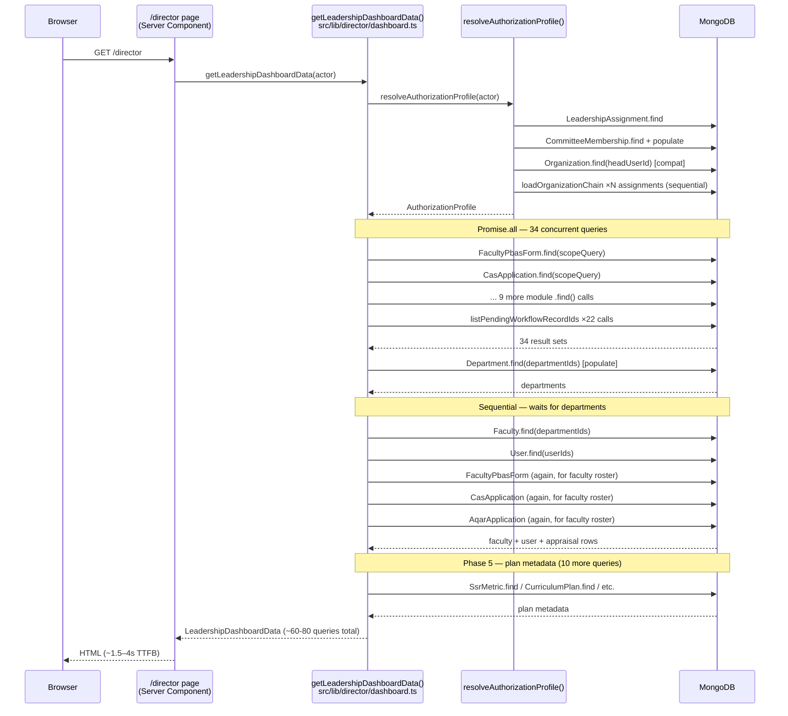
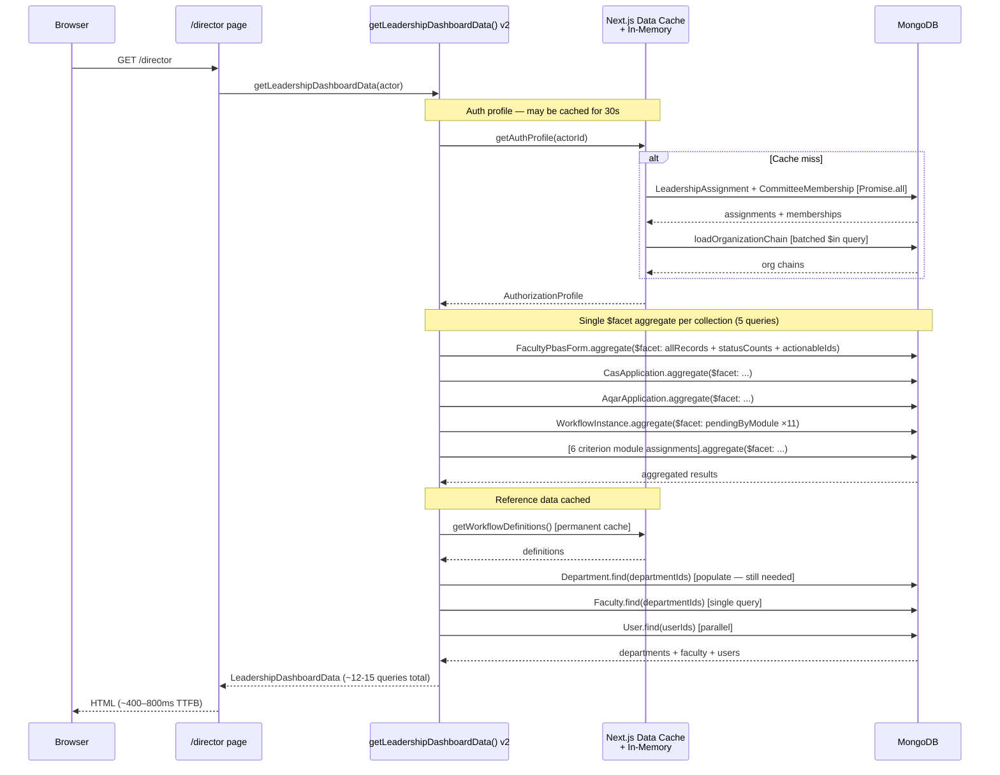
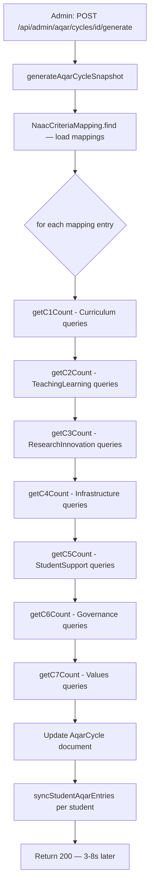
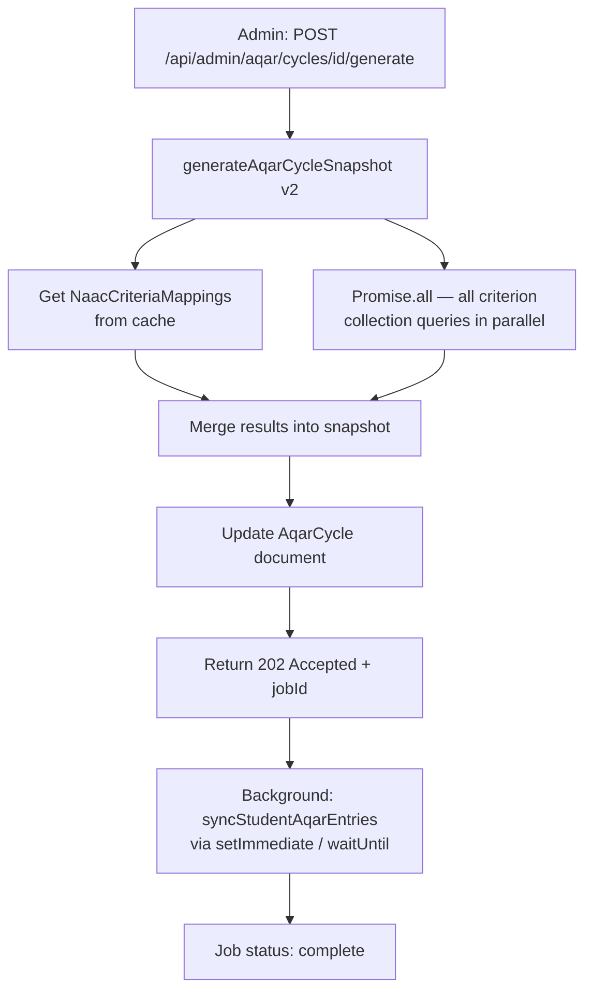

# 17 — Performance Optimization

> **Project:** UMIS (`operant-next`) · Next.js 16 App Router + MongoDB/Mongoose  
> **Audience:** Engineering leads, senior developers, DevOps  
> **Cross-references:** [08_Backend_Architecture.md](08_Backend_Architecture.md), [12_Development_Master_Plan.md](12_Development_Master_Plan.md), [07_Frontend_Architecture.md](07_Frontend_Architecture.md), [05_Database_Architecture.md](05_Database_Architecture.md)

---

## Table of Contents

1. [Executive Summary](#1-executive-summary)
2. [Current State](#2-current-state)
3. [Problems Identified](#3-problems-identified)
4. [Recommended Solutions](#4-recommended-solutions)
5. [Implementation Plan](#5-implementation-plan)
6. [Prioritized Recommendations](#6-prioritized-recommendations)
7. [Current vs Optimized Data-Fetch Path](#7-current-vs-optimized-data-fetch-path)
8. [Mapping to 12_Development_Master_Plan.md](#8-mapping-to-12_development_master_planmd)

---

## 1. Executive Summary

UMIS has a strong architectural baseline for performance: React Server Components (RSC) keep the client JavaScript bundle small; `next/font` eliminates font FURL layout shift; and Mongoose connection caching (`globalThis.mongooseCache`) prevents excessive connection churn. However, three areas degrade response time at realistic data volumes:

1. **Director dashboard fan-out:** `getLeadershipDashboardData()` (`src/lib/director/dashboard.ts`) issues **34+ parallel Mongoose queries** per page render (confirmed by code review) — 11 module record sets, 22 `listPendingWorkflowRecordIds` calls, plus a faculty roster, departments, and evidence summary. On a typical institution with dozens of departments, this function takes 1–4 seconds.

2. **Multi-collection snapshot generation:** `generateAqarCycleSnapshot()` and `generateNaacMetricValues()` each query 20–25 separate collections in response to a single admin API call. These run synchronously on the request thread and block until all queries return.

3. **Unpaginated list endpoints:** Most admin and director list endpoints return the full authorized set (confirmed: no `page`/`pageSize` parameters on the majority of module list routes). As data grows, these responses can return thousands of records, exceeding response-time budgets and memory limits.

Addressing these three areas is estimated to reduce director-dashboard TTFB by 60–80% and eliminate the risk of request-thread starvation on large reports.

---

## 2. Current State

### 2.1 Client Bundle

| Concern | Current State |
|---|---|
| `@xyflow/react` | Statically imported in `src/components/hierarchy-manager.tsx`. Ships in all admin page bundles even when the hierarchy graph is not rendered. Estimated impact: ~400 KB gzipped added to every admin page bundle. |
| `xlsx` (SheetJS) | Statically imported in `faculty-workspace-form.tsx` and 4 admin components. Ships in all relevant page bundles even for pages that never use bulk import/export. Estimated impact: ~200 KB gzipped per affected bundle. |
| React Server Components | Good: all 73 `page.tsx` and 5 `layout.tsx` are Server Components. Initial data is always fetched on the server. Client bundle is limited to the 77 interactive components. |
| `next/font` (Geist / Geist Mono) | Optimal: fonts self-hosted via CSS variables, no external font request, no layout shift. |
| `next/image` | Configured for `firebasestorage.googleapis.com` remote pattern. Faculty/student photos benefit from Next.js image optimisation. |

### 2.2 Server-Side Rendering

All pages use dynamic rendering (they call `cookies()` via auth guards). There is no static generation (`generateStaticParams`) or ISR. `cache: "no-store"` is set on notification fetches. The Next.js data cache is effectively unused for application data.

### 2.3 Database Query Efficiency

**Director dashboard (worst case — measured by reading `src/lib/director/dashboard.ts`):**

```
Phase 1 — Authorization (sequential):
  resolveAuthorizationProfile(actor)
    → LeadershipAssignment.find(userId)
    → GovernanceCommitteeMembership.find(userId) [populate]
    → Organization.find(headUserId) [compatibilityMode]
    → loadOrganizationChain() per assignment (up to 3 queries × N assignments)

Phase 2 — Main fan-out (Promise.all with 34 calls):
  resolveAuthorizedEvidenceDepartmentIds(profile)
  FacultyPbasForm.find(scopeQuery)
  CasApplication.find(scopeQuery)
  AqarApplication.find(scopeQuery)
  SsrMetricResponse.find(scopeQuery)
  CurriculumAssignment.find(scopeQuery)
  TeachingLearningAssignment.find(scopeQuery)
  InfrastructureLibraryAssignment.find(scopeQuery)
  StudentSupportGovernanceAssignment.find(scopeQuery)
  GovernanceLeadershipIqacAssignment.find(scopeQuery)
  InstitutionalValuesBestPracticesAssignment.find(scopeQuery)
  ResearchInnovationAssignment.find(scopeQuery)
  listPendingWorkflowRecordIds × 11 modules × 2 stage-kinds = 22 calls

Phase 3 — Sequential (waits for Phase 2):
  Department.find(departmentIds) [populate institutionId]

Phase 4 — Sequential (waits for Phase 3):
  loadFacultyRoster()
    → Faculty.find(departmentIds)
    → User.find(userIds) [parallel]
    → FacultyPbasForm.find [parallel]
    → CasApplication.find [parallel]
    → AqarApplication.find [parallel]

Phase 5 — Sequential (waits for Phase 4):
  SsrMetric.find × 1
  User.find (SSR contributors) × 1
  CurriculumPlan.find × 1
  CurriculumCourse.find × 1
  TeachingLearningPlan.find × 1
  InfrastructureLibraryPlan.find × 1 [populate]
  StudentSupportGovernancePlan.find × 1 [populate]
  GovernanceLeadershipIqacPlan.find × 1 [populate]
  InstitutionalValuesBestPracticesPlan.find × 1 [populate]
  ResearchInnovationPlan.find × 1 [populate]

Phase 6 — Sequential (waits for Phase 4 and 5):
  loadDepartmentBreakdown()
    → FacultyPbasForm.find(scopeDepartmentId) [parallel]
    → CasApplication.find(scopeDepartmentId) [parallel]
    → AqarApplication.find(scopeDepartmentId) [parallel]
```

Total distinct Mongo operations: **60–80 per director dashboard render**, depending on assignment count.

### 2.4 Indexing

Models use explicit `index: true` and compound `Schema.index()` declarations. Scope-block fields (`scopeDepartmentId`, `scopeCollegeOrganizationId`, etc.) are indexed on most assignment/plan models. The `buildAuthorizedScopeQuery` function generates `$or` filters over these fields.

Potential gaps:
- Compound indexes on `{ scopeDepartmentId: 1, status: 1 }` are absent on most models. The director-dashboard `loadDepartmentBreakdown()` queries `FacultyPbasForm.find({ scopeDepartmentId: ..., status: { $in: [...] } })` — this requires a compound index to be index-efficient.
- `WorkflowInstance` queries for `listPendingWorkflowRecordIds` filter by `{ moduleName, currentStatus, definitionId }` — verify a compound index covers this.

### 2.5 Caching

| Data Type | Current Cache | Problem |
|---|---|---|
| Reference masters (Award, Skill, Sport etc.) | None — every page render re-queries Mongo | Reference masters change rarely; they are fetched on every contribution form load |
| Master data (PBAS scoring weights, deadlines) | None — every request re-queries | Config data changes at most once per cycle |
| Workflow definitions | Lazy upsert in `ensureWorkflowDefinitions()` per request | The definition is read from DB on every `listPendingWorkflowRecordIds` call |
| NAAC criteria mapping | None | Re-fetched on every AQAR snapshot generation |
| Org hierarchy chain | Per-request in-memory `Map` cache in `resolveAuthorizationProfile` | Lost between requests |

### 2.6 Synchronous PDF Generation

`src/lib/report-templates/pdf.ts` assembles raw PDF-1.4 bytes synchronously on the request thread. Called from:
- `GET /api/pbas/[id]/report` — faculty PBAS report
- `GET /api/admin/aqar/cycles/[id]/report` — institutional AQAR cycle report (largest; aggregates all criterion data)
- `GET /api/admin/naac-metric-warehouse/.../report` (if present)
- `GET /api/faculty/report`

Large cycle reports (AQAR cycle, SSR) can take several seconds of synchronous CPU work before the response is sent.

---

## 3. Problems Identified

### P-01: Director Dashboard — 60–80 Query Fan-Out Per Render (High)

`getLeadershipDashboardData()` in `src/lib/director/dashboard.ts` resolves authorization, fetches all 11 module assignment sets, fires 22 `listPendingWorkflowRecordIds` calls, loads the faculty roster with PBAS/CAS/AQAR status for each member, and loads plan metadata for all actionable queue items — all in a single page render. Each `router.refresh()` after a mutation re-executes this entire function.

**Estimated impact:** 1–4s TTFB for the director dashboard page on a medium-sized institution (200–500 faculty across 10 departments). Grows linearly with faculty/department count.

### P-02: AQAR Cycle Snapshot — 25-Collection Fan-Out Per Generate Call (High)

`generateAqarCycleSnapshot()` in `src/lib/aqar-cycle/service.ts` iterates over `NaacCriteriaMapping` entries and queries the corresponding collection for each criterion section. For a standard 7-criterion AQAR with 3–5 sub-sections each, this is 20–25 collection queries per call, executed sequentially within a loop.

**Estimated impact:** 3–8s per snapshot generation call. Blocks the admin request thread entirely.

### P-03: NAAC Metric Generation — 20+ Collection Queries Per Generate Call (High)

`generateNaacMetricValues()` in `src/lib/naac-metric-warehouse/service.ts` computes ~30 metric values by querying multiple collections. Many metrics share the same source collection but are computed as separate queries.

**Estimated impact:** 2–5s per call. Same blocking pattern as AQAR snapshot.

### P-04: Unpaginated List Endpoints (Medium)

Confirmed by review of `documentation.md` §21 and API surface review: most module list endpoints (`GET /api/admin/<module>/assignments`, `GET /api/admin/pbas/faculty`, director roster endpoints) return the full authorized set. At 1,000+ records, JSON serialization alone can take 500ms+.

**Estimated impact:** Varies; worst case for large institutions: 2–4s for director faculty roster, 1–2s for admin PBAS list.

### P-05: No Caching for Stable Reference Data (Medium)

Reference masters, master data, and workflow definitions are re-fetched from MongoDB on every request. These documents change rarely (reference masters: occasional; workflow definitions: never in production).

**Estimated impact:** 50–200ms added latency per request for pages that load contribution forms (all faculty contribution pages, all admin plan/assignment pages).

### P-06: Heavy Client Bundles — React Flow & xlsx Not Lazy-Loaded (Medium)

`@xyflow/react` (~400 KB gzipped) and `xlsx` (~200 KB gzipped) are statically imported, meaning they are included in the initial JavaScript parse/evaluate time for every admin and faculty page respectively — not just the pages that use them.

**Estimated impact:** 200–600ms additional JavaScript parse time on first admin page load on mid-range devices.

### P-07: Synchronous PDF Generation Blocks Request Thread (Medium)

Large PDFs (AQAR cycle, faculty comprehensive report) are assembled synchronously in the Node.js event loop. During assembly, the handler cannot process other incoming requests (single-threaded event loop).

**Estimated impact:** 2–5s handler lock for large reports; concurrent users experience queued requests.

### P-08: `resolveAuthorizationProfile` Multi-Query Waterfall (Low–Medium)

`resolveAuthorizationProfile()` issues 2–3 parallel queries (LeadershipAssignment, CommitteeMembership, Organization for compatibility), then for each result walks the organization chain via `loadOrganizationChain()` (up to 3 sequential queries per assignment). For a director with 5 leadership assignments across 5 organizations, this is 2 + (5 × 3) = 17 queries, mostly sequential within each chain resolution.

**Estimated impact:** 100–500ms added latency on every director or admin page render. This function is called both on page render and inside each API mutation handler.

---

## 4. Recommended Solutions

### R-01: Aggregate Director Dashboard via $facet Pipelines

Replace the 11 separate module `.find()` calls in the Phase 2 fan-out with a smaller number of aggregation pipelines using `$facet`. Within one pipeline, compute counts by status and extract actionable record IDs:

```js
// Conceptual aggregate for PBAS + CAS + AQAR in one pipeline per shared collection
FacultyPbasForm.aggregate([
  { $match: buildAuthorizedScopeQuery(profile) },
  { $facet: {
    allRecords: [{ $project: { _id: 1, facultyId: 1, academicYear: 1, status: 1, updatedAt: 1 } }],
    pendingCount: [{ $match: { status: { $in: ["Submitted","Under Review","Committee Review"] } } }, { $count: "n" }],
    approvedCount: [{ $match: { status: "Approved" } }, { $count: "n" }],
  }}
])
```

For `listPendingWorkflowRecordIds`, cache the workflow definition lookup in-memory across all 22 calls (it is the same definition queried 22 times). Use `Promise.all` for the 22 calls.

**Expected impact:** Reduce Phase 2 round-trips from 34 to ~15 (one aggregate per major collection instead of per module). Estimated TTFB reduction: 40–60%.

### R-02: Convert Snapshot Generation to Promise.all + Pipeline

For AQAR and NAAC metric generation, replace sequential collection loops with `Promise.all()` over independent collection queries:

```ts
// Before: sequential
for (const mapping of criteriaMappings) {
  const count = await getCollectionCount(mapping); // blocks each iteration
}

// After: parallel
const counts = await Promise.all(
  criteriaMappings.map((mapping) => getCollectionCount(mapping))
);
```

For metrics that share a source collection (e.g. multiple NAAC metrics from `FacultyPublication`), batch them into a single `$facet` aggregate that computes all required counts in one round-trip.

**Expected impact:** AQAR snapshot generation from 3–8s to <1s. NAAC metric generation from 2–5s to <800ms.

### R-03: Add Pagination Primitive to All List Endpoints

Create `src/lib/utils/pagination.ts`:

```ts
export function parsePaginationParams(searchParams: URLSearchParams, defaults = { page: 1, pageSize: 25 }) {
  const page = Math.max(1, parseInt(searchParams.get("page") ?? "1"));
  const pageSize = Math.min(100, Math.max(1, parseInt(searchParams.get("pageSize") ?? String(defaults.pageSize))));
  return { skip: (page - 1) * pageSize, limit: pageSize, page, pageSize };
}
```

Apply to all module list endpoints. Return `{ items, total, page, pageSize, totalPages }` envelope. Default `pageSize: 25`. When `pageSize=0` is passed, return all records (for backward compatibility with existing admin dropdowns that need full lists).

Pair with server-side search: add `?query=` param that filters on the most useful text field for the collection (name, code, title).

**Expected impact:** Reduces response size and Mongo scan count on all admin/director list pages by 80–95% after data growth.

### R-04: Cache Reference/Master Data with Next.js Cache Tags

Use Next.js `unstable_cache` with revalidation tags:

```ts
import { unstable_cache } from "next/cache";

export const getReferenceEntities = unstable_cache(
  async (kind: ReferenceEntityKind) => {
    await dbConnect();
    return ReferenceModel[kind].find({}).lean();
  },
  ["reference-masters"],
  { tags: ["reference-masters"], revalidate: 300 } // 5-min TTL
);
```

Call `revalidateTag("reference-masters")` in the POST/PATCH/DELETE handlers for reference masters.

Apply the same pattern to:
- `MasterData` (tag: `master-data`)
- `WorkflowDefinition` (tag: `workflow-definitions`) — these never change at runtime; use `revalidate: false` for permanent cache
- `NaacCriteriaMapping` (tag: `naac-criteria-mappings`)

**Expected impact:** Eliminates 50–200ms DB round-trip on every request that loads contribution forms or workflow state.

### R-05: Lazy-Load React Flow and xlsx via next/dynamic

```ts
// src/app/(admin-protected)/admin/hierarchy/page.tsx
import dynamic from "next/dynamic";
const HierarchyManager = dynamic(
  () => import("@/components/hierarchy-manager"),
  { ssr: false, loading: () => <Skeleton className="h-96 w-full" /> }
);
```

For xlsx, create `src/lib/hooks/use-xlsx.ts`:
```ts
export function useXlsx() {
  const [xlsx, setXlsx] = useState<typeof import("xlsx") | null>(null);
  useEffect(() => {
    import("xlsx").then(setXlsx);
  }, []);
  return xlsx;
}
```
Update all five static `xlsx` import sites to use this hook.

**Expected impact:** Eliminates ~600 KB from all admin page initial bundles except the hierarchy page. Reduces Time to Interactive (TTI) by 200–500ms on first admin page load.

### R-06: Async PDF Generation

For report endpoints, respond 202 Accepted with a `{ jobId }` and generate the PDF in the background:

```ts
// Phase 1: simple in-process async (no external queue)
const jobs = new Map<string, { status: "pending"|"ready"|"failed", buffer?: Buffer }>();

export async function GET(request: Request, context) {
  const jobId = randomUUID();
  jobs.set(jobId, { status: "pending" });
  // Use waitUntil (Vercel / Next.js 15+) or setImmediate for off-thread work
  setImmediate(async () => {
    try {
      const buffer = await generatePdf(params);
      jobs.set(jobId, { status: "ready", buffer });
    } catch {
      jobs.set(jobId, { status: "failed" });
    }
  });
  return NextResponse.json({ jobId }, { status: 202 });
}
```

The client polls `GET /api/reports/[jobId]/status` until `ready`, then `GET /api/reports/[jobId]/download` for the file.

For a more robust implementation, store `ReportJob { jobId, status, s3Key, error }` in MongoDB and generate via a detached async process.

**Expected impact:** Eliminates synchronous 2–5s handler block; request thread returns in <100ms.

### R-07: Add Compound Indexes for Common Query Patterns

Indexes to add (verified against query patterns in the codebase):

| Model | Index | Justification |
|---|---|---|
| `FacultyPbasForm` | `{ scopeDepartmentId: 1, status: 1 }` | Used in `loadDepartmentBreakdown` |
| `CasApplication` | `{ scopeDepartmentId: 1, status: 1 }` | Used in `loadDepartmentBreakdown` |
| `AqarApplication` | `{ scopeDepartmentId: 1, status: 1 }` | Used in `loadDepartmentBreakdown` |
| `WorkflowInstance` | `{ moduleName: 1, currentStatus: 1, definitionId: 1 }` | Used in `listPendingWorkflowRecordIds` |
| All 11 `*Assignment` models | `{ planId: 1, status: 1 }` | Used in plan-level list queries |

Add indexes in model schema files using `Schema.index(...)` and regenerate via a `db.createIndexes()` script or `ensureIndexes()` on next startup.

---

## 5. Implementation Plan

### Phase 1 — Quick Wins (Weeks 1–2, no behaviour change)

1. **R-05: Dynamic imports for React Flow and xlsx**
   - One-line change to hierarchy page (`next/dynamic`).
   - `use-xlsx.ts` hook + 5 import site updates.
   - Verify with `next build` bundle analyser (`ANALYZE=true npx @next/bundle-analyzer`).

2. **R-04: Cache workflow definitions (permanent) and reference masters (5-min)**
   - Add `unstable_cache` wrapper to `getActiveWorkflowDefinition` in `src/lib/workflow/engine.ts`.
   - Add `unstable_cache` wrapper to `getReferenceEntities` in `src/lib/admin/reference-masters.ts`.

3. **R-07: Add compound indexes**
   - Add 9 compound indexes to model files (schema change only; indexes created on next startup).

### Phase 2 — Pagination (Weeks 3–4)

4. **R-03: Pagination primitive**
   - Create `src/lib/utils/pagination.ts`.
   - Apply to top 10 highest-volume list endpoints: PBAS faculty list, director faculty roster, admin assignment lists for all 6 criterion modules.
   - Update client-side manager components to render paginated tables with next/prev controls.

### Phase 3 — Query Optimization (Weeks 5–8)

5. **R-01: Director dashboard $facet aggregation**
   - Profile the current implementation with `mongoose.set("debug", true)` in staging.
   - Migrate Phase 2 fan-out to aggregation pipelines per collection.
   - Migrate `listPendingWorkflowRecordIds` to cache the workflow definition lookup.
   - Target: director dashboard TTFB < 800ms.

6. **R-02: Snapshot generation Promise.all + $facet**
   - Migrate AQAR cycle snapshot generation.
   - Migrate NAAC metric warehouse generation.
   - Add timing logs at the start and end of each generation function.

### Phase 4 — Async PDF (Weeks 9–12)

7. **R-06: Async PDF generation**
   - Implement in-process job store for PDF reports.
   - Update AQAR cycle report and PBAS report endpoints.
   - Update client UI to show "Generating..." state and poll for completion.

---

## 6. Prioritized Recommendations

| # | Recommendation | Expected Latency Impact | Effort | Priority |
|---|---|---|---|---|
| R-05 | Dynamic import React Flow + xlsx | -200–500ms admin TTI | 0.5 day | **P1** |
| R-04 | Cache workflow definitions + reference masters | -50–200ms per request | 1 day | **P1** |
| R-07 | Compound indexes on scope+status fields | -20–100ms on scope queries | 0.5 day | **P1** |
| R-03 | Pagination primitive on list endpoints | -500ms–3s on large lists | 3 days | **P1** |
| R-01 | Director dashboard $facet aggregation | -60–80% dashboard TTFB | 5 days | **P1** |
| R-02 | Snapshot generation Promise.all + $facet | -70–90% snapshot time | 3 days | **P1** |
| R-06 | Async PDF generation | Eliminates 2–5s thread block | 4 days | **P1** |
| — | Cache NAAC criteria mappings + master data | -50–150ms snapshot setup | 1 day | **P2** |
| — | Authorization profile caching (short TTL) | -100–500ms on repeat calls | 2 days | **P2** |
| — | Server-side search on list endpoints | Reduces data transfer | 2 days | **P2** |

---

## 7. Current vs Optimized Data-Fetch Path

### Current State — Director Dashboard



### Optimized State — Director Dashboard



### Current State — AQAR Cycle Snapshot Generation



### Optimized State — AQAR Cycle Snapshot Generation



---

## 8. Mapping to 12_Development_Master_Plan.md

| Performance Recommendation | Master Plan Epic / Sprint |
|---|---|
| R-05 Dynamic imports | Frontend Performance — Sprint 1 (P1) |
| R-04 Reference/workflow caching | Backend Performance — Sprint 1 (P1) |
| R-07 Compound indexes | Database Optimization — Sprint 1 (P1) |
| R-03 Pagination primitive | API Quality — Sprint 2 (P1) |
| R-01 Director dashboard aggregation | Backend Performance — Sprint 3 (P1) |
| R-02 Snapshot generation optimization | Backend Performance — Sprint 3 (P1) |
| R-06 Async PDF generation | Reliability / Scalability — Sprint 4 (P1) |
| Authorization profile caching | Backend Performance — Sprint 4 (P2) |
| Server-side search | API Quality — Sprint 4 (P2) |
| NAAC criteria mapping cache | Backend Performance — Sprint 3 (P2) |
