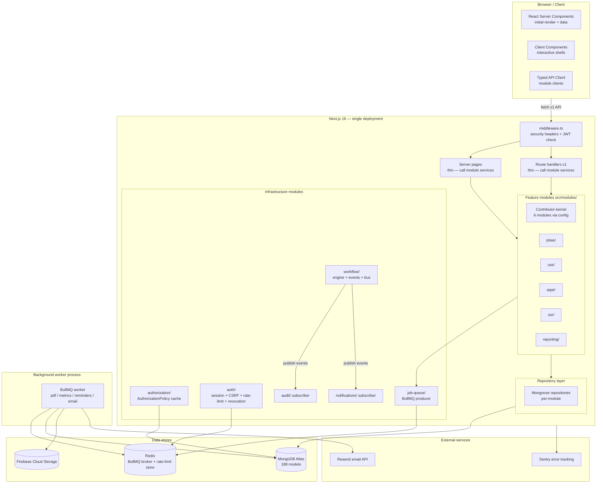
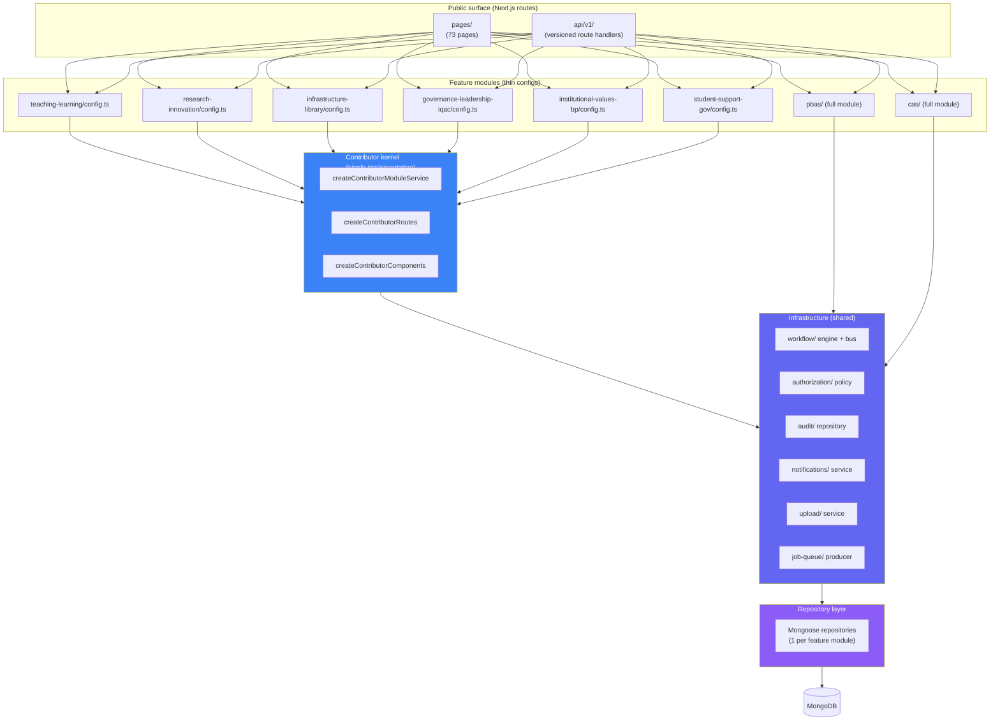
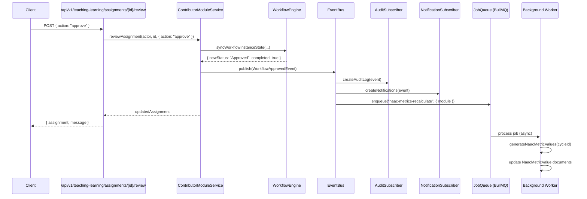

# 19 — Future Architecture

> **Project:** UMIS / `operant-next`
> **Status:** North-star design. This document defines the ideal enterprise target state that `11_Refactoring_Strategy.md` and `12_Development_Master_Plan.md` incrementally move toward.
> **Cross-references:** `02_Current_Architecture.md` (what exists today) · `06_API_Documentation.md` · `07_Frontend_Architecture.md` · `08_Backend_Architecture.md` · `09_Code_Quality_Report.md` · `10_Technical_Debt_Report.md` · `11_Refactoring_Strategy.md` · `12_Development_Master_Plan.md` · `14_Testing_Strategy.md` · `15_Deployment_Architecture.md` · `16_Security_Audit.md` · `17_Performance_Optimization.md` · `18_Coding_Standards.md`
> **Authoritative grounding:** `documentation.md` §3 (architecture), §7 (auth/authz), §9.5–9.6 (workflow engine), §10.7 (six contributor modules), §23 (code quality), §27 (known issues), §28 (recommendations)

---

## Table of Contents

1. [Current State Summary](#1-current-state-summary)
2. [Problems Identified — Architectural Drivers](#2-problems-identified--architectural-drivers)
3. [Recommended Target Architecture](#3-recommended-target-architecture)
   - 3.1 [Feature-Based / Domain-Driven Module Organization](#31-feature-based--domain-driven-module-organization)
   - 3.2 [Shared UI Component Library and Design System](#32-shared-ui-component-library-and-design-system)
   - 3.3 [Versioned, Typed API Layer with OpenAPI](#33-versioned-typed-api-layer-with-openapi)
   - 3.4 [Service Layer and Repository Pattern](#34-service-layer-and-repository-pattern)
   - 3.5 [Unified Validation Layer (Shared Zod Schemas)](#35-unified-validation-layer-shared-zod-schemas)
   - 3.6 [Authentication and Authorization Hardening](#36-authentication-and-authorization-hardening)
   - 3.7 [Event-Driven Workflow Architecture](#37-event-driven-workflow-architecture)
   - 3.8 [Background Processing and Job Queue](#38-background-processing-and-job-queue)
   - 3.9 [Contributor Module Kernel — Eliminating 6-Way Duplication](#39-contributor-module-kernel--eliminating-6-way-duplication)
   - 3.10 [Scalability and Maintainability](#310-scalability-and-maintainability)
4. [Target Architecture Diagrams](#4-target-architecture-diagrams)
5. [Current vs Target Comparison Table](#5-current-vs-target-comparison-table)
6. [Migration Path](#6-migration-path)

---

## 1. Current State Summary

UMIS is today a **modular monolith**: a single Next.js 16 deployment serving 73 pages, 213 API route handlers, and a domain layer of 97 `lib` modules backed by 188 Mongoose models. The defining architectural strengths — a generic workflow engine, governance-driven RBAC, thin handlers over fat services, and a clean RSC/client split — give the system remarkable consistency for its size.

The six primary weaknesses driving this future-architecture plan are all documented in `02_Current_Architecture.md` and `documentation.md` §27:

1. **Near-zero automated test coverage** (4 tests for 188 models and 213 handlers).
2. **6-way code duplication** across the six criterion contributor modules (Teaching-Learning, Research-Innovation, Infrastructure-Library, Governance-Leadership-IQAC, Institutional-Values-Best-Practices, Student-Support-Governance).
3. **Monolithic service files** (`lib/pbas/service.ts` ~2500 lines; `lib/accreditation/service.ts` comparable).
4. **No background job processing** — notifications, reminders, PDF generation, and metric aggregation are all synchronous on the request thread.
5. **Security gaps** — no CSRF protection, no rate limiting, no session revocation list, always-on legacy authorization path.
6. **No operational infrastructure** — no CI/CD, no structured logging, no error tracking, no migration framework.

`11_Refactoring_Strategy.md` and `12_Development_Master_Plan.md` address these issues tactically. This document provides the **north-star architecture** — the coherent target state that every tactical step should advance toward.

---

## 2. Problems Identified — Architectural Drivers

| Driver | Root cause | Target improvement |
|---|---|---|
| 6 near-identical contributor modules | No generic factory; each module was hand-copied and adapted | Contributor module kernel: a single generic implementation parameterised by domain config |
| Monolithic service files | No domain boundary enforcement; a service owns all of PBAS (creation + workflow + PDF + audit + notifications + admin) | Sub-domain separation: each concern is its own module within a feature boundary |
| No test coverage | Pure-function logic is easy to test; DB and HTTP concerns are coupled tightly to service functions | Repository pattern: abstract the DB so services can be tested without Mongoose |
| Workflow engine is hidden inside services | `syncWorkflowInstanceState` is called directly from service functions; events are fired inline | Event-driven workflow: transitions emit domain events consumed by notification, audit, and reporting subscribers |
| Background work blocks requests | PDF generation, metric aggregation, email, reminder computation are synchronous | Job queue: async worker processes; requests enqueue, workers execute |
| Authorization is a single monolithic function | `resolveAuthorizationProfile()` merges three sources into one blob; no caching | Policy objects per domain: cacheable, testable, composable policy instances |
| No API contract | 213 route handlers with no schema, no versioning, no typed client | OpenAPI spec generated from Zod schemas; typed client for server-to-server and E2E testing |
| UI component proliferation | 85 components with no design-system contract; shadcn primitives used inconsistently | Shared component library with a documented design system and accessibility guarantees |

---

## 3. Recommended Target Architecture

### 3.1 Feature-Based / Domain-Driven Module Organization

**Current state:** `src/lib/` organizes modules by feature name (`pbas/`, `cas/`, `teaching-learning/`), but the internal structure is flat — one `service.ts` file owns everything for a feature. `src/models/` is organized by a different taxonomy (`core/`, `reporting/`, `faculty/`, etc.) that does not align with feature boundaries. Route handlers in `src/app/api/` follow a third taxonomy.

**Why the current organization hurts:** a developer working on a PBAS feature must navigate four directories (`src/app/api/pbas/`, `src/lib/pbas/`, `src/models/core/faculty-pbas-*`, `src/components/pbas-*`) with no single home. The 6 contributor modules that share identical patterns live in six scattered locations.

**Target organization:** a **feature-first** layout where all code for a bounded domain lives together, with an explicit public API (barrel `index.ts`) separating it from the rest of the system.

```
src/
  modules/
    workflow/          # Generic workflow engine (infrastructure)
      engine.ts
      events.ts        # Domain event types
      repository.ts    # WorkflowDefinition / WorkflowInstance DB access
      index.ts         # Public API: resolveWorkflowTransition, syncWorkflow…
    authorization/     # RBAC (infrastructure)
      policy.ts        # AuthorizationPolicy class
      repository.ts    # LeadershipAssignment / Membership DB access
      cache.ts         # Per-request policy cache
      index.ts
    contributor/       # Generic contributor module kernel (§3.9)
      plan/
      assignment/
      service-factory.ts   # createContributorModuleService(config)
      component-factory.tsx # createContributorModuleComponents(config)
      index.ts
    pbas/              # PBAS feature module
      domain/
        form.model.ts     # Mongoose model
        entry.model.ts
        revision.model.ts
      repository.ts        # DB access layer (§3.4)
      service.ts           # Business logic (split: create, workflow, scoring, admin)
      validators.ts        # Zod schemas
      workflow.ts          # PBAS-specific workflow helpers
      pdf.ts               # PDF generation (enqueues a background job)
      index.ts
    cas/               # CAS feature module (same structure)
    aqar/
    ssr/
    teaching-learning/ # Wraps contributor kernel with T&L domain config
    research-innovation/
    infrastructure-library/
    governance-leadership-iqac/
    institutional-values-best-practices/
    student-support-governance/
    auth/              # Authentication (infrastructure)
    notifications/     # Notification service (infrastructure)
    audit/             # Audit log (infrastructure)
    upload/            # File upload lifecycle (infrastructure)
    reporting/         # AISHE, NIRF, NAAC metrics, SSR
  app/                 # Next.js routing (thin: pages import from modules)
  components/          # Shared UI library (§3.2)
  lib/                 # Residual shared utilities (dbConnect, env, utils)
```

**Benefit:** a developer working on PBAS opens `src/modules/pbas/` and finds everything. A new module is created by composing the contributor kernel. The public `index.ts` barrel makes dependency relationships explicit.

**NAAC domain alignment:** the module structure maps directly to NAAC criteria:

```
C1 → curriculum/
C2 → teaching-learning/ + sss/ + pbas/ + cas/
C3 → research-innovation/ + pbas/ + aqar/
C4 → infrastructure-library/
C5 → student-support-governance/
C6 → governance-leadership-iqac/
C7 → institutional-values-best-practices/
```

### 3.2 Shared UI Component Library and Design System

**Current state:** 85 React components exist across `src/components/`. 77 are `"use client"` components. 19 shadcn primitives live in `src/components/ui/`. The four component families (`-manager`, `-review-board`, `-contributor-workspace`, `-dashboard`) use shadcn primitives inconsistently and have no documented design contract. A single global stylesheet (`globals.css`) holds OKLCH design tokens but they are not enforced programmatically.

**Target state:** a **documented component library** with three layers.

**Layer 1 — Design tokens** (`src/design-system/tokens.ts`):
A single TypeScript file that exports all design tokens (colours, spacing, typography, border radii, shadows) as constants. These constants are imported into `globals.css` CSS custom properties, ensuring the code and the stylesheet always agree. Example:

```ts
export const tokens = {
    color: {
        primary: "oklch(60% 0.2 250)",
        destructive: "oklch(55% 0.25 25)",
        // ...
    },
    borderRadius: { md: "0.5rem", lg: "0.75rem" },
} as const;
```

**Layer 2 — Primitive components** (`src/components/ui/`):
The 19 existing shadcn primitives, extended with:
- A `DataTable` primitive (replaces ad-hoc `<table>` patterns in managers).
- A `StatusBadge` primitive (renders workflow status strings with appropriate colour).
- A `FileUpload` primitive (encapsulates the intent → Firebase → finalize flow).
- An `EmptyState` primitive (consistent empty-collection placeholder).
- A `PageHeader` primitive (title + breadcrumb + action buttons).

**Layer 3 — Domain components** (`src/components/domain/`):
Compound components that compose primitives with domain logic:
- `WorkflowStatusBar` — renders the current stage and permitted actions for a workflow record.
- `ReviewDecisionPanel` — forward/recommend/reject decision form reused across all 11 modules.
- `AuditLogTimeline` — renders a `statusLogs[]` array as a visual timeline.
- `EvidenceUploadRow` — per-document upload row used in contributor workspaces.
- `ContributorModuleTable` — generic plan/assignment table used in all 6 contributor managers.

**Accessibility:** every component targets WCAG 2.1 AA. Radix UI primitives already handle keyboard navigation and ARIA roles for interactive elements; custom domain components add `aria-label`, `aria-live` for status updates, and visible focus rings.

**Benefit:** eliminating the ad-hoc per-module UI duplication reduces the component count from 85 to roughly 40 domain-specific components consuming 25 shared primitives. New modules compose from the library rather than copy-adapting existing components.

### 3.3 Versioned, Typed API Layer with OpenAPI

**Current state:** 213 route handlers with no formal contract. The response envelope (`{ message, entity }`) is documented in `documentation.md` §9.2 but not enforced by a schema. Clients (React components) call raw `fetch()` with hand-written URL strings.

**Target state:** a **typed, versioned, schema-documented API**.

**Versioning:** add `/api/v1/` as a URL prefix for all API routes. Existing clients continue to work during a transition period while new clients use the versioned surface. The version segment also enables breaking changes to be rolled out alongside a compatibility period.

**Schema-first with Zod:** request and response shapes are defined as Zod schemas in the module's `validators.ts`. These schemas are consumed both by the API route (validation) and by the client (TypeScript types). The response schema is inferred as the return type of the service function.

```ts
// src/modules/teaching-learning/validators.ts
export const TLAssignmentResponseSchema = z.object({
    id: z.string(),
    status: TLAssignmentStatusEnum,
    planId: z.string(),
    assigneeUserId: z.string(),
    dueDate: z.string().datetime(),
    // ...
});
export type TLAssignmentResponse = z.infer<typeof TLAssignmentResponseSchema>;
```

**OpenAPI generation:** use `zod-to-openapi` to generate a machine-readable API specification from the Zod schemas. The spec is served at `/api/docs.json` (not publicly exposed in production) and consumed by Swagger UI for internal developer documentation and by API contract tests.

```ts
// src/app/api/docs.json/route.ts  (dev + staging only)
import { generateOpenApiSpec } from "@/lib/openapi/generator";
export async function GET() {
    return Response.json(generateOpenApiSpec());
}
```

**Typed client:** a thin client module generated from the schemas provides typed `fetch` wrappers for all endpoints. React components import the typed client instead of raw `fetch`:

```ts
// Before
const res = await fetch(`/api/teaching-learning/assignments/${id}/submit`, { method: "POST" });

// After
import { teachingLearningApi } from "@/modules/teaching-learning/client";
const res = await teachingLearningApi.submitAssignment(id);
// res is typed as { assignment: TLAssignmentResponse; message: string }
```

**Benefit:** TypeScript catches API contract mismatches at compile time. OpenAPI spec enables external integration partners (future) and automated contract testing. Versioning enables future breaking changes without immediately breaking existing clients.

### 3.4 Service Layer and Repository Pattern

**Current state:** service functions (`lib/<feature>/service.ts`) directly import Mongoose models and call `.find()`, `.create()`, `.findByIdAndUpdate()` inline. This couples business logic to Mongoose, making unit testing difficult (Mongoose calls require a real MongoDB or heavy mocking) and making a future database change (e.g. adding a read replica or a caching layer) require modifications to every service file.

**Target state:** a **repository pattern** that abstracts database access behind interfaces. Each feature module has a repository that owns all Mongoose calls; the service calls the repository through the interface.

```ts
// src/modules/pbas/repository.ts
export interface PbasRepository {
    findFormByFacultyAndYear(facultyId: string, year: string): Promise<IPbasForm | null>;
    createForm(input: CreatePbasFormInput): Promise<IPbasForm>;
    updateFormStatus(id: string, status: PbasStatus): Promise<IPbasForm>;
    findFormById(id: string): Promise<IPbasForm | null>;
    // ...
}

export class MongoosePbasRepository implements PbasRepository {
    async findFormByFacultyAndYear(facultyId, year) {
        await dbConnect();
        return FacultyPbasForm.findOne({ facultyId, academicYear: year }).lean();
    }
    // ...
}
```

The service takes the repository as a constructor parameter (dependency injection):

```ts
// src/modules/pbas/service.ts
export class PbasService {
    constructor(
        private readonly repo: PbasRepository,
        private readonly workflowRepo: WorkflowRepository,
        private readonly auditRepo: AuditRepository,
        private readonly notifyService: NotificationService,
    ) {}

    async submitPbasForm(actor: ActorContext, formId: string): Promise<IPbasForm> {
        const form = await this.repo.findFormById(formId);
        if (!form) throw new AuthError("PBAS form not found.", 404);
        // … pure business logic: deadline check, score check, workflow transition …
        const updated = await this.repo.updateFormStatus(formId, "Submitted");
        await this.auditRepo.createLog(actor, "SUBMIT", "FacultyPbasForm", formId, { old: form, new: updated });
        await this.notifyService.notifyWorkflowTransition(updated, actor);
        return updated;
    }
}
```

**Unit testing becomes straightforward** — inject a mock repository:

```ts
const mockRepo = { findFormById: vi.fn(), updateFormStatus: vi.fn(), ... };
const service = new PbasService(mockRepo, mockWorkflowRepo, mockAuditRepo, mockNotify);
```

**Benefit:** services become pure business logic with no Mongoose import. Tests run at full speed without `mongodb-memory-server`. The repository can be swapped for a Redis-backed read cache, an aggregation pipeline, or a different database engine without touching service code.

**Infrastructure repositories** (shared across modules):
- `WorkflowRepository` — `WorkflowDefinition` + `WorkflowInstance` CRUD.
- `AuditRepository` — `AuditLog.create()`.
- `NotificationRepository` — `Notification.create()` + deduplication.
- `ScopeRepository` — `buildAuthorizedScopeQuery` + org hierarchy traversal.

### 3.5 Unified Validation Layer (Shared Zod Schemas)

**Current state:** 20 `validators.ts` files contain Zod schemas that duplicate model field definitions from 188 Mongoose schemas. The same enum strings appear in `{ type: String, enum: [...] }` Mongoose schema definitions and in `z.enum([...])` Zod schema definitions separately — both maintained by hand.

**Target state:** a **single source of truth for each domain type**, shared between the Mongoose model, the Zod validator, the TypeScript interface, and the API response type.

**Pattern:**

```ts
// src/modules/pbas/domain/constants.ts
export const PBAS_STATUSES = ["Draft", "Submitted", "Under Review", "Committee Review", "Approved", "Rejected"] as const;
export type PbasStatus = typeof PBAS_STATUSES[number];

// src/modules/pbas/domain/form.model.ts
import { PBAS_STATUSES } from "./constants";
const PbasFormSchema = new Schema<IFacultyPbasForm>({
    status: { type: String, enum: PBAS_STATUSES, default: "Draft" },
    // ...
});

// src/modules/pbas/validators.ts
import { PBAS_STATUSES } from "./domain/constants";
export const pbasStatusSchema = z.enum(PBAS_STATUSES);
```

**Cross-cutting request/response types** are defined in `src/modules/shared/`:
- `PaginationParamsSchema` — shared page/pageSize/search parsing.
- `ScopeBlockSchema` — the 9-field scope block, shared across all assignment models.
- `ActorContextSchema` — the actor shape passed to every service function.
- `WorkflowTransitionRequestSchema` — shared `{ action, comment }` body for all `*/review` endpoints.

**Client-server type sharing** — React components that call the typed API client (§3.3) consume the same TypeScript types inferred from Zod schemas. There is no duplication between the API layer and the frontend layer.

**Benefit:** changing a status enum in one place (the constants file) propagates automatically to the Mongoose validator, the Zod schema, and the TypeScript type. This eliminates an entire class of runtime errors where a new enum value is added to the model but not to the validator, or vice versa.

### 3.6 Authentication and Authorization Hardening

This section defines the security-hardened target state for auth/authz. Full current-state analysis is in `16_Security_Audit.md`.

**CSRF protection:**
The application uses `sameSite: "lax"` cookies but has no CSRF token mechanism. The target adds a **Double Submit Cookie** pattern: each session cookie issuance also sets a separate `umis_csrf` cookie (non-`httpOnly`); state-changing requests must echo the CSRF token in a header; the route guard verifies the match. This is a minimal change that does not require server-side state.

```ts
// src/lib/auth/csrf.ts
export function generateCsrfToken(): string {
    return crypto.randomUUID();
}

export function assertCsrfToken(request: Request, cookieCsrfToken: string) {
    const headerToken = request.headers.get("x-csrf-token");
    if (!headerToken || !crypto.timingSafeEqual(
        Buffer.from(headerToken), Buffer.from(cookieCsrfToken)
    )) throw new AuthError("Invalid CSRF token.", 403);
}
```

**Rate limiting and lockout:**
Add an in-process rate limiter (or Redis-backed for multi-instance deployments) on login, activation, forgot-password, and upload-intent endpoints. Recommended library: `@upstash/ratelimit` (works without Redis using an in-memory sliding window) or `express-rate-limit`-style wrapper adapted for Next.js route handlers.

```ts
// src/lib/auth/rate-limit.ts
const authLimiter = new Ratelimit({
    window: "15m",
    max: 10,  // 10 attempts per 15 minutes per IP
    keyPrefix: "auth:login",
});

// In POST /api/auth/login handler:
const { success } = await authLimiter.limit(clientIp);
if (!success) return NextResponse.json({ message: "Too many attempts." }, { status: 429 });
```

**Session revocation:**
The current 7-day JWT has no server-side revocation. The target adds a `sessionVersion` counter on the `User` model. The JWT includes `sessionVersion` at issuance; `getCurrentUser()` compares the token's version with the current DB value. To invalidate all sessions for a user (on password change, role change, or admin suspension), increment `user.sessionVersion`. The next request with the old token sees a version mismatch and is rejected.

```ts
// src/models/core/user.ts (addition)
sessionVersion: { type: Number, default: 0 }

// src/lib/auth/session.ts (getCurrentUser addition)
if (payload.sessionVersion !== dbUser.sessionVersion) {
    throw new AuthError("Session invalidated. Please log in again.", 401);
}
```

**Centralized authorization policy:**
The current `resolveAuthorizationProfile()` is called on every request that needs RBAC, resulting in 2–3 DB queries per request (leadership + governance + compatibility). The target wraps the profile in a **per-request cached policy object**:

```ts
// src/modules/authorization/policy.ts
export class AuthorizationPolicy {
    private static readonly cache = new WeakMap<Request, AuthorizationPolicy>();

    static async forRequest(request: Request, user: IUser): Promise<AuthorizationPolicy> {
        if (this.cache.has(request)) return this.cache.get(request)!;
        const profile = await resolveAuthorizationProfile(user);
        const policy = new AuthorizationPolicy(user, profile);
        this.cache.set(request, policy);
        return policy;
    }

    canReviewStage(module: string, stage: string): boolean { /* ... */ }
    canViewModule(module: string, scope: ScopeBlock): boolean { /* ... */ }
    buildScopeQuery(): Record<string, unknown> { /* ... */ }
}
```

This eliminates duplicate RBAC queries when a page or API route resolves authorization multiple times.

**Legacy `headUserId` path:**
The `compatibilityMode = true` hard-code in `resolveAuthorizationProfile` grants silent leadership powers via `Organization.headUserId`. The target adds an admin-controlled feature flag (`MasterData` key `authz.compatibilityMode`) that can be disabled once all organizations have been migrated to explicit `LeadershipAssignment` records.

### 3.7 Event-Driven Workflow Architecture

**Current state:** workflow state transitions are synchronous. When `syncWorkflowInstanceState()` is called, the service immediately calls `createAuditLog()` and `notifyWorkflowStageAssignees()` inline on the same request thread. This couples the request latency to notification and audit write performance. Adding a new side effect (e.g. trigger a NAAC metric recalculation on approval) requires editing every service file.

**Target state:** workflow transitions **emit domain events**. Event subscribers handle side effects independently, and new side effects are added by registering new subscribers — not by editing service code.

**Domain event types** (`src/modules/workflow/events.ts`):

```ts
export type WorkflowTransitionEvent = {
    type: "workflow.transition";
    moduleName: string;
    recordId: string;
    previousStatus: string;
    newStatus: string;
    action: "submit" | "approve" | "reject" | "resubmit";
    actor: ActorContext;
    completedAt: Date;
};

export type WorkflowApprovedEvent = {
    type: "workflow.approved";
    moduleName: string;
    recordId: string;
    actor: ActorContext;
    completedAt: Date;
};
```

**Event bus** (initial implementation — in-process, synchronous to preserve transaction semantics):

```ts
// src/modules/workflow/event-bus.ts
type WorkflowEventHandler = (event: WorkflowEvent) => Promise<void>;
const handlers = new Map<string, WorkflowEventHandler[]>();

export function subscribe(eventType: string, handler: WorkflowEventHandler) {
    handlers.get(eventType)?.push(handler) ?? handlers.set(eventType, [handler]);
}

export async function publish(event: WorkflowEvent) {
    for (const handler of handlers.get(event.type) ?? []) {
        await handler(event).catch(err => logger.error({ err, event }, "Event handler failed"));
    }
}
```

**Subscribers registered at startup:**

```ts
// src/modules/audit/subscriber.ts
subscribe("workflow.transition", async (event) => {
    await auditRepo.createLog(event.actor, event.action.toUpperCase(), event.moduleName, event.recordId, { status: event.newStatus });
});

// src/modules/notifications/subscriber.ts
subscribe("workflow.transition", async (event) => {
    await notificationService.notifyWorkflowTransition(event);
});

// src/modules/reporting/naac-sync-subscriber.ts
subscribe("workflow.approved", async (event) => {
    // Enqueue a background job to regenerate NAAC metrics for the relevant cycle
    await jobQueue.enqueue("naac-metrics-recalculate", { moduleName: event.moduleName });
});
```

**Service code simplifies:**

```ts
// Before
await createAuditLog(...);
await notifyWorkflowStageAssignees(...);
// (and more per future feature)

// After
await publish({ type: "workflow.transition", ...transitionData });
```

**Long-term evolution:** once the event bus is established, it can be upgraded from in-process to a durable message queue (BullMQ + Redis, or a cloud service) without changing subscriber code — only the `publish` implementation changes.

### 3.8 Background Processing and Job Queue

**Current state:** three categories of work are performed synchronously on the request thread:

1. **PDF generation** — `buildTemplatedPdf()` assembles raw PDF bytes synchronously. Large cycle PDFs (AQAR, SSR) can take seconds and block the handler.
2. **NAAC metric generation** — `generateNaacMetricValues()` aggregates 20+ MongoDB collections in a single call; triggered manually via `POST /api/admin/naac-metric-warehouse/cycles/{id}/generate`.
3. **Notification reminders** — deadline reminders are computed inside `GET /api/notifications` on every call; this means each notification fetch can trigger multiple DB queries to check deadlines across PBAS, CAS, and AQAR.

**Target state:** a **job queue** that accepts work envelopes from the request thread and executes them asynchronously in worker processes.

**Recommended stack:** **BullMQ** (Redis-backed job queue, Node.js native, TypeScript-friendly) with **Redis** as the broker.

```
Request thread                      Worker process
─────────────────────────────       ──────────────────────────────
POST /api/pbas/{id}/report    →     job: { type: "pdf-generate", id: "..." }
  → enqueue("pdf-generate", ...)         → buildTemplatedPdf(id)
  → return { jobId }                     → store result to Storage
                                         → notify user "report ready"

POST /api/admin/naac-metric/generate →  job: { type: "naac-metrics", cycleId: "..." }
  → enqueue("naac-metrics", ...)              → generateNaacMetricValues(cycleId)
  → return { jobId }

Nightly cron                       →   job: { type: "deadline-reminders" }
                                         → compute and create Notification docs
```

**Job types:**

| Job type | Trigger | Description |
|---|---|---|
| `pdf-generate` | User requests a PDF report | Generates PBAS/AQAR/CAS/faculty PDF; stores to Firebase Storage; notifies user |
| `naac-metrics-recalculate` | `workflow.approved` event or manual trigger | Runs `generateNaacMetricValues()` for the affected cycle |
| `aqar-snapshot-generate` | Admin triggers cycle snapshot | Aggregates all contributor-module data for the AQAR cycle |
| `deadline-reminders` | Nightly cron (replace lazy computation) | Computes PBAS/CAS/AQAR deadline proximity; creates Notification docs for affected faculty |
| `email-send` | Any notification creation | Sends transactional email via Resend with retry on failure |
| `evidence-reminder` | Nightly cron | Notifies admins of stale evidence items (>7 days pending) |
| `naac-criteria-sync` | Post-approval hook | Syncs newly approved records into `NaacCriteriaMapping` source data |

**API response pattern for long-running jobs:**

```ts
// POST /api/admin/naac-metric-warehouse/cycles/{id}/generate
// Current: synchronous, can time out
// Target: async job
const job = await jobQueue.enqueue("naac-metrics-recalculate", { cycleId: id });
return NextResponse.json({ jobId: job.id, status: "queued" }, { status: 202 });

// GET /api/admin/jobs/{jobId}  (new endpoint)
const job = await jobQueue.getJob(jobId);
return NextResponse.json({ status: job.state, progress: job.progress, result: job.result });
```

**Minimum viable BullMQ setup** (added alongside existing app, no architectural break):

```ts
// src/lib/job-queue/index.ts
import { Queue, Worker } from "bullmq";
import IORedis from "ioredis";

const connection = new IORedis(process.env.REDIS_URL!);
export const jobQueue = new Queue("umis-jobs", { connection });

// src/lib/job-queue/worker.ts  (separate process: node src/lib/job-queue/worker.ts)
const worker = new Worker("umis-jobs", async (job) => {
    switch (job.name) {
        case "pdf-generate": return handlePdfGenerate(job.data);
        case "naac-metrics-recalculate": return handleNaacMetrics(job.data);
        case "deadline-reminders": return handleDeadlineReminders();
        case "email-send": return handleEmailSend(job.data);
    }
}, { connection });
```

This adds one new infrastructure dependency (`REDIS_URL`) to the environment variables. `15_Deployment_Architecture.md` should be updated to include Redis in the docker-compose and production topology.

### 3.9 Contributor Module Kernel — Eliminating 6-Way Duplication

**Current state:** the six contributor criterion modules (Teaching-Learning, Research-Innovation, Infrastructure-Library, Governance-Leadership-IQAC, Institutional-Values-Best-Practices, Student-Support-Governance) share an identical lifecycle pattern but are implemented as six separate, nearly identical codebases. Each module has:
- 2 Mongoose models (plan + assignment), each with the same ~30 scope/status/reviewer fields.
- 1 `service.ts` with the same `createPlan`, `updatePlan`, `createAssignment`, `saveContribution`, `submitAssignment`, `reviewAssignment` functions.
- 1 `validators.ts` with the same plan/assignment/contribution Zod schemas.
- 4 API route files (plan CRUD, assignment CRUD, contribution PUT, submit POST, review POST).
- 3 React components (`-manager`, `-contributor-workspace`, `-review-board`).

The duplication is documented as a primary technical debt item in `documentation.md` §23 and §27.

**Target state:** a **contributor module kernel** — a generic factory parameterised by domain-specific configuration that generates the full module (models, service, routes, components) for any criterion.

**Module configuration type:**

```ts
// src/modules/contributor/types.ts
export interface ContributorModuleConfig<TPlanData, TAssignmentData, TContributionData> {
    moduleName: string;       // e.g. "TEACHING_LEARNING"
    urlSlug: string;          // e.g. "teaching-learning"
    planSchema: z.ZodType<TPlanData>;
    assignmentSchema: z.ZodType<TAssignmentData>;
    contributionSchema: z.ZodType<TContributionData>;
    submitGate: (assignment: TAssignmentData) => string | null;  // returns error message or null
    workflowDefinition: WorkflowModuleKey;
    planModel: Model<IPlan>;
    assignmentModel: Model<IAssignment>;
    displayName: string;      // "Teaching-Learning"
    naacCriterion: string;    // "C2"
}
```

**Service factory:**

```ts
// src/modules/contributor/service-factory.ts
export function createContributorModuleService<T extends ContributorModuleConfig<...>>(
    config: T,
    repos: { plan: PlanRepository; assignment: AssignmentRepository; workflow: WorkflowRepository; audit: AuditRepository; }
) {
    return {
        createPlan: createPlanHandler(config, repos),
        assignFaculty: assignFacultyHandler(config, repos),
        saveContribution: saveContributionHandler(config, repos),
        submitAssignment: submitAssignmentHandler(config, repos),
        reviewAssignment: reviewAssignmentHandler(config, repos),
        // ... all lifecycle operations
    };
}
```

**Each module becomes a configuration file:**

```ts
// src/modules/teaching-learning/config.ts
import { ContributorModuleConfig } from "@/modules/contributor/types";
import { teachingLearningPlanSchema, teachingLearningContributionSchema } from "./validators";
import TeachingLearningPlan from "./domain/plan.model";
import TeachingLearningAssignment from "./domain/assignment.model";

export const teachingLearningConfig: ContributorModuleConfig<...> = {
    moduleName: "TEACHING_LEARNING",
    urlSlug: "teaching-learning",
    planSchema: teachingLearningPlanSchema,
    contributionSchema: teachingLearningContributionSchema,
    submitGate: (a) => {
        if (!a.pedagogicalApproach) return "Pedagogical approach is required.";
        if (!a.lessonPlanDocumentId) return "Lesson plan document is required.";
        if ((a.sessions ?? []).length === 0) return "At least one session is required.";
        return null;  // gate passed
    },
    workflowDefinition: "TEACHING_LEARNING",
    planModel: TeachingLearningPlan,
    assignmentModel: TeachingLearningAssignment,
    displayName: "Teaching-Learning",
    naacCriterion: "C2",
};
```

**Route generation:**

```ts
// src/modules/contributor/route-factory.ts
export function createContributorRoutes(config: ContributorModuleConfig<...>) {
    const service = createContributorModuleService(config, standardRepos);
    return {
        adminPlanRoutes: makeAdminPlanRoutes(service, config),
        adminAssignmentRoutes: makeAdminAssignmentRoutes(service, config),
        facultyAssignmentRoutes: makeFacultyAssignmentRoutes(service, config),
    };
}
```

**Component factory:**

```ts
// src/modules/contributor/component-factory.tsx
export function createContributorComponents(config: ContributorModuleConfig<...>) {
    return {
        Manager: makeManagerComponent(config),
        ContributorWorkspace: makeWorkspaceComponent(config),
        ReviewBoard: makeReviewBoardComponent(config),
    };
}
```

**Migration path:** the kernel is introduced alongside the existing modules. One module (Teaching-Learning, as the most thoroughly understood) is migrated first as a proof of concept; tests verify the kernel produces identical behaviour to the hand-written module; the remaining five modules are migrated one at a time. The duplication is eliminated without a big-bang rewrite.

**Scale of duplication eliminated:** approximately 6 × (200-line service + 100-line validators + 4 route files + 3 component files) = roughly 3,000–4,000 lines of near-identical code replaced by one 400-line kernel plus six 50-line configuration files.

### 3.10 Scalability and Maintainability

**Pagination and search primitives:** shared `PaginatedListService<T>` abstraction that every list endpoint consumes. Eliminates the current pattern of returning full authorized sets, which scales poorly as data grows.

```ts
export interface PaginatedResult<T> {
    items: T[];
    total: number;
    page: number;
    pageSize: number;
    hasMore: boolean;
}

export async function paginatedQuery<T>(
    model: Model<T>,
    filter: Record<string, unknown>,
    params: { page: number; pageSize: number; sort?: Record<string, 1 | -1>; search?: string; searchFields?: string[] }
): Promise<PaginatedResult<T>> { /* ... */ }
```

**MongoDB aggregation for dashboards:** replace the current N+1 fan-out in `lib/director/dashboard.ts` (11 modules × 2 queries per render) and NAAC metric generation (20+ collections) with `$facet` aggregation pipelines and `$lookup` where appropriate. Document each pipeline in the module's `repository.ts`.

**Response caching for static reference data:** reference masters (Award, Skill, Sport, etc.), master data, PBAS catalog, and workflow definitions rarely change. Cache them in the Next.js data cache with `revalidate` tags, or in a short-lived (5-minute) in-memory map. Invalidate on admin write.

**No middleware.ts — add it:** a single `middleware.ts` should exist as a **security backstop**:
- Verify the `umis_session` cookie is syntactically valid (not a DB query — just a JWT signature check) and redirect to the correct login URL if not.
- Apply security response headers (`Strict-Transport-Security`, `X-Content-Type-Options`, `X-Frame-Options`, `Referrer-Policy`, `Content-Security-Policy`).
- Block requests to `/api/admin/*` from non-admin sessions at the middleware layer (reducing per-route guard importance).

The layout-level guards remain for the redirect logic; middleware adds the defence-in-depth layer.

**Error boundaries:** add `error.tsx` to every route group (`(admin-protected)`, `(director-protected)`, `(faculty-protected)`, `(student-protected)`) and a root `error.tsx`. Add `not-found.tsx` to the root. These are two-line files that render a consistent error page — the absence is a gap in the current codebase.

---

## 4. Target Architecture Diagrams

### 4.1 Target System Architecture



### 4.2 Module Boundary Diagram



### 4.3 Event-Driven Workflow Flow



---

## 5. Current vs Target Comparison Table

| Concern | Current (see `02_Current_Architecture.md`) | Target |
|---|---|---|
| **Module organization** | Feature-named folders in `src/lib/`; models in separate taxonomy; routes in a third taxonomy | Feature-first `src/modules/` with public `index.ts` API; co-located models, services, validators, routes |
| **6 contributor modules** | 6 near-identical hand-copied implementations (~3000 lines duplication) | 1 generic kernel + 6 configuration files (~400 + 300 lines) |
| **Service layer** | Direct Mongoose calls inline in service functions | Repository pattern: services call interfaces; Mongoose in repository implementations |
| **Validation** | 20 separate `validators.ts` files; enums duplicated between Mongoose and Zod | Single-source constants shared between Mongoose schema, Zod schema, and TypeScript type |
| **API contract** | No spec; no versioning; typed only by TypeScript inference | OpenAPI spec generated from Zod schemas; `/api/v1/` prefix; typed client |
| **UI components** | 85 ad-hoc components; 19 shadcn primitives used inconsistently | 3-layer system: tokens → primitives → domain components; documented design contract |
| **Auth/CSRF** | `sameSite: "lax"` cookie; no CSRF token; no rate limiting; 7-day JWT no revocation | CSRF double-submit; rate limiter on auth endpoints; `sessionVersion` field for revocation |
| **Authorization** | `resolveAuthorizationProfile()` called per-request; 2–3 DB queries; legacy `headUserId` always-on | Cached `AuthorizationPolicy` per request; admin-toggled compatibility mode |
| **Workflow side effects** | Audit, notify called inline in service functions; adding a side effect = editing every service | Domain events emitted; subscribers registered at startup; new side effects = new subscriber |
| **Background processing** | PDF, metric generation, reminders are synchronous on the request thread | BullMQ job queue; async workers; 202 Accepted with job ID |
| **Middleware** | No `middleware.ts`; each route guards itself independently | Security-backstop `middleware.ts`: JWT check, security headers, admin route blocking |
| **Error boundaries** | Only 1 `error.tsx` (faculty profile); no root `not-found.tsx` | `error.tsx` in every route group + root; `not-found.tsx` at root |
| **Test coverage** | 4 unit tests | Test pyramid: unit + DB integration + API + component + E2E (see `14_Testing_Strategy.md`) |
| **Deployment** | Manual deploy; no CI/CD; no Dockerfile; no migration framework | CI/CD pipeline; Docker + standalone output; `migrate-mongo` versioned migrations (see `15_Deployment_Architecture.md`) |

---

## 6. Migration Path

This document is the **north star** — it describes the ideal end state, not a single step. The path from current state to target state is managed in `11_Refactoring_Strategy.md` (tactics) and `12_Development_Master_Plan.md` (phasing). The mapping is:

| Target capability | Refactoring strategy entry | Master plan phase |
|---|---|---|
| Env validation + health endpoint | Security hardening | Phase 1 |
| CSRF + rate limiting + session revocation | Security hardening | Phase 2 |
| Contributor kernel (6-way deduplication) | Extract contributor factory | Phase 3 |
| Repository pattern (PBAS first) | Decompose service monolith | Phase 3 |
| Event-driven workflow (audit/notify decoupling) | Decouple cross-cutting concerns | Phase 3–4 |
| Shared validation layer (constants pattern) | Validation unification | Phase 3 |
| Job queue (PDF + reminders first) | Background processing | Phase 4 |
| Feature-first module organization | Module restructuring | Phase 3–4 |
| Shared UI component library | Design system extraction | Phase 4 |
| Versioned API + typed client | API layer | Phase 4–5 |
| OpenAPI spec generation | API documentation | Phase 5 |
| `middleware.ts` security backstop | Security hardening | Phase 2 |
| Error boundaries | Reliability | Phase 1–2 |

**Incremental safety:** every step in this migration plan is designed to be backward-compatible with the running application. The kernel is introduced alongside existing modules; the repository layer is added under existing service functions; the event bus starts in-process; the job queue starts with one job type. There is no required big-bang cutover.

**Testing gates each step:** as documented in `14_Testing_Strategy.md`, each module migration to the kernel is gated on a test suite that verifies the new implementation is behaviourally identical to the old one.

---

*This document is intentionally forward-looking. When the architecture evolves — either by implementing these recommendations or by discovering better solutions — update this document. It should always represent the current best-known target state, not a historical record of past decisions.*
