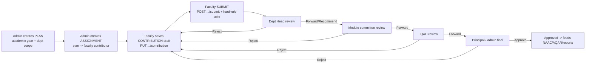
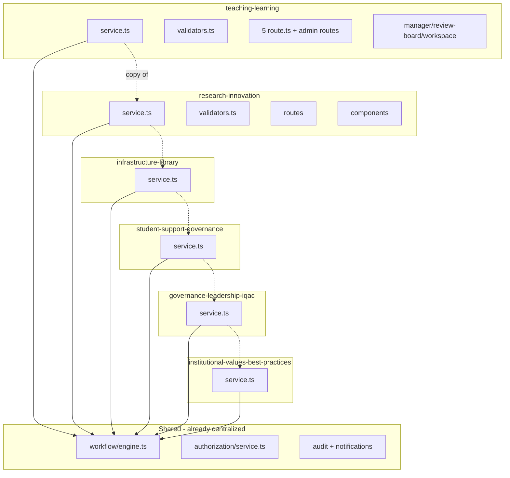
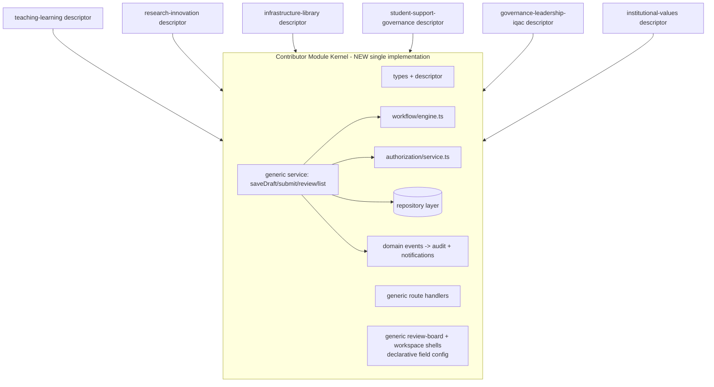
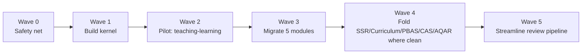

# Contributor Workflow — Current Flow & Detailed Improvement Plan

> **Scope:** the end-to-end **contributor workflow** that powers UMIS accreditation data collection:
> **Plan → Assignment → Contribution → Submit → multi-stage Review → Approve/Reject.**
> **Goal:** streamline the review pipeline and **eliminate the ~6× duplication** across the criterion modules by extracting a single, config-driven **Contributor Module Kernel**, without a big-bang rewrite and without changing user-visible behavior.

Related suite documents: [08_Backend_Architecture.md](08_Backend_Architecture.md) · [11_Refactoring_Strategy.md](11_Refactoring_Strategy.md) · [06_API_Documentation.md](06_API_Documentation.md) · [19_Future_Architecture.md](19_Future_Architecture.md) · [14_Testing_Strategy.md](14_Testing_Strategy.md) · [09_Code_Quality_Report.md](09_Code_Quality_Report.md) · [10_Technical_Debt_Report.md](10_Technical_Debt_Report.md). Condensed reference: [../documentation.md](../documentation.md).

---

## Table of Contents

1. [What This Plan Covers](#1-what-this-plan-covers)
2. [Current Flow (As-Built)](#2-current-flow-as-built)
3. [Problems Identified](#3-problems-identified)
4. [Target Flow (To-Be)](#4-target-flow-to-be)
5. [Detailed Implementation Plan (Phased)](#5-detailed-implementation-plan-phased)
6. [Migration & Rollback Strategy](#6-migration--rollback-strategy)
7. [Risk Analysis](#7-risk-analysis)
8. [Testing Requirements](#8-testing-requirements)
9. [Effort & Sequencing Summary](#9-effort--sequencing-summary)
10. [Definition of Done](#10-definition-of-done)

---

> **Status (this repo):** Wave 0 safety net + **Wave 1 kernel are implemented** at [`src/lib/contributor-kernel/`](../src/lib/contributor-kernel/) — unit-tested (26 cases) and imported by no module yet (rollback = delete the folder). Wave 2 (pilot Teaching-Learning behind parity tests) is the next slice.

## 1. What This Plan Covers

The contributor workflow is the single most important — and most **duplicated** — flow in UMIS. It is implemented (near-)identically across **six criterion modules**:

| Module | NAAC | `WorkflowModuleName` |
|---|---|---|
| Teaching-Learning | C2 | `TEACHING_LEARNING` |
| Research-Innovation | C3 | `RESEARCH_INNOVATION` |
| Infrastructure-Library | C4 | `INFRASTRUCTURE_LIBRARY` |
| Student-Support-Governance | C5 | `STUDENT_SUPPORT_GOVERNANCE` |
| Governance-Leadership-IQAC | C6 | `GOVERNANCE_LEADERSHIP_IQAC` |
| Institutional-Values-Best-Practices | C7 | `INSTITUTIONAL_VALUES_BEST_PRACTICES` |

The same shape also underlies **Curriculum**, **SSR**, and (with extra domain logic) **PBAS**, **CAS**, and **AQAR** — all 11 are registered in `DEFAULT_WORKFLOW_DEFINITIONS` and driven by the shared engine in `src/lib/workflow/engine.ts`.

This plan improves the flow **structurally** (remove duplication, decouple concerns, streamline review) — it does **not** propose schema/data changes, so it carries no data-migration risk.

---

## 2. Current Flow (As-Built)

### 2.1 Lifecycle



### 2.2 What is already shared (good)

The **state machine itself is centralized** — this is the part that is *not* duplicated:

- `src/lib/workflow/engine.ts` — `resolveWorkflowTransition(def, status, action)`, `getActiveWorkflowDefinition(module)`, `canActorProcessWorkflowStage(...)`, `syncWorkflowInstanceState(...)`, `listPendingWorkflowRecordIds(...)`, and `DEFAULT_WORKFLOW_DEFINITIONS` (11 modules).
- `src/lib/authorization/service.ts` — `resolveAuthorizationProfile()`, `canReviewWorkflowStage()`, `buildAuthorizedScopeQuery()` (governance RBAC + org-scope resolution).
- `src/lib/audit/service.ts`, `src/lib/notifications/service.ts` — cross-cutting audit & notify.
- `src/models/core/workflow-definition.ts` + `workflow-instance.ts` — definition graph + live per-record state.

### 2.3 What is duplicated (the problem surface)

Everything that *wraps* the shared engine is copy-adapted per module. For each of the six modules there is a parallel set of files:

```
src/lib/<module>/service.ts            # saveDraft / submit / review / list — near-identical orchestration
src/lib/<module>/validators.ts         # plan/assignment/contribution/review Zod schemas
src/app/api/<module>/assignments/route.ts
src/app/api/<module>/assignments/[id]/route.ts
src/app/api/<module>/assignments/[id]/contribution/route.ts
src/app/api/<module>/assignments/[id]/submit/route.ts
src/app/api/<module>/assignments/[id]/review/route.ts
src/app/api/admin/<module>/plans/route.ts (+ [id])
src/app/api/admin/<module>/assignments/route.ts (+ [id])
src/models/<category>/<module>-plan.ts
src/models/<category>/<module>-assignment.ts   # + module-specific child record models
src/components/<module>/<module>-manager.tsx
src/components/<module>/<module>-review-board.tsx
src/components/<module>/<module>-contributor-workspace.tsx
src/app/(admin-protected)/admin/<module>/page.tsx
src/app/(faculty-protected)/faculty/<module>/page.tsx
src/app/(director-protected)/director/<module>/page.tsx
```

The orchestration inside each `service.ts` follows the identical 6-step recipe:

```
saveDraft / submit / review:
  1. await dbConnect()
  2. schema.parse(input)                         # per-module validator
  3. load assignment + ownership/authz check
  4. business step (write draft | run submit gate | resolveWorkflowTransition + canActorProcessWorkflowStage)
  5. syncWorkflowInstanceState(...)              # shared engine
  6. createAuditLog(...) + notifyWorkflowStageAssignees(...)   # shared cross-cutting
```

Only **step 2 (schema)**, **step 4's payload fields**, and **the submit gate rules** genuinely differ per module. Steps 1, 3, 5, 6 are effectively identical — yet re-implemented six times.

### 2.4 Current topology



---

## 3. Problems Identified

| # | Problem | Evidence | Impact |
|---|---|---|---|
| P1 | **~6× duplicated orchestration** (saveDraft/submit/review/list) across the 6 module services | `src/lib/<module>/service.ts` (all six) | A change/fix (e.g. self-review, audit action names, notification payloads) must be made 6 times; drift is inevitable |
| P2 | **Duplicated route handlers** — the same 5 contributor routes + 4 admin routes per module | `src/app/api/<module>/assignments/**`, `src/app/api/admin/<module>/**` | ~54 near-identical route files; new module = copy 9 files |
| P3 | **Duplicated Zod validators** — plan/assignment/contribution/review schemas per module | `src/lib/<module>/validators.ts` | inconsistent rules, repeated ObjectId/enum patterns |
| P4 | **Per-module status enums** re-declare the same shape (`Draft → Submitted → <X> Review → Under Review → Committee Review → Approved/Rejected`) | each `<module>-assignment.ts` | review-board UIs each hardcode status labels; hard to reason about uniformly |
| P5 | **Fat services mixing concerns** — validation + Mongoose access + workflow + audit + notify + scope resolution all inline | e.g. large `service.ts` files; see [08_Backend_Architecture.md](08_Backend_Architecture.md) | untestable in isolation; no repository seam |
| P6 | **Submission-gate rules hardcoded & duplicated** in each submit path | each service's `validateContributionForSubmission` equivalent | rules diverge silently between modules |
| P7 | **Review-board N+1 / no pagination** — boards load full record sets + related docs per render | `<module>-review-board.tsx` + list services; see [17_Performance_Optimization.md](17_Performance_Optimization.md) | slow at scale |
| P8 | **Inconsistent review vocabulary** — `Forward`/`Recommend`/`Approve`/`Reject` mapped to engine actions per module | review handlers + validators | confusing UX + code |
| P9 | **Adding a new criterion module = copy-paste an entire vertical** (~15–20 files) | observed structure | high cost, high error rate |
| P10 | **Near-zero tests** around submit gates, transitions, and reviewer authorization | only 4 Vitest files; see [14_Testing_Strategy.md](14_Testing_Strategy.md) | refactoring is currently unsafe |

Scale of the duplication (measured): the six criterion services total **~13,100 lines** — teaching-learning 1,983 · research-innovation 2,636 · infrastructure-library 1,981 · student-support-governance 1,981 · governance-leadership-iqac 1,946 · institutional-values-best-practices 2,561 — each ~2,000 lines of structurally near-identical orchestration. A kernel collapses the five redundant copies (**on the order of ~10,000 lines**) into one implementation, plus the parallel route files (~54) and the per-module component triplets.

---

## 4. Target Flow (To-Be)

**Keep the flow identical for users. Collapse the implementation to one kernel + thin per-module config.**

### 4.1 Contributor Module Kernel

A single generic implementation parameterized by a **`ContributorModuleDescriptor`** — a declarative config each module provides once:

```ts
// src/lib/contributor-kernel/types.ts  (NEW)
export interface ContributorModuleDescriptor<TDraft> {
  moduleName: WorkflowModuleName;              // "TEACHING_LEARNING" ...
  planModel: Model<IPlanBase>;
  assignmentModel: Model<IAssignmentBase>;
  childModels?: Array<{ key: string; model: Model<any>; }>;   // sessions, assessments, grants...
  contributionSchema: ZodType<TDraft>;         // replaces per-module contribution validator
  applyDraft(assignment: IAssignmentBase, draft: TDraft): Promise<void>;  // module-specific write of payload/children
  submissionGate(ctx: SubmissionContext): SubmitCheck;        // module-specific hard rules (P6 unified signature)
  reviewCommitteeType: GovernanceCommitteeType;
  auditPrefix: string;                         // e.g. "TEACHING_LEARNING"
  notificationModule: NotificationModuleName;
}
```

```ts
// src/lib/contributor-kernel/service.ts  (NEW) — ONE implementation, used by all modules
export function createContributorService<TDraft>(d: ContributorModuleDescriptor<TDraft>) {
  return {
    saveDraft, submit, review, listForContributor, listForReviewer, getById
  };
  // Each method runs the shared 6-step recipe; only step 2 (d.contributionSchema),
  // step 4 (d.applyDraft / d.submissionGate) and audit/notify labels come from the descriptor.
}
```

Route handlers become thin adapters generated from the descriptor (Next.js requires per-file exports, so each `route.ts` re-exports kernel handlers):

```ts
// src/app/api/teaching-learning/assignments/[id]/submit/route.ts  (AFTER)
import { teachingLearning } from "@/lib/contributor-kernel/registry";
export const POST = teachingLearning.handlers.submit;   // was ~60 lines, now 1
```

### 4.2 Target topology



### 4.3 What unifies fully vs partially

- **Fully unified:** services (saveDraft/submit/review/list), route handlers, workflow/audit/notify orchestration, status vocabulary, reviewer authorization, pagination.
- **Partially unified:** UI — a generic **review-board** and **contributor-workspace** shell driven by a per-module **field descriptor** (labels, field types, child-record tables). Module-specific field layouts remain, but as *data* (config), not copy-pasted components.
- **Stays per-module:** the domain models (`*-plan`, `*-assignment`, child records) and the `submissionGate` rules — but the gate now implements a **shared interface**.

---

## 5. Detailed Implementation Plan (Phased)

Strangler-fig: build the kernel beside the existing modules, migrate one module at a time behind parity tests, delete the old code only after parity is proven.



### Wave 0 — Safety net (do this first)
- **Goals:** make the refactor safe by locking current behavior.
- **Tasks:**
  1. Write **golden/parity tests** for the workflow engine transitions (extend `src/lib/workflow/engine.test.ts`).
  2. Add **submit-gate tests** per module (capture today's exact rejection reasons).
  3. Add **authorization tests** for `canReviewWorkflowStage` / `resolveAuthorizationProfile` at each stage.
  4. Add an **API contract test** per contributor route (request → status + envelope shape) using an in-memory Mongo (`mongodb-memory-server`).
- **Files:** `src/lib/workflow/*.test.ts`, new `src/lib/contributor-kernel/__tests__/parity.*` (records fixtures for all 6 modules).
- **Dependencies:** none (can start immediately). Ties to [14_Testing_Strategy.md](14_Testing_Strategy.md).
- **Risks:** low. **Rollback:** n/a (additive).
- **Deliverables:** a green test suite that will detect any behavior drift.
- **Acceptance:** tests cover Draft→Submitted→…→Approved and every Reject edge for all 6 modules, plus self-review-blocked and scope-denied cases.
- **Effort:** M.

### Wave 1 — Build the kernel (no behavior change) ✅ Implemented

> **Done:** `src/lib/contributor-kernel/{types,review,scope,service,index}.ts` + 26 unit tests. The `submit`/`review` orchestration, the shared review vocabulary/schema, scope mapping, and dependency injection are in place; imported by no module yet. `saveDraft`/`list` read-paths land with the Wave 2 pilot (they need each module's contribution schema + `applyDraft`/hydration).

- **Goals:** implement `contributor-kernel` with descriptor + generic service + generic route handlers; **not yet wired** to any module.
- **Tasks:**
  1. Create `src/lib/contributor-kernel/{types.ts, service.ts, routes.ts, registry.ts}`.
  2. Introduce a thin **repository seam** (`assignmentRepo`, `planRepo`) wrapping the Mongoose calls the service needs (P5) — kept minimal.
  3. Implement the generic 6-step orchestration using the existing engine/authz/audit/notify functions verbatim.
  4. Define `SubmitCheck`/`SubmissionContext` interfaces (P6 unification).
- **Files:** new folder `src/lib/contributor-kernel/**`.
- **Dependencies:** Wave 0 tests exist.
- **Risks:** low (nothing calls it yet). **Rollback:** delete folder.
- **Acceptance:** kernel unit-tested against fixtures; zero imports from module code yet.
- **Effort:** L.

### Wave 2 — Pilot migration: Teaching-Learning
- **Goals:** route teaching-learning through the kernel; prove parity; ship.
- **Tasks:**
  1. Write `teachingLearningDescriptor` (schema = existing contribution validator; `applyDraft` = existing payload/child writes; `submissionGate` = existing hard rules).
  2. Replace `src/lib/teaching-learning/service.ts` internals with `createContributorService(descriptor)` (keep the module's public function names as thin re-exports so callers/pages don't change).
  3. Replace the 5 contributor route bodies + admin plan/assignment routes with kernel handlers.
  4. Run Wave 0 parity tests against teaching-learning → must be identical.
  5. Manual smoke via the faculty/director/admin pages.
- **Files affected:** `src/lib/teaching-learning/*`, `src/app/api/teaching-learning/**`, `src/app/api/admin/teaching-learning/**`. UI unchanged this wave.
- **Dependencies:** Waves 0–1.
- **Risks:** medium (payload/child-record writing differences). **Rollback:** revert the module (single commit/branch); kernel stays.
- **Acceptance:** all teaching-learning parity/API tests green; identical audit action names & notifications; no UI change.
- **Effort:** M.

### Wave 3 — Migrate the remaining five modules
- **Goals:** repeat Wave 2 for research-innovation, infrastructure-library, student-support-governance, governance-leadership-iqac, institutional-values-best-practices — **one module per iteration**.
- **Tasks (per module):** write descriptor → swap service internals → swap routes → run parity tests → smoke → delete now-dead duplicated code.
- **Files:** each module's `lib/`, `api/`, `api/admin/`.
- **Dependencies:** Wave 2 pattern proven.
- **Risks:** medium but **isolated per module** (one at a time). **Rollback:** per-module revert.
- **Acceptance:** each module's parity tests green; net deletion of duplicated lines recorded in the PR.
- **Effort:** M each (×5) — but each is now mechanical.

### Wave 4 — Fold in adjacent flows (where the fit is clean)
- **Goals:** apply the kernel to **Curriculum** and **SSR** (same shape), and evaluate **PBAS/CAS/AQAR** (they add domain-specific scoring/eligibility/snapshot logic — migrate only the shared submit/review/list orchestration, keep their extra logic in module hooks).
- **Tasks:** add descriptors; for PBAS/CAS/AQAR introduce optional descriptor hooks (`beforeSubmit`, `afterApprove`) to host scoring/eligibility/promotion-history without re-duplicating orchestration.
- **Dependencies:** Wave 3 complete.
- **Risks:** medium-high for PBAS/CAS (richest logic) — treat as optional/last.
- **Acceptance:** Curriculum + SSR on the kernel; PBAS/CAS/AQAR share orchestration while retaining domain hooks.
- **Effort:** L.

### Wave 5 — Streamline the review pipeline (cross-cutting)
- **Goals:** improve the *experience and performance* of review now that it's centralized.
- **Tasks:**
  1. **Unify the review vocabulary** (P8): a single `ReviewDecision` = `{ advance | return | approve | reject }` mapped once in the kernel to engine actions.
  2. **Pagination + server-side search** for review boards and pending queues (P7) via the kernel's `listForReviewer` (accept `page/pageSize/status/scope`).
  3. **Aggregate pending counts** across modules for the director dashboard with one pipeline instead of per-module fan-out (see [17_Performance_Optimization.md](17_Performance_Optimization.md)).
  4. **Event-driven notifications** (P1/P5): the kernel emits a `WorkflowTransitioned` domain event; audit + notifications subscribe (decouples cross-cutting from the service body). See [19_Future_Architecture.md](19_Future_Architecture.md).
  5. Generic **review-board / contributor-workspace** shells driven by per-module field descriptors (partial UI unification).
- **Dependencies:** Waves 2–3.
- **Risks:** medium (UI). **Rollback:** feature-flag the new boards.
- **Acceptance:** one review-board component; paginated queues; single decision vocabulary; notifications via events; director dashboard uses one aggregation.
- **Effort:** L.

---

## 6. Migration & Rollback Strategy

- **Strangler-fig, one module per PR.** The kernel lives beside the old code; a module is switched over only when its parity tests pass. Old per-module code is deleted **in the same PR** that proves parity, keeping the tree clean.
- **Public function names preserved.** Each module's `service.ts` keeps exporting the same function names (now thin wrappers over the kernel), so pages/components and any callers are untouched until Wave 5.
- **No schema/data changes** through Wave 4 → **no data migration, no downtime.** Rollback is a code revert.
- **Per-module feature branch / flag.** If a migrated module misbehaves in staging, revert that one module; the kernel and already-migrated modules are unaffected.
- **Ordering:** start with **teaching-learning** (best-understood, has the richest submit gate → highest-value parity proof), finish with the simplest, defer PBAS/CAS/AQAR.

## 7. Risk Analysis

| Risk | Likelihood | Mitigation |
|---|---|---|
| Behavior drift (different rejection reason, audit label, notification recipient) | Medium | Wave 0 golden/parity + API tests must pass before delete; preserve exact audit action strings & messages |
| Subtle scope-resolution differences per module | Medium | Reuse `resolveAuthorizationProfile`/`buildAuthorizedScopeQuery` unchanged; add scope test cases per module |
| `applyDraft`/child-record write differences | Medium | Encapsulate current write logic verbatim in each descriptor's `applyDraft`; diff DB state in parity tests |
| PBAS/CAS/AQAR richer logic doesn't fit cleanly | Medium | Keep them last (Wave 4) with optional hooks; do not force-fit |
| UI regressions when generalizing boards (Wave 5) | Medium | Feature-flag new shells; keep per-module field config; ship module-by-module |
| Refactor stalls half-done | Low | Each wave/module is independently shippable and valuable |

## 8. Testing Requirements

- **Unit (Vitest):** kernel service (saveDraft/submit/review), submit gates per descriptor, `resolveWorkflowTransition`, `canReviewWorkflowStage`.
- **Integration (`mongodb-memory-server`):** full submit→review→approve path per module; scope-denied and self-review-blocked; audit rows + notification records created.
- **API contract:** each contributor route returns identical status codes + envelope before/after migration.
- **Parity harness:** run the same fixture through old vs kernel service and assert equal DB mutations + responses (used to green-light each module's cutover, then retired).
- **Regression gate in CI:** these tests block merge (see [14_Testing_Strategy.md](14_Testing_Strategy.md)).

## 9. Effort & Sequencing Summary

| Wave | Work | Effort | Prereq | Ships value? |
|---|---|---|---|---|
| 0 | Safety-net tests | M | — | Yes (safety) |
| 1 | Build kernel | L | 0 | No (enabler) |
| 2 | Pilot teaching-learning | M | 0,1 | Yes |
| 3 | Migrate 5 modules | M×5 (mechanical) | 2 | Yes (incremental) |
| 4 | Fold Curriculum/SSR (+ PBAS/CAS/AQAR hooks) | L | 3 | Yes |
| 5 | Streamline review (pagination, vocab, events, UI) | L | 2,3 | Yes |

**Expected outcome:** the six criterion services (**~13,100 lines total**, ~2,000 each) collapse to **one kernel + six small descriptors** — eliminating on the order of **~10,000 lines** of redundant orchestration; ~54 route files become thin re-exports; new criterion modules cost a descriptor + models instead of a copied vertical (P9 solved); review is paginated, consistent, and event-driven.

## 10. Definition of Done

- All six criterion modules run through the single `contributor-kernel`; per-module `service.ts` files contain only a descriptor + thin re-exports.
- Contributor & admin route files are one-line re-exports of kernel handlers.
- One `ReviewDecision` vocabulary; one review-board shell driven by field config.
- Review queues are paginated; director pending counts use a single aggregation.
- Audit action names, notification behavior, and all status transitions are **byte-for-byte** equivalent to today (proven by parity tests), then extended intentionally.
- Adding a new criterion module requires: models + a descriptor + a field config — **no** copied service/routes/components.
- CI enforces the workflow/authz/submit-gate test suite.

---

*Grounded in the current implementation (`src/lib/workflow/engine.ts`, `src/lib/authorization/service.ts`, the six `src/lib/<module>/` services, and their `src/app/api/<module>/**` routes). This plan changes structure, not behavior or schema. See [11_Refactoring_Strategy.md](11_Refactoring_Strategy.md) for how it fits the broader refactor and [19_Future_Architecture.md](19_Future_Architecture.md) for the target-state rationale.*
