# UMIS (operant-next) — Technical Documentation

> **Project:** `operantums` / `operant-next`
> **Type:** Full-stack Next.js 16 (App Router) application
> **Domain:** Indian higher-education **accreditation & quality assurance** (NAAC, AQAR, NIRF, AISHE, PBAS, CAS, SSR, IQAC)
> **Data store:** MongoDB via Mongoose
> **Auth:** Custom JWT sessions (`jose` + `bcryptjs`) — no NextAuth/Clerk/Auth.js

This document is a complete technical reference and onboarding guide derived **entirely from the current codebase**. It describes how the application actually works end-to-end: architecture, data model, API design, authentication/authorization, the workflow engine that powers most features, the frontend rendering model, cross-cutting concerns, and the technical debt found during review.

**Codebase scale (measured):**

| Metric | Count |
|---|---|
| Mongoose model files (`src/models/**`) | **188** across 10 domain categories |
| API route handlers (`route.ts`) | **213** |
| App Router pages (`page.tsx`) | **73** |
| Route-group / segment layouts (`layout.tsx`) | **5** |
| `lib` modules (`src/lib/**/*.ts`) | **97** (24 `service.ts`, 20 `validators.ts`) |
| React components (`src/components/**/*.tsx`) | **85** (77 marked `"use client"`) |
| `loading.tsx` / `error.tsx` / `not-found.tsx` | 1 / 1 / 0 |
| Automated tests (Vitest `*.test.ts`) | **4** |

---

## Table of Contents

1. [Project Overview](#1-project-overview)
2. [Technology Stack](#2-technology-stack)
3. [Overall Architecture](#3-overall-architecture)
4. [Folder Structure](#4-folder-structure)
5. [Application Flow](#5-application-flow)
6. [Routing](#6-routing)
7. [Authentication & Authorization](#7-authentication--authorization)
8. [Database Documentation](#8-database-documentation)
9. [API Documentation](#9-api-documentation)
10. [Business Features](#10-business-features)
11. [Components Documentation](#11-components-documentation)
12. [Server Components vs Client Components](#12-server-components-vs-client-components)
13. [Data Fetching](#13-data-fetching)
14. [State Management](#14-state-management)
15. [Forms](#15-forms)
16. [Middleware](#16-middleware)
17. [File Uploads](#17-file-uploads)
18. [Third-Party Integrations](#18-third-party-integrations)
19. [Environment Variables](#19-environment-variables)
20. [Security Review](#20-security-review)
21. [Performance Review](#21-performance-review)
22. [Error Handling](#22-error-handling)
23. [Code Quality Review](#23-code-quality-review)
24. [Deployment](#24-deployment)
25. [Developer Guide](#25-developer-guide)
26. [Architecture Diagrams](#26-architecture-diagrams)
27. [Known Issues & Technical Debt](#27-known-issues--technical-debt)
28. [Architecture Summary & Recommendations](#28-architecture-summary--recommendations)

---

## 1. Project Overview

### Purpose

UMIS ("Unified Management Information System", product name **operant**) is a web platform that helps an Indian higher-education institution **collect, review, and report the evidence required for statutory accreditation and quality-assurance frameworks**. It replaces spreadsheet-and-email workflows with a structured, role-based, auditable system in which faculty contribute data, institutional committees review and approve it, and administrators compile it into the reports demanded by regulators.

### Business domain

The application is organized around India's accreditation acronyms. Understanding them is essential to understanding the codebase:

| Acronym | Meaning | Role in the app |
|---|---|---|
| **NAAC** | National Assessment and Accreditation Council | The master framework. All data ultimately rolls up to NAAC **Criteria C1–C7**. |
| **AQAR** | Annual Quality Assurance Report | Yearly report submitted to NAAC; the app has both faculty-level AQAR contributions and an institutional AQAR **cycle**. |
| **SSR** | Self-Study Report | The large self-assessment document prepared for a NAAC visit (Cycle → Criteria → Metrics → Narratives). |
| **NIRF** | National Institutional Ranking Framework | Ranking submission (parameters, metrics, scores, benchmarks, trends). |
| **AISHE** | All India Survey on Higher Education | Statistical survey (enrollment, faculty, staff, finance, infrastructure). |
| **PBAS / API** | Performance Based Appraisal System / Academic Performance Indicator | Annual faculty self-appraisal producing an API score. |
| **CAS** | Career Advancement Scheme | UGC faculty-promotion process gated on PBAS scores and service years. |
| **IQAC** | Internal Quality Assurance Cell | The governance body that reviews/approves quality data. |
| **BOS** | Board of Studies | Curriculum governance (meetings, decisions, syllabus revisions). |
| **SSS** | Student Satisfaction Survey | Anonymous student survey feeding NAAC C2 metrics. |

The **7 NAAC criteria** map onto the app's "contributor modules":

- **C1 Curricular Aspects** → Curriculum
- **C2 Teaching-Learning & Evaluation** → Teaching-Learning, SSS
- **C3 Research, Innovation & Extension** → Research-Innovation, faculty AQAR/PBAS
- **C4 Infrastructure & Learning Resources** → Infrastructure-Library
- **C5 Student Support & Progression** → Student-Support-Governance
- **C6 Governance, Leadership & Management** → Governance-Leadership-IQAC
- **C7 Institutional Values & Best Practices** → Institutional-Values-Best-Practices

### Target users (four portals)

| Role | Portal | Primary activity |
|---|---|---|
| **Admin** | `/admin` | System configuration, master data, provisioning users, catalogs, final approvals, report compilation |
| **Director** (leadership) | `/director` | Scoped review/approval across all modules, faculty & student oversight, exports. Access is **earned via governance roles**, not a static `role` value. |
| **Faculty** | `/faculty` | Maintain professional record; contribute PBAS, CAS, AQAR, curriculum, and criterion-module data |
| **Student** | `/student` | Maintain profile & activity records; upload evidence; complete satisfaction surveys |

### High-level workflow (the backbone of the app)

Most academic modules share one lifecycle, powered by a **generic workflow engine** and **governance-based RBAC**:

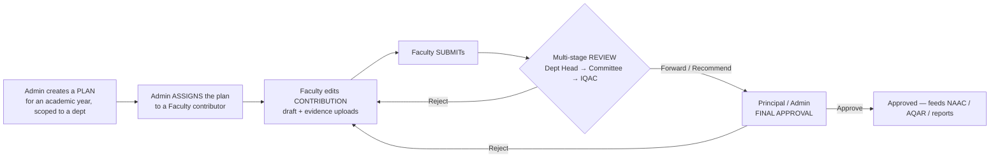

The same Draft → Submitted → …Review… → Approved / Rejected state machine governs PBAS, CAS, AQAR, SSR, Curriculum, and the six criterion modules. Who may act at each stage is decided at runtime from the user's **governance committee memberships** and **leadership assignments**, not from a hard-coded role.

### Core business features

Curriculum · Teaching-Learning · Research-Innovation · Infrastructure-Library · Governance-Leadership-IQAC · Institutional-Values-Best-Practices · Student-Support-Governance · PBAS · CAS · Faculty AQAR + institutional AQAR Cycle · SSR · SSS · NAAC Metric Warehouse · NAAC Criteria Mapping · AISHE · NIRF · Statutory Compliance · Governance & Committees · Organizational Hierarchy · Reference Masters · Master Data · Report Templates · Faculty Records · Student Records · Evidence Review · Notifications · Audit Logs · Director dashboards. (Each is documented in [§10](#10-business-features).)

### Technology summary

Next.js 16 App Router with React 19 Server Components for data-fetching pages and Client Components for interactive shells; MongoDB/Mongoose for persistence; custom `jose` JWT cookie sessions; Firebase Storage for file uploads; Resend for email; Tailwind v4 + shadcn/ui (Radix) for UI; Zod + react-hook-form for validation. See [§2](#2-technology-stack).

### Architecture summary

A **modular monolith**: a single Next.js deployment serves the UI (Server + Client Components), the HTTP API (213 route handlers), and the data-access/business layer (`src/lib/**/service.ts`). There is **no separate backend service** and **no `middleware.ts`** — authentication is enforced inside async Server Component layouts and inside each API route via shared guard helpers. Cross-cutting concerns (workflow, authorization, audit, notifications, uploads) are centralized in `src/lib` and reused by every feature.

---

## 2. Technology Stack

Everything below is taken from `package.json`, config files, and actual imports in the code.

### Core framework & language

| Technology | Version | Where / Why |
|---|---|---|
| **Next.js** | `16.1.6` | App Router. Serves pages, layouts, and the entire `/api` surface. |
| **React** | `19.2.3` | Server Components (pages/layouts) + Client Components (interactive UI). |
| **TypeScript** | `^5` | Strict mode (`tsconfig.json` `"strict": true`). Path alias `@/*` → `src/*`. |
| **Node runtime** | — | Default Node.js runtime for route handlers (uses `crypto`, `Buffer`; not Edge). |

### Data & backend

| Technology | Version | Where / Why |
|---|---|---|
| **MongoDB + Mongoose** | `mongoose ^9.2.4` | All persistence. 188 models in `src/models/**`. Connection cached on `globalThis` (`src/lib/dbConnect.ts`) to survive hot reloads and serverless reuse. |
| **jose** | `^6.2.0` | Signs/verifies HS256 JWT session tokens (`src/lib/auth/session.ts`). |
| **bcryptjs** | `^3.0.3` | Password hashing (cost factor 12) in `src/lib/auth/password.ts`. |
| **zod** | `^4.3.6` | Input validation. 20 `validators.ts` files; schemas parsed inside services. |
| **Firebase** | `firebase ^12.10.0` | **Client SDK only** — Cloud Storage for document/photo uploads (`src/lib/firebase/config.ts`). No Firebase Admin SDK. |
| **Resend** | `resend ^6.9.3` | Transactional email (verification, reset, notifications). Falls back to console logging when unconfigured. |
| **xlsx** (SheetJS) | `^0.18.5` | **Client-side** Excel parse/generate for bulk provisioning & faculty export. |

### UI & styling

| Technology | Version | Where / Why |
|---|---|---|
| **Tailwind CSS** | `^4` (via `@tailwindcss/postcss`) | Utility styling; OKLCH design tokens in `src/app/globals.css`. |
| **shadcn/ui** | `shadcn ^4.0.2` (`radix-nova` style) | 19 primitives generated into `src/components/ui/`. |
| **Radix UI** | multiple `@radix-ui/react-*` + `radix-ui ^1.4.3` | Headless a11y primitives wrapped by shadcn (dialog, select, tabs, popover, checkbox, alert-dialog, label, separator, scroll-area). |
| **lucide-react** | `^0.577.0` | Icon set. |
| **sonner** | `^2.0.7` | Toast notifications (`<Toaster>` in root layout). |
| **class-variance-authority**, **clsx**, **tailwind-merge** | — | `cn()` helper in `src/lib/utils.ts` for class composition. |
| **tw-animate-css** | `^1.4.0` | Animation utilities imported in `globals.css`. |
| **@xyflow/react** (React Flow) | `^12.10.2` | Interactive org-hierarchy graph — used **only** in `hierarchy-manager.tsx`. |
| **react-day-picker** | `^9.14.0` | Backs the shadcn `Calendar`; date pickers in curriculum/AQAR/admin forms. |
| **next/font** (Geist, Geist Mono) | — | Fonts loaded in root layout as CSS variables. |

### Forms & validation

| Technology | Version | Where / Why |
|---|---|---|
| **react-hook-form** | `^7.71.2` | Auth forms, PBAS/CAS dashboards, hierarchy manager, faculty workspace. |
| **@hookform/resolvers** | `^5.2.2` | Bridges Zod schemas into react-hook-form (`zodResolver`). |

### Tooling & testing

| Technology | Version | Where / Why |
|---|---|---|
| **ESLint** | `^9` + `eslint-config-next 16.1.6` | `core-web-vitals` + `typescript` rule sets (`eslint.config.mjs`). |
| **Vitest** | `^2.1.9` | Node-environment unit tests (`vitest.config.ts`). Only 4 test files exist. |
| **date-fns** | `^4.1.0` | Date formatting/manipulation. |

### Notably **absent** (confirmed — do not assume these exist)

- **No** NextAuth/Auth.js/Clerk/Supabase (custom auth instead).
- **No** Prisma/Drizzle/TypeORM/Sequelize (Mongoose instead).
- **No** React Query, SWR, Redux, Zustand, Jotai, or any client state library. State is plain `useState`/`useTransition` + `router.refresh()` (see [§14](#14-state-management)).
- **No** tRPC, GraphQL, Axios, Socket.IO/WebSockets, Stripe, Redis, or Docker files in the repo.
- **No** external PDF library — PDFs are hand-assembled bytes (see [§17](#17-file-uploads) / [§21](#21-performance-review)).

---

## 3. Overall Architecture

### Style

UMIS is a **modular monolith** built on a single Next.js app. Three logical tiers live in one deployable:

1. **Presentation** — App Router pages/layouts (Server Components) + interactive Client Components.
2. **API / application** — 213 route handlers under `src/app/api/**` that authenticate, parse, and delegate.
3. **Domain / data** — per-feature `service.ts` modules in `src/lib/**` that own validation, business rules, Mongoose access, workflow transitions, audit, and notifications.

### System context

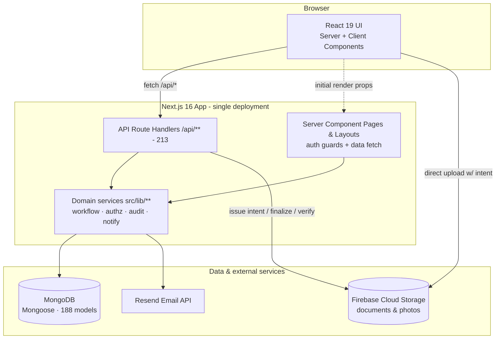

### Layered request handling

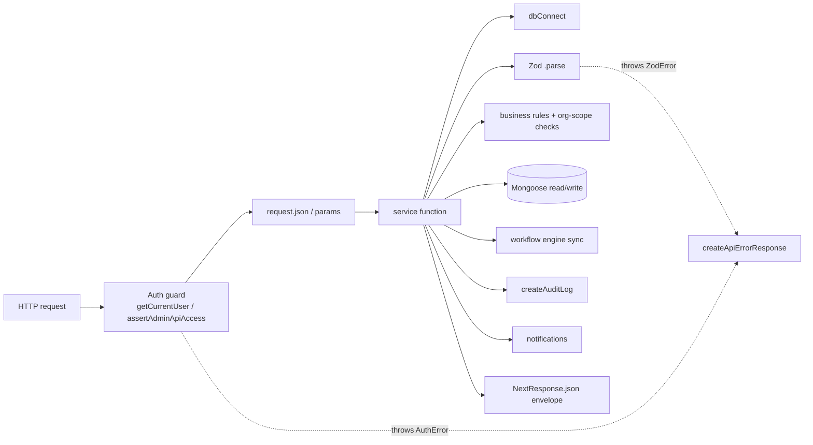

### Sub-architectures at a glance

- **Frontend architecture** — Server Component pages fetch data via services and pass **serialized** props to Client Component "shells"; mutations post to `/api/*` then call `router.refresh()`. See [§12](#12-server-components-vs-client-components)–[§13](#13-data-fetching).
- **Backend architecture** — thin route handlers → fat services. One shared error mapper, one shared success-envelope convention. See [§9](#9-api-documentation).
- **Database architecture** — document store; multi-tenancy by **denormalized scope fields** on records rather than joins. See [§8](#8-database-documentation).
- **API architecture** — REST-ish resource routes with action sub-routes (`/submit`, `/review`, `/approve`). See [§9](#9-api-documentation).
- **Auth architecture** — stateless JWT cookie + per-request DB re-validation; layout- and route-level guards. See [§7](#7-authentication--authorization).
- **Authorization architecture** — governance-driven RBAC computed by `resolveAuthorizationProfile()`. See [§7](#7-authentication--authorization).
- **State management** — server-owned data, minimal client state, `router.refresh()` as cache invalidation. See [§14](#14-state-management).
- **File uploads** — intent → direct-to-Firebase → server finalize/verify. See [§17](#17-file-uploads).
- **Background jobs** — **none scheduled.** "Reminders" are computed lazily when a user fetches `/api/notifications`. One-shot maintenance scripts exist in `scripts/`. See [§17](#17-file-uploads)/[§24](#24-deployment).
- **Caching** — the Mongoose connection is cached on `globalThis`; report templates and workflow definitions are lazily upserted. No Redis/response cache. Next.js data cache is effectively bypassed because pages read live from Mongo and clients use `cache: "no-store"` for notifications.

---

## 4. Folder Structure

```
operant-next/
├── src/
│   ├── app/                     # App Router: pages, layouts, API routes
│   │   ├── layout.tsx           # Root layout (fonts, <Toaster>, metadata)
│   │   ├── page.tsx             # Public/landing (Server Component)
│   │   ├── globals.css          # Tailwind v4 + OKLCH tokens + 3rd-party CSS
│   │   ├── (auth)/              # Route group: login/register/activate/reset (no chrome)
│   │   ├── (admin-protected)/   # Route group: /admin/** guarded by requireAdmin()
│   │   ├── (director-protected)/# Route group: /director/** guarded by requireDirector()
│   │   ├── (faculty-protected)/ # Route group: /faculty/** guarded by requireFaculty()
│   │   ├── (student-protected)/ # Route group: /student/** guarded by requireStudentProfileAccess()
│   │   ├── admin/               # /admin/login, /admin/setup (bootstrap) — NOT in protected group
│   │   ├── director/            # /director/login — NOT in protected group
│   │   └── api/                 # 213 route.ts handlers (the entire HTTP API)
│   ├── components/              # 85 React components
│   │   ├── ui/                  # 19 shadcn/ui primitives (Radix wrappers)
│   │   ├── admin/ director/ student/  # role "shell" nav + role-specific managers
│   │   ├── auth/                # login/register/activation forms + password helpers
│   │   ├── <feature>/           # per-module: *-manager, *-review-board, *-contributor-workspace, *-dashboard
│   │   └── notifications/       # notification-center.tsx
│   ├── lib/                     # 97 modules: business logic & infrastructure
│   │   ├── auth/                # session, config, tokens, password, user guards, email, http, errors, validators
│   │   ├── authorization/       # service.ts — governance RBAC (resolveAuthorizationProfile)
│   │   ├── workflow/            # engine.ts — generic state-machine engine (+ test)
│   │   ├── audit/               # service.ts + request.ts (IP capture)
│   │   ├── notifications/       # service.ts + email.ts
│   │   ├── upload/              # service.ts (client helpers) + policy.ts (MIME/size)
│   │   ├── firebase/            # config.ts (client SDK init)
│   │   ├── report-templates/    # service.ts, pdf.ts, preview.ts, validators.ts
│   │   ├── <feature>/           # service.ts + validators.ts (+ report-pdf, catalog, migration…)
│   │   ├── admin/               # academics, hierarchy, master-data, reference-masters, users, system, dashboard
│   │   ├── hierarchy/           # canonical.ts (org projection/scope resolution)
│   │   ├── academic-year.ts     # academic-year label/period helpers
│   │   └── dbConnect.ts         # cached Mongoose connection
│   └── models/                  # 188 Mongoose models, grouped by domain
│       ├── core/                # 41: user, organization, pbas*, cas*, aqar*, workflow*, governance*, audit-log, notification, master-data, report-template, upload-intent
│       ├── reporting/           # 35: aishe*, nirf*, naac-metric*, ssr*, report
│       ├── faculty/             # 22: faculty + achievement sub-records
│       ├── academic/            # 20: program, course, curriculum*, teaching-learning*
│       ├── student/             # 19: student + activity records + support-governance
│       ├── quality/             # 16: values/best-practices, sustainability, gender, ethics
│       ├── reference/           # 12: institution, department, academic-year, semester, document, award/skill/sport…
│       ├── research/            # 9: research-innovation*, publication, project, IP
│       ├── engagement/          # 8: sss* (student satisfaction), feedback, system-misc
│       └── operations/          # 6: infrastructure-library*
├── scripts/                     # one-shot .cjs/.mjs migrations, backfills, verification (see §24)
├── docs/                        # PBAS design & UGC implementation guides (markdown)
├── public/                      # static assets (favicon, images)
├── legacy_models.txt/new_models.txt  # STALE migration-planning artifacts (see §8 note)
├── next.config.ts               # image remotePatterns (firebasestorage host)
├── tsconfig.json  eslint.config.mjs  postcss.config.mjs  vitest.config.ts  components.json
└── package.json
```

**Folder responsibilities**

- **`app/`** — routing + HTTP surface. Route **groups** `(...)` add auth boundaries without adding URL segments. Pages are Server Components that call `lib` services and render Client Components.
- **`components/`** — a repeating per-feature "component family" (`-manager`, `-review-board`, `-contributor-workspace`, `-dashboard`) plus role shells and shadcn primitives. See [§11](#11-components-documentation).
- **`lib/`** — the real backend. Route handlers are intentionally thin; `service.ts` files hold validation, rules, DB access, and cross-cutting calls.
- **`models/`** — schema + TypeScript interfaces + the hot-reload-safe registration pattern. See [§8](#8-database-documentation).
- **`scripts/`** — the closest thing to migrations/seeds (no framework). See [§24](#24-deployment).

---

## 5. Application Flow

### Startup / connection

There is no custom server bootstrap. On the first DB-touching call, `dbConnect()` (`src/lib/dbConnect.ts`) connects Mongoose lazily and caches the connection + promise on `globalThis.mongooseCache` so hot reloads and serverless invocations reuse a single pool. `bufferCommands: false` means any query issued before connection throws immediately rather than queuing. Models self-register with the `mongoose.models.X || mongoose.model(...)` guard, so importing a model never double-compiles.

### Request lifecycle (page render)

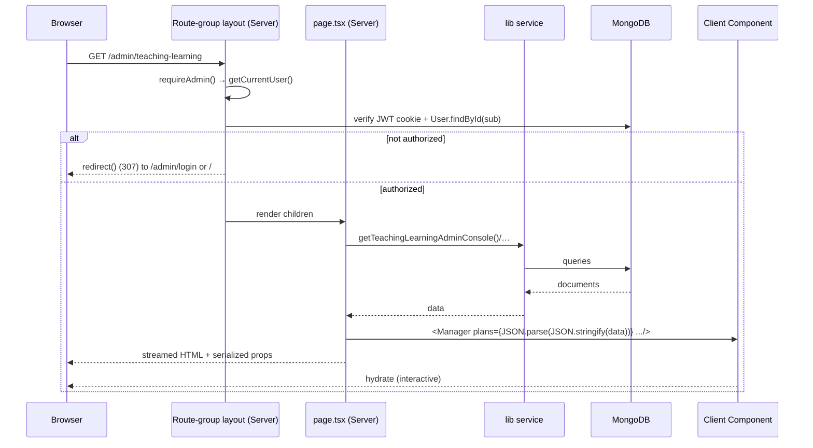

### Mutation lifecycle (write + re-sync)

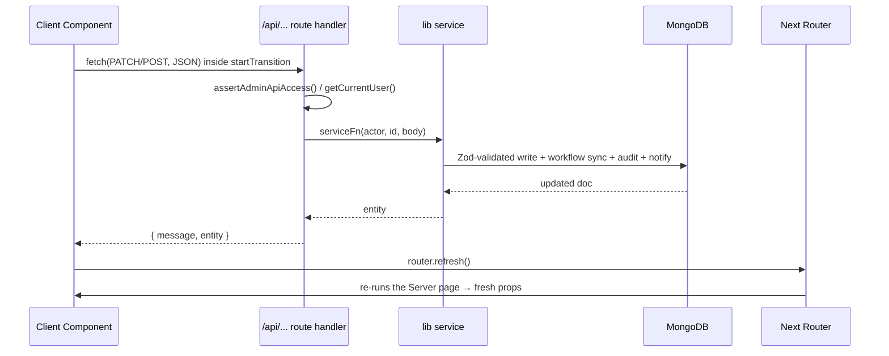

The `JSON.parse(JSON.stringify(...))` step is deliberate: Mongoose documents contain `ObjectId`/`Date` objects that cannot cross the Server→Client boundary, so services' output is serialized before being passed as props.

### Rendering / SSR / SSG

- **SSR (dynamic)** is the norm: pages call `cookies()` (via guards) and read live data, so they are dynamically rendered per request. There is no `generateStaticParams`/ISR usage.
- **Static generation** effectively applies only to the framework's default assets and the few pages with no data dependency.
- **Client navigation** uses `<Link>` and `useRouter()`; the shells highlight the active route via `usePathname()`.

### Data-fetching lifecycle

- **Initial data:** always server-side, inside `page.tsx`, via `lib` services (no client fetch waterfall on first paint).
- **Subsequent mutations:** client `fetch()` → `/api/*` → `router.refresh()` re-fetch. See [§13](#13-data-fetching).

---

## 6. Routing

Routing is 100% App Router. **URL protection is achieved with route groups + async layout guards, not `middleware.ts`.**

### Route groups (auth boundaries)

| Group | URL prefix | Layout guard | Behavior |
|---|---|---|---|
| `(auth)` | `/login`, `/register`, `/forgot-password`, `/reset-password`, `/verify-email`, `/activate-faculty`, `/activate-student` | none | Public. Thin Server pages rendering client forms. |
| `(admin-protected)` | `/admin/**` | `requireAdmin()` | Redirects to `/admin/login` (no session) or `/` (wrong role). Wraps children in `<AdminShell>`. |
| `(director-protected)` | `/director/**` | `requireDirector()` | Redirects to `/director/login` or `/` (no leadership access). Wraps in `<DirectorShell>`. |
| `(faculty-protected)` | `/faculty/**` | `requireFaculty()` | Redirects to `/login`, `/`, or `/activate-faculty` (pending activation). Inline server-rendered header/footer. |
| `(student-protected)` | `/student/**` | `requireStudentProfileAccess()` | Redirects to `/login`, `/`, or `/activate-student`. Wraps in `<StudentShell>`. |

> **Why two `admin`/`director` folders?** `admin/login`, `admin/setup`, and `director/login` live **outside** the protected groups (`src/app/admin/*`, `src/app/director/*`) so they are reachable without a session; the authenticated console lives inside the `(…-protected)` groups.

### Public routes

`/` (landing/portal), `/login`, `/register` (**disabled** — API returns HTTP 410), `/forgot-password`, `/reset-password?token=`, `/verify-email?token=`, `/activate-faculty`, `/activate-student`, `/admin/login`, `/admin/setup`, `/director/login`.

### Protected routes (representative)

- **Admin** (`AdminShell`, ~25 nav items): `/admin`, `/admin/hierarchy`, `/admin/governance`, `/admin/academics`, `/admin/curriculum`, `/admin/teaching-learning`, `/admin/research-innovation`, `/admin/infrastructure-library`, `/admin/institutional-values-best-practices`, `/admin/student-support-governance`, `/admin/governance-leadership-iqac`, `/admin/reference-masters`, `/admin/cas`, `/admin/pbas`, `/admin/pbas/catalog`, `/admin/evidence`, `/admin/aqar`, `/admin/naac-metric-warehouse`, `/admin/accreditation`, `/admin/ssr`, `/admin/report-templates`, `/admin/master-data`, `/admin/users`, `/admin/system`, `/admin/audit-logs`.
- **Director**: `/director`, `/director/approvals`, `/director/faculty`, `/director/students`, `/director/evidence`, `/director/reports`, plus scoped module review pages mirroring the admin modules.
- **Faculty**: `/faculty`, `/faculty/profile`, `/faculty/pbas`, `/faculty/cas`, `/faculty/aqar`, `/faculty/ssr`, `/faculty/curriculum`, `/faculty/teaching-learning`, `/faculty/research-innovation`, `/faculty/infrastructure-library`, `/faculty/student-support-governance`.
- **Student**: `/student`, `/student/profile`, `/student/records`, `/student/ssr`, `/student/sss`, `/student/verification-pending`.

### Dynamic, nested & special segments

- **Dynamic routes** are pervasive in the API: `[id]` (e.g. `/api/pbas/[id]`), `[kind]` + `[id]` (`/api/admin/reference-masters/[kind]/[id]`), and deep action nesting (`/api/teaching-learning/assignments/[id]/review`). Params arrive as a **Promise** (`context.params`) per Next 15/16 and must be `await`ed.
- **Nested layouts:** root layout → route-group layout → page. Only the faculty profile route adds a segment-level `loading.tsx` + `error.tsx`.
- **Route groups:** the five `(...)` groups above.
- **Parallel routes / intercepting routes:** **none used.**
- **Middleware:** **none** (`middleware.ts` does not exist). See [§16](#16-middleware).

---

## 7. Authentication & Authorization

Custom implementation in `src/lib/auth/**` and `src/lib/authorization/service.ts`. No third-party auth provider.

### 7.1 Session mechanism

- **Library / algorithm:** `jose`, **HS256** (`src/lib/auth/session.ts`).
- **Secret:** `AUTH_SECRET` env var (`getAuthSecret()` throws if missing).
- **Cookie:** name **`umis_session`**, `httpOnly: true`, `sameSite: "lax"`, `secure` only in production, `path: "/"`, `maxAge = 7 days` (`src/lib/auth/config.ts`).
- **Payload/claims:** `{ sub: userId, email, name, role }` + jose `iat`/`exp`.

```ts
// src/lib/auth/session.ts (essence)
export async function createSessionToken(payload) {
  return new SignJWT(payload)
    .setProtectedHeader({ alg: "HS256" })
    .setIssuedAt()
    .setExpirationTime(`${authConfig.sessionDurationSeconds}s`) // 604800
    .sign(getSecretKey());
}
export async function getSessionPayload() {
  const token = (await cookies()).get(authConfig.cookieName)?.value;
  if (!token) return null;
  try { return await verifySessionToken(token); } catch { return null; }
}
```

### 7.2 Password handling

`src/lib/auth/password.ts` — `bcrypt.hash(password, 12)` and `bcrypt.compare(...)`. The `password` field is `select: false` on the User model, so every login path must explicitly `.select("+password")`.

### 7.3 User model & sub-roles

`User` (`src/models/core/user.ts`) has `role` ∈ {Faculty, Student, Alumni, Admin, Director, PRO, NSS, Sports, Swayam, Placement} and `accountStatus` ∈ {PendingActivation, Active, Suspended}. Provisioned faculty/students start `PendingActivation`. Note: **Director portal access is NOT the `role` value** — it is earned via `LeadershipAssignment` / `GovernanceCommitteeMembership` (see §7.6).

### 7.4 Login flows

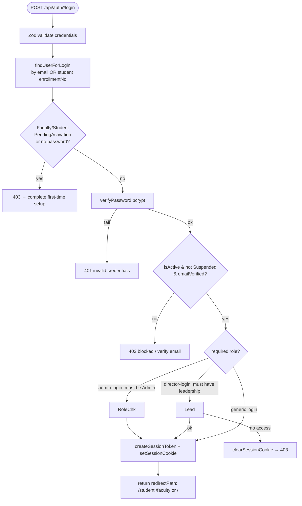

- `POST /api/auth/login` — general login; students may use **enrollment number**.
- `POST /api/auth/admin-login` — requires `role === "Admin"`.
- `POST /api/auth/director-login` — runs normal login, then checks `hasLeadershipPortalAccess`; **clears the cookie** if the check fails (no race window).

### 7.5 Registration, activation & recovery

- **Self-registration is disabled:** `POST /api/auth/register` returns **HTTP 410 Gone** (accounts are admin-provisioned).
- **Faculty activation** (`/api/auth/activate-faculty`): match `employeeCode` + email → set password, `accountStatus=Active`, `emailVerified=true`, link `facultyId`, log in.
- **Student activation** (`/api/auth/activate-student`): match `enrollmentNo` + email/phone → same result.
- **Email verification** handled in the `verify-email` page via `verifyEmailToken` (24 h token).
- **Password reset:** `forgot-password` (30 min token, user-enumeration-safe uniform 200) → `reset-password` (sets password, logs in).
- **Tokens** (`src/lib/auth/tokens.ts`): `crypto.randomBytes(32)` raw token emailed; only its **SHA-256 hash** is stored, so a DB dump can't replay links.

### 7.6 Authorization (governance RBAC)

No `middleware.ts`. Access control has two layers:

1. **Guards** in `src/lib/auth/user.ts`:
   - `getCurrentUser()` — verifies cookie **and re-fetches the User from Mongo every request** (so suspended/deleted users are invalidated immediately; no cached sessions).
   - `requireAdmin()`, `requireDirector()`, `requireFaculty()`, `requireStudentProfileAccess()` — used by layouts; call `redirect()` on failure.
   - `assertAdminApiAccess()`, `assertLeadershipApiAccess()` — used by API routes; throw `AuthError(403)`.
2. **`resolveAuthorizationProfile(user)`** in `src/lib/authorization/service.ts` — the RBAC brain. It merges three sources into an `AuthorizationProfile`:
   - **`LeadershipAssignment`** (HOD→DEPARTMENT_HEAD, PRINCIPAL, IQAC_COORDINATOR→IQAC, DIRECTOR, OFFICE_HEAD).
   - **`GovernanceCommitteeMembership`** (committee type → workflow role, e.g. `PBAS_REVIEW`→`PBAS_COMMITTEE`, `CAS_SCREENING`→`CAS_COMMITTEE`, `IQAC`→`IQAC`, `BOARD_OF_STUDIES`→`BOARD_OF_STUDIES`).
   - **Legacy compatibility** (`compatibilityMode = true`, always on): `Organization.headUserId` grants a role based on org type/name.

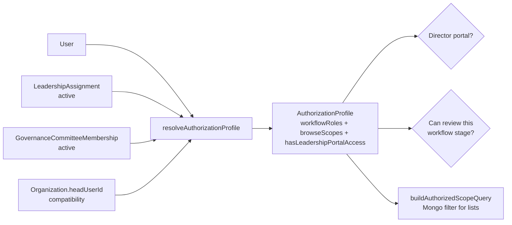

The profile drives: director portal access (`hasLeadershipPortalAccess`), per-stage review permission (`canReviewWorkflowStage`), list/detail visibility (`canViewModuleRecord`, `buildAuthorizedScopeQuery`), and evidence department scoping. Each scope is resolved through the org hierarchy (Department → College → University).

### 7.7 Admin bootstrap

`POST /api/admin/bootstrap` creates the first admin. Requires header `x-admin-bootstrap-secret` matching `ADMIN_BOOTSTRAP_SECRET` (compared with `crypto.timingSafeEqual`). In production the secret is **required**; if unset in production, bootstrap is disabled. Refuses to run once any Admin exists.

### 7.8 Security notes

Strengths: hashed-only tokens, `select:false` password, per-request DB re-validation, timing-safe secret compare, enumeration-safe reset, director cookie-clear on failure. Gaps (detailed in [§20](#20-security-review)): `sameSite=lax` + **no CSRF tokens**, **no rate limiting/lockout**, 7-day JWT with no server-side revocation list, always-on legacy `headUserId` path, photo-upload endpoints that skip verification.

---

## 8. Database Documentation

### 8.1 Engine, connection & registration

MongoDB accessed through **Mongoose 9**. Connection is cached (`src/lib/dbConnect.ts`, §5). Every model follows one canonical, hot-reload-safe pattern:

```ts
export interface IModel extends Document { /* typed fields */ }

const SubSchema = new Schema<ISub>({ /* ... */ }, { _id: false }); // embedded docs

const ModelSchema = new Schema<IModel>({
  email: { type: String, required: true, unique: true, index: true },
  refField: { type: Schema.Types.ObjectId, ref: "Target", index: true },
  status: { type: String, enum: ["Draft","Submitted","Approved"], default: "Draft" },
}, { timestamps: true, collection: "collection_name" });

ModelSchema.index({ a: 1, b: 1 }, { unique: true }); // compound indexes

const Model = mongoose.models.Model || mongoose.model<IModel>("Model", ModelSchema);
export default Model;
```

Conventions: `{ timestamps: true }` everywhere; `{ _id: false }` on sub-documents; TypeScript generics on schema & model; sparse-unique indexes on optional FKs; enums often imported from a shared const array (also reused by Zod). A couple of models (`Program`, `FacultyPbasEntry`) patch fields onto an already-compiled schema — a sign of incremental migration.

### 8.2 Model categories (188 total)

| Category | Files | Domain |
|---|---|---|
| `core/` | 41 | users, org, PBAS, CAS, AQAR, workflow, governance, audit, notification, master-data, report-template, upload-intent |
| `reporting/` | 35 | AISHE, NIRF, NAAC metrics, SSR, report |
| `faculty/` | 22 | faculty + achievement sub-records |
| `academic/` | 20 | program, course, curriculum, teaching-learning |
| `student/` | 19 | student + activity records + support-governance |
| `quality/` | 16 | values/best-practices, environment, gender, ethics |
| `reference/` | 12 | institution, department, academic-year, semester, document, lookups |
| `research/` | 9 | research-innovation, publication, project, IP |
| `engagement/` | 8 | SSS, feedback, system-misc |
| `operations/` | 6 | infrastructure-library |

### 8.3 Multi-tenancy: the "scope block"

There is no relational join layer. Instead, every **plan / assignment / reporting** record carries a denormalized **scope block**, written at creation and indexed:

```
scopeDepartmentName, scopeCollegeName, scopeUniversityName,
scopeDepartmentId, scopeInstitutionId,
scopeDepartmentOrganizationId, scopeCollegeOrganizationId, scopeUniversityOrganizationId,
scopeOrganizationIds: ObjectId[]
```

List endpoints for non-admins call `buildAuthorizedScopeQuery(profile)` to produce a Mongo `$or` filter over these fields — enabling department/college/university scoping without lookups.

### 8.4 Core entities (field-level highlights)

- **User** (`users`): name, email(uniq), password(select:false), role, accountStatus, institutionId→Institution, departmentId→Department, studentId/facultyId (sparse-uniq), emailVerified, token hashes (select:false), embedded `experience[]` & `researchProfile`. Indexes: `{institutionId,role}`, `{departmentId,role}`, `{role,accountStatus}`.
- **Organization** (`organizations`): name(uniq), type (University/College/Department/Center/Office), parentOrganizationId (self-ref tree), hierarchyLevel, headUserId→User, denormalized university/college names.
- **Institution / Department** (`reference/`): parallel hierarchy to Organization; Department unique per `{institutionId,name}`.
- **AcademicYear** (`academic_years`): yearStart/yearEnd (uniq compound), `isActive` (⚠ not uniquely enforced). **Semester**: `semesterNumber` (uniq).
- **Program / Course** (`academic/`): Program unique per `{departmentId,name}`; Course unique per `{programId,semesterId,name}`, links to Semester.
- **Faculty** (`faculty`): userId(sparse-uniq), employeeCode(uniq), designation, employmentType, status, departmentId/institutionId.
- **Student** (`students`): userId(sparse-uniq), enrollmentNo(uniq), programId/departmentId, admissionYear, status.

### 8.5 The plan/assignment pattern

Eight module families share plan + assignment models (Curriculum, Teaching-Learning, Research-Innovation, Infrastructure-Library, Student-Support-Governance, Governance-Leadership-IQAC, Institutional-Values-Best-Practices, SSR). Shared **Assignment** fields: `planId`, `assigneeUserId`, `assignedBy`, `dueDate`, module-specific 7-value `status`, `reviewHistory[]`, `statusLogs[]`, `submittedAt/reviewedAt/approvedAt/approvedBy`, `documentIds[]`, `supportingLinks[]`, the scope block, and `{planId, assigneeUserId}` uniqueness.

### 8.6 PBAS, CAS, AQAR, SSR, SSS families

- **PBAS** (`core/`): `FacultyPbasForm` (root, uniq per faculty+year, `apiScore`, `draftReferences`, `reviewCommittee[]`), `FacultyPbasEntry` (per indicator, claimed vs approved score, evidenceDocumentId), `FacultyPbasRevision` (immutable submit snapshot), `PbasCategoryMaster` (A/B/C), `PbasIndicatorMaster` (indicatorCode, formulaKey, naacCriteriaCode), `PbasIdAlias` (legacy id map), plus reference/snapshot schemas.
- **CAS** (`core/`): `CasApplication` (eligibility, apiScore breakdown, linked/manual achievements, statusLogs), `CasApiScoreBreakup`, `CasPromotionRule` (min experience/score per designation transition), `CasPromotionHistory`, `CasScreeningCommitteeMember`, `CasSupportingDocument`.
- **AQAR** (`core/`): `AqarApplication` (faculty yearly contribution, weighted `metrics`), `AqarCycle` (institutional; criteria C1–C7 sections, snapshot generation) + `student/student-aqar-entry`.
- **SSR** (`reporting/`): `SsrCycle → SsrCriterion → SsrMetric → SsrMetricResponse`, plus `SsrNarrativeSection` and `SsrAssignment`.
- **SSS** (`engagement/`): `SssSurvey`, `SssQuestion`, `SssEligibleStudent`, `SssResponse` (uniq per student+survey), `SssResponseDetail`, `SssResultAnalytics`.

### 8.7 Reporting families (AISHE / NIRF / NAAC metrics)

- **AISHE** (11 models): `AisheSurveyCycle` + institution/program/enrollment/faculty/staff/finance/infrastructure/support statistics + submission log + supporting docs.
- **NIRF** (12 models): `NirfRankingCycle` + parameter/metric/value/score/parameter-score/composite-score + benchmark dataset, department contribution, trend analysis, submission log, metric documents.
- **NAAC metrics** (4 models): `NaacMetricCycle`, `NaacMetricDefinition`, `NaacMetricValue` (Pending/Generated/Reviewed/Overridden), `NaacMetricSyncRun`.

### 8.8 Governance, workflow, audit, docs

`WorkflowDefinition` (per-module stage graph) + `WorkflowInstance` (live per-record state, keyed by `{moduleName, recordId}`); `GovernanceCommittee` + `GovernanceCommitteeMembership` + `LeadershipAssignment`; `AuditLog` (actor, action, tableName, recordId, old/new Mixed, ipAddress); `Notification` (in-app + email status); `Document` (upload registry, verification status); `UploadIntent` (TTL-expiring pre-upload record); `MasterData` (generic `{category,key}` config store); `ReportTemplate` (versioned `{{placeholder}}` templates).

### 8.9 Entity-Relationship Diagram (core)

```mermaid
erDiagram
    Organization ||--o{ Organization : "parentOrganizationId"
    Organization ||--o{ Institution : "organizationId"
    Organization ||--o{ Department : "organizationId"
    Institution ||--o{ Department : "institutionId"
    Institution ||--o{ User : "institutionId"
    Institution ||--o{ Faculty : "institutionId"
    Institution ||--o{ Student : "institutionId"
    Institution ||--o{ Program : "institutionId"
    Department ||--o{ Faculty : "departmentId"
    Department ||--o{ Student : "departmentId"
    Department ||--o{ Program : "departmentId"
    User ||--o| Faculty : "facultyId"
    User ||--o| Student : "studentId"
    Program ||--o{ Course : "programId"
    Program ||--o{ Student : "programId"
    Semester ||--o{ Course : "semesterId"

    AcademicYear ||--o{ FacultyPbasForm : "academicYearId"
    AcademicYear ||--o{ CasApplication : "applicationYearId"
    AcademicYear ||--o{ AqarCycle : "academicYearId"
    AcademicYear ||--o{ AisheSurveyCycle : "academicYearId"
    AcademicYear ||--o{ NaacMetricCycle : "academicYearId"

    Faculty ||--o{ FacultyPublication : "facultyId"
    Faculty ||--o{ FacultyPatent : "facultyId"
    Faculty ||--o{ FacultyResearchProject : "facultyId"
    Faculty ||--o{ FacultyTeachingLoad : "facultyId"
    Faculty ||--o{ FacultyPbasForm : "facultyId"
    Faculty ||--o{ CasApplication : "facultyId"

    FacultyPbasForm ||--o{ FacultyPbasRevision : "pbasFormId"
    FacultyPbasForm ||--o{ FacultyPbasEntry : "pbasFormId"
    PbasCategoryMaster ||--o{ PbasIndicatorMaster : "categoryId"
    PbasIndicatorMaster ||--o{ FacultyPbasEntry : "indicatorId"

    CasApplication ||--o{ CasApiScoreBreakup : "casApplicationId"
    CasApplication ||--o{ CasScreeningCommitteeMember : "casApplicationId"
    CasApplication ||--o{ CasSupportingDocument : "casApplicationId"

    Student ||--o{ StudentAcademicRecord : "studentId"
    Student ||--o{ Placement : "studentId"
    Student ||--o{ Internship : "studentId"

    TeachingLearningPlan ||--o{ TeachingLearningAssignment : "planId"
    CurriculumPlan ||--o{ CurriculumAssignment : "curriculumId"
    ResearchInnovationPlan ||--o{ ResearchInnovationAssignment : "planId"

    SsrCycle ||--o{ SsrCriterion : "cycleId"
    SsrCycle ||--o{ SsrMetric : "cycleId"
    SsrCriterion ||--o{ SsrMetric : "criterionId"
    SsrMetric ||--o{ SsrAssignment : "metricId"

    NaacMetricCycle ||--o{ NaacMetricValue : "cycleId"
    NaacMetricDefinition ||--o{ NaacMetricValue : "definitionId"
    AisheSurveyCycle ||--o{ AisheStudentEnrollment : "surveyCycleId"
    NirfRankingCycle ||--o{ NirfMetricValue : "rankingCycleId"

    WorkflowDefinition ||--o{ WorkflowInstance : "definitionId"
    User ||--o{ AuditLog : "userId"
    User ||--o{ Document : "uploadedBy"
    Document ||--o{ CasSupportingDocument : "documentId"
```

### 8.10 Migrations & seed data

No migration framework. `scripts/*.cjs|.mjs` are one-shot idempotent backfills/migrations (see [§24](#24-deployment)). Lazy seeding: `ensureDefaultReportTemplates()`, `ensureWorkflowDefinitions()`, `ensureNaacCriteriaMappingsSeeded()`, default CAS rules, and PBAS catalog (`/api/admin/pbas/seed`).

> **Note on `legacy_models.txt` / `new_models.txt`:** these root-level files list a *different*, older role-siloed model layout (NSS/KRC/DSD/Swayam/PM-USHA/youth-festival, etc.) and a proposed port. **Neither reflects the implemented schema** (the 188 files under `src/models/**`). Treat them as **stale planning artifacts**; the app consolidated into the domain-category structure documented above.

---

## 9. API Documentation

### 9.1 Conventions

- Each `route.ts` exports async `GET/POST/PUT/PATCH/DELETE`. No global middleware; every handler is self-contained with a `try/catch`.
- **Dynamic params are Promises:** `const { id } = await context.params;`.
- **Canonical handler shape:**

```ts
export async function PATCH(request: Request, context: { params: Promise<{ id: string }> }) {
  try {
    const admin = await assertAdminApiAccess();                 // 1. auth guard
    const body = await request.json();                          // 2. parse
    const { id } = await context.params;
    const result = await updateThing(                           // 3. delegate to service
      { id: admin.id, name: admin.name, role: admin.role,
        auditContext: getRequestAuditContext(request) },        //    (IP for audit)
      id, body);
    return NextResponse.json({ message: "…updated.", thing: JSON.parse(JSON.stringify(result)) });
  } catch (error) {
    return createApiErrorResponse(error);                       // 4. central error mapper
  }
}
```

### 9.2 Response envelopes & error mapping

**Success:** `{ message, <entityName> }` for mutations, `{ <entityName(s)> }` for reads (notifications use `{ total, unread, notifications }`).

**Errors:** single mapper `createApiErrorResponse()` (`src/lib/auth/http.ts`):

| Thrown | Status | Body |
|---|---|---|
| `ZodError` | 400 | `{ message: firstIssue.message, issues[] }` |
| Mongoose `ValidationError` / `CastError` | 400 | `{ message, issues[] }` |
| `AuthError` (custom, has `.status`) | `.status` (401/403/404/409…) | `{ message }` |
| anything else | 500 | `{ message: "…unexpected server error." }` |

Bulk provisioning returns **HTTP 207** with `{ created[], failed[] }` on partial success.

### 9.3 Validation (Zod)

Schemas live in `src/lib/<domain>/validators.ts` and are `.parse()`d **inside services** (so validation errors surface through the route's catch → 400). Patterns: 24-hex ObjectId regex, enums imported from model const arrays, `.partial()` for update schemas, `.refine()/.superRefine()` for cross-field rules (password match, date ranges, duplicate-indicator rejection).

### 9.4 Auth on endpoints

| Guard | Used by |
|---|---|
| `assertAdminApiAccess()` → 403 | all `/api/admin/**` |
| `assertLeadershipApiAccess()` → 403 | director/leadership endpoints |
| `getCurrentUser()` + inline role check | faculty/student endpoints (`401` then `403`) |
| governance stage check (`canActorProcessWorkflowStage`) | `*/review`, `*/approve` |
| bootstrap secret header | `/api/admin/bootstrap` |

### 9.5 The shared contributor workflow (6 modules)

`teaching-learning`, `research-innovation`, `infrastructure-library`, `governance-leadership-iqac`, `institutional-values-best-practices`, `student-support-governance` all expose the identical route shape:

| Method | Path | Auth | Purpose |
|---|---|---|---|
| POST | `/api/admin/<m>/plans` | Admin | create plan |
| PATCH | `/api/admin/<m>/plans/[id]` | Admin | update plan |
| POST | `/api/admin/<m>/assignments` | Admin | assign faculty (status `Draft`) |
| PATCH | `/api/admin/<m>/assignments/[id]` | Admin | update assignment |
| GET | `/api/<m>/assignments` | Faculty | my assignments |
| PUT | `/api/<m>/assignments/[id]/contribution` | Faculty (assignee) | save draft |
| POST | `/api/<m>/assignments/[id]/submit` | Faculty (assignee) | submit (validated) |
| POST | `/api/<m>/assignments/[id]/review` | reviewer role | Forward/Recommend/Approve/Reject |

**Teaching-Learning state machine** (representative):

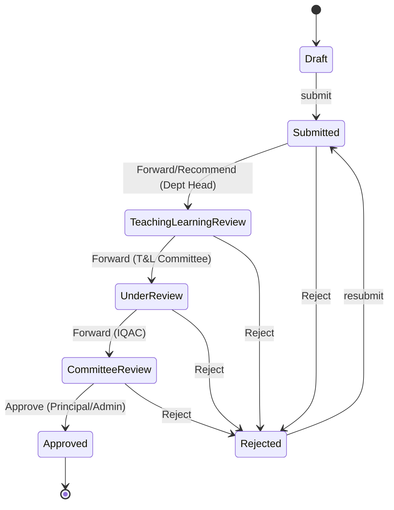

Submission is gated by hard rules (e.g. T&L requires pedagogical approach, attendance strategy, attainment summary, a lesson-plan document, ≥1 session, ≥1 assessment, ≥1 evidence/link). **Self-review is blocked** unless the actor is Admin.

### 9.6 Workflow engine

`src/lib/workflow/engine.ts` is a pure transition resolver over `WorkflowDefinition`/`WorkflowInstance`. Key API: `resolveWorkflowTransition(def, status, action)`, `getActiveWorkflowDefinition(module)`, `canActorProcessWorkflowStage(...)`, `syncWorkflowInstanceState(...)`, `listPendingWorkflowRecordIds(...)`. `DEFAULT_WORKFLOW_DEFINITIONS` seeds **11 modules** (PBAS, CAS, AQAR, SSR, CURRICULUM, TEACHING_LEARNING, INFRASTRUCTURE_LIBRARY, STUDENT_SUPPORT_GOVERNANCE, GOVERNANCE_LEADERSHIP_IQAC, INSTITUTIONAL_VALUES_BEST_PRACTICES, RESEARCH_INNOVATION). **No module hardcodes its own transitions.**

### 9.7 Representative endpoint reference

| Method | Path | Auth | Purpose |
|---|---|---|---|
| POST | `/api/auth/login` · `/admin-login` · `/director-login` | none | authenticate; set cookie |
| POST | `/api/auth/logout` | auth | clear cookie |
| POST | `/api/auth/forgot-password` · `/reset-password` · `/resend-verification` | none | recovery |
| POST | `/api/auth/activate-faculty` · `/activate-student` | none | first-time setup |
| POST | `/api/admin/bootstrap` | secret header | create first admin |
| GET/POST | `/api/admin/users` · POST `/bulk-faculty` · `/bulk-students` | Admin | user provisioning (207 on partial) |
| PATCH | `/api/admin/users/[id]` | Admin | update user |
| GET/POST/PATCH/DELETE | `/api/admin/master-data(/[id])` · `/master-data/bulk` | Admin | config store |
| GET/POST/PATCH/DELETE | `/api/admin/reference-masters/[kind](/[id])` | Admin | lookup entities |
| GET/POST/PATCH/DELETE | `/api/admin/hierarchy(/[id])` | Admin | org tree |
| GET/POST/PATCH/DELETE | `/api/admin/governance/committees(/[id])` · `/leadership-assignments(/[id])` | Admin | governance |
| POST/PUT/GET/DELETE | `/api/pbas` · `/faculty` · `/[id]` · `/[id]/entries(/moderate)` · `/[id]/references` · `/[id]/submit` · `/[id]/review` · `/[id]/approve` · `/[id]/report` | auth/reviewer | PBAS lifecycle + PDF |
| GET/POST | `/api/cas` · `/eligibility` · `/[id]/submit·review·approve·documents·workflow` | auth/reviewer | CAS lifecycle |
| POST | `/api/aqar` · `/[id]/submit·review·approve` · GET `/[id]/report` | auth/reviewer | faculty AQAR |
| GET/POST/PATCH | `/api/admin/aqar/cycles(/[id])` · `/[id]/generate·finalize·submit·report` | Admin | AQAR cycle |
| GET/POST | `/api/ssr/assignments/[id]/response·submit` · `/responses/[id]/review` | auth/reviewer | SSR |
| GET/POST | `/api/admin/naac-metric-warehouse/cycles(/[id])` · `/[id]/generate` · `/values/[id]/manual·review` | Admin | NAAC warehouse |
| GET/POST | `/api/admin/accreditation/{aishe,nirf,compliance,sss}/**` | Admin | accreditation ops |
| GET/POST | `/api/evidence/review` · PATCH `/review/[id]` | Admin/Director | evidence verification |
| GET/POST | `/api/notifications(?limit=)` · `/[id]/read` · `/read-all` | auth | notifications |
| POST | `/api/documents` (`issue-upload` / `finalize-upload`) | auth | Firebase upload lifecycle |
| GET/POST | `/api/faculty/profile` · `/photo` · `/report` | Faculty | faculty workspace |
| GET/POST | `/api/student/profile` · `/records` · `/photo` · `/sss/**` | Student | student workspace |
| GET | `/api/admin/audit-logs?page&pageSize&action&tableName&…` | Admin | audit query |
| GET | `/api/director/{faculty,students}/[id]/records` · `/reports?type=` | Director | oversight + CSV export |

### 9.8 Pagination & filtering

No global framework. Audit logs support `page/pageSize/action/tableName/recordId/userId/query/startDate/endDate`; notifications support `limit`; most module list endpoints return the full authorized set (used to populate admin tables/dropdowns).

---

## 10. Business Features

Every feature is grounded in real `app/`, `api/`, `lib/`, and `models/` code. They share the infrastructure in [§7](#7-authentication--authorization)/[§9](#9-api-documentation) (workflow engine, governance RBAC, audit, notifications).

**Feature → NAAC criterion → portals map:**

| Feature | NAAC | Admin | Director | Faculty | Student |
|---|---|:--:|:--:|:--:|:--:|
| Curriculum | C1 | ✅ | ✅ | ✅ | |
| Teaching-Learning | C2 | ✅ | ✅ | ✅ | |
| SSS (Student Satisfaction) | C2 | ✅ | | | ✅ |
| Research-Innovation | C3 | ✅ | ✅ | ✅ | |
| PBAS / CAS / faculty AQAR | C2/C3 | ✅ | ✅ | ✅ | |
| Infrastructure-Library | C4 | ✅ | ✅ | ✅ | |
| Student-Support-Governance | C5 | ✅ | ✅ | ✅ | |
| Governance-Leadership-IQAC | C6 | ✅ | ✅ | ✅ | |
| Institutional-Values-Best-Practices | C7 | ✅ | ✅ | ✅ | |
| SSR / AQAR Cycle / NAAC Warehouse | C1–C7 | ✅ | ✅(view) | ✅(contrib) | ✅(SSR view) |
| AISHE / NIRF / Compliance | — | ✅ | ✅(view) | | |
| Student records & evidence | C5 | ✅ | ✅ | | ✅ |

### 10.1 PBAS — Performance Based Appraisal System
- **Purpose:** UGC annual faculty self-appraisal producing an API score (prerequisite for CAS; feeds NAAC C2/C3).
- **Roles:** Faculty (draft/select references/upload evidence/submit), Director (review + per-indicator score moderation), Admin (catalog, scoring weights, deadline, final approval, seed/backfill).
- **UI:** `faculty/pbas`, `admin/pbas`, `admin/pbas/catalog`, `director/pbas`.
- **API:** `/api/pbas` + `/[id]/{entries,entries/moderate,references,submit,review,approve,report}`, `/api/pbas/{faculty,summary}`, `/api/admin/pbas/{settings,categories,indicators,seed,backfill}`.
- **Lib/Models:** `lib/pbas/{service,workflow,catalog,references,report-pdf}.ts`; `core/faculty-pbas-{form,entry,revision}`, `pbas-{category,indicator}-master`.
- **Rules:** one active form per faculty; submit gated on `totalScore>0` and deadline; immutable revision snapshot on submit; `approvedScore ≤ claimedScore ≤ maxScore`; final approval locks form; graduated deadline reminders (14/7/3/1 days); admin break-glass override; audited transitions.

### 10.2 CAS — Career Advancement Scheme
- **Purpose:** faculty promotion applications gated on service years + minimum API score derived from approved PBAS.
- **Roles:** Faculty (apply/link PBAS/upload mandatory docs/submit), Director (dept-head/committee review), Admin (promotion rules, final approval).
- **UI:** `faculty/cas`, `admin/cas` (rules + review), `director/cas`.
- **API:** `/api/cas` + `/eligibility` + `/[id]/{submit,review,approve,documents,workflow}`, `/api/admin/cas/rules(/[id])`.
- **Lib/Models:** `lib/cas/{service,admin,validators}.ts`; `core/cas-{application,promotion-rule,promotion-history,api-score-breakup,screening-committee,supporting-document}`.
- **Rules:** eligibility requires ≥1 Approved PBAS + experience ≥ rule min + score ≥ rule min; 3 mandatory document types; promotion-history written on approve; default rules auto-seeded; break-glass override.

### 10.3 AQAR — faculty applications + institutional cycle (two sub-systems)
- **Faculty AQAR** (`core/aqar-application`): annual quality contribution (publications, projects, patents, awards…) with a weighted `totalContributionIndex`; submit gate `index>0`; faculty may delete own Draft/Rejected; `faculty/aqar`, `/api/aqar/**`, `lib/aqar/**`.
- **Institutional AQAR Cycle** (`core/aqar-cycle`, admin-only): aggregates 25+ collections into C1–C7 sections via `NaacCriteriaMapping`; `generateAqarCycleSnapshot()` pulls live counts; criterion "Ready" at ≥75% completion; state flow Draft → Department Review → IQAC Review → Finalized → Submitted; `admin/aqar`, `/api/admin/aqar/cycles/**`, `lib/aqar-cycle/**`; syncs `student-aqar-entry` per active student.

### 10.4 SSR — Self-Study Report
- **Purpose:** the NAAC-visit self-assessment document (Cycle → Criteria → Metrics → Narratives).
- **Roles:** Admin (structure + assignments + approval), Director (review), Faculty (metric responses), Student (read-only sections).
- **UI/API/Lib:** `admin|faculty|director|student/ssr`; `/api/ssr/**` + `/api/admin/ssr/{cycles,criteria,metrics,sections,assignments,responses}`; `lib/ssr/**`.
- **Models:** `reporting/ssr-{cycle,criterion,metric,metric-response,narrative-section,assignment}`.
- **Rules:** hierarchical structure; assignment lifecycle Draft→Submitted→Under Review→Approved/Rejected via engine; multi-type responses (numeric/text/bool/date/table + narrative); optional word-count limit; scope-based reviewer authorization.

### 10.5 SSS — Student Satisfaction Survey
- **Purpose:** NAAC-mandated anonymous student survey feeding C2 metrics.
- **Roles:** Admin (surveys/questions/eligibility/analytics), Student (submit).
- **UI/API/Lib:** `student/sss`; `/api/student/sss/surveys(/[id]/submit)`, `/api/admin/accreditation/sss/**`; `lib/accreditation/service.ts`.
- **Models:** `engagement/sss-{survey,question,eligible-student,response,response-detail,result-analytics}`.
- **Rules:** default 5-question blueprint across 5 buckets; only eligible students respond; one response per student/survey; anonymized analytics; `overallSatisfactionIndex` (0–100) + response rate consumed by the NAAC metric warehouse.

### 10.6 Curriculum
- **Purpose:** programs, courses, PO/CO outcome mappings, BOS meetings/decisions, syllabus versions, value-added courses, academic calendars + a plan→assignment→contribution→review cycle (NAAC C1).
- **UI/API/Lib:** `admin|faculty|director/curriculum`; `/api/curriculum/assignments/**` + `/api/admin/curriculum/{plans,assignments,courses,program-outcomes,syllabus-versions,value-added,bos-meetings,bos-decisions,calendars,calendar-events}`; `lib/curriculum/**`.
- **Models:** `academic/curriculum-*` (13 models) + `program`, `course`.
- **Rules:** plan→assignment; course-code uniqueness; CO↔PO correlation (1–3); syllabus versioning with `effectiveFrom`; engine-driven review.

### 10.7 The six contributor criterion modules
Identical architecture (admin **Plan** → **Assignment** → faculty **Contribution** → **Review**), distinguished by domain models. All use the shared engine + scope RBAC. Routes: `admin|faculty|director/<module>`, `/api/<module>/assignments/**`, `/api/admin/<module>/{plans,assignments}`; libs `lib/<module>/{service,validators}.ts`.

| Module | NAAC | Domain models (category) |
|---|---|---|
| Teaching-Learning | C2 | `academic/teaching-learning-{plan,assignment,session,assessment,support}` |
| Research-Innovation | C3 | `research/research-innovation-{plan,assignment,activity,grant,startup}`, `publication`, `project`, `intellectual-property` |
| Infrastructure-Library | C4 | `operations/infrastructure-library-{plan,assignment,facility,resource,maintenance,usage}` |
| Governance-Leadership-IQAC | C6 | `core/governance-{leadership-iqac-plan,leadership-iqac-assignment,iqac-meeting,policy-circular,quality-initiative,compliance-review}` |
| Institutional-Values-Best-Practices | C7 | `quality/*` (gender-equity, ethics, green-campus, energy/water/waste, sustainability-audit, outreach, inclusiveness, best-practice, distinctiveness) |
| Student-Support-Governance | C5 | `student/student-support-{plan,assignment,mentor-group,grievance,representation,progression}` |

### 10.8 NAAC Metric Warehouse
- **Purpose:** cycle-based store of ~30 computed NAAC metrics across C1–C7, with manual override + review.
- **UI/API/Lib:** `admin|director|faculty/naac-metric-warehouse`; `/api/admin/naac-metric-warehouse/{cycles(/[id]/generate),values/[id]/{manual,review}}`; `lib/naac-metric-warehouse/service.ts`.
- **Models:** `reporting/naac-metric-{cycle,definition,value,sync-run}`.
- **Rules:** catalog seeded from `lib/naac-criteria-mapping/catalog.ts`; `generateNaacMetricValues()` aggregates from ~20 collections; status Pending→Generated→Reviewed→Overridden (override needs reason); each run logged in a sync-run record.

### 10.9 NAAC Criteria Mapping
- **Purpose:** configurable bridge from data sources → NAAC criterion codes; drives AQAR-cycle snapshots and warehouse generation.
- **UI/API/Lib:** managed in `admin/aqar` (`NaacCriteriaMappingManager`); `/api/admin/aqar/mappings(/[id])`; `lib/naac-criteria-mapping/{catalog,service}.ts`; stored as `reporting/naac-metric-definition` / `reference/naac-criteria-mapping`.

### 10.10 Accreditation Operations — AISHE / NIRF / Compliance
- **AISHE:** one survey cycle/year with 8 statistical categories; submission logs. **NIRF:** ranking cycle with parameters→metrics→scores→composite + benchmarks + trends. **Compliance:** regulatory bodies, institutional approvals, statutory reports, inspection visits, action items (Open→…→Closed).
- **UI/API/Lib:** `admin/accreditation`, `director/accreditation`; `/api/admin/accreditation/{aishe,nirf,compliance,sss}/**`; `lib/accreditation/{service,validators}.ts`.
- **Models:** `reporting/aishe-*` (11), `reporting/nirf-*` (12), `core/{regulatory-body,institutional-approval,statutory-compliance-report,inspection-visit,compliance-action-item}`.

### 10.11 Governance & Leadership
- **Purpose:** committees (IQAC/BOS/review committees), memberships, and leadership assignments — the data behind workflow-role authorization.
- **UI/API/Lib:** `admin/governance`; `/api/admin/governance/{committees(/[id]/memberships),memberships/[id],leadership-assignments}`; `lib/governance/service.ts` (incl. `resolveWorkflowRoleRecipientIds`).
- **Models:** `core/governance-committee`, `governance-committee-membership`, `leadership-assignment`. Committee type → workflow approver role mapping determines who reviews/notifies at each stage.

### 10.12 Organizational Hierarchy
- **Purpose:** University → College → Department tree (`Organization`); propagates scope labels to users/faculty and all authorization scope queries.
- **UI/API/Lib:** `admin/hierarchy` (React Flow graph); `/api/admin/hierarchy(/[id])`; `lib/admin/hierarchy.ts`, `lib/hierarchy/canonical.ts`.
- **Rules:** `hierarchyLevel = parent+1`; head user validated; renames re-project onto scope fields.

### 10.13 Reference Masters vs Master Data
- **Reference Masters** (`admin/reference-masters`, `/api/admin/reference-masters/[kind]`): first-class **lookup entities** (Award, Skill, Sport, CulturalActivity, SocialProgram, Event) referenced by ObjectId FK from student/faculty records. `lib/admin/reference-masters.ts`; `reference/*` models.
- **Master Data** (`admin/master-data`, `/api/admin/master-data`): generic **`{category,key}` config store** consumed programmatically (e.g. PBAS scoring weights & deadline, office lists). `core/master-data`. Not FK-referenced.

### 10.14 Report Templates
- **Purpose:** editable versioned PDF templates with `{{variable}}` placeholders for PBAS/AQAR/CAS/faculty reports.
- **UI/API/Lib:** `admin/report-templates`; `/api/admin/report-templates(/[id])/{preview,preview-data,download}`; `lib/report-templates/{service,pdf,preview,validators}.ts`; `core/report-template`.
- **Rules:** defaults auto-created per type; `{{token}}` interpolation; version bumped on edit; legacy templates auto-upgraded on read.

### 10.15 Faculty Records & Profile
- **Purpose:** complete professional record (qualifications, teaching load/summary, result summary, publications, books, patents, projects, events, FDPs, MOOCs, e-content, PhD guidance, awards, consultancy, admin roles, contributions, KPIs, AQAR summary) — the **source data for PBAS/CAS scoring**.
- **UI/API/Lib:** `faculty/profile` (`FacultyWorkspaceForm`), `director/faculty`; `/api/faculty/{profile,photo,report,report-defaults}`, `/api/director/faculty/[id]/records`; `lib/faculty/{service,options,report-defaults,report-pdf,validators,migration}.ts`; 22 `faculty/*` models.
- **Rules:** unique `employeeCode`; `saveFacultyWorkspace` does full-replace per sub-collection (KPI/AQAR upsert by year); reference entities must pre-exist; `ensureFacultyContext` resolves User↔Faculty.

### 10.16 Student Records & Profile
- **Purpose:** identity + academic records + activities (awards, skills, sports, cultural, publications, research, internships, placements, participations).
- **UI/API/Lib:** `student/{profile,records,verification-pending}`, `director/students`; `/api/student/{profile,records,photo,master-data,semesters,resume}`, `/api/director/students/[id]/records`; `lib/student/{service,records-service,validators,master-data,record-validators,resume-pdf}.ts`; 19 `student/*` models.
- **Rules:** unique `enrollmentNo`; attaching a document fires evidence-review notification; activity records FK to reference masters; `resume-pdf` API is retired (410).

### 10.17 Evidence Review
- **Purpose:** verify student-uploaded supporting documents (9 record types) via a pending queue.
- **UI/API/Lib:** `admin/evidence`, `director/evidence` (`EvidenceReviewBoard`); `/api/evidence/review(/[id])`; `lib/evidence/service.ts`.
- **Models:** `reference/document` (verificationStatus Pending/Verified/Rejected) + FK from student records.
- **Rules:** scope-based access (`resolveAuthorizedEvidenceDepartmentIds`); decision updates the Document + notifies the student; dashboard flags stale (>7 days) pending items. (`/api/faculty/evidence` returns 410 — evidence merged into faculty workspace.)

### 10.18 Notifications
- **Purpose:** in-app + email notifications for workflow events, evidence, deadlines.
- **UI/API/Lib:** `NotificationCenter` in shells; `/api/notifications(?limit)`, `/[id]/read`, `/read-all`; `lib/notifications/{service,email}.ts`; `core/notification`.
- **Rules:** dedupe by `metadata.dedupeKey` within window; email only for verified addresses (Resend, or console fallback); stage recipients resolved via governance roles; deadline reminders computed lazily on fetch. See [§17](#17-file-uploads) for email details.

### 10.19 Audit Logs
- **Purpose:** append-only trail of create/update/delete/workflow actions.
- **UI/API/Lib:** `admin/audit-logs` (`AuditLogManager`); `GET /api/admin/audit-logs`; `lib/audit/{service,request}.ts`; `core/audit-log`.
- **Rules:** actor + action + tableName + recordId + old/new (Mixed) + IP (from `x-forwarded-for`/`x-real-ip`/`cf-connecting-ip`); filterable + paginated; called by ~20 services.

### 10.20 Director Dashboards & Approvals
- **Purpose:** scoped cross-module command center — unified approval queue (11 modules), faculty/student rosters with drill-down, evidence review, CSV exports.
- **UI/API/Lib:** `director/{,approvals,faculty,students,evidence,reports}`; `/api/director/{faculty,students}/[id]/records`, `/api/director/reports?type=`; `lib/director/dashboard.ts`.
- **Rules:** everything filtered by `resolveAuthorizationProfile` scopes; `needsAttention` when PBAS/CAS/AQAR is in a review state; queues capped (6/module, 12 total); student-approval route retired (410); CSV covers roster/department-summary + SSS/AISHE/NIRF/Compliance.

---

## 11. Components Documentation

### Component families (the repeating pattern)

Each academic module ships up to four Client Components with a consistent contract:

| Suffix | Role | Consumed by |
|---|---|---|
| `*-manager.tsx` | Admin CRUD (plans, assignments, catalogs) | admin pages |
| `*-review-board.tsx` | Read + workflow decisions (approve/reject/return) | admin + director pages |
| `*-contributor-workspace.tsx` | Faculty submission (fields, sub-records, uploads, submit) | faculty pages |
| `*-dashboard.tsx` | Faculty application + history (PBAS/CAS/AQAR) | faculty pages |

**Representative props/state** (`teaching-learning-manager.tsx`): receives `plans[]`, `assignments[]`, and option arrays as props; local `useState` for tab/search/edit/form; `useDeferredValue` for non-blocking search; `useTransition` + `router.refresh()` for mutations; shadcn `Tabs/Table/Select/Input/Textarea/Card`; inline success/error banner or `sonner` toast; cascade `useEffect` to clear dependent selects.

### Role shells

- **`admin-shell.tsx`** — client; `usePathname` active nav; 2-col grid; ~25 nav items; hosts `NotificationCenter` + `LogoutButton`.
- **`director-shell.tsx`** — client; 19 scoped nav items; exact-match active state.
- **`student-shell.tsx`** — client; responsive (desktop sidebar / tablet pills / mobile bottom-tab); 5 items.
- **Faculty layout** — server-rendered header/footer with a static nav array; drops `NotificationCenter` as a client island; no active-highlight.

### UI primitives (`src/components/ui/`, 19)

shadcn wrappers over Radix: `alert(-dialog)`, `badge`, `button`, `calendar` (react-day-picker), `card`, `checkbox`, `dialog`, `input`, `label`, `popover`, `scroll-area`, `select`, `separator`, `skeleton`, `sonner`, `table`, `tabs`, `textarea`. Styled with `cn()` (`src/lib/utils.ts`) + `class-variance-authority`. Interactive ones are `"use client"`.

### Auth components (`src/components/auth/`)

`forms.tsx` (Login/Register/ForgotPassword/ResetPassword/FacultyActivation/StudentActivation via react-hook-form + zodResolver), `password-input.tsx` (show/hide), `password-checklist.tsx` (5 live rules via `useWatch`), `auth-helpers.tsx` (`FieldError`, `Spinner`, `AuthCard`), `logout-button.tsx`.

### Notable

- **`hierarchy-manager.tsx`** — the only React Flow user (org graph + rhf form).
- **`notification-center.tsx`** — Radix Popover; fetches `/api/notifications?limit=12` on mount/open (no polling); optimistic mark-read.
- **`faculty-workspace-form.tsx`** — largest component; `useFieldArray` per section, XLSX export, per-row uploads, debounced auto-save.

---

## 12. Server Components vs Client Components

- **Server Components (default):** all `page.tsx`, all `layout.tsx` (the faculty layout inlines its nav), and `src/app/page.tsx`. They run auth guards, fetch data via services, and pass serialized props down. They never ship JS for themselves.
- **Client Components (`"use client"`, 77 files):** the 19 UI primitives that need Radix/interactivity, every `-manager/-review-board/-contributor-workspace/-dashboard`, the three role shells, auth forms, and the notification center.

**Why the split works:** initial data is fetched on the server (no client waterfall, no first-paint spinner), while interactivity (forms, tabs, dialogs, `usePathname`, `useTransition`, `router.refresh()`) lives in leaf client components. The boundary is crossed with `JSON.parse(JSON.stringify(data))` to strip non-serializable Mongoose types.

```mermaid
flowchart TD
    L[Layout (Server)<br/>auth guard] --> P[page.tsx (Server)<br/>await service data]
    P -->|serialized props| C[Client shell/manager<br/>useState/useTransition]
    C -->|fetch mutate| API[/api route/]
    API --> DB[(Mongo)]
    C -->|router.refresh| P
```

**Performance implications:** server pages keep the client bundle limited to interactive leaves; but because pages read live from Mongo on every request and rarely memoize, list-heavy admin pages can issue many queries per render (see [§21](#21-performance-review)).

---

## 13. Data Fetching

| Mechanism | Used? | Where |
|---|---|---|
| Server Components calling services | ✅ primary | every `page.tsx` initial load |
| `fetch()` to `/api/*` from client | ✅ primary for mutations | all managers/dashboards/forms |
| `router.refresh()` re-fetch | ✅ | after every successful mutation |
| Server Actions | ❌ | not used |
| React Query / SWR | ❌ | not installed |
| Route Handlers as data API | ✅ | 213 handlers |
| `fetch` caching / `revalidate` / ISR | ❌ | notifications use `cache: "no-store"`; pages are dynamic |

**Pattern:** each client component defines a small `requestJson<T>(url, opts)` wrapper (fetch + JSON + throw on non-OK). Reads happen server-side and arrive as props; writes go to `/api/*` inside `startTransition`, then `router.refresh()` re-runs the server subtree to reconcile. The only self-fetching client component is `NotificationCenter`.

---

## 14. State Management

There is **no external state library** (verified against `package.json`). State is deliberately minimal:

- **Server state** is the source of truth (Mongo), delivered as props; refreshed via `router.refresh()` — this replaces a client cache/invalidation layer.
- **Local UI state:** `useState` (form objects, selected rows, tabs, dialogs), `useTransition` (pending), `useDeferredValue` (search), `useEffect` (cascades, notification fetch).
- **Form state:** `react-hook-form` for validated forms; plain `useState` objects for manager CRUD forms.
- **Session state:** the `umis_session` JWT cookie (server-read only; never in a client store).
- **No** Context providers of app data, Redux, Zustand, or React Query cache.

Trade-off: simple and consistent, but every mutation triggers a full server re-render/refetch of the page subtree (no fine-grained cache).

---

## 15. Forms

- **Libraries:** `react-hook-form` + `@hookform/resolvers/zod`. The **same Zod schemas** used by the API validate the UI, so client and server agree.
- **Auth forms** (`auth/forms.tsx`): `useForm({ resolver: zodResolver(schema) })`, `form.register`, `<FieldError message={errors.x?.message} />`, submit in `useTransition` → post → `router.push/refresh`. Helpers: `PasswordInput`, `PasswordChecklist`.
- **Complex forms** (`faculty-workspace-form.tsx`, PBAS/CAS dashboards, `hierarchy-manager.tsx`): `useFieldArray` for dynamic lists, `Controller` for Select/Checkbox, `useWatch` for cascades; file rows call the upload service; some auto-save.
- **Manager CRUD forms:** intentionally *not* rhf — flat `useState` objects with `setForm(prev => ({...prev, field}))`, submitted through `requestJson` + `router.refresh()`.
- **Validation error flow:** client shows inline field errors; server returns `{ message, issues[] }` (400) which components surface as a banner/toast.

---

## 16. Middleware

**There is no `middleware.ts` in this project** (confirmed — `next` middleware is not used). All request-time concerns that middleware usually handles are done elsewhere:

- **Auth/redirects:** async Server Component **layout guards** (`requireAdmin/Director/Faculty/StudentProfileAccess`) call `redirect()`; API routes call `assertAdminApiAccess`/`assertLeadershipApiAccess` or inline `getCurrentUser()` checks.
- **Request modification / headers:** none globally; IP for audit is read per-route via `getRequestAuditContext(request)`.
- **Security headers / CORS / rate limiting:** not implemented at a middleware layer (see [§20](#20-security-review)).

Implication: protection is only as complete as each layout/route remembering to call its guard. There is no single choke point; a new route that forgets the guard is unprotected.

---

## 17. File Uploads

### Flow: intent → direct-to-Firebase → server finalize/verify

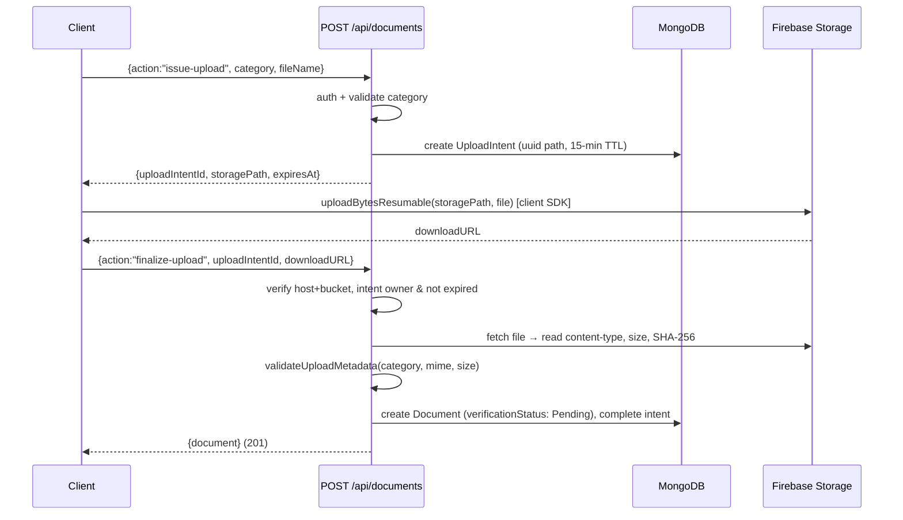

- **Client SDK only** (`src/lib/firebase/config.ts`) using `NEXT_PUBLIC_FIREBASE_*` vars; no Firebase Admin SDK; the server relies on public download URLs + its own re-fetch to verify.
- **Policy** (`src/lib/upload/policy.ts`): `profile-photo` → JPEG/PNG/WebP ≤2 MB; `document` → PDF ≤10 MB; `evidence` → PDF/JPEG/PNG/WebP ≤10 MB.
- **UploadIntent** has a Mongo TTL index that auto-deletes expired intents.
- **Helpers** (`src/lib/upload/service.ts`): `requestUploadIntent`, `uploadFile`, `registerUploadedDocument`; used by contributor workspaces and `faculty-workspace-form`.
- ⚠ **Photo endpoints** (`/api/faculty/photo`, `/api/student/photo`) bypass the intent/finalize cycle and only string-check the URL prefix — no MIME/size re-verification (see [§20](#20-security-review)).

### Email (Resend)

`src/lib/auth/email.ts` (verification, reset) and `src/lib/notifications/email.ts` (notifications) instantiate Resend per call. From-address via `RESEND_FROM_EMAIL`. **Dev fallback:** if `RESEND_API_KEY` is unset, links/subjects are `console.info`-logged and the send is skipped. Emails are hand-built inline-HTML strings; no template engine; no retry queue on failure.

### PDF generation (hand-rolled)

`src/lib/report-templates/pdf.ts` assembles **raw PDF-1.4 bytes** (objects, xref, trailer) with no PDF library. Report libs (`pbas/report-pdf`, `faculty/report-pdf`, `aqar/report-pdf`, `aqar-cycle/report-pdf`, `student/resume-pdf`, `report-templates/preview`) build a context, `renderReportTemplate()` fills `{{tokens}}`, then `buildTemplatedPdf()` emits a Buffer. ⚠ Only Helvetica variants; **all non-ASCII characters are stripped** — a real risk for Indian-language names in official documents (see [§27](#27-known-issues--technical-debt)).

### Excel (xlsx)

Client-side only (5 components). Bulk faculty/student provisioning panels parse `.xlsx/.csv` in the browser and POST parsed JSON to `/api/admin/users/bulk-{faculty,students}` (server validates JSON via Zod, returns 207 on partial failure). Faculty workspace exports records to Excel client-side. The server never receives the raw file.

### Background jobs

**No scheduler/queue.** "Deadline reminders" are computed opportunistically when a user calls `GET /api/notifications`. Maintenance is manual via `scripts/` (see [§24](#24-deployment)).

---

## 18. Third-Party Integrations

| Integration | SDK / method | Where | Purpose |
|---|---|---|---|
| **Firebase Cloud Storage** | `firebase` client SDK | `lib/firebase/config.ts`, `lib/upload/*`, `/api/documents` | document & photo storage (intent + direct upload). `next.config.ts` allows `firebasestorage.googleapis.com` images. |
| **Resend** | `resend` SDK | `lib/auth/email.ts`, `lib/notifications/email.ts` | transactional email; console fallback in dev |
| **MongoDB Atlas/self-hosted** | `mongoose` | `lib/dbConnect.ts` | primary database (via `MONGODB_URI`) |

**No** Google APIs, AWS, OpenAI, analytics, maps, Stripe, or payment integrations are present. Firebase is used **only** for Storage (no Firebase Auth, Firestore, or FCM).

---

## 19. Environment Variables

| Variable | Required | Purpose / Notes |
|---|---|---|
| `MONGODB_URI` | ✅ | Mongo connection string. `dbConnect` throws if missing. |
| `AUTH_SECRET` | ✅ | HS256 JWT signing secret. `getAuthSecret()` throws if missing. **High-value secret.** |
| `ADMIN_BOOTSTRAP_SECRET` | ⚠ prod | Required in production to create the first admin (header `x-admin-bootstrap-secret`). Optional in dev. |
| `APP_URL` | recommended | Absolute base URL for email links; falls back to `NEXT_PUBLIC_APP_URL` then `http://localhost:3000`. |
| `NEXT_PUBLIC_APP_URL` | recommended | Public base URL (client-visible). |
| `RESEND_API_KEY` | optional | Enables real email. If unset, emails are console-logged (must NOT be relied on in prod). |
| `RESEND_FROM_EMAIL` | optional | From address; defaults to a resend.dev sandbox address. |
| `NEXT_PUBLIC_FIREBASE_API_KEY` | ✅ (uploads) | Firebase web config — **client-exposed by design**. |
| `NEXT_PUBLIC_FIREBASE_AUTH_DOMAIN` | ✅ (uploads) | Firebase web config. |
| `NEXT_PUBLIC_FIREBASE_PROJECT_ID` | ✅ (uploads) | Firebase web config. |
| `NEXT_PUBLIC_FIREBASE_STORAGE_BUCKET` | ✅ (uploads) | Bucket; server validates finalize URLs against it. |
| `NEXT_PUBLIC_FIREBASE_MESSAGING_SENDER_ID` | ✅ (uploads) | Firebase web config. |
| `NEXT_PUBLIC_FIREBASE_APP_ID` | ✅ (uploads) | Firebase web config. |
| `NODE_ENV` | (framework) | Gates cookie `secure`, bootstrap requirement, email fallback. |

**Security considerations:** `AUTH_SECRET`, `ADMIN_BOOTSTRAP_SECRET`, `MONGODB_URI`, and `RESEND_API_KEY` are true secrets — keep out of the client bundle and VCS (`.env*` is git-ignored). All `NEXT_PUBLIC_FIREBASE_*` values are intentionally public; Firebase **Storage Security Rules** (not in this repo) are the real access control for the bucket. There is no env-schema validation (e.g. no `zod`-parsed `env.ts`), so a missing non-critical var fails lazily at first use.

---

## 20. Security Review

### Strengths (implemented well)

- **Password hashing** with bcrypt (cost 12); `password` is `select:false`.
- **One-time tokens stored as SHA-256 hashes only** — a DB dump cannot replay verification/reset links; 256-bit entropy (`crypto.randomBytes(32)`).
- **Per-request identity re-validation** — `getCurrentUser()` re-reads the User from Mongo every request, so suspend/delete takes effect immediately (no stale sessions).
- **Timing-safe** bootstrap-secret comparison; **user-enumeration-safe** password reset (uniform 200).
- **Director login clears the cookie** if leadership check fails (no partial-auth window).
- **HttpOnly** session cookie; `secure` in production.
- **Server-side upload verification** on the finalize path (re-fetch, host/bucket check, MIME/size, checksum).

### Weaknesses & risks

| Area | Finding | Severity |
|---|---|---|
| **CSRF** | `sameSite: "lax"` + **no CSRF tokens** on state-changing POST/PATCH/DELETE. State mutations rely only on cookie auth. | High |
| **Rate limiting / lockout** | **None** on login, activation, reset, upload-intent, or email send → brute-force & abuse exposure. | High |
| **Session revocation** | 7-day JWT with no server-side revocation list; mitigated only by per-request DB check — any future edge/middleware bypass would leave stolen tokens valid up to 7 days. | Medium |
| **Photo upload endpoints** | `/api/faculty/photo`, `/api/student/photo` skip intent/finalize and only prefix-check the URL — no MIME/size/checksum verification. | Medium |
| **Firebase rules dependency** | All `NEXT_PUBLIC_FIREBASE_*` keys are in the browser bundle; only Firebase Storage Security Rules (not in repo) prevent arbitrary authenticated writes/reads. Rules **must** be audited. | Medium |
| **Legacy `headUserId` authz** | `compatibilityMode = true` is hard-coded on; setting `Organization.headUserId` silently grants leadership/workflow power with no admin toggle. | Medium |
| **Bootstrap length oracle** | `secretsMatch` compares length before `timingSafeEqual`, leaking secret length. | Low |
| **No security headers** | No CSP/HSTS/X-Frame-Options/Referrer-Policy configured. | Low–Med |
| **Client-side XLSX parsing** | Server can't validate the source file, only the parsed JSON. | Low |
| **Env validation** | No startup schema check; a missing secret fails lazily. | Low |

**Injection posture:** MongoDB/Mongoose with typed schemas + Zod parsing reduces NoSQL-injection risk (no string-built queries observed). XSS risk is limited by React's default escaping, but hand-built email HTML interpolates values without sanitization (currently only system-generated values). SQL injection is N/A (no SQL).

---

## 21. Performance Review

- **Bundle:** kept lean by the RSC boundary — only 77 client components ship JS; heavy libs are localized (React Flow only in the hierarchy manager; xlsx only in 5 admin/faculty components).
- **Images/fonts:** `next/image` allowed for `firebasestorage.googleapis.com`; fonts via `next/font` (self-hosted Geist, no layout shift).
- **Dynamic imports / lazy loading:** **not used** — client components are statically imported. Opportunity: `next/dynamic` for React Flow and xlsx to trim admin bundles.
- **Server Components usage:** good — data fetching stays on the server.
- **Database query efficiency — main concern:**
  - **N+1 / fan-out:** the AQAR-cycle snapshot and NAAC-metric generation query 20–25 collections per run; the director dashboard loads 11 modules × (records + pending IDs) per page render; notification GET can trigger reminder computation. These are correctness-first, not optimized.
  - **No pagination** on most list endpoints — admin/director consoles fetch full authorized sets to populate tables/dropdowns; this scales poorly with data growth.
  - **Indexes** are generally present (unique + compound + scope fields), which helps scoped queries; verify the scope-block fields are all indexed in production.
  - **No response/data caching** — pages are dynamic and read live; `router.refresh()` re-fetches whole subtrees after each mutation.
- **PDF generation** is synchronous byte assembly on the request thread — fine for small reports, but large cycle PDFs block the handler.

**Recommendations:** add pagination + server-side search to list endpoints; memoize/aggregate dashboard queries (`$facet`/aggregation pipelines); `next/dynamic` for heavy client libs; consider a cache (or Next data cache with tags) for rarely-changing reference/master data; move large PDF/report generation to a background job.

---

## 22. Error Handling

- **API:** every handler wraps logic in `try/catch` and funnels to `createApiErrorResponse()` (`src/lib/auth/http.ts`), which maps `ZodError`/Mongoose errors → 400, `AuthError` → its `.status`, everything else → 500 with a generic message. Consistent envelope `{ message, issues? }`.
- **Domain errors** use `throw new AuthError(msg, status)` (404/409/403) inside services.
- **Client:** `requestJson` helpers throw on non-OK; components show inline banners or `sonner` toasts; forms surface field errors from `issues[]`.
- **UI error boundaries:** only `src/app/(faculty-protected)/faculty/profile/error.tsx` exists (client boundary with retry). No global `error.tsx`, no `not-found.tsx`, and only one `loading.tsx` (faculty profile) — most routes have no Suspense/error UI, so an unhandled server error yields the framework default.
- **Logging:** `console` only (e.g. dbConnect logs the Mongo host; email fallback logs links). No structured logger, no error-tracking service (Sentry etc.).
- **Retry:** none — failed emails are marked `failed` and never retried; no client auto-retry.

**Recommendations:** add root and per-group `error.tsx` + `not-found.tsx`; introduce a structured logger and error-tracking; add an email retry/outbox.

---

## 23. Code Quality Review

### Strengths

- **Consistent layering** (route → validator → service → model) and **consistent conventions** (envelope shape, guard helpers, model registration, scope block) make the codebase highly predictable.
- **Strong domain modeling** — 188 well-named models mirror the accreditation domain; enums shared between Mongoose and Zod.
- **Generic reuse** — one workflow engine and one authorization service power ~11 modules instead of duplicated state machines.
- **Separation of concerns** — thin handlers, business logic in services, UI split into a clear component family.
- **TypeScript strict** throughout; path aliases; typed schemas/interfaces.

### Weaknesses / technical debt

- **Very large files:** `lib/pbas/service.ts` (~2500 lines), `lib/accreditation/service.ts`, and `faculty-workspace-form.tsx` are monoliths that would benefit from decomposition.
- **Repetition across the 6 criterion modules** — nearly identical service/validator/route/component code is copy-adapted per module; a shared factory/generic could remove hundreds of duplicated lines (trade-off: current explicitness aids readability).
- **Two form paradigms** (rhf vs plain `useState`) coexist without a documented rule.
- **Stale artifacts:** `legacy_models.txt`/`new_models.txt` describe a schema that isn't implemented; `scripts/ts-alias-loader.mjs` hard-codes `/Users/rc/Projects/operant-next/src` (breaks on other machines).
- **Retired-but-present endpoints** return 410 (`/api/auth/register`, `/api/faculty/evidence`, student resume, director student-approvals) — good for compatibility, but dead client references may linger.
- **Near-zero test coverage** (4 unit tests) for a system this size.
- **`createAuditLog` doesn't `dbConnect()`** itself — relies on caller; audit writes aren't transaction-bound.
- **Naming:** the `role` enum contains legacy values (PRO/NSS/Sports/Swayam/Placement/Director) that aren't the real access mechanism, which can mislead.

---

## 24. Deployment

### Development setup

```bash
# 1. install
npm install
# 2. create .env.local (see §19) with at least:
#    MONGODB_URI, AUTH_SECRET  (+ NEXT_PUBLIC_FIREBASE_* for uploads, RESEND_* for email)
# 3. run
npm run dev            # next dev
# 4. first admin (dev): POST /api/admin/bootstrap (no secret needed unless ADMIN_BOOTSTRAP_SECRET set)
#    or visit /admin/setup
```

### Build & run (production)

```bash
npm run build          # next build
npm run start          # next start  (Node.js server; not static export)
npm run lint           # eslint
npm test               # vitest run  (4 tests)
```

The app requires a **Node.js runtime** (uses `crypto`, `Buffer`, Mongoose) — it is **not** an Edge/static deployment. Any Node host (Vercel Node functions, a container, or a VM) works. `next.config.ts` only configures remote image patterns; there is no `output: "standalone"`, no Dockerfile, and no CI/CD config in the repo.

### Data/ops scripts (`scripts/`, run with Node against `MONGODB_URI`)

| Script | npm alias | Purpose |
|---|---|---|
| `migrate-institution-terminology.cjs` | `migrate:institution-terminology` | rename schoolName→collegeName→universityName across collections |
| `backfill-organizations.cjs` | `backfill:organizations` | create/link Organization nodes from Institutions/Departments |
| `backfill-governed-reference-masters.cjs` | `backfill:governed-reference-masters` | activate legacy reference collections; deprecate old master-data categories |
| `backfill-governance-rbac.cjs` | `backfill:governance-rbac` | seed leadership_assignments from `headUserId`; backfill scope fields |
| `cleanup-aqar-verification-data.mjs` | — | delete data created by the AQAR verification run |
| `verify-aqar-seven-modules.mjs` | — | live-DB end-to-end smoke test of all 7 AQAR modules |
| `ts-alias-loader.mjs` | — | Node loader resolving `@/`→`src/` (⚠ hard-coded absolute path) |

> These are one-shot, idempotent, and **untracked** (no "which ran where" ledger). Treat as manual migration steps in a runbook.

### Deployment architecture

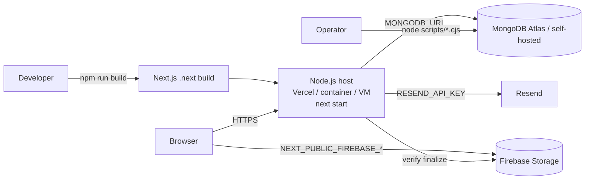

---

## 25. Developer Guide

**Add a new page (server-rendered, guarded):** create `src/app/(role-protected)/role/feature/page.tsx` as an async Server Component; call the role guard is unnecessary (the group layout already guards); fetch via a `lib` service; render a Client Component with serialized props. Add a nav item to the relevant shell (`admin-shell.tsx` etc.).

**Add a new API endpoint:** create `src/app/api/.../route.ts`; export the HTTP method; start with a guard (`assertAdminApiAccess()` / `getCurrentUser()`), `await context.params`, `await request.json()`, delegate to a service, return `{ message, entity }`, and `catch → createApiErrorResponse(error)`. Put validation in a `validators.ts` schema parsed inside the service.

**Add a new database model:** create `src/models/<category>/<name>.ts` following the canonical pattern ([§8.1](#8-database-documentation)) — interface, `{ timestamps: true, collection }`, indexes, and the `mongoose.models.X || mongoose.model(...)` guard. If the record participates in scoping, include the scope block; if it flows through review, add `status`/`statusLogs`/`reviewHistory` and register it in `DEFAULT_WORKFLOW_DEFINITIONS`.

**Add authentication to a route:** protected pages just need to live under a `(…-protected)` group; API routes must call the appropriate guard themselves (there is no middleware to catch omissions).

**Create a reusable component:** add shadcn primitives under `src/components/ui/`; use `cn()` for classes; mark `"use client"` only if it needs interactivity/hooks.

**Add a new feature (module) with the workflow:** (1) models (plan + assignment + domain records with scope block + status); (2) `DEFAULT_WORKFLOW_DEFINITIONS` entry (stages, approver roles); (3) `lib/<module>/{service,validators}.ts` (reuse `resolveWorkflowTransition`, `syncWorkflowInstanceState`, `createAuditLog`, `notifyWorkflowStageAssignees`); (4) admin plan/assignment routes + faculty contribution/submit/review routes; (5) `-manager`, `-contributor-workspace`, `-review-board` components; (6) pages in the four portals; (7) nav entries. Use an existing module (teaching-learning) as the template.

**Write a database migration:** add a `scripts/*.cjs` (raw driver) or `*.mjs` (Mongoose) script, make it idempotent (existence checks / guarded `updateMany`), add an npm alias, and document the run order in your deploy runbook.

**Add an environment variable:** read it via a small accessor (mirror `src/lib/auth/config.ts` `getRequiredEnv`), document it in [§19](#19-environment-variables) and `README`, and (recommended) add it to a future env-validation schema.

---

## 26. Architecture Diagrams

The key diagrams appear inline in their sections; this section adds the cross-cutting views.

**System architecture** — [§3](#3-overall-architecture). **Request & mutation lifecycle** — [§5](#5-application-flow). **Authentication flow & authorization resolution** — [§7](#7-authentication--authorization). **Database ERD** — [§8.9](#8-database-documentation). **Workflow state machine** — [§9.5](#9-api-documentation). **RSC data flow** — [§12](#12-server-components-vs-client-components). **Upload flow** — [§17](#17-file-uploads). **Deployment** — [§24](#24-deployment).

### Feature relationships (data roll-up to NAAC)

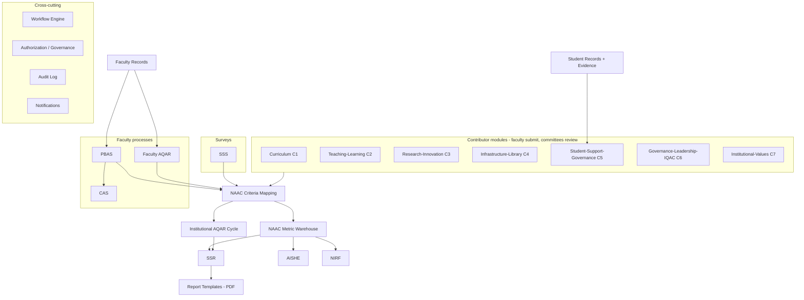

### Folder architecture

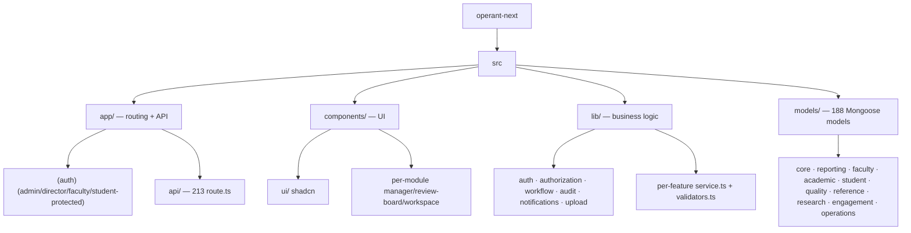

---

## 27. Known Issues & Technical Debt

**Correctness / data-integrity risks**
- `AcademicYear.isActive` has **no uniqueness constraint** — two "current" years are possible; services fall back to "active or latest," so a stray active flag misroutes new records.
- **PDF non-ASCII stripping** silently corrupts Indian-language names in official accreditation PDFs.
- `createAuditLog` assumes an existing connection and isn't transaction-bound with the write it records.
- Photo endpoints don't verify uploaded content (MIME/size/checksum).

**Security (see [§20](#20-security-review))**
- No CSRF protection; no rate limiting/lockout; 7-day JWT with no revocation list; always-on legacy `headUserId` authorization; Firebase security depends on unaudited Storage Rules; no security headers.

**Performance (see [§21](#21-performance-review))**
- Unpaginated list endpoints; multi-collection fan-out in dashboards/snapshots/metric generation; no caching; synchronous PDF building; no dynamic import of heavy client libs.

**Maintainability**
- Very large service/component files; heavy duplication across the 6 criterion modules; two form paradigms; stale `legacy_models.txt`/`new_models.txt`; hard-coded path in `ts-alias-loader.mjs`; dead-but-410 endpoints.

**Testing & observability**
- Only 4 unit tests; no integration/API/component/e2e tests (the AQAR verify script runs against a live DB); `console`-only logging; no error tracking; no email retry.

**Missing validation / guards**
- No global env-schema validation; protection relies on each route/layout remembering its guard (no middleware backstop).

**Refactoring opportunities**
- Extract a generic "contributor module" factory (models + service + routes + components) to collapse the 6 near-identical modules.
- Split `pbas/service.ts` and `accreditation/service.ts` by concern.
- Introduce pagination/search primitives shared across list endpoints.
- Add an env accessor + Zod env schema; add a structured logger.

---

## 28. Architecture Summary & Recommendations

### Architecture summary

UMIS is a **domain-rich modular monolith** on Next.js 16. Its defining ideas are: (1) a **single generic workflow engine** and **governance-driven RBAC** that power ~11 review modules uniformly; (2) **document-store multi-tenancy via denormalized scope blocks** instead of joins; (3) a **thin-handler / fat-service** backend with one error mapper and one response convention; and (4) an **RSC-first frontend** where server pages fetch and client leaves interact, using `router.refresh()` in place of a client cache. Everything ultimately rolls up to the **7 NAAC criteria** for accreditation reporting.

### Key design decisions (and their trade-offs)

| Decision | Benefit | Trade-off |
|---|---|---|
| Custom `jose` JWT auth (no NextAuth) | full control, minimal deps, per-request DB re-check | must hand-roll CSRF, rate limiting, revocation |
| MongoDB + denormalized scope block | flexible schema, join-free scoping | data-integrity is app-enforced; no referential guarantees |
| Generic workflow engine + governance RBAC | uniform lifecycle, config-driven approvers | indirection; must understand engine to trace flows |
| Layout/route guards instead of middleware | co-located, explicit | no single choke point; guard omission = open route |
| RSC + `router.refresh()` (no client cache lib) | simplicity, small bundle | full subtree refetch per mutation; N+1-prone dashboards |
| Hand-rolled PDF + client XLSX | zero heavy deps | ASCII-only PDFs; server can't validate source files |

### Strengths

Predictable, consistent conventions; excellent domain fidelity; strong reuse of cross-cutting infrastructure; clean RSC/client separation; sensible auth primitives (hashed tokens, `select:false`, per-request validation); typed end-to-end with shared Zod/Mongoose enums.

### Areas for improvement

Security hardening (CSRF, rate limiting, revocation, headers, Firebase-rules audit); performance (pagination, aggregation, caching, dynamic imports); reliability (env validation, structured logging/error tracking, email retry, error/not-found boundaries); testing (integration + API + workflow coverage); maintainability (decompose monolith files, factor out the duplicated criterion modules, remove stale artifacts).

### Recommended next steps (prioritized)

1. **Security P0:** add CSRF protection for mutations, rate limiting on auth/upload/email, and audit the Firebase Storage Rules; fix the photo-upload verification gap.
2. **Data integrity P0:** enforce a single active `AcademicYear`; make PDF generation Unicode-safe; wrap audit writes with their transactions.
3. **Reliability P1:** add env-schema validation, a structured logger + error tracking, root `error.tsx`/`not-found.tsx`, and an email retry/outbox.
4. **Performance P1:** paginate + server-search list endpoints; convert dashboard/snapshot fan-out to aggregation pipelines; `next/dynamic` for React Flow/xlsx.
5. **Maintainability P2:** extract a shared contributor-module factory; split the largest services; delete/verify stale artifacts and the hard-coded loader path.
6. **Quality P2:** grow automated tests around the workflow engine, authorization, and each module's submit/review gates; wire the AQAR verify script into CI against an ephemeral DB.

---

*This document reflects the codebase as reviewed and is intended as the primary technical reference and onboarding guide. When behavior and this document disagree, treat the code as the source of truth and update this file.*
